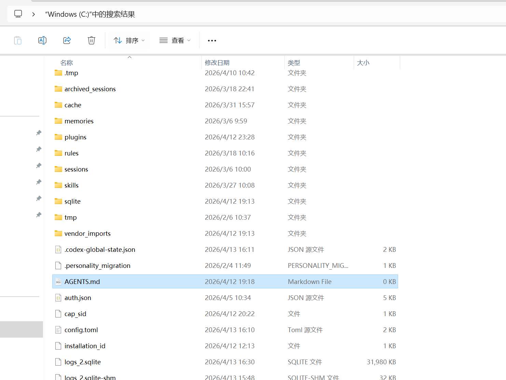
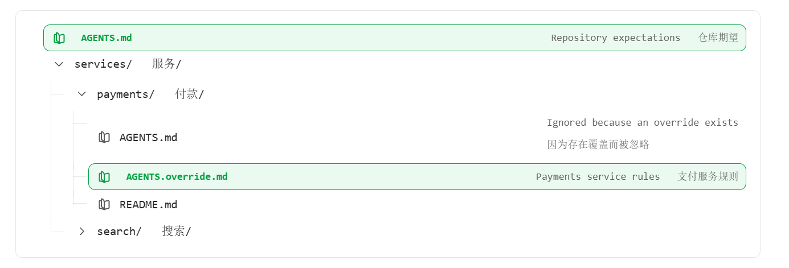
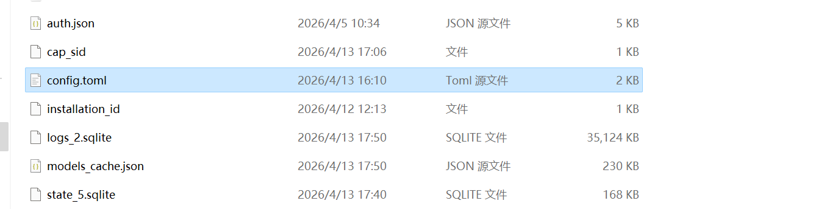

## 前言

agent说通了就是一份说明书，用来指导并且告诉agent `should do/ should not do anything`

首先对于agent的指令，尽可能的以英文为主，中文为辅，当然，用中文其实也没有什么影响：

```markdown
- Always run `npm test` after modifying JavaScript files.  
  （修改 JS 文件后必须运行 npm test）  
  
- Prefer `npm` when installing dependencies.  
  （优先使用 npm 安装依赖）  
  
- Ask for confirmation before adding new production dependencies.  
  （新增生产依赖前必须确认）

```

## 定制化

自定义是让你让 Codex 像团队一样运作的方式，在Codex中，自定义来自几个层次协同工作：

- 持久指令的**项目指导（`AGENTS.md`）**
- 可重用工作流程**技能(SKILL.md)** 和领域专业知识
- 用于访问外部工具和共享系统的 **[MCP](https://developers.openai.com/codex/mcp)**
- 分**[代理](https://developers.openai.com/codex/concepts/subagents)** ，负责将工作委托给专业分代理 

> 这些是互补的，不是竞争的。`AGENTS.md` 塑造行为，`SKILL.md`包装可重复流程，[MCP](https://developers.openai.com/codex/mcp) 将 Codex 连接到本地工作区外的系统。

## AGENTS.md

`AGENTS.md` 为 Codex 提供了持久的项目指导，这些指导会随你的仓库一起移动，并在代理开始工作之前生效。保持小巧。

用它来设置你希望 Codex 每次在仓库里遵守的规则，比如：

- 构建和测试命令
- 复习期望
- 仓库专用约定
- 目录特定指令

当代理对你的代码库做出错误假设时，`AGENTS.md` 纠正并要求代理更新 `AGENTS.md` 以保证修复有效。把它当作一个反馈循环。

并且AGENTS.md具有两份：

一份是在全局系统中：



另一份是在仓库的根目录下，靠近工作目录的文件优先。利用全局文件来塑造 Codex 与你的沟通方式（例如，审查风格、冗长度和默认值），并让仓库文件聚焦于团队和代码库规则。

### 何时更新AGENTS.md

- **重复犯错** ：如果代理反复犯同样错误，则添加一条规则。
- **阅读过多** ：如果找到了正确的文件但读取了太多文档，就添加路由指引（优先处理哪些目录/文件）。
- 反**复的公关反馈** ：如果你多次留下相同的反馈，请将其写入法典。
- **在 GitHub 中** ：在拉取请求评论中，用请求标记 `@codex`（例如 `，@codex 将此添加到 AGENTS.md` 中），以便将更新委托给云任务。
- **自动化漂移检查** ：使用[自动化](https://developers.openai.com/codex/app/automations)进行定期检查（例如每日），寻找指导缺口并建议 `AGENTS.md` 添加内容。

> 当你需要临时全局覆盖而不删除基础文件时，可以使用 `~/.codex/AGENTS.override.md`。移除覆盖以恢复共享引导。

> 还有一点就是：修改 AGENTS.md 后，**必须开新线程才可靠**，

### 图层项目说明

仓库级文件让 Codex 了解项目规范，同时继承你的全局默认设置。

1. 在你的仓库根目录中，添加一个涵盖基本设置的 `AGENTS.md`：
	
    ```markdown
    ## Repository expectations
    
    - Run `npm run lint` before opening a pull request.
    - Document public utilities in `docs/` when you change behavior.
    ```
    
2. 当特定团队需要不同规则时，可以在嵌套目录中添加覆盖功能。例如，内部`服务/支付/` 会创建 `AGENTS.override.md(services/payments/AGENTS.override.md)`：
	 
    ```markdown
    ## Payments service rules
    
    - Use `make test-payments` instead of `npm test`.
    - Never rotate API keys without notifying the security channel.
    ```
    
3. 从支付目录开始 Codex：
    
    ```
    codex --cd services/payments --ask-for-approval never "List the instruction sources you loaded."
    ```

预期：Codex 首先报告全局文件，仓库根 `AGENTS.md` 次，付款覆盖最后。

Codex 一旦进入你当前目录就会停止搜索，所以把覆盖放在专业工作附近。

这是添加全局文件和支付专用覆盖(override)后示例仓库：



> 非常推荐读一下这篇文章：[如何写出优秀 agents.md：来自 2500 多个仓库的经验教训——GitHub 博客](https://github.blog/ai-and-ml/github-copilot/how-to-write-a-great-agents-md-lessons-from-over-2500-repositories/)

## 工程化标准

通常一份AGENT.md需要包含以下部分：

### 1. Project Overview

写仓库性质、核心目标、技术栈、优先级。

```markdown
## Project Overview

This repository contains a React + Node.js monorepo for real-time collaboration tools.
（该仓库是一个 React + Node.js 的实时协作系统）

Primary goals:
（优先级目标）

1. Maintain production stability
（优先保证线上稳定）
2. Keep API backward compatible
（保证接口向后兼容）
3. Prefer minimal changes over large refactors
（优先最小改动，而不是大规模重构）

Tech stack:
（技术栈）

- Frontend: React + TypeScript
- Backend: Node.js (NestJS)
- Package manager: pnpm
```

### 2. Repository Structure

写主要目录职责、层次边界、禁止越层调用规则。

```markdown
## Repository Structure

- `apps/web` – frontend application
（前端应用）

- `apps/api` – backend services
（后端服务）

- `packages/ui` – shared UI components
（共享 UI 组件）

- `packages/utils` – shared utilities
（公共工具函数）

Rules:
（约束）

- Do not import from `apps/*` into `packages/*`
（禁止从应用层反向依赖基础包）

- Backend logic must not be placed in frontend folders
（后端逻辑禁止出现在前端目录）

- Shared logic must live in `packages/`
（公共逻辑必须抽到 packages）
```

### 3. Local Development

写安装、启动、调试、环境变量约定。

```markdown
## Local Development

- Install dependencies: `pnpm install`
（安装依赖）

- Start all services: `pnpm dev`
（启动全部服务）

- Start frontend only: `pnpm --filter web dev`
（只启动前端）

- Start backend only: `pnpm --filter api dev`
（只启动后端）

Environment variables:
（环境变量）

- Copy `.env.example` to `.env`
（复制环境变量模板）

- Do not commit `.env`
（禁止提交环境变量）
```

### 4. Build / Test / Validation

写 lint、typecheck、unit test、integration test、build、手工验证入口。

```markdown
## Validation Commands

- Lint: `pnpm lint`
（代码规范检查）

- Type check: `pnpm typecheck`
（类型检查）

- Unit tests: `pnpm test`
（单元测试）

- Build: `pnpm build`
（构建）

Rules:
（规则）

- Always run tests after modifying business logic
（修改业务逻辑必须跑测试）

- Do not skip failing tests
（禁止忽略失败测试）

- Fix errors instead of bypassing checks
（必须修复问题，而不是绕过）
```

### 5. Coding Standards

写语言规范、命名、错误处理、日志、依赖管理、组件/服务设计约束。

```markdown
## Coding Standards

### TypeScript

- Use strict mode
（必须开启严格模式）

- Avoid `any` unless necessary
（尽量避免 any）

### React

- Prefer function components
（使用函数组件）

- Avoid global state unless required
（避免滥用全局状态）

### Backend

- Controllers should be thin
（控制层必须轻量）

- Business logic goes to services
（业务逻辑放 service 层）

### Logging

- Use centralized logger instead of console.log
（禁止使用 console.log，统一日志）
```

### 6. Change Policy

写最小改动原则、何时允许重构、何时必须先确认。

```markdown
## Change Policy

- Prefer minimal changes
（优先最小改动）

- Do not refactor unrelated code
（禁止顺手重构）

- Check if feature already exists before implementing
（先确认是否已有实现）

- Outline a plan before coding
（编码前先规划步骤）

- Ask for clarification if requirements are unclear
（需求不清必须提问）
```

### 7. Security Boundaries

写密钥、配置、数据库、权限、支付、CI/CD 等高风险限制。

```markdown
## Security Boundaries

- Never expose API keys or secrets
（禁止泄露密钥）

- Do not access `.env` content
（禁止读取环境变量内容）

- Do not modify CI/CD without permission
（禁止修改 CI/CD）

- Avoid changes to authentication logic unless required
（非必要不得修改认证逻辑）

- Database migrations must be explicitly approved
（数据库变更必须确认）
```

### 8. Documentation Rules

写哪些行为变化必须更新 README、API 文档、变更日志。

```markdown
## Documentation Rules

- Update README when public APIs change
（API变化必须更新 README）

- Update docs when adding new environment variables
（新增环境变量必须更新文档）

- Add comments for non-obvious logic
（复杂逻辑必须注释）

- Keep docs concise and up-to-date
（文档保持简洁和最新）
```

### 9. PR / Delivery Format

写代理输出结果时要包含什么：摘要、影响范围、验证命令、风险说明。

```markdown
## Delivery Format

Every response should include:
（输出必须包含）

1. Summary of changes
（变更摘要）

2. Files modified
（修改文件）

3. Commands executed
（执行命令）

4. Test results
（测试结果）

5. Potential risks
（潜在风险）

Example:

- Summary: Fixed login validation bug
（修复登录校验问题）

- Files: auth.service.ts
（修改文件）

- Tests: passed
（测试通过）

- Risks: low
（风险较低）
```

CBMC 这种偏大型、复杂、长期维护的仓库，会把架构概念、中心数据结构、测试框架、开发工作流、导航提示都拆出来；而更偏工具型或业务型仓库，则会更强调“做事方式”和“验证要求”。


## SKILLS

关于skills，请移步至[AGENTSKILL](/posts/AgentSkill)

## MCP

一种思考方式：

- **Host**: Codex  
- **Client**: Codex 内部的 MCP 连接
- **Server**: 外部工具或上下文提供者

MCP 服务器可以暴露：

- **Tools** (actions) 
- **Resources** (可读数据)
- **Prompts** (可重复使用的提示模板)

### 将 Codex 连接到 MCP 服务器

Codex 将 MCP 配置与其他 Codex 配置设置一起存储在 `config.toml` 中。默认是 `~/.codex/config.toml`，但你也可以用 `.codex/config.toml` 将 MCP 服务器范围限制在某个项目（仅限受信任项目）。



添加MCP可以用命令行或者编译.toml的形式：

```bash
codex mcp add <server-name> --env VAR1=VALUE1 --env VAR2=VALUE2 -- <stdio server-command>
```

比如我配置的matlab：

```config.toml
[mcp_servers.matlab]
command = ' D:\MCP\MatLab\matlab-mcp-core-server-win64.exe'
args = ["--matlab-display-mode=nodesktop", "--initialize-matlab-on-startup=true", "--initial-working-folder=", '“D:\MatLab_Project\MobileVehicle”']
```

详情可见：[模型上下文协议 – Codex |OpenAI 开发者](https://developers.openai.com/codex/mcp)

相关MCP市场可见：[MCP 服务器目录：12,060+ 每日更新 |脉冲 MCP](https://www.pulsemcp.com/servers)

## Subagents

*待补充......*

## 工程中顺序

按以下顺序构建：

1. [自定义说明带 AGENTS.md](https://developers.openai.com/codex/guides/agents-md) 让 Codex 遵循你的仓库规范。添加预提交的钩子和提示来执行这些规则。
2. 当已有可重用的工作流程时，安装[插件](https://developers.openai.com/codex/plugins) 。否则，创建[技能并打](https://developers.openai.com/codex/skills)包成插件，方便分享。
3. 当工作流程需要外部系统（线性系统、GitHub、文档服务器、设计工具）时，使用 [MCP](https://developers.openai.com/codex/mcp)。
4. 当你准备好把含噪信息或专门的任务委托给分代理时，可以[找分代理](https://developers.openai.com/codex/subagents) 。


