## 前言

对于静态博客而言，如果想要统计浏览量和访客等等数据，就需要自己搭建一个**VPS（虚拟托管服务器）** 来获取到相关的数据，可以在`pages`当中的`scripts`放一个`fetch`，每当有人访问的时候，都可以`fetch`到远程服务器，然后创建一个`Redis`之类的KV数据查询，但是这样的话需要自己写`js`统计脚本，很显然这对于能力的需求比较大，因此基于`Umami`或者`Google Analystics`建立对应的查询，但我用下来，感觉还是`Umami`体验最好，先说`Umami`

## Umami

### 基础使用

`Umami`官方网址：[鲜味 --- Umami](https://umami.is/)
按照官方的提示注册登录以后，就可以将`Umami`接入到网站当中：

```html
<!-- 引入umami -->
<script defer src="https://cloud.umami.is/script.js" data-website-id="your-website-id"></script>
```

然后就可以在面板中查看`Umami`了：

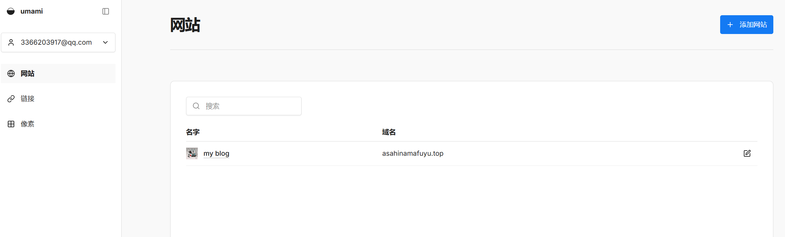

点进去就可以看到我们的数据了：

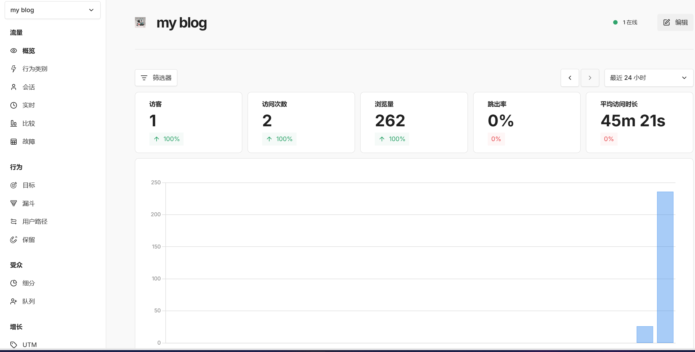

### 将Umami数据接入到博客

首先需要在面板中点开编辑：

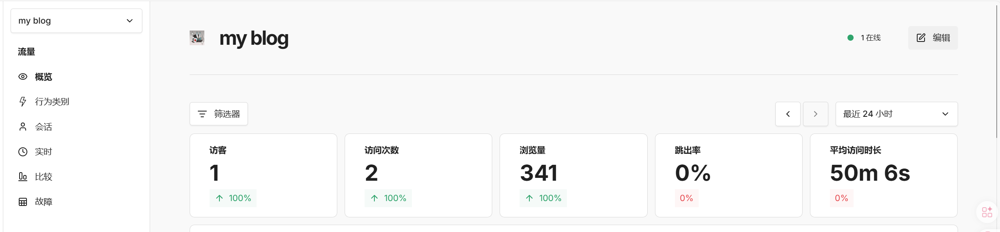

然后点击`添加`：

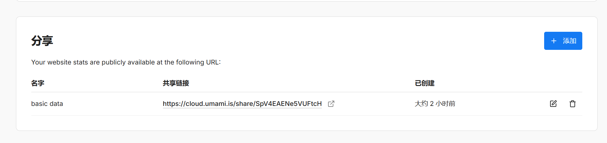

添加你想要统计的数据（后续可以继续添加，这一步填少了填多了都无所谓），然后生成共享连接，点开它，然后弹出这个统计面板：

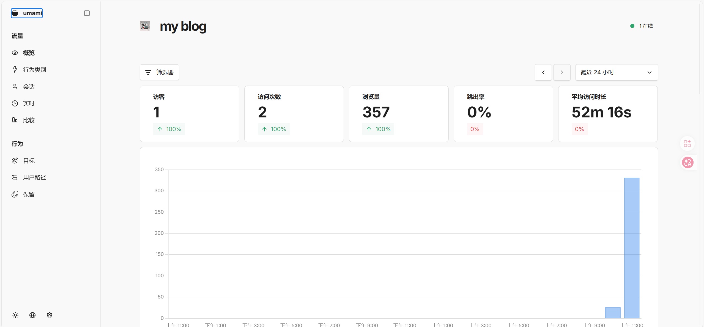

思路也很简单：既然有数据统计，那么肯定是有对应的`fetch`请求，于是：

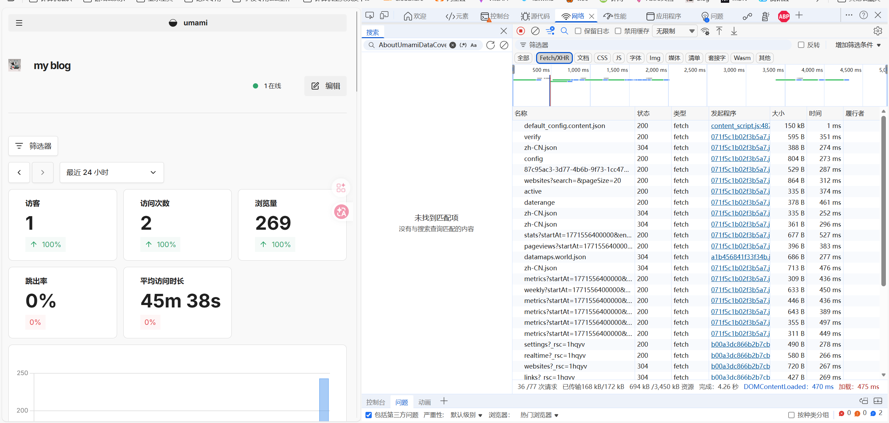

可以看到有这么一个请求，非常符合我们的需求：


将请求`Url`复制过来（根据个人的实际请求`Url`进行对应的复制粘贴）：
https://cloud.umami.is/analytics/us/api/websites/87c95ac3-3d77-4b6b-9f73-1cc473f30bb5/stats?startAt=1771556400000&endAt=1771646399999

然后还需要携带上对应的`x-umami-share-token`(可以发现接口请求也有这么一段token):


可以在服务端写类似的这样一个请求（**注：这里的token最好还是用json封装起来**）：
```ts
import fs from 'node:fs'
export function getPageStates() {
    fetch('https://cloud.umami.is/analytics/us/api/websites/87c95ac3-3d77-4b6b-9f73-1cc473f30bb5/stats?compare=prev&startAt=1771552800000&endAt=1771642799999',{
        headers: {
            "x-umami-share-token": JSON.parse(fs.readFileSync('../umami_token.json', 'utf-8'))["x-umami-share-token"]
        }
    }).then(res=>res.json()).then(data=>{
        console.log(data)
    })
    };
getPageStates()
```

可以发现能够正确的获取到结果：

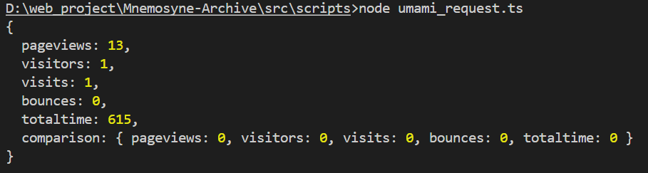

> *Additional*: 可以发现这个`api`可以获取到站点的信息，也就是各个文章的浏览量统计，也是非常不错的（其中x表示路径，y表示的是浏览量）
> 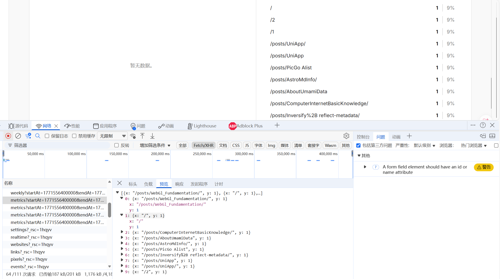

**既然fetch请求由服务端发起，那么我们是不是可以直接使用cf的workers直接进行托管不是更好吗？**
### 使用cf进行托管

打开cf，创建一个worker page（我事先创建好了）：

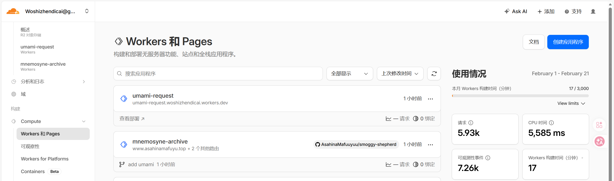

点开`page`，点开设置，找到`变量和机密`，创建（因为我们需要将）`x-umami-share-token`存放进去：

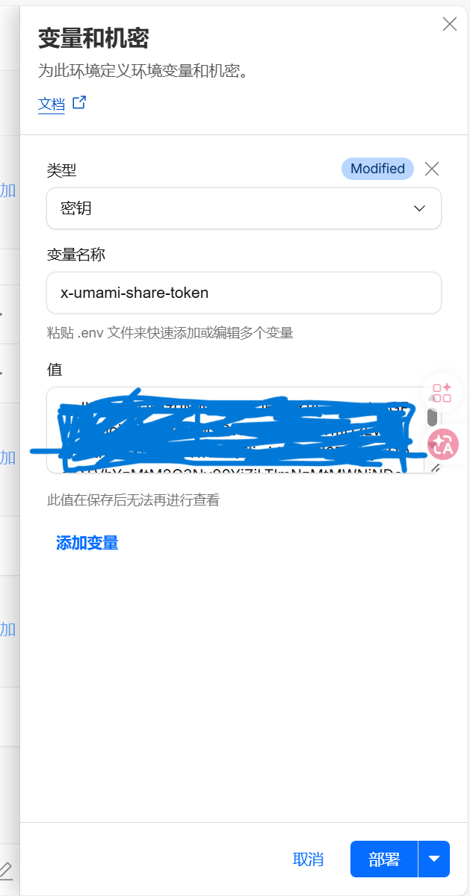

然后我们就可以去`workers`中编辑代码（这里还需要在响应头加上跨域允许）：

```js
export default {

  async fetch(request, env, ctx) {
    const url = new URL(request.url);
    // 只处理你自己的 API 路径
    if (url.pathname !== "/api/umami/stats") {
      return new Response("Not Found", { status: 404 });
    }
    
    // 这里你可以改成从 query 读取 startAt/endAt，但先写死最简单
    const umamiUrl =
      `https://cloud.umami.is/analytics/us/api/websites/87c95ac3-3d77-4b6b-9f73-1cc473f30bb5/stats?startAt=1771560000000&endAt=${Date.now()}`;
      
    // 读取 Worker Secret
    const token = env.UMAMI_SHARE_TOKEN;
    if (!token) {
      return new Response
        JSON.stringify({ error: "Missing UMAMI_SHARE_TOKEN secret" }),
        { status: 500, headers: { "content-type": "application/json" } },
      );
    }

    // 边缘缓存：减少对 Umami 的请求
    const cache = caches.default;
    const cacheKey = new Request(umamiUrl, { method: "GET" });
    const cached = await cache.match(cacheKey);
    if (cached) return cached;

    // 请求 Umami
    const res = await fetch(umamiUrl, {
      headers: {
        "x-umami-share-token": token,
      },
    });

    if (!res.ok) {
      return new Response(
        JSON.stringify({ error: "Umami fetch failed", status: res.status }),
        { status: 502, headers: { "content-type": "application/json" } },
      );
    }

    const body = await res.text();
    const out = new Response(body, {
      headers: {
        "content-type": "application/json",
        // 缓存 30 min（你可按需调整）
        "cache-control": "public, s-maxage=60 * 30",
      },
    });

    // 写入缓存（异步）
    ctx.waitUntil(cache.put(cacheKey, out.clone()));
    return out;
  },
};
```

预览一下，可以得到：

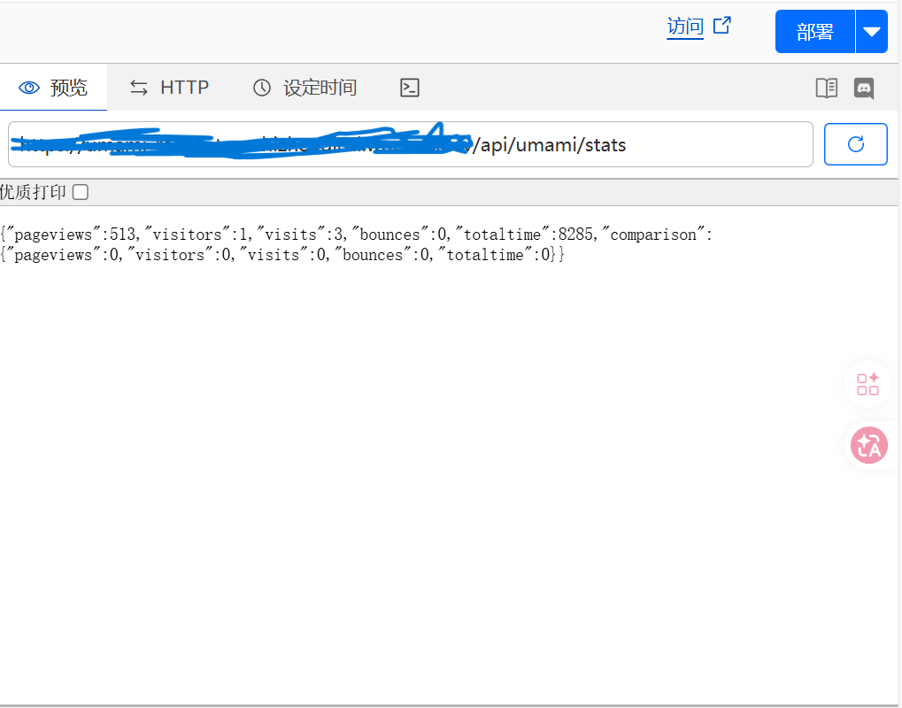

有了这个`json`，则可以直接在前端中进行`fetch`即可：

```html
<!-- 要写在scripts当中，如果写在"--- ---"中的话，那么只会在构建期起作用 -->
 <script>
    const msgJson = await fetch('your-domain/api/umami/stats').then(res => res.json()).then(data => {
        return data
    })  
    console.log(msgJson)
</script>
```

可以得到以下内容：

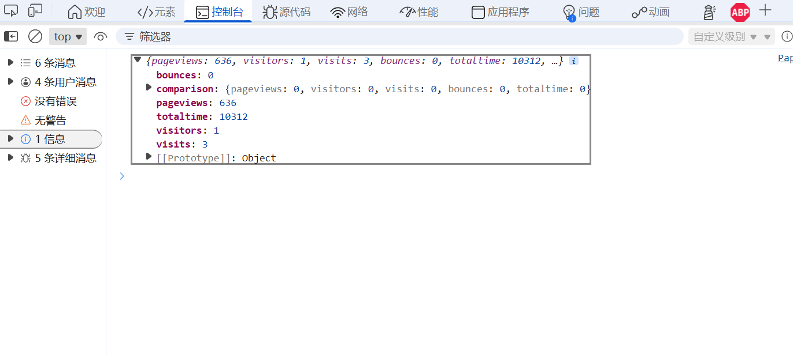

就此，我们直接挂载到页面上即可！

## Google Analytics

按照官网一步步提示构建即可：


不过我觉得这个作为博客的api接口不太行，还是用`Umami`更具体直观一些。

