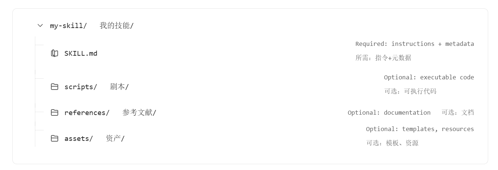

## 前言

skill的核心是一个包含 `SKILL.md` 文件的文件夹。该文件包含元数据（至少包含`名称`和`描述` ）以及指示代理如何执行特定任务的指令。技能还可以捆绑脚本、模板和参考资料。

```structure
my-skill/
├── SKILL.md          # Required: instructions + metadata
├── scripts/          # Optional: executable code
├── references/       # Optional: documentation
└── assets/           # Optional: templates, resources
```



**按需加载（progressive disclosure）**

- 先只读名字/描述
- 需要时再加载详细内容  
	 解决“上下文爆炸”问题

## SKILL.md 结构


```markdown
---  
name: summarize-text  
description: Summarize long-form text into concise key points  
license: MIT  
allowed-tools:  
  - browser  
  - code-interpreter 
metadata:
	author: example-org
	version: "1.0" 
---  
# Instructions  
  
Summarize the provided text into key insights. Focus on clarity and brevity.  
  
# Usage  
  
Input: long article    
Output: concise bullet summary
```

这里分两部分：

**1）YAML frontmatter（元信息）**

| 字段            | 是否必须   | 含义         | 关键约束                      |
| ------------- | ------ | ---------- | ------------------------- |
| name          | 必须     | Skill 唯一标识 | ***必须与父目录名一致*** ，只能小写+连字符 |
| description   | 必须     | 用途说明       | 决定 agent 是否调用             |
| license       | 可选     | 授权信息       | 非核心                       |
| allowed-tools | 可选（实验） | 允许用的工具     | 控制执行能力                    |
| metadata      | 可选     | 扩展字段       | 自定义                       |

关键点：  
**agent 在“未加载 Skill 前”，只会看到 name 和 description**

---

**2）正文（Instructions / Usage）**

这一部分是真正的“执行逻辑”，用于告诉 agent：

- 具体怎么做
- 输入输出格式
- 处理流程

建议写法：

```markdown
# Instructions  
1. Read the input text  
2. Identify key points  
3. Compress into concise summary  
  
# Usage  
Input: article text    
Output: 3-5 bullet points
```


---

### 加载机制（这篇最重要的设计思想）

Skill 不是一次性全部加载，而是分层加载：

|阶段|加载内容|目的|
|---|---|---|
|初始阶段|name + description|判断是否需要该 Skill|
|激活阶段|整个 SKILL.md|执行逻辑|
|深度阶段|scripts / references|处理复杂任务|

本质就是：  
**延迟加载（progressive loading）来控制上下文成本**

---

### 设计规范背后的关键原则

- Skill 必须“可被选择”，所以 description 要写清“什么时候用”
- 主文件要“短而核心”，复杂内容放到 references
- 结构必须简单（避免深层嵌套），否则 agent 很难解析
- 文件之间的引用要明确（不能隐式依赖）
- 整个 Skill 要能被自动工具校验（例如 validate 工具）


## 核心流程

核心流程可以压缩为三个阶段：Discovery（发现）、Activation（激活）、Execution（执行），这三个阶段实际上就是 Skill 机制能工作的关键闭环。

```structure
User Query
   ↓
[Discovery]   → 扫描 skills 目录，只读取 name / description
   ↓
[Activation]  → 匹配用户问题，加载完整 SKILL.md
   ↓
[Execution]   → 按 instructions 执行任务
```

其中 Discovery 阶段发生在会话开始时，agent 会扫描默认目录（比如 `.github/skills/` 或 `.claude/skills/`），但只读取极少信息（name + description），目的只是“建立索引”；Activation 阶段发生在用户提问时，agent 会根据 description 判断是否匹配，一旦匹配就把完整的 `SKILL.md` 加载进上下文；Execution 阶段则是严格按照你写在 `SKILL.md` 里的 instructions 去执行，并根据输入动态调整行为 。

技能是一个包含 `SKILL.md` 文件的文件夹。VS Code 默认会查找 `.agents/skills/` 中的技能。在你的项目中创建 `.agents/skills/roll-dice/SKILL.md`：

```structure
1. 创建目录
   skills/my-skill/

2. 写 SKILL.md
   - YAML：name + description
   - Markdown：instructions + usage

3. 放到约定路径
   .agents/skills/my-skill/

4. 启动 agent（自动发现）

5. 提问触发（靠 description 匹配）
```

对应一个最小用例为：

```markdown
---
name: dice-roller
description: Roll dice with any number of sides. Use for dice, random number, roll.
---

# Instructions
1. Parse number of sides
2. Generate random number
3. Return result

# Usage
Input: "roll a 20-sided dice"
Output: number between 1-20
```

## 实践经验

只写 agent 本来不知道、但没有这些就容易做错的内容，比如项目特定约定、非显然的坑、指定工具或 API，而不要浪费篇幅解释 PDF 是什么、HTTP 是什么这类通用知识。

规范建议把 `SKILL.md` 控制在 **500 行、5000 token 以内**，更详细的材料放进 `references/`，并明确说明“在什么条件下再去读哪个文件”。

先是 **Gotchas**，也就是“容易踩坑但 agent 不会自己想到的事实”。这是高价值内容，因为它最能防止 agent 按常识做错事：

```markdown
## Gotchas
- `users` 表使用软删除，查询时必须带 `WHERE deleted_at IS NULL`
- 数据库里的 `user_id`、鉴权服务里的 `uid`、计费 API 里的 `accountId` 实际上是同一个值
- `/health` 只表示 Web 服务活着，不代表数据库可用；完整健康检查要看 `/ready`
```

这里每一项都不是通用建议，而是“如果不提前告诉 agent，它大概率会踩的坑”。**建议把这种内容直接放在 `SKILL.md` 里，而不是藏到引用文件里，因为 agent 往往不会主动意识到自己快踩坑了**。

再就是 **输出模板**。如果你要求 agent 输出特定格式，最稳的方法不是口头描述，而是直接给模板，因为模型对模式匹配更稳定：

```markdown
## Report structure
Use this template:

```markdown
# [Analysis Title]

## Executive summary
[One-paragraph overview]

## Key findings
- Finding 1
- Finding 2

## Recommendations
1. Recommendation
2. Recommendation
```

中文版可以这么写：

```markdown
## 报告结构
请使用以下模板：

 ```markdown
# [分析标题]

## 执行摘要
[一段概述，总结核心内容]

## 关键发现
- 发现 1
- 发现 2

## 建议
1. 建议 1
2. 建议 2
 \```
```

这里的参数含义也很清楚：

| 元素 | 作用 |
|---|---|
| `[Analysis Title]` | 报告标题占位符 |
| `Executive summary` | 一段摘要，先给结论 |
| `Key findings` | 关键发现，通常列表化 |
| `Recommendations` | 可执行建议，尽量具体 |

短模板可以直接放在 `SKILL.md` 里；长模板或只在某些情形下使用的模板，可以放到 `assets/`，需要时再加载。

对于多步骤任务，这篇建议加 **Checklist**，因为它能帮助 agent 跟踪进度，避免漏步骤，尤其是在步骤有依赖关系时：

```markdown
## Form processing workflow
Progress:
- [ ] Step 1: Analyze the form (`scripts/analyze_form.py`)
- [ ] Step 2: Create field mapping (`fields.json`)
- [ ] Step 3: Validate mapping (`scripts/validate_fields.py`)
- [ ] Step 4: Fill the form (`scripts/fill_form.py`)
- [ ] Step 5: Verify output (`scripts/verify_output.py`)
```

中文版可以这么写：

```markdown
## 表单处理流程  
进度：  
- [ ] 步骤 1：分析表单（`scripts/analyze_form.py`）  
- [ ] 步骤 2：创建字段映射（`fields.json`）  
- [ ] 步骤 3：校验映射（`scripts/validate_fields.py`）  
- [ ] 步骤 4：填充表单（`scripts/fill_form.py`）  
- [ ] 步骤 5：验证输出（`scripts/verify_output.py`）
```

`progress`中的参数可以这么理解：

|项目|含义|
|---|---|
|`scripts/analyze_form.py`|负责提取原始结构|
|`fields.json`|中间映射结果，承上启下|
|`scripts/validate_fields.py`|校验映射是否合法|
|`scripts/fill_form.py`|执行真正填充|
|`scripts/verify_output.py`|对最终结果再做核对|

这种写法的重点不只是“列流程”，而是把依赖关系显式化。也就是“做完之后先验证，不通过就修，再验证，直到通过”。这是把 agent 从“一次性生成”改造成“会自检的流程执行者”：

```markdown
## Editing workflow
1. Make your edits
2. Run validation: `python scripts/validate.py output/`
3. If validation fails:
   - Review the error message
   - Fix the issues
   - Run validation again
4. Only proceed when validation passes
```

中文版可以这么写：

```markdown
## 编辑流程
1. 进行修改
2. 运行校验：`python scripts/validate.py output/`
3. 如果校验失败：
   - 查看错误信息
   - 修复问题
   - 再次运行校验
4. 只有在校验通过后，才继续下一步
```

其中：

|参数/步骤|作用|
|---|---|
|`scripts/validate.py`|校验器，负责发现问题|
|`output/`|待校验结果目录|
|`If validation fails`|明确失败后的修正闭环|
|`Only proceed when validation passes`|防止未通过就继续执行|

这比“请注意检查结果是否正确”这种空话强得多，因为它把验证动作工具化、可执行化了。

最后一个很强的模式是 **Plan → Validate → Execute**，特别适合批处理或有破坏性的任务。文档给出的 PDF 表单示例很典型：

```markdown
## PDF form filling
1. Extract form fields: `python scripts/analyze_form.py input.pdf` -> `form_fields.json`
2. Create `field_values.json`
3. Validate: `python scripts/validate_fields.py form_fields.json field_values.json`
4. If validation fails, revise `field_values.json` and re-validate
5. Fill the form: `python scripts/fill_form.py input.pdf field_values.json output.pdf`
```

中文版可以这么写：

```markdown
## PDF 表单填写流程
1. 提取表单字段：
   `python scripts/analyze_form.py input.pdf`
   → 生成 `form_fields.json`

2. 创建 `field_values.json`（填写内容）

3. 校验：
   `python scripts/validate_fields.py form_fields.json field_values.json`

4. 如果校验失败：
   - 修改 `field_values.json`
   - 重新校验

5. 填写表单：
   `python scripts/fill_form.py input.pdf field_values.json output.pdf`
```

这里最关键的不是“多了一步”，而是把执行前的计划中间件结构化了：

| 文件/命令                | 作用                    |
| -------------------- | --------------------- |
| `input.pdf`          | 原始输入                  |
| `form_fields.json`   | 从源文件中抽取出的真实字段定义，是真实依据 |
| `field_values.json`  | 计划执行内容，表示“我准备怎么填”     |
| `validate_fields.py` | 用真实字段去核对计划是否合法        |
| `output.pdf`         | 验证通过后才生成的最终结果         |

这其实就是把“直接动手做”改成“先出计划、再检查计划、最后执行计划”，能显著减少误操作。

## 优化description

### 核心原则

首先是最核心的写法原则：

- 要用“命令式表达”，不是介绍 ，也就是说不要写“这个 Skill 可以……”，而是写成：
	
	```markdown
	description: 当用户需要分析数据时，使用这个技能
	```
	本质是在告诉 agent：  **什么时候该用，而不是你是什么**
	
- 要描述“用户意图”，而不是实现细节
	
	```markdown
	# 错误（实现导向）
	description: 使用 pandas 处理 CSV 文件
	
	# 正确（用户意图导向）
	description: 当用户需要分析数据、生成图表或清洗数据时使用此技能
	```
	
- 要“主动一点（甚至有点激进）”
	
	```markdown
	description: >
	  当用户需要分析数据文件、生成图表、统计结果时使用，
	  即使用户没有明确提到“CSV”或“数据分析”
	```
	
	> 关键点：不要等关键词命中，要覆盖"隐式需求"
	
- 要简短，但信息密：
	
	```markdown
	# 太短（没信息）
	description: 处理数据

	# 太长（污染上下文）
	description: 一大段说明……

	# 合理
	description: >
	  分析 CSV 或表格数据，计算统计信息、生成图表、清洗数据。
	  当用户需要探索或可视化数据时使用。
	```

### 测试description

这一部分就是用来检测你的SKILL.md是否会触发，具体操作流程详见[Best practices for skill creators - Agent Skills](https://agentskills.io/skill-creation/optimizing-descriptions#testing-whether-a-description-triggers)


codex mcp add matlab -- " D:\MCP\MatLab\matlab-mcp-core-server-win64.exe" --matlab-display-mode=nodesktop --initialize-matlab-on-startup=true --initial-working-folder= “D:\MatLab_Project\MobileVehicle”

