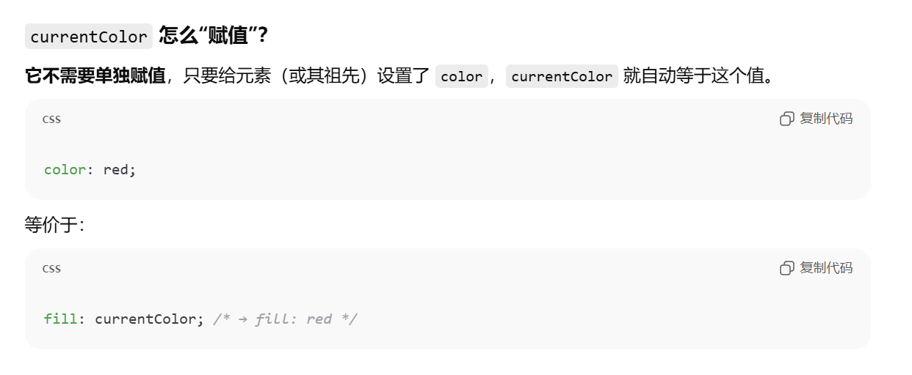

# 1. 外容器思想
我们可以将html的内部用一个容器装着，这个容器占据视口大小的100%，这样的话再用overflow-scroll来进行变更，能够做到视觉上是页面滚动，实际上只是内容在视口内进行滚动
好处如下：
1. 如果是整个页面进行滚动的话，需要设置页面的滚动条样式，但是这样的话我们只需要给我们外层的盒子进行滚动条样式的设计即可
2. 容器固定住了，那么背景图也不会随着滚动而变化
# 2. 导航栏究竟做哪些内容
暂定1.首页 2.文章 3.友链 4.关于 5.统计 
# 3. 关于插槽为什么不能单独写弹性布局
在 Astro 中，<slot> 只是编译期的内容占位符，并不会作为真实 DOM 节点存在于最终 HTML 中；而 CSS Grid 的 col-span-* 等布局规则只对 Grid container 的直接子元素（grid item）生效。因此，把 col-span-2 写在 <slot> 上是无效的，真正参与布局的是传入 slot 的元素本身。若需要控制列跨度，必须在 <slot> 外包一层真实元素（如 div），让该包装元素成为 grid item 并承担布局职责。
# 4. 如何给svg赋上颜色
