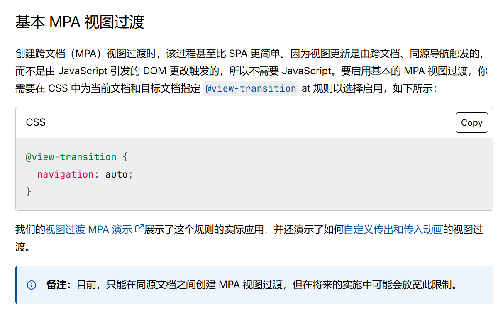

# 1. 为什么要用SPA的动画效果
> 好的视觉体验才能给前端用户带来如同大雷黑皮熟女乳胶的冲击感

SPA动画可以让用户能够访问不同的URL但是却只用更新某一部分的动画内容，这样的话给用户的体验带来极其高的视觉效果

# 2. SPA动画的底层实现
## 2.1 View Transition
这里就得介绍一下关于View Transition的相关内容
> 借助 View Transition API，您可以创建网站上不同视图之间的无缝视觉过渡效果。这样一来，无论您的网站是作为多页应用 (MPA) 还是单页应用 (SPA) 构建的，用户在浏览您的网站时都能获得更具视觉吸引力的用户体验。
> <video controls src="https://developer.chrome.com/static/docs/web-platform/view-transitions/video/CZmpGM8Eo1dFe0KNhEO9SGO8Ok23/hgnJfPFUbGlucFegEEtl.mp4?hl=zh-cn" title="Title"></video>
>

在mdn上也有类似的教程：
