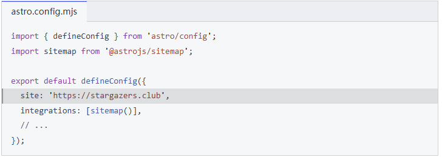

## sitemap究竟是个啥

Sitemap是“网站地图”，通常指一个包含网站所有页面的列表，旨在帮助搜索引擎更有效地抓取和索引网站内容。制作并提交Sitemap的主要目的是为了让Google等搜索引擎快速找到并收录网站中的所有页面。

sitemap通常需要放在域名的根目录下：("https://your-domain/sitemap.xml")
如果是普通网站，可以直接生成sitemap:[免费 XML Sitemap 生成器 – 在线创建站点地图](https://landing-page.io/zh/tools/sitemap-generator)
但是对于博客而言，每次新增博文，都需要修改**sitemap**，那样会非常麻烦，因此需要借助官方astro的sitemap插件

## @Astro sitemap

### 安装

```npm
npx astro add sitemap
```

然后就可以进行安装：

```powershell
D:\web_project\Mnemosyne-Archive>npx astro add sitemap
√ Resolving packages...

  Astro will run the following command:
  If you skip this step, you can always run it yourself later

 ╭────────────────────────────────╮
 │ npm i @astrojs/sitemap@^3.7.0  │
 ╰────────────────────────────────╯

  To run this command without prompts, pass the --yes flag

√ Continue? ... yes
√ Installing dependencies...

  Astro will make the following changes to your config file:

 ╭ astro.config.mjs ─────────────────────────────╮
 │ // @ts-check                                  │
 │ import { defineConfig } from 'astro/config';  │
 │                                               │
 │ import preact from "@astrojs/preact";         │
 │                                               │
 │ import tailwindcss from "@tailwindcss/vite";  │
 │                                               │
 │ import sitemap from "@astrojs/sitemap";       │
 │                                               │
 │ // https://astro.build/config                 │
 │ export default defineConfig({                 │
 │   site: "https://asahinamafuyu.top/",         │
 │   integrations: [preact(), sitemap()],        │
 │                                               │
 │   vite: {                                     │
 │     plugins: [tailwindcss()]                  │
 │   }                                           │
 │ });                                           │
 ╰───────────────────────────────────────────────╯

√ Continue? ... yes

   success  Added the following integration to your project:
  - @astrojs/sitemap

```

### 用法

> （此处用法等参考astro官方教程：[@astrojs/sitemap | 文档](https://docs.astro.build/en/guides/integrations-guide/sitemap/#manual-install)）

将你站点的 URL 添加到 `astro.config.mjs` 中的 [site](https://docs.astro.build/zh-cn/reference/configuration-reference/#site) 选项。且这个 URL 必须以 `http://` 或 `https://` 开头。



配置站点地图集成后，在构建站点时，`sitemap-index.xml` 和 `sitemap-0.xml` 文件将添加到你的输出目录中。这样也就生成了对应的站点xml

`sitemap-index.xml` 链接到所有编号的站点地图文件。 `sitemap-0.xml` 列出了你网站上的页面。 对于非常大的站点，可能还存在其他编号文件，例如 `sitemap-1.xml` 和 `sitemap-2.xml`。


### 站点抓取

主要是配置两个：
1. `<head>`标签中的站点地图链接：
	```html
	<head>
	<link rel="sitemap" href="/sitemap-index.xml" />
	</head>
	```
2. `robots.txt` 中的站点地图链接:
	```txt
	// public/robots.txt
	User-agent: *
	Allow: /
	Sitemap: https://<YOUR SITE>/sitemap-index.xml
	```

如果是想要利用`astro.config.mjs` 中的 `site`，以动态生成 `robots.txt` 的话。则不要使用 `public/` 目录中的静态文件，而是创建 `src/pages/robots.txt.ts` 文件并添加以下代码：
```ts
import type { APIRoute } from 'astro';
const getRobotsTxt = (sitemapURL: URL) => `\
User-agent: *
Allow: /
Sitemap: ${sitemapURL.href}
`;

export const GET: APIRoute = ({ site }) => {
	const sitemapURL = new URL('sitemap-index.xml', site);
	return new Response(getRobotsTxt(sitemapURL));
};
```

然后构建项目，就可以动态生成`robots.txt`了