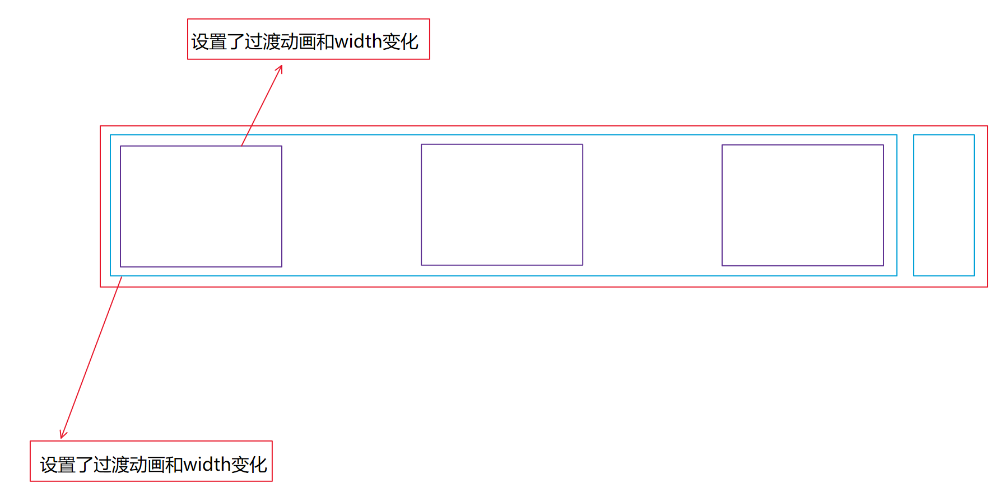
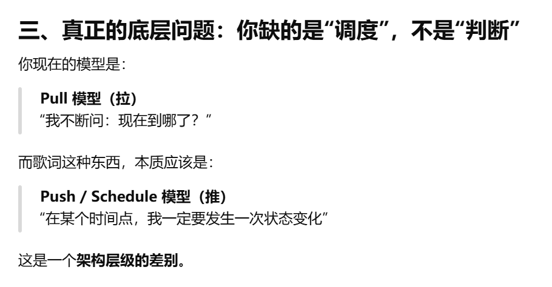
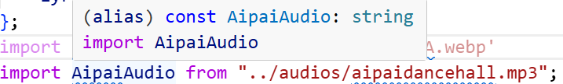
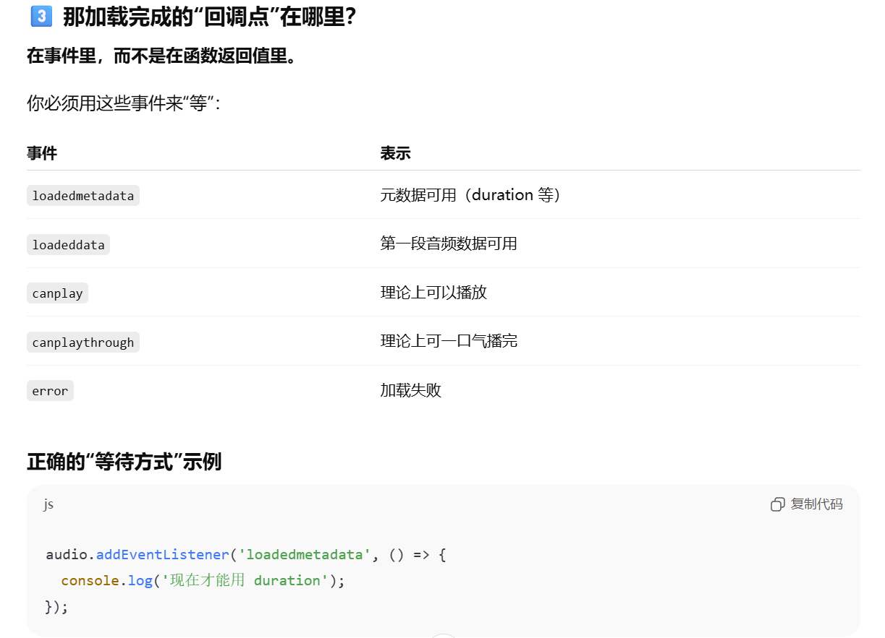
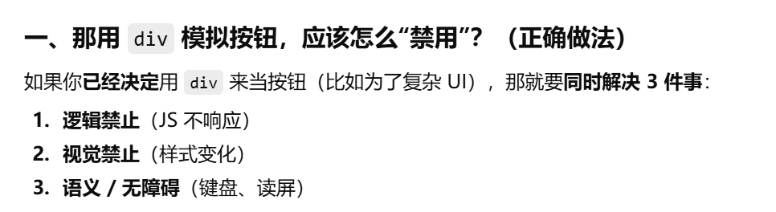
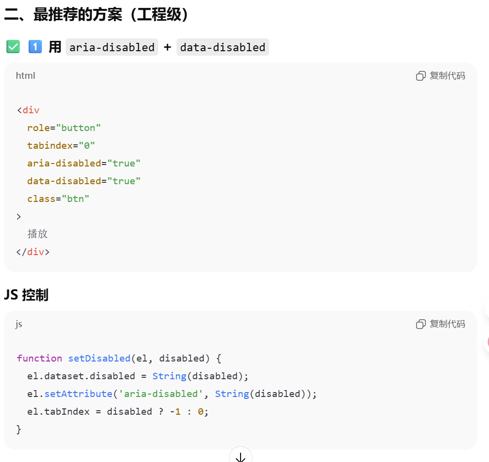
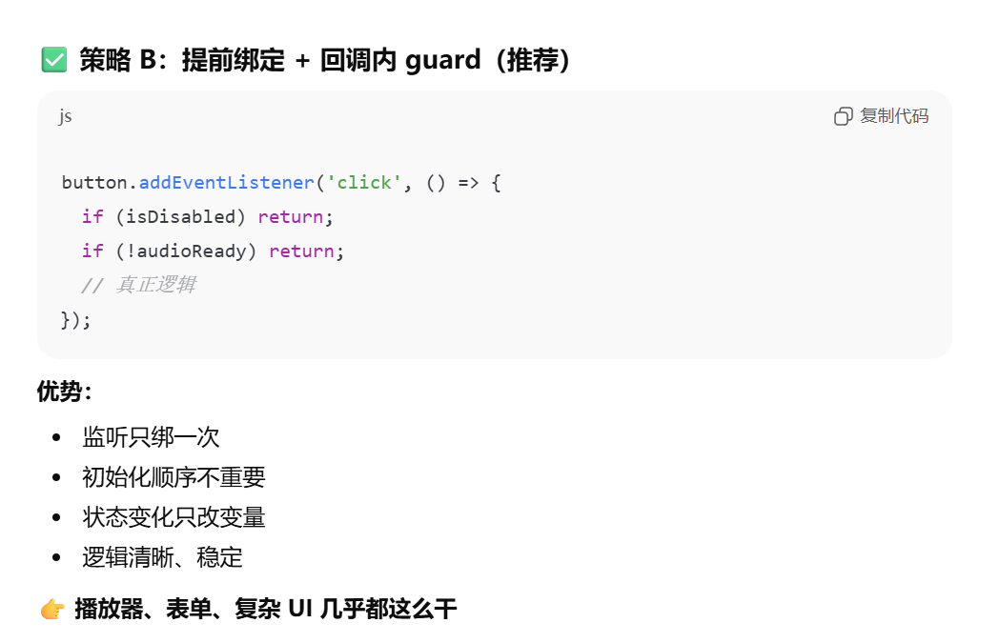
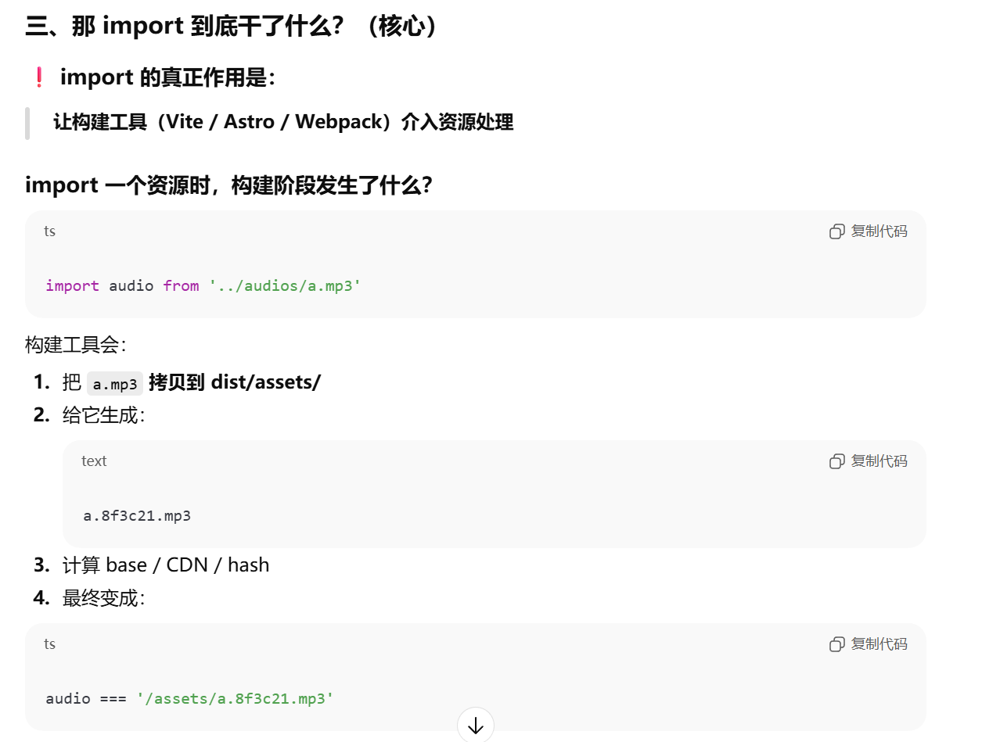
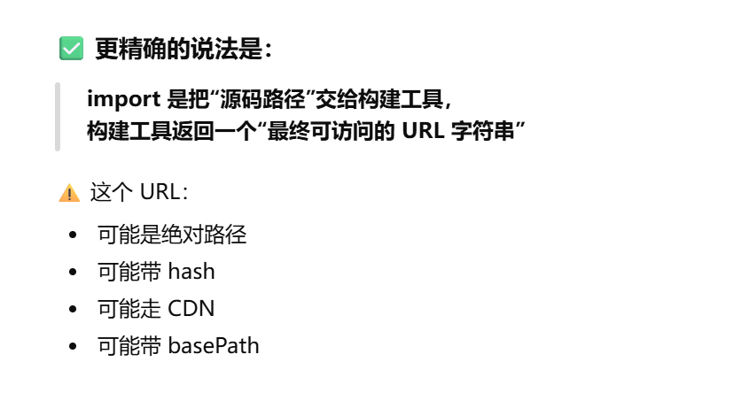

# 1. 状态设置
首先状态的话建议是针对hidden和unfold两个状态，hidden的话就彻底隐藏，而且对于一些公共属性（比如动画效果，background-image等等），我的建议是设置成普通属性，不需要用hidden: 或者unfold: 状态来修饰，不然在状态变化的过渡当中会发生很奇怪的事情
通过状态设置，需要明白哪些属性是得变的，要变的属性（例如transform，width等等）才用状态前缀包裹起来，其他的不变的属性（例如背景图片，背景图片覆盖样式等等）才设置为常用状态，即前面不加任何前缀

# 2. flex盒子突变
> *我试图通过transition去改变**内部元素的突变效果**，然而只是徒劳无功:joy:* 
> <p style="text-align:end">---AsahinaMafuyu</p>
---
flex盒子中元素发生增删的话，就会导致flex布局突变，此时要用到Flip：
Flip就是：
1. 首先需要在修改之前将transition移除（直接突变）
2. 其次的话需要查询到当前坐标位置（getBoundingClientRect()）
3. 布局变化之后（在同一个帧内）读取坐标位置（此时可以得到变化前后的位置），立刻设置translateX和translateY，以保证这一帧不会发生突变（transition移除以后可以突变）**新发现：（如果盒子本身的规模也会发生突变的话，我推荐使用clip-path进行视觉上的裁剪变化）**
4. 在下一帧加上transition(注意先加transition)，然后再让translateX和translateY设置为0即可

# 3. 滑动歌词处理
方法1. 制作一个大的容器，每次滑动一些在视口显示，形成最简单的滚动歌词的逻辑
方法2. 做一个list，只显示要展示的部分，每次只展示部分：

当下一次播放插入的时候，利用FLIP动画来实现过渡效果：


**注**：上述两种方法的核心都是要用到timeupdate这个核心事件来监听audio的变化，然后将currentTime来进行时间戳的判断
**对歌词来说，我不管你这一句唱了多长时间，我只管你这一句歌词是不是要展示的一个时间段的内容**  
数据结构的话，通常用如下数据结构：

```typescript
type LyricLine = {
  t: number;        // 时间（秒，浮点）
  text: string;     // 该行歌词
  // 可选：双语
  trans?: string;   // 翻译行
};

const lines: LyricLine[] = [
  { t: 0.86, text: "愛包ダンスホール 今日はボレロ", trans: "爱派Dancehall 今天上演博莱罗" },
  ...
];
```
用一个字典数组来存放时间戳，用数组的意义在于到底是第几句歌词

# 4. 关于flex突变要添加FLIP过于麻烦
如果盒子里有一个flex和一个固定尺寸的元素,那么还是用calc来计算方便
然后还有动画:当出现这种结构的时候:

此时蓝色盒子和紫色盒子都设置了动画的话,那么在使用响应式计算的时候,很容易形成紫色盒子也要渲染过渡动画,蓝色盒子也要渲染过渡动画,导致的是**最右边的蓝色盒子只用渲染一个动画**,这样的话最右边的蓝色盒子跑的最快,因此**需要将紫色盒子不设置动画,蓝色盒子设置动画的话只用渲染自身的尺寸**,假设紫色盒子中有需要动画渲染的元素,那么就在紫色盒子的最外层套上一层div,**用来平滑蓝色盒子**.
# 5. 要注意逻辑顺序：
```typescript
// 定义判断函数
    function isTitleOverflow() {
        console.log(single_audio_title.getBoundingClientRect().width)
        if (single_audio_title.getBoundingClientRect().width > 120) {
            
            // 内部元素复制
            single_audio_title.innerText += "&nbsp;&nbsp;";
            single_audio_title.innerText += single_audio_title.innerText;

            // 大于120则代表溢出，需要进行播放
            // 要注意这个顺序
            single_audio_info_display.dataset.titleoverflow = "true";
        }
    }
```
> 先复制元素，再来对元素进行状态的开启预处理，否则的话会乱套

# 6. 关于歌词更新：
如果是播放器自动更新的话，完全没有必要来索引json文件通过对比currentTime和歌词的时间，不然每一次更新都要进行对比，时间开销非常大，**直接记录下当前歌词的索引值**，然后每一次进行timeUpdate的时候看当前时间是否进入到下一个time，如果大于下一个time，意味着要播放下一句歌词了
> 但是上述逻辑有一个很明显的漏洞：那就是当timeupdate达不到我所更新的时间的时候，就会发生歌词错位：也就是说**歌词实际上已经唱了2-3句，但是timupdate在这个时间段内还没有更新或者只更新了一次**
> 

用rAF在每一帧对事件头进行判定即可
所以答案总结成两句话

> ✅ 每一帧都做：读 audio.currentTime + O(1) 检查队头是否到期
> ✅ 一旦到期：用“while 补账”推进到正确的那句（可能跨多句）

# 7. 关于ImageMetaData类型
> </br>**声明文件里写的ImageMetaData类型是一个特殊的类，通过.src来得到他的相关url**
> ```typescript
> export type ImageMetadata = {
>   src: string;
>   width: number;
>   height: number;
>   format: ImageInputFormat;
>   orientation?: number;
>   [isESMImport]?: true; 
> }
> ```
其实也只是通过url来进行解析，并不能够进行预加载
然后关于Audio，它单纯就是一个字符串，指向的就是url

# 8. Audio的相关事件

对于js开发div的禁止效果：例如当加载音频期间，不允许进行播放等操作


也就是说需要用js来设置disabled，样式也是设置成disabled（hover:cursor-not-allowed）
然后div的js逻辑中click需要进行处理（如果el.dataset.disabled，则不执行）
以及js绑定技术：事件监听只绑定一次，但是内部需要进行判别：


# 9. Fisher–Yates shuffle算法
原理大致就是:每次抽一个数,然后与最前面或者最后面的互换,然后取出最后的一个数(也就是当前抽取的数),重复上述过程,直到剩余数组大小为1
网易云的播放逻辑就是:当使用随机播放以后,当前歌曲变成第一首,然后列表中的歌曲都会随机打乱,当播放到最后一首的时候,此时最后一首变成第一首,然后其他的歌曲重新打乱顺序
如果用Fisher-Yates shuffle算法的话,逻辑大概就是:
> 1. 首先需要创建一个数组用来维护Fisher-Yates所创建的Array
> 2. 然后还需要创建一个Dict用来映射这些逻辑关系
> 3. 监听的事件有:切换播放模式, 音频加载的时候需要进行判断(是否当前为最后一首,如果是的话需要重新shuffle)(这样的话不需要维护上一首和下一首这些控件的逻辑,我只用看当前加载的音频的index是否为最后一首即可)

具体使用的话,就将当前array中播放的曲子拿出来(保留上下,然后再进行Fisher-Yates的算法)

# 10. 音频的 preload 到底怎么用？

`<audio preload>`三个常用值：

`none`：基本不下载（最懒）

`metadata`：只下元信息（时长、编码信息），通常很小（折中，常用）

`auto`：浏览器自己决定，可能会下载不少（偏静态）
我的建议（默认）：**metadata**
既能让你拿到`duration`、进度条初始化，也不会把整首歌先下了。
# 11. 关于import的相关知识


浏览器只认识 URL
构建工具只认识 import
glob 是让你“按需触发构建工具”

> **import 音频 = 把音频交给构建工具 → 复制到 assets → 返回最终可访问的 URL 字符串**
> 很直观的例子,如果你在img的src中写的是当前工程中的相对路径,那么就会报错(404),但是如果是先import,再将import得到的路径交给src,这才对,因为astro是一个先构建,构建完毕后取消掉所有不可用的js代码

# 12. JS代码工程化模板
JS的话推荐优先获取DOM,然后再定义变量,然后再定义工具函数,然后再定义事件处理的函数,最后再进行事件监听函数的定义
```typescript
/* 1️⃣ DOM */
const range = document.querySelector("#range");
const audio = document.querySelector("audio");

/* 2️⃣ 状态 */
let dragging = false;

/* 3️⃣ 工具函数(无副作用) */
function clamp(v, min, max) {
  return Math.min(max, Math.max(min, v));
}

/* 4️⃣ 业务逻辑(不是纯函数,有副作用) */
function syncUI() {
  range.value = audio.currentTime;
}

/* 5️⃣ 事件处理函数（⚠️ 注意：这里只是“处理”，不是监听） */
function onInput() {
  if (!dragging) return;
  audio.currentTime = range.value;
}

function onPointerDown() {
  dragging = true;
}

function onPointerUp() {
  dragging = false;
}

/* ⭐ 5.5️⃣ 事件监听集中区（你刚才觉得“缺失”的部分） */
function bindEvents() {
  range.addEventListener("input", onInput);
  range.addEventListener("pointerdown", onPointerDown);
  range.addEventListener("pointerup", onPointerUp);
}

/* 6️⃣ 初始化 */
function init() {
  bindEvents();
  syncUI();
}

/* 7️⃣ 启动（最后） */
init();
```

# 13. 歌词滑动页
可以设置一个事件,每滑动的时候将定时器重置,该定时器主要就是将isScroll这种变量设置为true
**对于tick而言,还需要判断用户是否scroll**

# 14. 如果需要根据父元素的后代来修改样式，可以用group来标记
例如父元素hover，子元素修改样式，可以使用group标记父元素，然后子元素用group-hover
```html
<div class="group bg-gray-200 p-4">
  <div class="opacity-0 group-hover:opacity-100 transition">
    子元素
  </div>
</div>
```
父元素：group
子元素：group-hover:xxx
**但是这样的话产生了一个问题：当多个父元素都进行group的话，那么该怎么找到指定父元素的特定状态呢？**
#### 答案就是给group自定义命名区分
示例如下：
1. 定义group
```html 
html

<div class="group/card">
<div class="group/menu">
<div class="group/cover">
```
2. 使用group的状态：
```html
html

group-hover/card:...
group-focus/menu:...
group-active/cover:...
```
这样的话就可以对多个父元素进行挂载定义
```html
html

<div class="group/card p-4">
  <div class="group/menu p-2">

    <span class="group-hover/card:text-red-500">
      hover card 变红
    </span>

    <span class="group-hover/menu:text-blue-500">
      hover menu 变蓝
    </span>

  </div>
</div>

```
# 15. 对于歌词页而言：自动滚动和人为滚动要区分开来
建议是用wheel事件代替scroll事件
# 16. 解决图层问题
如果两个标签不在同一个父元素容器中，并且也不好进行处理的时候，不妨将这两个元素的父容器的图层修改一下，**只要父容器的图层高于另一个父容器图层**，那么就不会被覆盖