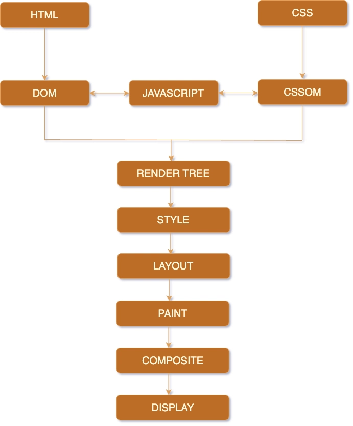

## 渲染页面机制

关键渲染路径（CRP）指的是浏览器将 HTML、CSS 和 JavaScript 转换为屏幕上像素的一系列步骤，其流程如下图所示：

*（此图片内容来源于 [web.dev](https://web.dev/)）*

### 关键渲染路径中的关键阶段：
1. **HTML 解析** ：浏览器解析 HTML 文档以构建文档对象模型 (DOM)。
	
2. **CSSOM 构建** ：浏览器处理 CSS 文件以构建 CSS 对象模型 (CSSOM)。
	
3. **JavaScript 执行** ：如果 HTML 引用了外部或内联 JavaScript，浏览器可能会暂停解析以执行脚本。
	
4. **渲染树的构建** ：DOM 和 CSSOM 组合形成渲染树，表示要显示的元素及其样式。
	
5. **布局和绘制** ：浏览器计算元素的布局并在屏幕上绘制像素。

*（内容出自[Understanding the Critical Render Path and Its Role in Web Performance - DEV Community](https://dev.to/nik26_/understanding-the-critical-render-path-and-its-role-in-web-performance-24c5)）*

只有完成CRP，用户才能看到相关内容，问题来了，初始渲染到底需要哪些数据呢？

### 初始渲染的关键资源

浏览器需要某些资源才能完成页面初始渲染，包括：
- **HTML** ：关键部分会在到达时进行处理。
	
- **阻塞渲染的 CSS** ：通常位于 `<head>` 元素中。
    
- **阻塞渲染的 JavaScript** ：通常位于 `<head>` 元素中。

而浏览器也不会等待某些相关的资源，包括：
- **所有 HTML** ：渲染从可用部分开始。
    
- **字体** ：文本可能暂时不可见，直到字体加载完毕。
    
- **图片** ：空间可能已被预留，但浏览器仍继续运行。
    
- ****非渲染阻塞 JavaScript** ：通常放在 `<head>` 之外，或标记为 async 或 defer。
    
- **非渲染阻塞 CSS** ：包含与当前视口无关的媒体属性样式。

**阻塞渲染器的资源主要是css**，CSS 被视为一种渲染阻塞资源，因为它会阻止浏览器显示任何内容，直到 CSS 对象模型 (CSSOM) 完全构建完成。这种行为可以避免出现“未样式内容闪烁 (FOUC)”的情况，从而确保流畅的用户体验。

而解析器的主要阻塞来源为javascript，默认情况下，除非标记 `async` 或 `defer` ，否则它会阻塞解析。**这可以确保在执行之前 DOM 和 CSSOM 的稳定性**。

### FCP指标

> 浏览器在解析过程中，**一旦已经拥有“可绘制内容 + 必要样式信息（CSSOM/布局）”，并且主线程出现可用空档**，就会在某个渲染时机点提交一次绘制；这次提交如果产生了“可见内容像素”，就会记为 **FCP**。
> 
> *对于此指标，“内容”是指文本、图片（包括背景图片）、`<svg>` 元素或非白色 `<canvas>` 元素。*

## 最大内容绘制时间（LCP）

详见[Largest Contentful Paint (LCP)  |  Articles  |  web.dev for China](https://web.developers.google.cn/articles/lcp?hl=zh_cn)
