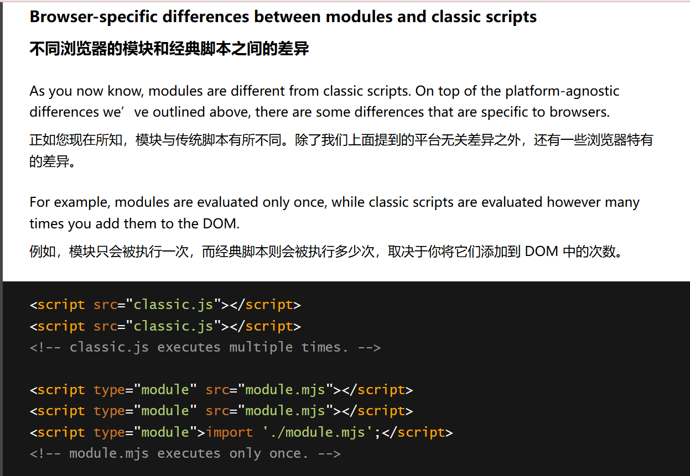
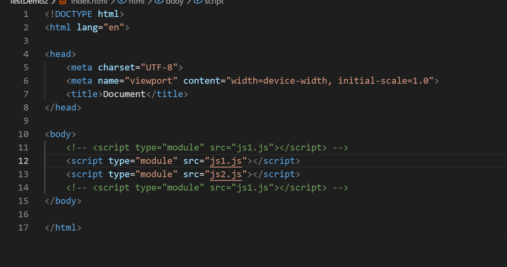
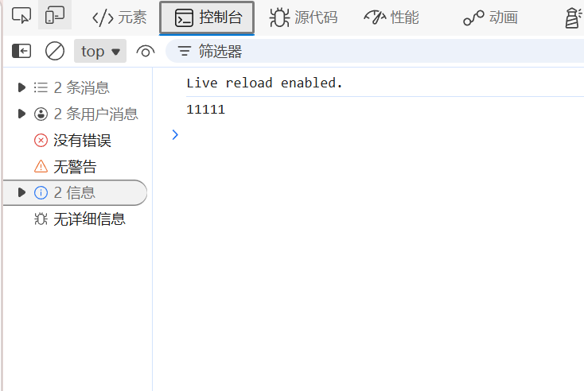
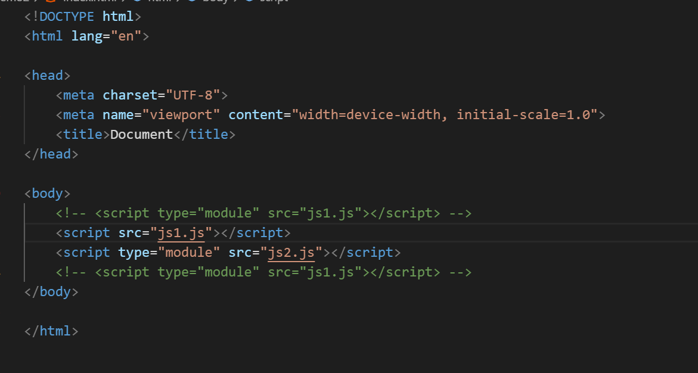
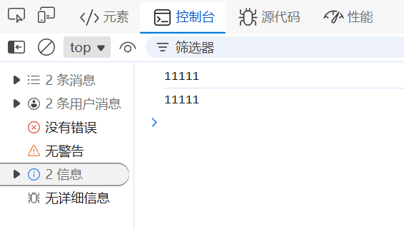
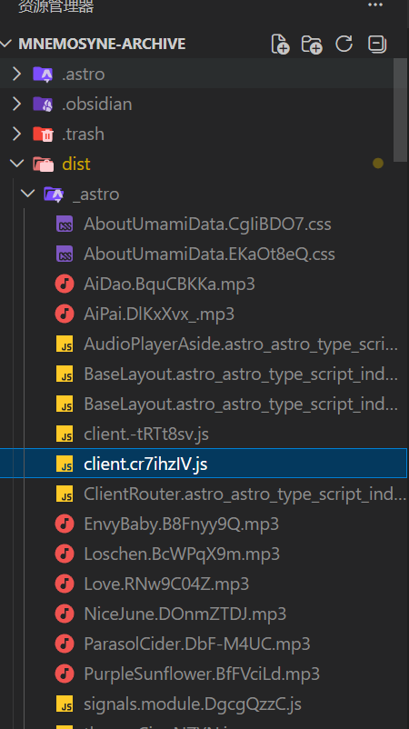

## ESModule加载机制

ESModule在浏览器中，对于同URL的ESM，js代码只会加载并执行一次：



这个问题就要追朔到当时做Astro页面的时候了，当时用原生js进行开发，结果发现：各种交互空间只有在进入首页的一瞬间以及刷新的时候才能使用，一旦跳转到其他页面，就不会重新使用了，而且当时使用的是SPA，SPA在加载JS的时候发现已经加载过这个module了，并且还沿用的是ESM，因此的话SPA就不会重新加载该js，也不会执行，这样就导致：**原来的js代码监听的还是原来的DOM对象，而HTML进行重渲染的时候DOM对象重新创建了，对象实际上可以理解成指针，创建的新DOM对象在内存上的地址不一样，因此的话js自然无法运作**

我们可以进行一点测试：



在这里我使用了两个.js，并且js1只是打印1111，js2是引入js1,而且用的也是import这种ESM的代码规范（require是cjs）：

```js js2.js
import './js1.js'
```

打开浏览器，确实只打印了一次：



改一下：



这样的话，第一个js1是cjs导入，不会记录到Map当中，第二个就是ESM导入，因此会记录，打印两次：



### 加载非Js资源

需要进行声明：

```js
import colors from "./colors.json" with { type: "json" }; 
import styles from "./styles.css" with { type: "css" };
```

## HTML中的规范

如果在HTML中导入ESM：

```html
<script type="module" src="main.js"></script>
```

那么对于main.js而言，**你只能在模块内使用 `import` 和 `export` 语句，不能在常规脚本中使用**。如果你的 `<script>` 元素没有 `type="module"` 属性并尝试导入其他模块，将会抛出错误。

### 动态加载模块

其实ESM也算动态加载模块，不过还有一种动态导入模组的方式：

```js
import("/modules/mymodule.js").then((module) => { // 使用模块做一些事情。 });
```

这允许你仅在需要时动态加载模块，而不必预先加载所有模块。这有一些明显的性能优势

这种动态导入的方式主要用于js脚本中：

```html
<script>
  import("./modules/square.js").then((module) => {
    // 使用模块做一些事情。
  });
  // 其他操作全局范围的代码，还没有准备好重构为模块。
  var btn = document.querySelector(".square");
</script>
```

### 缓存机制的弊端和利端

浏览器会缓存文件以减少加载时间和带宽消耗，**这个缓存通常都是运行时缓存，一旦刷新页面或者跳转页面就会丢失（SPA的话得跳到其他域名的页面才行）** 但对于 ESM 来说，这种行为可能会适得其反：当您更新某个模块（例如 `utils.js` ）时，由于文件 URL 保持不变，浏览器可能仍然会提供旧的缓存版本。

## ESM 缓存自动化解决方案

### 构建工具与内容哈希

现代构建工具（Webpack、Vite、Rollup）通过为模块生成**内容哈希文件名**来解决缓存问题。“内容哈希”是一个从文件内容派生的唯一字符串——如果内容发生变化，哈希值也会随之改变，从而强制浏览器获取新文件。

工作原理如下：

1. The build tool bundles your ESM files.  
    构建工具会将您的 ESM 文件打包。
2. For each output file, it appends a hash (e.g., `utils.8a3b2.js` instead of `utils.js`).  
    对于每个输出文件，它都会附加一个哈希值（例如， `utils.8a3b2.js` 而不是 `utils.js` ）。
3. It updates all `import` statements and HTML entry points to reference the hashed filenames.  
    它会将所有 `import` 语句和 HTML 入口点更新为引用哈希文件名。

比如我这个博客用构建工具build以后：



这些js文件统一都放在一个目录下了，并且都加上了一定的哈希值

如果使用webpack，还要配置hash值：


而使用vite的话就不用考虑那么多：
 
Vite 默认在生产版本中启用内容哈希功能。无需手动配置！

```bash
# Build for production
vite build
```

Vite 会生成一个 `dist/` 文件夹，其中包含哈希文件名（例如， `utils.8a3b2.js` ），并更新 `index.html` 以导入它们。

因此对于这些hash文件而言：他们的内容一旦发生改变，则会改变文件名，到时候拉取的时候拉取的文件也不一致，因此可以长期保存：让服务器设置Headers即可（尤其是 **`Cache-Control: public, max-age=31536000, immutable`** 以及 **`ETag` / `Last-Modified`** ）

Nginx中可以这么配置：

```nginx
# /etc/nginx/sites-available/your-app
server { 
	location / { 
		root /var/www/your-app/dist; 
		try_files $uri $uri/ /index.html; # 这个一般是配合单页面使用的 
		} 
	# Cache hashed ESM files for 1 year 
	location ~* \.(js)$ { 
		add_header Cache-Control "public, max-age=31536000, immutable"; 
		etag on; # Enable ETags 
	}
}
```

## Astro中解决SPA关于ESM问题

SPA中ESM的问题已经在上述中讨论过了，这里针对解决方案了解一下：

astro中对于页面跳转有一套完整的生命周期，我们只要在对应的生命周期执行即可，通常一般用这个钩子函数`astro:page-load`，用于每次路由跳转之后，且新页面的DOM已经挂载完毕了，这时候可以使用`astro:page-load`来获取到对应的DOM并进行相应操作：

```html
<script>  
	function bind() {  
		document.querySelector('.btn')?.addEventListener('click', () => {  
			console.log('clicked')  
		})  
	}  
	bind()  
	  
	document.addEventListener("astro:page-load", bind)  
</script>
```

也就是说js代码得重新完整的执行一遍（包括元素绑定，事件监听都得重新执行），这样就可以做到DOM更新的同时，对应的js也进行了重新的绑定。

## JS代码拆分

代码拆分是一种实用技术，可减少网页的初始 JavaScript 载荷。它可让您将 JavaScript 软件包拆分为两部分：

- 在网页加载时需要，因此无法在任何其他时间加载。
- 可在稍后时间点加载的剩余 JavaScript，通常是在用户与网页上的指定互动元素互动时加载。

上面我们讲到了动态加载模块的语法，此时就可以做一些非常不错的事情了：

```js
document.querySelectorAll('#myForm input').addEventListener('blur', async () => {
  // Get the form validation named export from the module through destructuring:
  const { validateForm } = await import('/validate-form.mjs');

  // Validate the form:
  validateForm();
}, { once: true });
```

在上面的 JavaScript 代码段中，只有当用户[模糊处理](https://developer.mozilla.org/docs/Web/API/Element/blur_event)表单的任何 `<input>` 字段时，系统才会下载、解析和执行 `validate-form.mjs` 模块。在这种情况下，负责驱动表单验证逻辑的 JavaScript 资源仅在最有可能实际使用时才与网页相关联。

> 而且咱用的还是ESM，也就是说当之前`import` 过`validate-form.mjs`以后，后面的动态导入都不会占用带宽和CPU了，直接从缓存中取出来即可，非常方便

> [React](https://react.dev/) 通过其 [`React.lazy`](https://react.dev/reference/react/lazy) 语法抽象化了动态 `import()`。从底层来看，这仍然依赖于动态 `import()`，并且模块打包器仍然负责将 JavaScript 拆分为单独的块。

## 顶层await

这里再补充一点：对于ESM而言，是可以使用顶层await的：

```js
const res = await fetch('/api/data')  
const data = await res.json()  
  
console.log(data)
```

通常而言，await通常只能用在async当中：

```js
async function main() {
  const res = await fetch('/api/data')
  const data = await res.json()
  console.log(data)
}

main()
```

顶层 `await` 的意义就是：

**不需要再为了异步初始化专门套一层 async 函数了。**

所以它特别适合：

- 模块初始化时就要异步取数据
- 模块初始化时就要异步加载配置
- 模块初始化时就要动态 import 某些资源
- 某个模块必须“准备好以后”别的模块才能继续执行

