## Electron模型

electron = chromium + NodeJs + Native API

因此我们还需要补充chromium和原生API的相关知识以及内容，以下为Electorn的流程模型（每一个流程可能用到不同的js runtime，例如主进程现在用的就是nodejs环境，而渲染进程用的则是web环境）

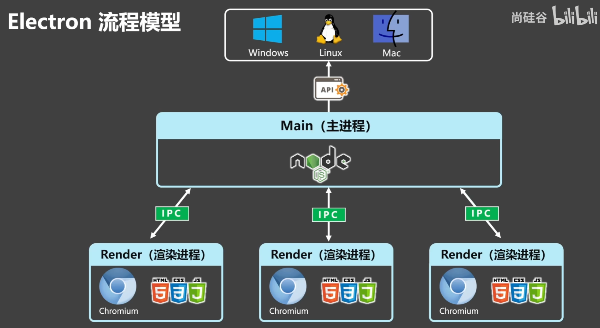

## 初始化Electron

1. 创建一个dir，然后cd进去，然后npm init -y即可，生成一个package.json

>注：package.json中：_entry point_ 应该是 `main.js`（你很快就会创建该文件。_author_、_license_ 和 _description_ 可以是任意值，**但以后在 [封装](https://electron.nodejs.cn/docs/latest/tutorial/tutorial-packaging) 中将是必要的**。

2. 将electron添加到Dev依赖中：

	```bash
	npm install electron --save-dev
	```

3. 由于 Electron 的主进程是一个 Node.js 运行时，你可以使用 `electron` 命令执行任意 Node.js 代码（你甚至可以将其用作 [交互式编程环境](https://electron.nodejs.cn/docs/latest/tutorial/repl)）。要执行此脚本，请在 package.json 的 [`scripts`](https://npm.nodejs.cn/cli/v7/using-npm/scripts) 字段中将 `electron .` 添加到 `start` 命令中。此命令将告诉 Electron 可执行文件在当前目录中查找主脚本并以开发模式运行它。

	```json package.json
	{
		"scripts": {  
			"start": "electron .",  
			"test": "echo \"Error: no test specified\" && exit 1"  
		},
	}
	```

4. 创建一个`main.js`（**这个也可以是index.js, a.js等等，取决于你在`package.json`中配置`"main": "index.js"`,我这里配置的是index.js**），然后写一些代码（例如console.log之类的），然后使用`npm run start`即可运行。

> 注：这里的`main.js`就是主进程，主进程使用的是nodejs环境！！！

## 创建渲染进程

注：本项目用的是ESM语法，开启ESM可以在`package.json`中加入

```json package.json
{
	"type": "module"
}
```

在`index.ts`中引入

```ts index.ts
import { app, BrowserWindow } from 'electron'
```

### app

在 Electron 里，`app` 指的是 **主进程（main process）里的“应用生命周期管理对象”**,它主要负责三类事：
1. 控制应用生命周期，你会经常看到这些事件/方法：
	- `app.whenReady()`：Electron 初始化完成，可以创建窗口了
	    
	- `app.on('ready', ...)`：旧写法（现在更推荐 `whenReady`）
	    
	- `app.on('window-all-closed', ...)`：所有窗口都关了
	    
	- `app.on('activate', ...)`：macOS 点击 Dock 图标、重新激活时触发
	    
	- `app.quit()`：退出应用
	
	典型启动骨架：
	```ts index.ts
	app.whenReady().then(() => {  
		createWindow()  
	})
	```
2. 获取应用信息/路径/环境:
	- `app.getPath(name)`：拿各种系统路径（`userData`、`documents`、`downloads`…）
	    
	- `app.getVersion()`：版本号
	    
	- `app.getName()`：应用名
	    
	- `app.isPackaged`：是否已打包发布
	比如把配置存到用户目录：
	
	```ts index.ts
	const userDataDir = app.getPath('userData')
	```
3. 设置应用级行为:
	- `app.setAppUserModelId()`（Windows 通知/任务栏相关常用）
		
	- `app.setLoginItemSettings()`（开机自启）
	    
	- `app.requestSingleInstanceLock()`（限制只能开一个实例）
### BrowserWindow

`BrowserWindow` 就是 **Electron 里用来创建/管理“一个原生窗口”的主进程类**。每 new 一次就是一个窗口，里面跑的是一个渲染进程页面（一个 Chromium 页面实例）。

**每个 `BrowserWindow` 都有自己的 `webContents`（渲染上下文）**，可以：

- `win.webContents.openDevTools()`
    
- `win.webContents.send(...)` 给该窗口发 IPC 消息
    
- 监听 `did-finish-load`、`did-navigate` 等事件

常见窗口生命周期操作:

- 关闭：`win.close()`
    
- 隐藏/显示：`win.hide()` / `win.show()`
    
- 最小化/最大化：`win.minimize()` / `win.maximize()`
    
- 销毁引用：监听 `win.on('closed', () => win = null)`

更多BrowserWindow的配置项（**就是new BrowserWindow({options})中的options**），请参考[BaseWindowConstructorOptions 对象 | Electron 中文网](https://electron.nodejs.cn/docs/latest/api/structures/base-window-options?inline)

> 开发者工具默认快捷键为`Ctrl + Shift + I`

## 管理应用的窗口生命周期

应用窗口在每个操作系统上的行为各不相同。Electron 并不会默认强制执行这些约定，而是允许你在应用代码中选择是否遵循它们。你可以通过监听由 app 和 BrowserWindow 模块发出的事件来实现基本的窗口约定。

在 Windows 和 Linux 上，**关闭所有窗口通常会完全退出应用**。要在你的 Electron 应用中实现这一模式，请监听 app 模块的 [`window-all-closed`](https://electron.nodejs.cn/docs/latest/api/app#event-window-all-closed) 事件，并在用户不是 macOS 时调用 [`app.quit()`](https://electron.nodejs.cn/docs/latest/api/app#appquit) 来退出应用。

MacOs退出应用一般就两种：`快捷键Command + Q`和`菜单栏 → 应用名 → Quit`

## 配置重新启动

1. 安装nodemon

	```bash
	npm i nodemon -D
	```

2. 修改package.json命令：

	```json package.json
	{
		 "scripts": {
		    "start": "nodemon --exec electron ."
		 },
	}
	```

3. 配置nodemon.json规则

	```json nodemon.json
	{
	   "watch": ["./pages/*", "electron", "package.json"],
	   "ext": "js,cjs,mjs,ts,json,html,css",
	  "ignore": [
	    "src/renderer/**",
	    "dist/**",        
	    "out/**",
	    "build/**",
	    "release/**",
	    "node_modules/**",
	    ".git/**",
	    "*.log"          
	  ],
	  "delay": 200,
	  "restartable": "rs",
	  "verbose": true,
	  "env": {
	    "NODE_ENV": "development",
	    "ELECTRON_DISABLE_SECURITY_WARNINGS": "true"
	  },
	  "exec": "electron ."
	}
	```

详细规则说明可以查看nodemon官方文档

## 主进程和渲染进程的js

主进程js就是package.json中配置main的js，而html中加载的script均为web js

可以这样子：在根目录创建一个index2.ts:

```ts index2.ts
import { fileURLToPath } from 'node:url'
import { dirname } from 'node:path'

// ESM 里用 import.meta.url 推导出 __filename / __dirname
const __filename = fileURLToPath(import.meta.url)
const __dirname = dirname(__filename)
export function consoleLogDir () {
    console.log(__filename)
}
```

然后在index.ts中导入：

```ts index.ts
import { app, BrowserWindow } from 'electron'
import { consoleLogDir } from './index2.ts'

const createWindow = (): BrowserWindow => {
	...
}

app.whenReady().then(() => {
    const win = createWindow()
    win.loadFile('./pages/index.html')
    
    consoleLogDir() // 控制台就会打印D:\web_project\Electron\index2.ts
})
```

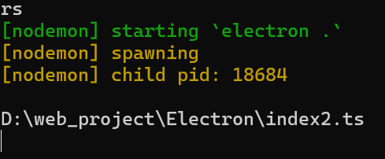

可以知道：index.ts就是运行在nodejs环境中，可以通过import的方式将其他script导入并且运行到NodeJs环境当中，当然，web 环境也是一样的道理！

## 预加载脚本

那么问题来了：既然主进程和渲染进程运行在不同的runtime，那么他们之间又该如何进行通信呢？

为了将 Electron 的不同进程类型连接在一起，我们需要使用一个称为 **preload** 的特殊脚本。预加载脚本会在网页在渲染器加载之前注入，类似于 Chrome 扩展的 [内容脚本](https://developer.chrome.com/docs/extensions/mv3/content_scripts/)。要向渲染器添加需要特权访问的功能，可以通过 [上下文桥](https://electron.nodejs.cn/docs/latest/api/context-bridge) API 定义 [全球](https://web.nodejs.cn/en-US/docs/Glossary/Global_object) 对象。

为了将这个preload脚本附加到渲染进程当中，需要在BrowserWindow 构造函数中**将其路径传递给 `webPreferences.preload` 选项**(module则需要用到)：

```ts index.ts
import { fileURLToPath } from 'node:url'
const preloadFilePath = fileURLToPath(new URL ('./preload.ts', import.meta.url))
const createWindow = () => {  
const win = new BrowserWindow({
	webPreferences: {  
		preload: preloadFilePath 
	}
})
```

预加载脚本可以随便写点东西（比如console.log('preload')），然后启动项目，可以发现，控制台的确打印了‘preload’

> 注：electron程序先加载主进程，然后执行预加载脚本，最后才会执行渲染进程脚本，**且预加载脚本是在渲染进程当中执行的**

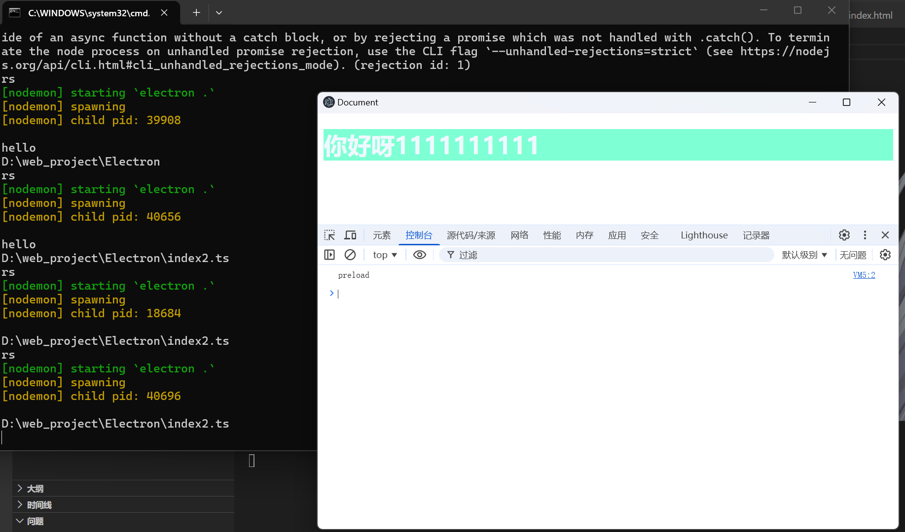

然后在预加载脚本中通过`contextBridge`来实现连桥

```ts preload.ts
import { contextBridge } from'electron' 
  
contextBridge.exposeInMainWorld('versions', {  
node: () => process.versions.node,  
chrome: () => process.versions.chrome,  
electron: () => process.versions.electron  
})
```

在`pages`目录下添加`index.js`

```js index.js
console.log(window.version.node())
console.log(window.version.chrome())
console.log(window.version.electron())
```

然后在`pages/index.html`中引入script，打开网页可以看到：

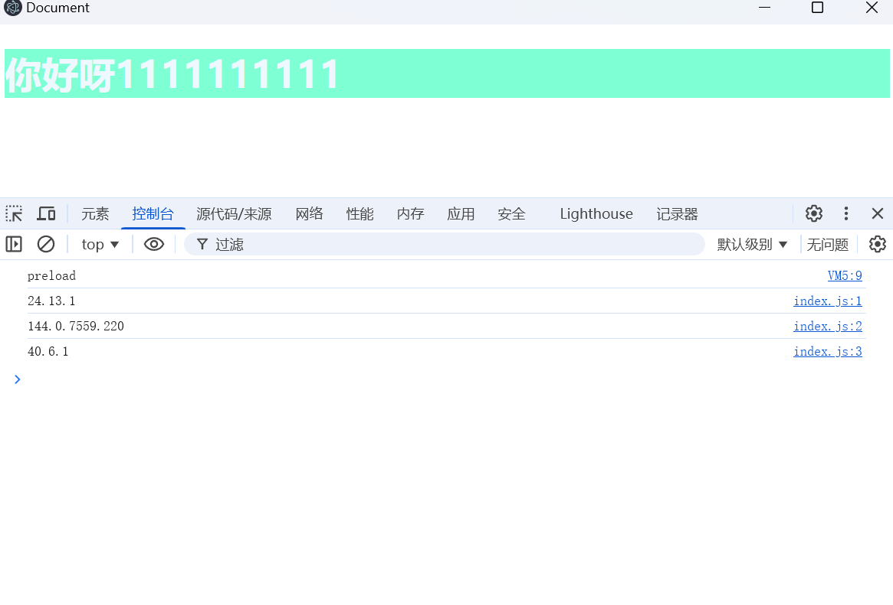

> 从结果也可以得知：`contextBridge.exposeInMainWorld`相当于给渲染进程中的window绑定键值对，这样就能实现主进程和渲染进程之间的通信了

## 进程通信

### 渲染 -> 主

在**渲染进程中**用`ipcRenderer.send`发送消息，在**主进程中**使用`ipcMain.on`接收消息（发布订阅模式）

preload.js中写入以下代码：

```js preload.js
const { ipcRenderer } = require("electron/renderer")
const { contextBridge } = require('electron')

// 保存文件相关api
contextBridge.exposeInMainWorld('FileOperation', {
    // 保存文件
    saveFile: (data) => {
        ipcRenderer.send('file-save', {
            filename: 'hello.txt',
            data: data
        }) // ipcRender相当于给主进程发送一个file-save的事件，只需要在主进程中监听即可
    }
})
```

而在渲染进程中，我们可以使用`window.FileOperation.saveFile()`来执行 这个函数！

```js index2.js
const btn = document.querySelector('.test-btn')
const inputArea = document.querySelector('.input-area')

btn.addEventListener('click', () => {
    const savedData = inputArea.value
    // 使用api进行通信
    window.FileOperation.saveFile(savedData)

})
```

主进程想要接收订阅信息，则需要引入`ipcMain`(其实从字面上也非常好理解，main嘛)

```ts index.ts
import { fileURLToPath } from 'node:url'
import fs from "node:fs"
import path from 'node:path'

function writeFile (event:any, data:{filename:string, data:string}) {
    // 调用系统级别
    const targetPath = path.join('D:\\', data.filename) // D:\xxx\yourfile
    fs.writeFileSync(targetPath, data.data)
}

// 订阅消息
ipcMain.on('file-save', writeFile)
```

测试可以得到：

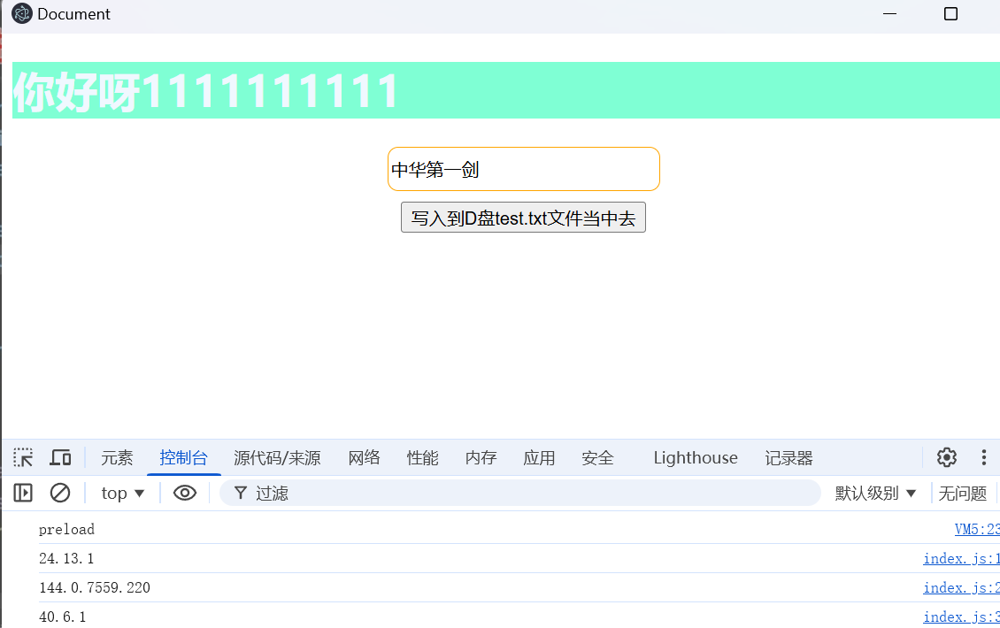

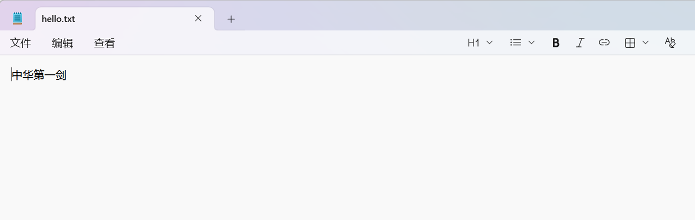

~~*（好吧，这里的文件名我弄错了，呜呜呜）*~~

### 渲染 < --- > 主（双向）

此时可以用`ipcRender.invoke`，主进程则用`ipcMain.handle`

> 注：invoke的返回值永远是Promise，因此需要await

因此主进程、预加载脚本和渲染进程的代码如下：

```ts index.ts
function readFile(event:any, data:any):string {
    return fs.readFileSync('D:/hello.txt').toString()
}

ipcMain.handle('file-read', readFile) // 返回的结果就是回调函数的返回结果
```

```js preload.js
// 操作文件相关api
contextBridge.exposeInMainWorld('FileOperation', {
    // 读取文件
    async readFile () {
       let readData = await ipcRenderer.invoke('file-read')
       return `读取hello.txt的内容为: ${readData}`
    }
})
```

```js pages/index2.js
// 写一个读文件的按钮
const readBtn = document.querySelector('.read-btn')

// 注册事件
readBtn.addEventListener('click', async () => {
    console.log(await window.FileOperation.readFile())
})
```

读取以后可以得到：

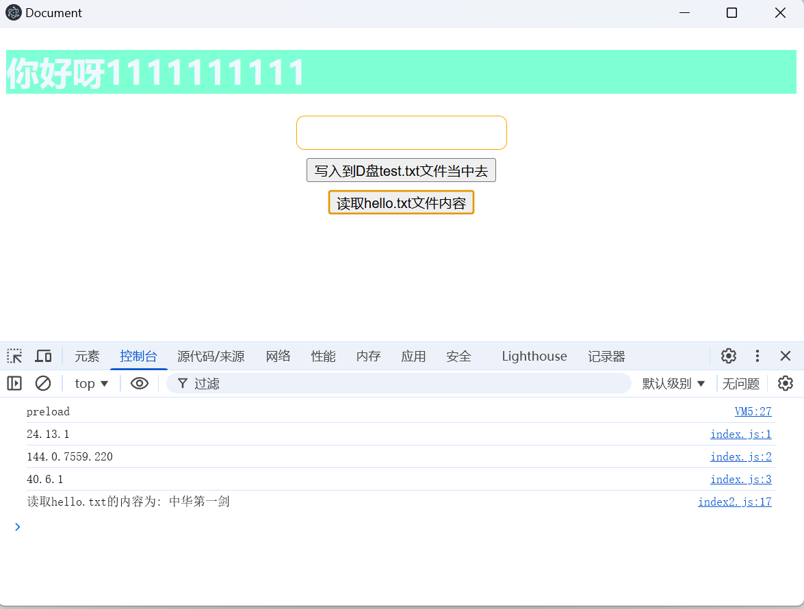

### 主 -> 渲染

主到渲染其实和渲染到主用的api一模一样，只是变成了主进程分派事件`（ipcMain.send）`， 而渲染进程监听事件`(ipcRender.on)`就可以了。

## 打包

先安装electron-forge：

```bash
npm install --save-dev @electron-forge/cli
npx electron-forge import
```

一旦转换脚本完成，Forge 应该已经向你的 `package.json` 文件中添加了一些脚本。

```json package.json
  //...
  "scripts": {
    "start": "electron-forge start",
    "package": "electron-forge package",
    "make": "electron-forge make"
  },
  //...
```

然后工程中多了一个`forge.config.js`的文件：

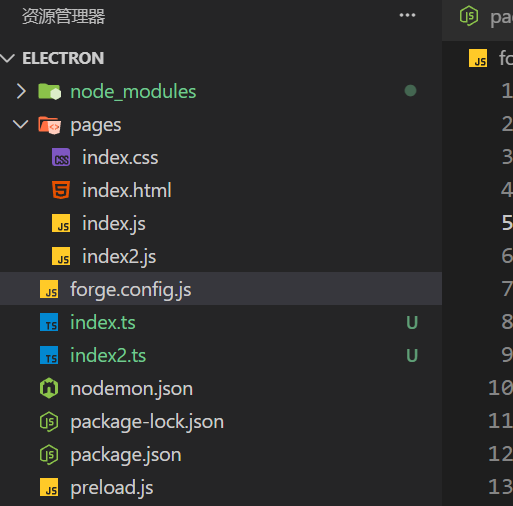

此时的话进入里面配置即可：

```js forge.config.js
module.exports = {
  packagerConfig: {
    name: 'My Electron App',
    asar: true,
    osxSign: {},
    appCategoryType: 'public.app-category.developer-tools'
  }
};
```

具体查看所有的相关接口，可以访问[选项 | @electron/packager --- Options | @electron/packager](https://electron.github.io/packager/main/interfaces/Options.html)，示例配置如下：

```js forge.config.js
module.exports = {
  packagerConfig: {
    name: '飞别放弃',
    icon: './favicon.ico',
    asar: true,
  }
}
```

然后执行

```bash
npm run make
```

> 注：还是建议全部替换成commonJs的写法，不然后面重新修改会特别麻烦

然后就可以看到`out`目录下有一个make目录，那里面存放的就是install程序，点击安装：

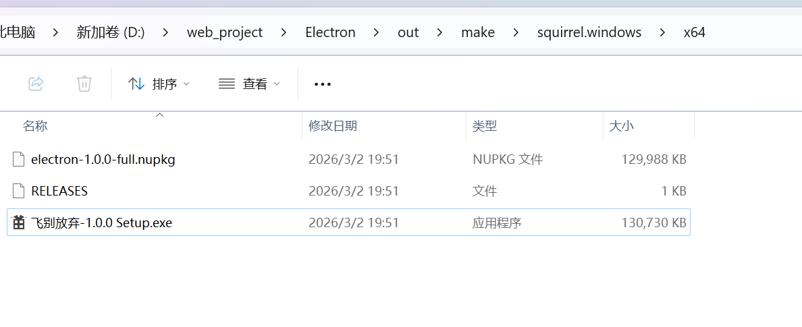

可以发现它会静默安装，并且不弹出任何提示信息就安装成功并且自动运行，但是我们打开菜单栏：

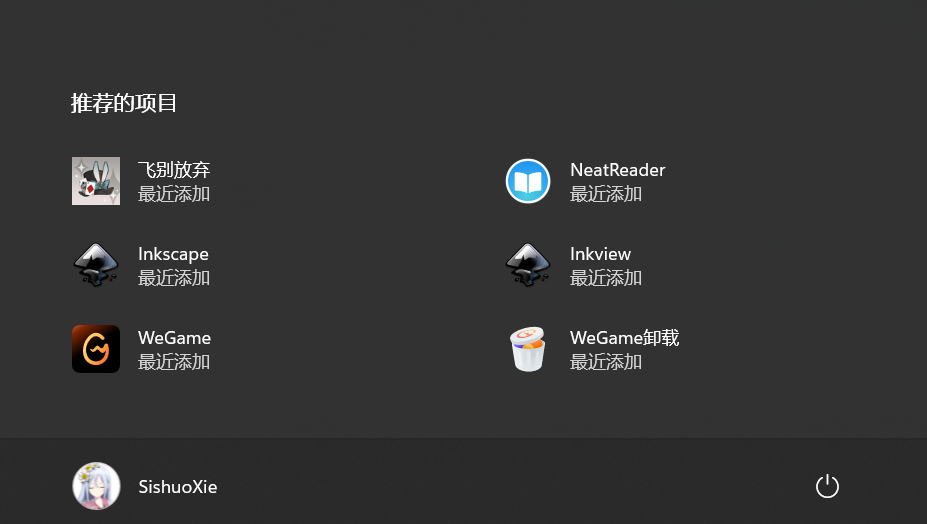

可以看到有一个最近安装的`飞八分钱`应用，查看源目录可以发现：应用默认安装在`C:/Users/<你的用户名>/AppData/Local/electron`里面：

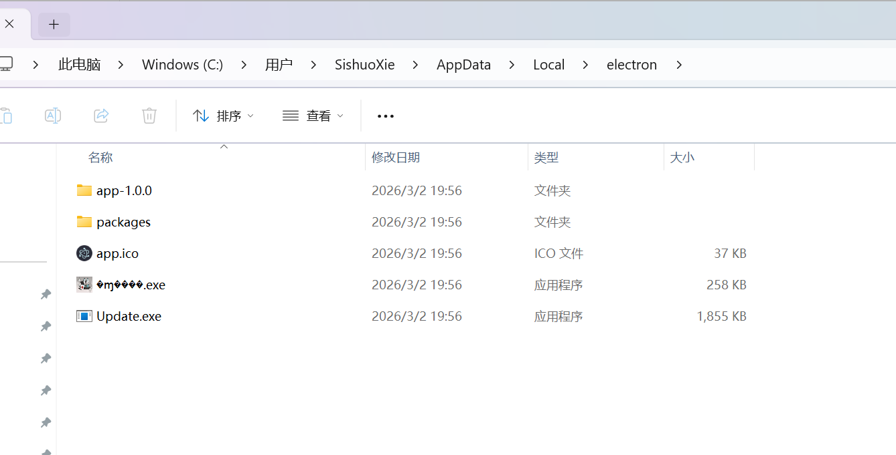

关于更多安装详细细节，可以查看[CLI | Electron Forge](https://www.electronforge.io/)