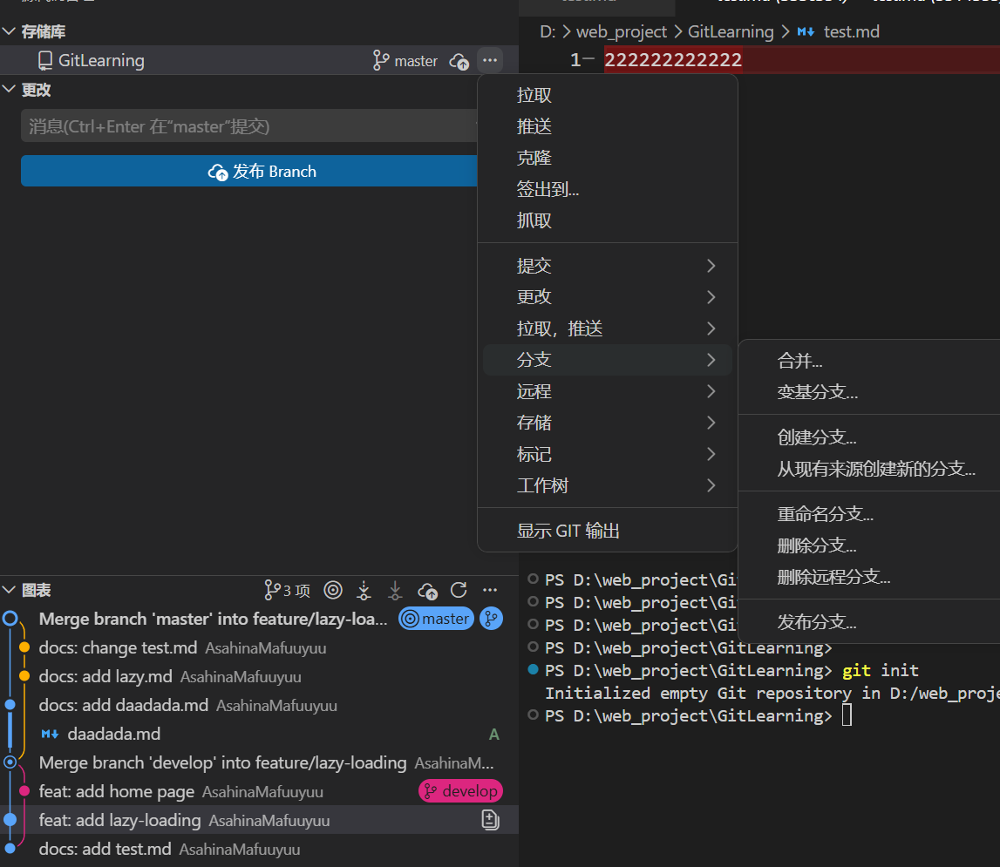
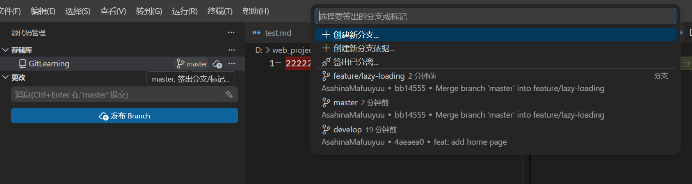

## Git分支命名规范：

1. 主分支（main/master）
	- 名称：main或master。
	- 用途：用于存放稳定的、可发布的代码。
	- 规则：只有一个主分支、不允许直接在主分支上提交代码，只能通过合并其他分支来更新。
2. 开发分支（develop）
	- 名称：develop。
	- 用途：用于集成开发中的功能分支。
	- 规则：从 main 分支创建、功能开发完成后，合并到 develop 分支。
3. 功能分支（feat）
	- 名称：feature/<feature-name> 或 feat/<feature-name>。
	- 用途：用于开发新功能。
	- 规则：从 develop 分支创建、功能开发完成后，合并回 develop 分支。
	- 示例：feature/user-authentication、feat/add-payment-gateway。
4. 修复分支（fix）
	- 名称：bugfix/ 或 fix/。
	- 用途：用于修复 bug。
	- 规则：从develop分支创建、修复完成后，合并回 develop 分支。
	- 示例：`bugfix/login-error`、`fix/null-pointer-exception`。
5. 发布分支（release）
	- 名称：release/。
	- 用途：用于准备发布新版本。
	- 规则：从 develop 分支创建、发布完成后，合并到 main 和 develop 分支。
	- 示例：`release/v1.0.0`、`release/2023-10-01`。
6. 热修复分支(hotfix)
	- 名称：hotfix/。
	- 用途：用于紧急修复生产环境中的 bug。
	- 规则：从 main 分支创建、修复完成后，合并到 main 和 develop 分支。
	- 示例：`hotfix/critical-security-issue`、`hotfix/login-page-crash`。
7. 支持分支（support）
	- 名称：support/。
	- 用途：用于维护旧版本。
	- 规则：从 main 分支创建。
	- 示例： support/v1.0.x。

## Git提交的批准规范

最常用的是这些：

### 1. feat

新增功能

feat: add dark mode toggle  
feat(order): support order cancellation

### 2. fix

修复 bug

fix: prevent duplicate form submission  
fix(cache): avoid null pointer when cache misses

### 3. docs

文档修改

docs: update README with setup steps  
docs(api): clarify token refresh behavior

### 4. refactor

重构，但不改变功能

refactor: split large service into smaller methods  
refactor(user): simplify profile validation logic

### 5. style

代码格式、空格、分号、lint 修正，不涉及逻辑变化

style: format code with prettier  
style(css): align button spacing rules

### 6. test

测试相关

test: add unit tests for payment service  
test(auth): cover invalid token cases

### 7. chore

杂项、工程维护、依赖更新、构建脚本等

chore: upgrade TypeScript to 5.8  
chore(ci): update GitHub Actions workflow

	### 8. perf

性能优化

perf: reduce unnecessary re-renders in tree component  
perf(redis): optimize hot key lookup path

### 9. build

构建系统或依赖构建流程变更

build: update Vite config for alias resolution  
build: enable source maps in production

### 10. ci

持续集成相关

ci: add test step for pull requests  
ci: cache pnpm dependencies

### 11. revert

回滚某次提交

revert: remove experimental caching strategy

## Vscode中GUI界面

图中可以看到对于分支的操作，包括合并

点击这里可以对分支进行切换和创建：

更多功能详见[GitLens 支持与文档 --- GitLens Support & Documentation](https://help.gitkraken.com/gitlens/gitlens-home/)

## Gitignore

`.gitignore` 的作用不是：

- “让 Git 停止跟踪已经提交过的文件”

而是：

- “让 Git 以后不要把这些**未跟踪文件**纳入跟踪”