## Git分支命名规范：

1. 主分支（main/master）
	- 名称：main或master。
	- 用途：用于存放稳定的、可发布的代码。
	- 规则：只有一个主分支、不允许直接在主分支上提交代码，只能通过合并其他分支来更新。
2. 开发分支（develop）
	- 名称：develop。
	- 用途：用于集成开发中的功能分支。
	- 规则：从 main 分支创建、功能开发完成后，合并到 develop 分支。
3. 功能分支（feat）
	- 名称：`feature/<feature-name>` 或 `feat/<feature-name>`。
	- 用途：用于开发新功能。
	- 规则：从 develop 分支创建、功能开发完成后，合并回 develop 分支。
	- 示例：feature/user-authentication、feat/add-payment-gateway。
4. 修复分支（fix）
	- 名称：bugfix/ 或 fix/。
	- 用途：用于修复 bug。
	- 规则：从develop分支创建、修复完成后，合并回 develop 分支。
	- 示例：`bugfix/login-error`、`fix/null-pointer-exception`。
5. 发布分支（release）
	- 名称：release/。
	- 用途：用于准备发布新版本。
	- 规则：从 develop 分支创建、发布完成后，合并到 main 和 develop 分支。
	- 示例：`release/v1.0.0`、`release/2023-10-01`。
6. 热修复分支(hotfix)
	- 名称：hotfix/。
	- 用途：用于紧急修复生产环境中的 bug。
	- 规则：从 main 分支创建、修复完成后，合并到 main 和 develop 分支。
	- 示例：`hotfix/critical-security-issue`、`hotfix/login-page-crash`。
7. 支持分支（support）
	- 名称：support/。
	- 用途：用于维护旧版本。
	- 规则：从 main 分支创建。
	- 示例： support/v1.0.x。

## Git提交的批准规范

最常用的是这些：

### 1. feat

新增功能

feat: add dark mode toggle  
feat(order): support order cancellation

### 2. fix

修复 bug

fix: prevent duplicate form submission  
fix(cache): avoid null pointer when cache misses

### 3. docs

文档修改

docs: update README with setup steps  
docs(api): clarify token refresh behavior

### 4. refactor

重构，但不改变功能

refactor: split large service into smaller methods  
refactor(user): simplify profile validation logic

### 5. style

代码格式、空格、分号、lint 修正，不涉及逻辑变化

style: format code with prettier  
style(css): align button spacing rules

### 6. test

测试相关

test: add unit tests for payment service  
test(auth): cover invalid token cases

### 7. chore

杂项、工程维护、依赖更新、构建脚本等

chore: upgrade TypeScript to 5.8  
chore(ci): update GitHub Actions workflow

	### 8. perf

性能优化

perf: reduce unnecessary re-renders in tree component  
perf(redis): optimize hot key lookup path

### 9. build

构建系统或依赖构建流程变更

build: update Vite config for alias resolution  
build: enable source maps in production

### 10. ci

持续集成相关

ci: add test step for pull requests  
ci: cache pnpm dependencies

### 11. revert

回滚某次提交

revert: remove experimental caching strategy

## GitTag

git tag就是给某一个commit进行一个标记，不过tag是不能像branch那样不停的往前推进的，tag一旦打上以后，基本上就定在某个commit上了

### 为什么要用 tag

最常见就是 **版本管理**。

比如你的项目经历了这些阶段：

- 功能刚写完
- 修了几个 bug
- 准备上线
- 发正式版

你不可能靠“记忆”去记哪个提交是正式版。

所以一般会打 tag：

- `v0.1.0`
- `v0.9.0-beta`
- `v1.0.0`
- `v1.0.1`

这样以后别人一看就知道：

- 哪个版本是正式发布
- 哪个版本是测试版
- 哪个版本修了补丁

### 用法

```bash
git tag -a v1.0.0 -m "First stable release"
```

这里的意思是：

- `-a`：创建附注标签
- `-m`：写说明信息

这种 tag 会带有：

- 标签名
- 作者
- 日期
- 备注信息

这种一般是给当前commit打上tag，而给某个历史提交进行tag的话：

先看提交记录：

```bash
git log --oneline
```

假设某个提交哈希是 `a1b2c3d`，那么：

```bash
git tag -a v1.0.0 a1b2c3d -m "Release version 1.0.0"
```

推送某一个 tag 到远程

注意，`git push` 默认**不会自动推送 tag**。

要单独推：

```bash
git push origin v1.0.0
```

一次性推送所有 tag

```bash
git push origin --tags
```

删除本地 tag

```bash
git tag -d v1.0.0
```

删除远程 tag

```bash
git push origin --delete v1.0.0
```
## Vscode中GUI界面

图中可以看到对于分支的操作，包括合并


点击这里可以对分支进行切换和创建：


更多功能详见[GitLens 支持与文档 --- GitLens Support & Documentation](https://help.gitkraken.com/gitlens/gitlens-home/)

## Gitignore

`.gitignore` 的作用不是：

- “让 Git 停止跟踪已经提交过的文件”

而是：

- “让 Git 以后不要把这些**未跟踪文件**纳入跟踪”

修复方法非常简单：

1. 首先使用`git rm -r --cached < 文件名 >`来放弃对某个文件的追踪，然后进行提交
2. 提交完毕后再将该文件添加进.gitignore中，这样的话就可以放弃对该文件的管理了

## GitHub

GitHub在原来Git的版本控制上增加了很多团队协作能力，比如：

- 网页查看代码
- 在线 code review
- 提 bug / 提需求
- 发版下载
- 贡献他人项目
- 自动化 CI/CD

### issue

Git 本身没有 Issue 这个概念。  
这是 GitHub 给仓库增加的“任务/讨论系统”。

 #### issue典型流程

一个正常流程可能是：

1. 用户提一个 Issue
2. 团队讨论
3. 某人认领
4. 开新分支修复
5. 提 Pull Request
6. 合并后关闭 Issue

所以很多仓库会在 PR 里写：

```
Fixes #12
```


表示这个 PR 合并后，自动关闭第 12 个 Issue。

#### issue主内容

**标题**

> 登录页点击按钮无响应

**内容**

- 复现步骤
- 预期结果
- 实际结果
- 浏览器/环境
- 截图

这样维护者先知道问题，再决定要不要修。
#### issue 常见配套功能

**Labels**

给 Issue 打标签，比如：

- `bug`
- `enhancement`
- `documentation`
- `help wanted`
- `good first issue`

作用：分类。

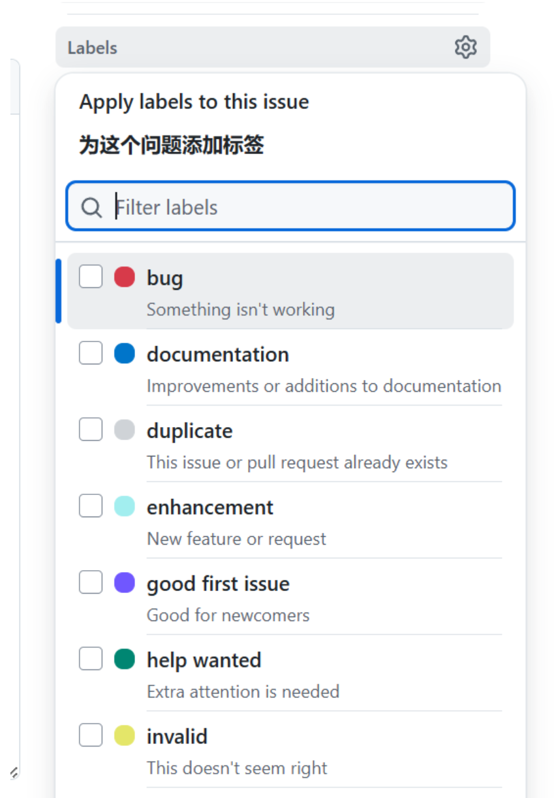

**Assignees**

指派给谁处理。

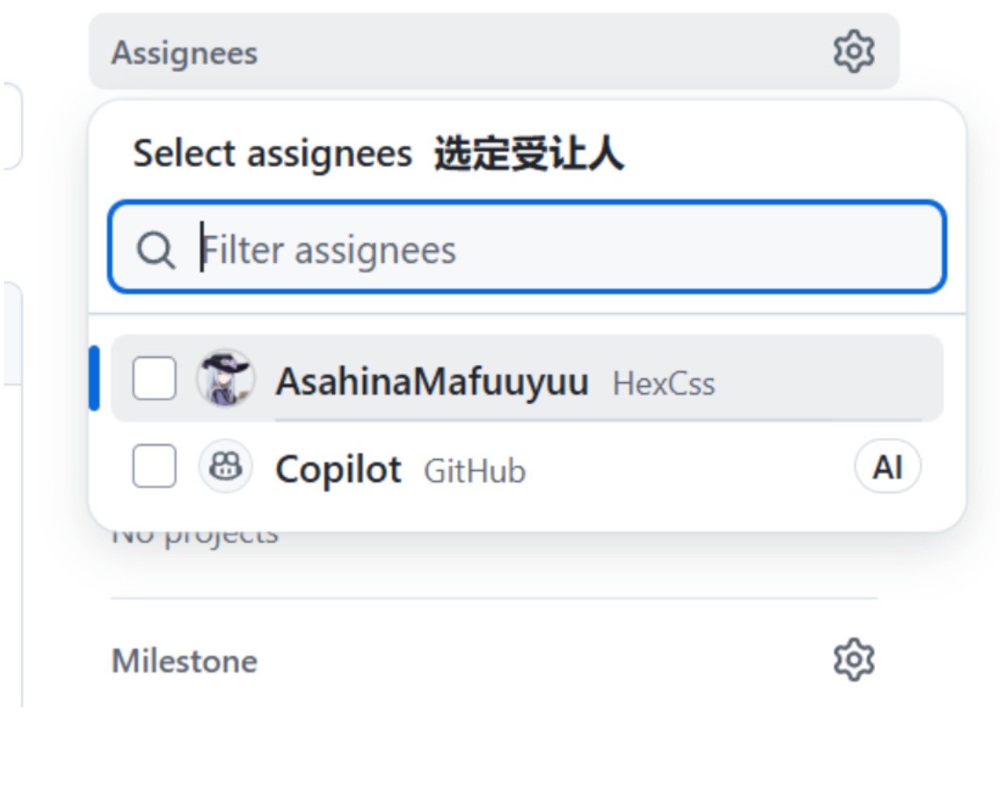

**Milestone**

归到某个版本，比如：

- `v1.0`
- `v2.0`

**Comments**

围绕这个问题继续讨论。

**Close**

问题解决后关闭 Issue。
### pull request

**PR 中常见操作**

- **Review comments**：别人逐行评论代码
- **Request changes**：要求你改
- **Approve**：认可这次修改
- **Merge**：合并
- **Squash and merge**：把多个提交压成一个再合并
- **Rebase and merge**：保持更线性的历史

一般的流程如下：

- **Open PR**：提申请
- **Approve**：我同意这份改动
- **Merge**：真正把改动并进 `master`

#### 仓库管理员处理PR

直接进这个 PR 页面：

1. 先把 **Draft** 改成 **Ready for review**
2. 然后点击 **Merge pull request**
3. 确认 merge

合并完成后，`master` 才会更新。

如果是copilot的话，原分支已经有了：

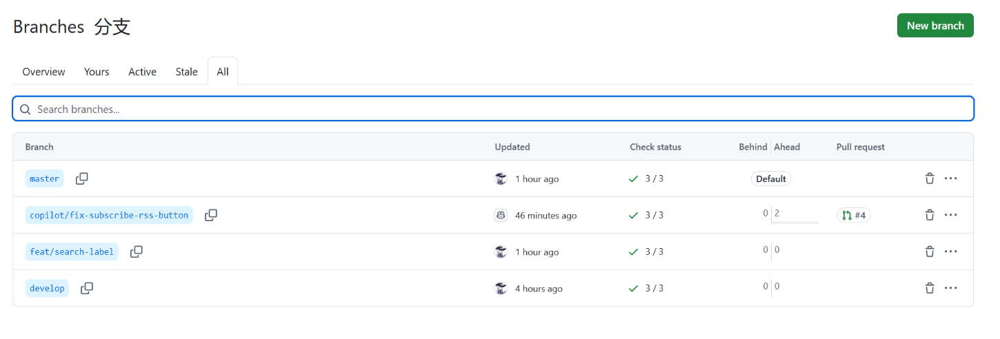
此时进行批准：

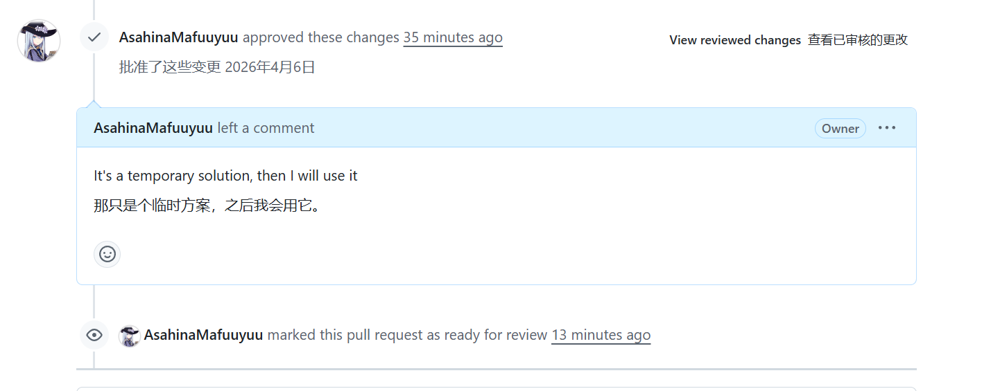

再在下面补充相关信息：

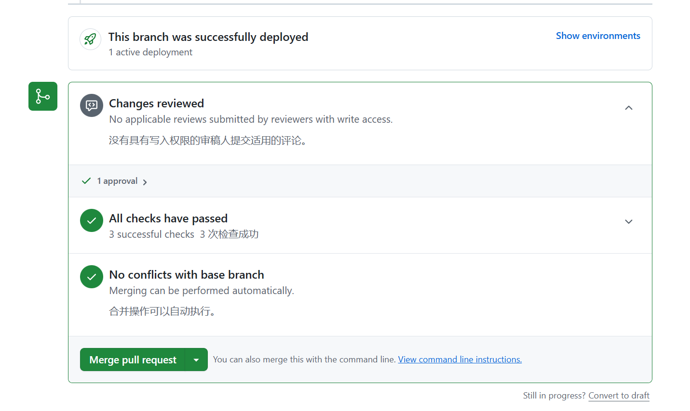

就可以进行合并了

然后输入此次合并提交的commit message：

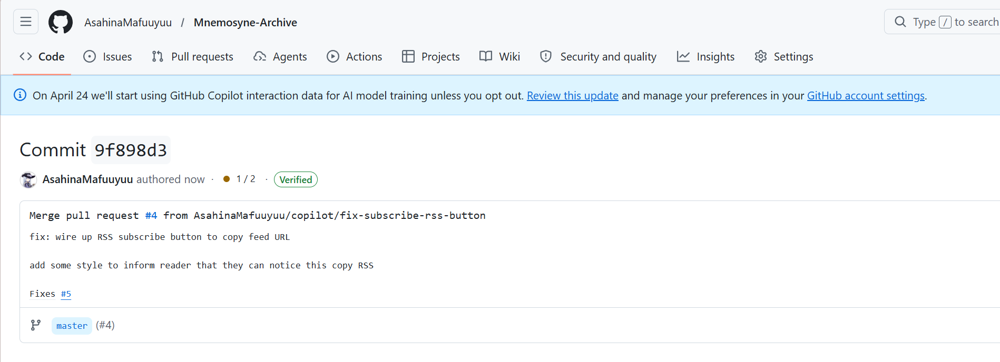

如果某次提交需要提到issue，则直接找对应的编号：

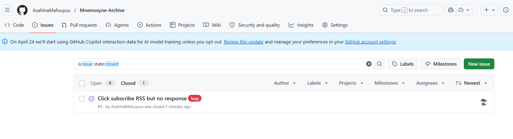

可以看到：我这里的issue是5，因此提交以后自动关闭

**常见关键词（必须英文）**：

- `Fixes #5`
- `Closes #5`
- `Resolves #5`

都可以自动关闭 issue

此外，可以解决多个问题，最好让它单独成一行，例如：

```
Closes #12  
Fixes #8  
Resolves #15
```

**只是提到的话，用 `#序号` 基本就够了。**

更规范一点的话，就写 `Related to #序号` 或 `Refs #序号`。

#### 提交者提交PR

### Fork

首先fork 是一个新的仓库，它与原始上游仓库共享代码和可见性设置。可以选择只fork`master`分支或者全部fork

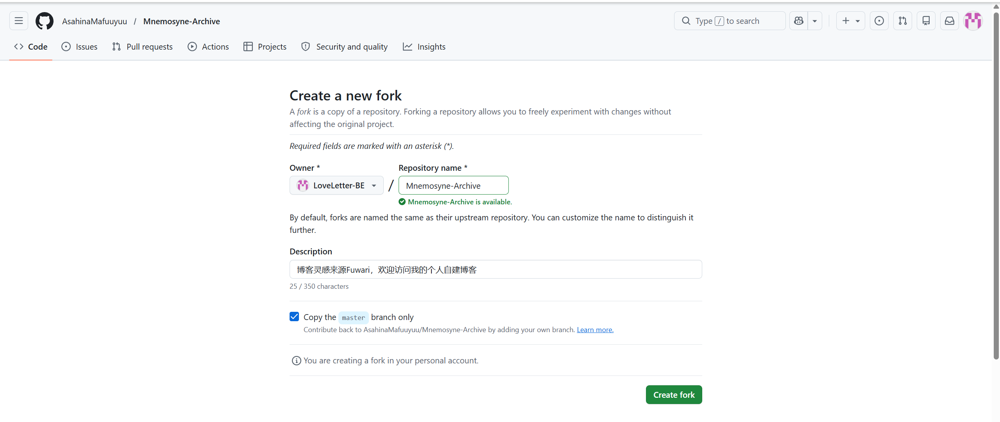

#### upstream 

在 fork 场景里，**upstream** 通常指你 fork 之前的那个“原始仓库”。GitHub 文档在讲 fork 时，直接把原始仓库称作 upstream repository。

#### 常见约定

- `origin`：通常指你 clone 下来的那个远程仓库
- `upstream`：通常指原作者仓库

所以在 fork 协作里，经常是：

- `origin` = 你的 fork
- `upstream` = 原仓库


## 区分SSH/Git/GitHub

### SSH

首先SSH是一对密钥，有公钥和私钥，其中我们可以为我们的笔记本创建SSH：

比如此时我在我的笔记本上创建SSH：

```bash
ssh-keygen -t rsa -C "<你的邮箱>" -f <存放的文件>
```

这里我用的是：

```bash
ssh-keygen -t rsa -C "2821594004@qq.com" -f C:/Users/SishuoXie/.ssh/id_rsa_alternate
```

然后她会要求你设置密码（这个密码是用来确认身份的密码），输入完毕后就可以看到.ssh文件夹下有一个`id_rsa_alternate`的文件（这个是私钥，而.pub对应的公钥）:

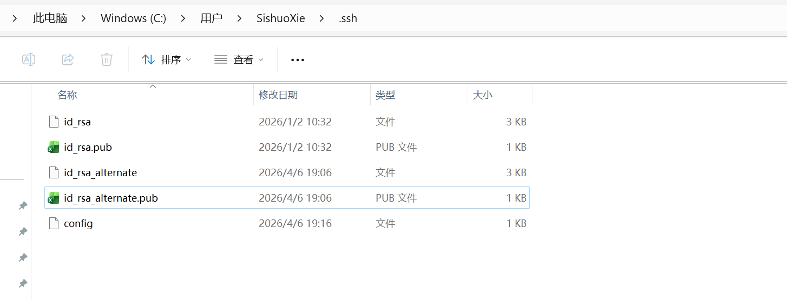

然后我们可以使用`config`来配置多个SSH：

```config
Host github-main
    HostName github.com
    User git
    IdentityFile C:/Users/SishuoXie/.ssh/id_rsa
Host github-alt
    HostName github.com
    User git
    IdentityFile C:/Users/SishuoXie/.ssh/id_rsa_alternate
```

> Host可以随便取，HostName的话必须填写真实服务器地址，如果是Github的话，就填写`github.com`即可，User的话，使用Github就一定得填`git`，IdentityFile填写对应的文件即可

#### SSH账号管理

如果是多个账号，并且没有配置`config`的话，那SSH在pull或者push的时候，默认使用id_rsa进行连接，这样的话很容易导致串号，如果是单账号，这样做确实完全没问题。

如果多账号配置了`config`文件的话，从远程`clone`到本地的时候，需要初始化账号,而且建议使用SSH克隆：

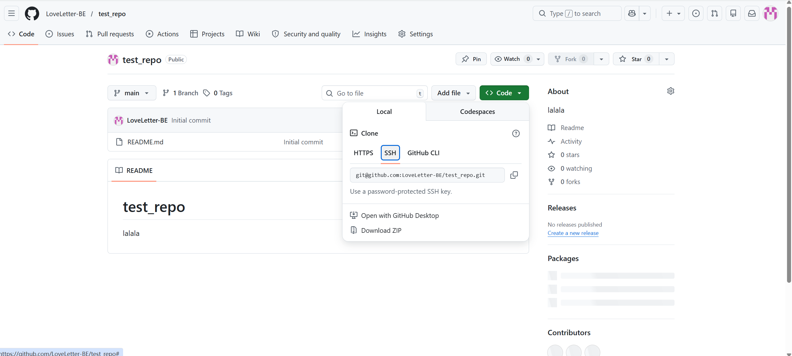

那么在本地就需要用以下命令进行拉取：

```bash
git clone git@<SSH账号>:LoveLetter-BE/test_repo.git
```

解读一下，这个SSH账号就是我们上面SSH配置的config中的Host（例如是github-alt），因此就可以使用：

```bash
git clone git@github-alt:LoveLetter-BE/test_repo.git
```

第一次使用的时候会看到：

```bash
The authenticity of host 'github.com ...' can't be established.
...
Are you sure you want to continue connecting (yes/no/[fingerprint])?
```

然后还需要输入密码，输入完成即可。

随便添加一些东西，然后进行推送：

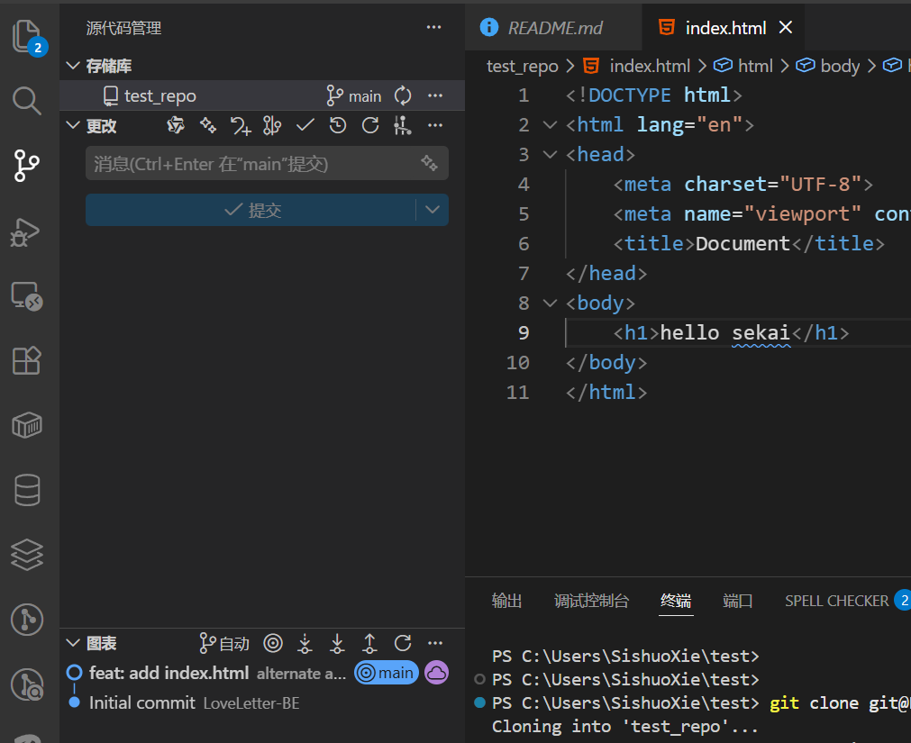

可以发现：完全没问题：

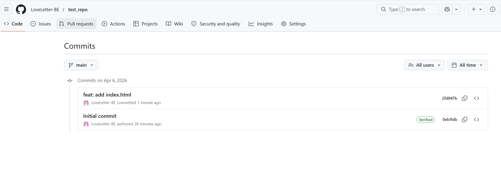

> 如果之前已经克隆过了的话，则直接在仓库中设置：
> `git remote set-url origin git@<SSH账户名>:<远程仓库地址>`
> 即可

### GitHub绑定设置的公钥

我们通常使用公钥绑定Github中的账号：

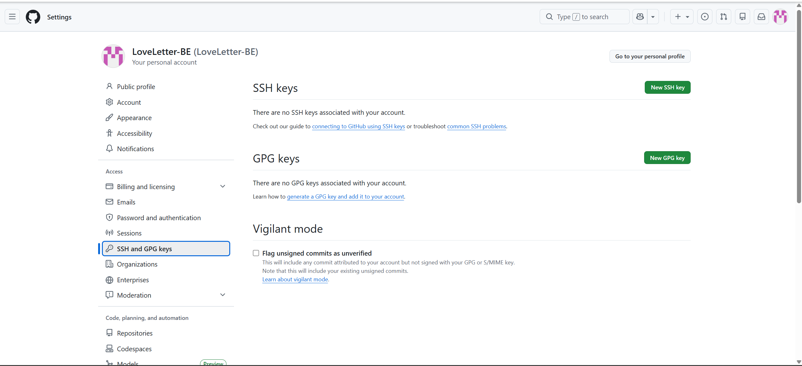

由于是需要输入公钥，则直接用.pub文件中的内容填进去就行了，就绑定成功了：

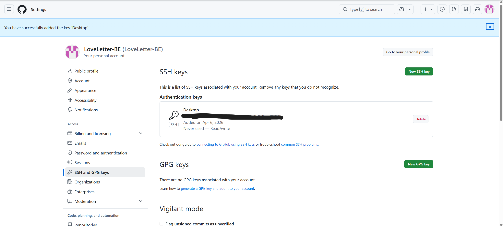

