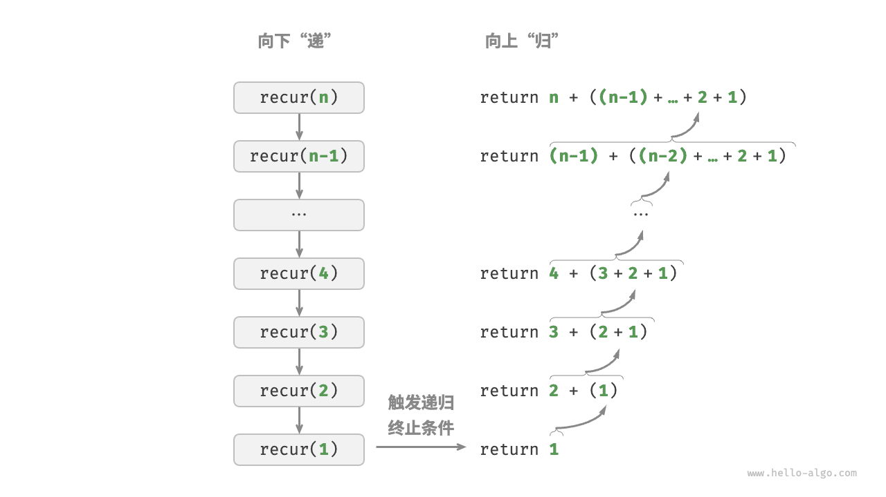
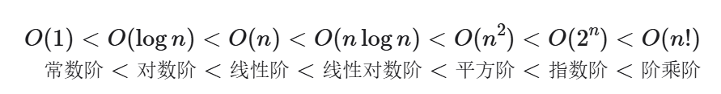
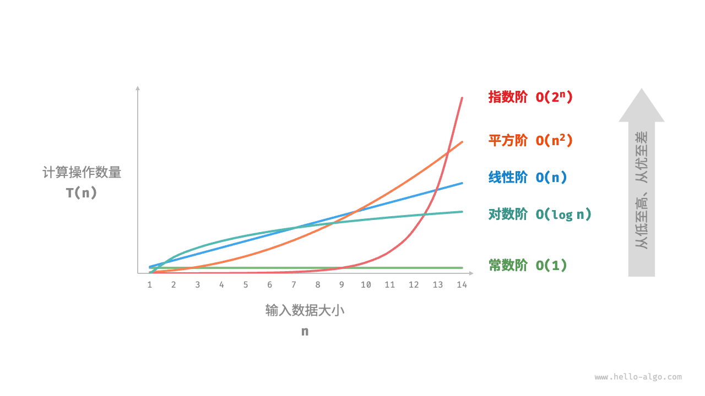
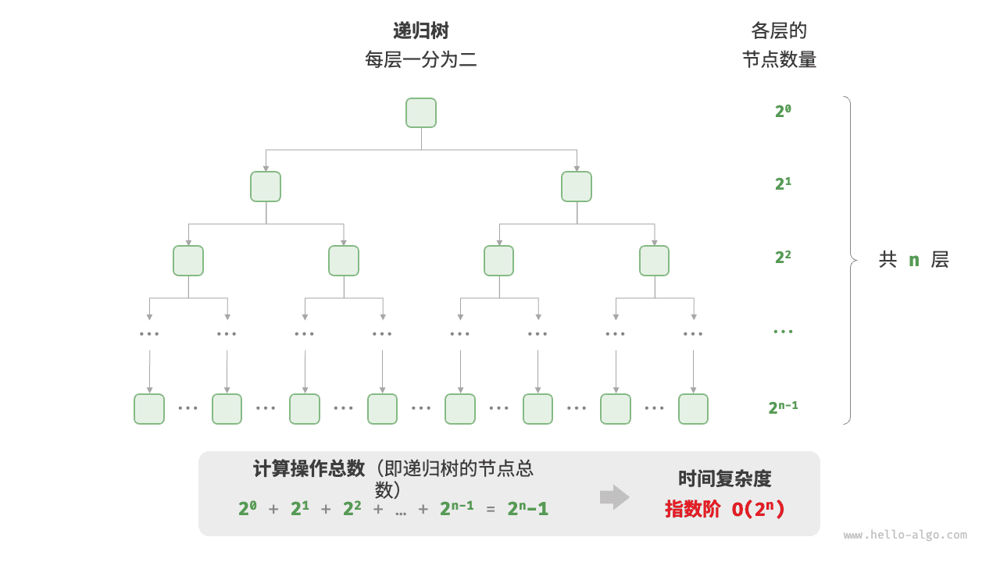

## 详解递归

迭代偏向for和while循环，而递归则是一种算法策略，通过函数调用自身来解决问题，主要包含两个阶段：

1. **递**：程序不断深入地调用自身，通常传入更小或更简化的参数，直到达到“终止条件”。
	
2. **归**：触发“终止条件”后，程序从最深层的递归函数开始逐层返回，汇聚每一层的结果。

因此递归主要包含三个要素：

1. 终止条件是什么？也就是何时由递转归？
	
2. 递的话应该传递给下一个调用函数什么参数？
	
3. 归的话返回结果又是什么？

用一个例子来说明：

```ts
/* 递归 */
function recur(n: number): number {
    // 终止条件
    if (n === 1) return 1;
    // 递：递归调用
    const res = recur(n - 1);
    // 归：返回结果
    return n + res;
}
```

图解就是这样的：



迭代和递归思考角度不一样：迭代是自下而上的解决问题，从最基础的步骤开始，不断地进行重复这些步骤；而递归却是自上而下，将一个问题拆分成更小的子问题，然后不断的拆分，直到某个子问题的解是已知的

## 调用栈

### 基础概念

每当代码调用一个函数时，系统就会在调用栈的顶部“压入”（Push）一个**栈帧（Stack Frame）**。

一个栈帧通常包含以下信息：

- **局部变量**：函数内部定义的变量。
    
- **参数**：传递给函数的输入值。
    
- **返回地址**：函数执行完后，程序应该回到主代码的哪一行继续执行。
    

当函数执行完毕，这个栈帧就会被“弹出”（Pop），程序根据记录的返回地址跳回到之前的地方。

举个例子就是：

```python
def greet():
    say_hello()
    print("Greet finished")

def say_hello():
    print("Hello!")

greet()
```

**执行过程中的调用栈变化：**

1. **调用 `greet()`**：栈顶加入 `greet` 的栈帧。
    
2. **`greet` 内部调用 `say_hello()`**：在 `greet` 之上压入 `say_hello` 的栈帧。此时栈内有两层，最上面是正在运行的 `say_hello`。
    
3. **`say_hello` 完成**：执行完 `print("Hello!")` 后，`say_hello` 的栈帧被弹出。
    
4. **回到 `greet`**：程序根据返回地址回到 `greet` 中调用 `say_hello` 的下一行，执行 `print("Greet finished")`。
    
5. **`greet` 完成**：`greet` 的栈帧也被弹出，栈变为空。

### 关于调用栈中的递归

普通递归而言，递归函数每次调用自身都会开启一份新的函数来分配内存，因此调用栈必须得重新维护，因此，**递归通常比迭代更加耗费内存空间**。

在实际编程语言中，很容易发生栈溢出错误。

尾递归的话，递归调用是函数返回前的最后一个操作，这意味着函数返回到上一层级后，无须继续执行其他操作，因此系统无须保存上一层函数的上下文。

举个例子就是：

```ts
/* 尾递归 */
function tailRecur(n: number, res: number): number {
    // 终止条件
    if (n === 0) return res;
    // 尾递归调用
    return tailRecur(n - 1, res + n);
}
```

对比普通递归和尾递归而言：

- **普通递归**：求和操作是在“归”的过程中执行的，每层返回后都要再执行一次求和操作。
	
- **尾递归**：求和操作是在“递”的过程中执行的，“归”的过程只需层层返回。

> 请注意，许多编译器或解释器并不支持尾递归优化。例如，Python 默认不支持尾递归优化，因此即使函数是尾递归形式，仍然可能会遇到栈溢出问题。


## 递归显示转换为迭代

递归是每次放入调用栈，然后达到终止条件以后，再从调用栈中pop()出来结果，这个设计理念和栈的先入后出完全一致

事实上，“调用栈”和“栈帧空间”这类递归术语已经暗示了递归与栈之间的密切关系。

1. **递**：当函数被调用时，系统会在“调用栈”上为该函数分配新的栈帧，用于存储函数的局部变量、参数、返回地址等数据。
2. **归**：当函数完成执行并返回时，对应的栈帧会被从“调用栈”上移除，恢复之前函数的执行环境。

因此，**我们可以使用一个显式的栈来模拟调用栈的行为**，从而将递归转化为迭代形式：

```ts
/* 使用迭代模拟递归 */
function forLoopRecur(n: number): number {
    // 使用一个显式的栈来模拟系统调用栈 
    const stack: number[] = [];
    let res: number = 0;
    // 递：递归调用
    for (let i = n; i > 0; i--) {
        // 通过“入栈操作”模拟“递”
        stack.push(i);
    }
    // 归：返回结果
    while (stack.length) {
        // 通过“出栈操作”模拟“归”
        res += stack.pop();
    }
    // res = 1+2+3+...+n
    return res;
}
```

不过这样转换以后，代码变得更复杂了，选择迭代还是递归，主要还是从问题的复杂度出手。

> 如果简单的问题，能用迭代，还是尽量迭代（毕竟迭代的效率通常较高，无函数调用开销，且通常使用固定大小的内存空间），而递归的话每次函数调用都会产生开销，累积函数调用可能使用大量的栈帧空间

## 时间复杂度

这一部分尽量一笔带过

**时间复杂度由T(n)中最高阶的项来决定**。

常见的时间复杂度类型排序如下：




### 指数阶O（2^n）

```ts
/* 指数阶（循环实现） */
function exponential(n: number): number {
    let count = 0,
        base = 1;
    // 细胞每轮一分为二，形成数列 1, 2, 4, 8, ..., 2^(n-1)
    for (let i = 0; i < n; i++) {
        for (let j = 0; j < base; j++) {
            count++;
        }
        base *= 2;
    }
    // count = 1 + 2 + 4 + 8 + .. + 2^(n-1) = 2^n - 1
    return count;
}
```



在实际算法中，指数阶常出现于递归函数中。例如在以下代码中，其递归地一分为二，经过n次分裂后停止：

```ts
/* 指数阶（递归实现） */
function expRecur(n: number): number {
    if (n === 1) return 1;
    return expRecur(n - 1) + expRecur(n - 1) + 1;
}
```

指数阶增长非常迅速，在穷举法（暴力搜索、回溯等）中比较常见。对于数据规模较大的问题，指数阶是不可接受的，通常需要使用动态规划或贪心算法等来解决。

### 对数阶O（logn）

与指数不一样，对数阶相当温和，且比线性阶好多了

```ts
/* 对数阶（循环实现） */
function logarithmic(n: number): number {
    let count = 0;
    while (n > 1) {
        n = n / 2;
        count++;
    }
    return count;
}
```

### 线性对数阶O（nlogn）

常出现在两层循环当中：

```ts
/* 线性对数阶 */
function linearLogRecur(n: number): number {
    if (n <= 1) return 1;
    let count = linearLogRecur(n / 2) + linearLogRecur(n / 2);
    for (let i = 0; i < n; i++) {
        count++;
    }
    return count;
}
```

> 这个时间复杂度相当重要，尤其是在后面的主流排序问题上有着非常大的作用

