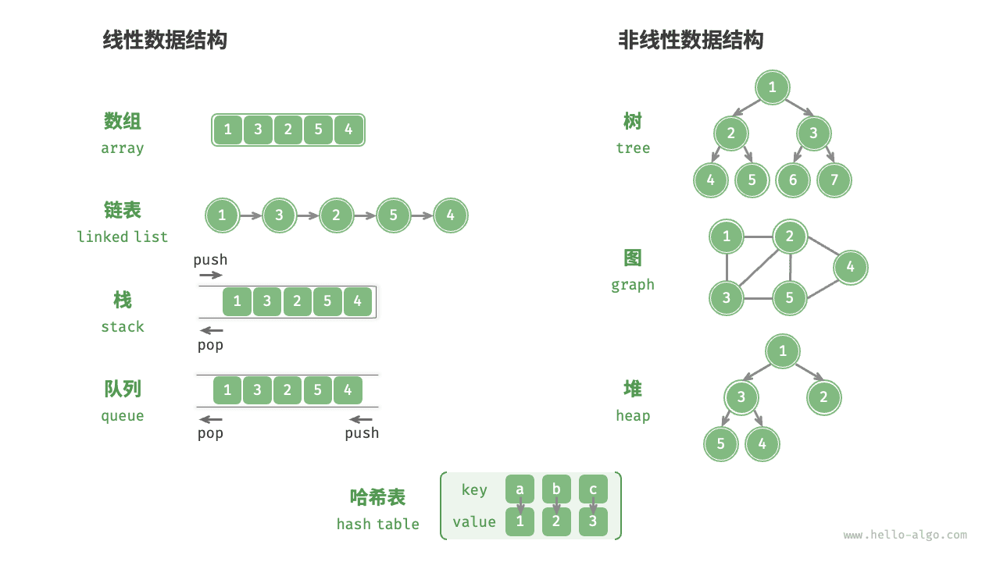
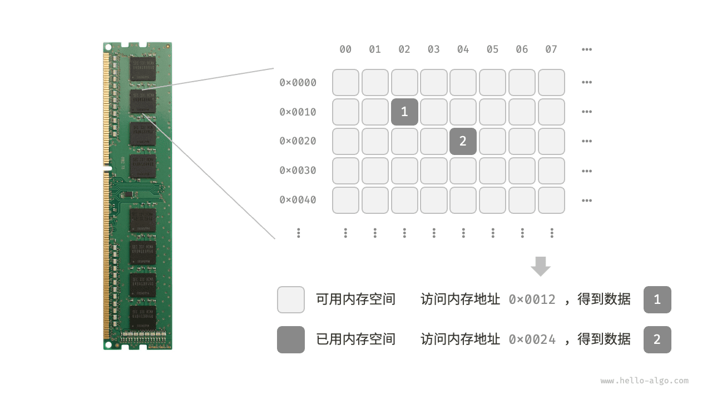
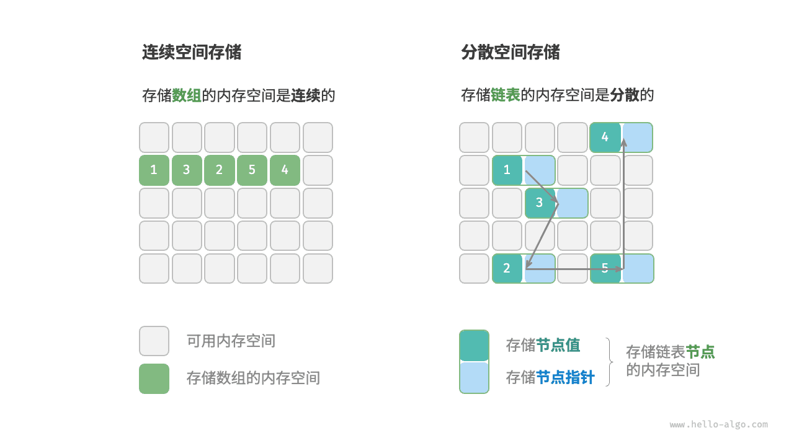
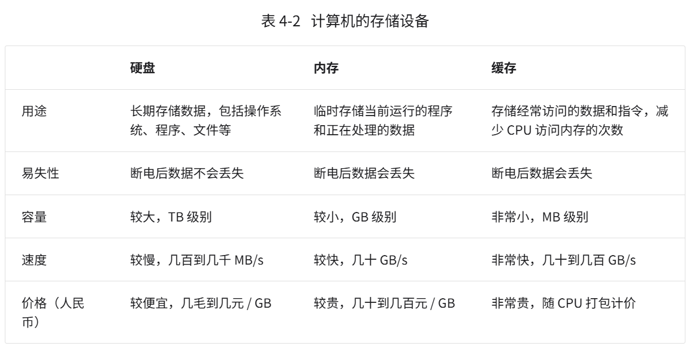
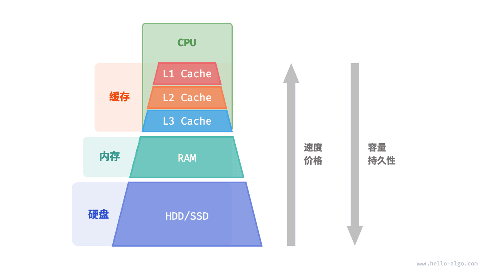
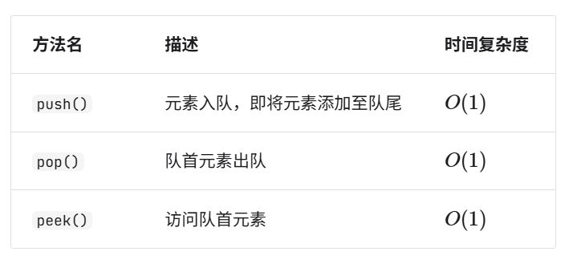
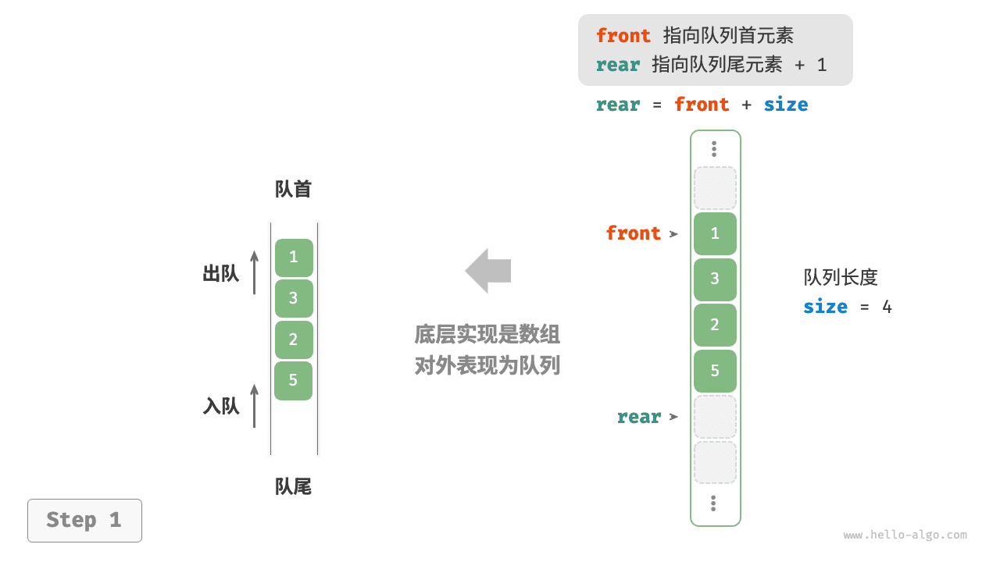

## 数据结构分类

### 逻辑结构

如下图所示，逻辑结构可分为“线性”和“非线性”两大类。线性结构比较直观，指数据在逻辑关系上呈线性排列；非线性结构则相反，呈非线性排列。

- **线性数据结构**：数组、链表、栈、队列、哈希表，元素之间是一对一的顺序关系。
- **非线性数据结构**：树、堆、图、哈希表。

非线性数据结构可以进一步划分为树形结构和网状结构。

- **树形结构**：树、堆、哈希表，元素之间是一对多的关系。
- **网状结构**：图，元素之间是多对多的关系。



### 物理结构

**当算法程序运行时，正在处理的数据主要存储在内存中**，



**物理结构反映了数据在计算机内存中的存储方式**，可分为连续空间存储（数组）和分散空间存储（链表）。物理结构从底层决定了数据的访问、更新、增删等操作方法，两种物理结构在时间效率和空间效率方面呈现出互补的特点。


值得说明的是，**所有数据结构都是基于数组、链表或二者的组合实现的**。例如，栈和队列既可以使用数组实现，也可以使用链表实现；而哈希表的实现可能同时包含数组和链表。

- **基于数组可实现**：栈、队列、哈希表、树、堆、图、矩阵、张量（维度 >=3 的数组）等。
- **基于链表可实现**：栈、队列、哈希表、树、堆、图等。

链表在初始化后，仍可以在程序运行过程中对其长度进行调整，因此也称 **“动态数据结构”**。数组在初始化后长度不可变，因此也称 **“静态数据结构”**。值得注意的是，数组可通过重新分配内存实现长度变化，从而具备一定的“动态性”。

## 存储

计算机中包括三种类型的存储设备：硬盘（hard disk）、内存（random-access memory, RAM）、缓存（cache memory）。表 4-2 展示了它们在计算机系统中的不同角色和性能特点。





## 栈（stack LIFO）

栈可以用数组或者链表实现，若用链表实现的话，则需要用到头插法（因为链表最开始知道的就是第一个元素，头插法的话可以做到访问栈顶是O(1)） 
数组的话非常简单，尾部作为栈顶即可

### 两种实现对比

**支持操作**

两种实现都支持栈定义中的各项操作。**数组实现额外支持随机访问**，但这已超出了栈的定义范畴，因此一般不会用到。

**时间效率**

在基于数组的实现中，入栈和出栈操作都在预先分配好的连续内存中进行，具有很好的缓存本地性，因此效率较高。然而，如果入栈时超出数组容量，会触发扩容机制，导致该次入栈操作的时间复杂度变为O(n)  。

在基于链表的实现中，链表的扩容非常灵活，不存在上述数组扩容时效率降低的问题。但是，入栈操作需要初始化节点对象并修改指针，因此效率相对较低。不过，如果入栈元素本身就是节点对象，那么可以省去初始化步骤，从而提高效率。

综上所述，当入栈与出栈操作的元素是基本数据类型时，例如 `int` 或 `double` ，我们可以得出以下结论。

- 基于数组实现的栈在触发扩容时效率会降低，但由于扩容是低频操作，因此平均效率更高。
- 基于链表实现的栈可以提供更加稳定的效率表现。

**空间效率**

在初始化列表时，系统会为列表分配“初始容量”，该容量可能超出实际需求；并且，扩容机制通常是按照特定倍率（例如 2 倍）进行扩容的，扩容后的容量也可能超出实际需求。因此，**基于数组实现的栈可能造成一定的空间浪费**。

然而，由于链表节点需要额外存储指针，**因此链表节点占用的空间相对较大**。

综上，我们不能简单地确定哪种实现更加节省内存，需要针对具体情况进行分析。

## 队列（queue FIFO）

队列常用操作：



同样的，可以使用数组和链表来实现，链表实现思路如下：
1. 将链表的“头节点”和“尾节点”分别视为“队首”和“队尾”，规定队尾仅可添加节点，队首仅可删除节点。
2. 因此维护的变量有头节点front，为节点rear，长度queSize，具体实现示例如下：
	```ts
	/* 基于链表实现的队列 */
	class LinkedListQueue {
	    private front: ListNode | null; // 头节点 front
	    private rear: ListNode | null; // 尾节点 rear
	    private queSize: number = 0;
	
	    constructor() {
	        this.front = null;
	        this.rear = null;
	    }
	
	    /* 获取队列的长度 */
	    get size(): number {
	        return this.queSize;
	    }
	
	    /* 判断队列是否为空 */
	    isEmpty(): boolean {
	        return this.size === 0;
	    }
	
	    /* 入队 */
	    push(num: number): void {
	        // 在尾节点后添加 num
	        const node = new ListNode(num);
	        // 如果队列为空，则令头、尾节点都指向该节点
	        if (!this.front) {
	            this.front = node;
	            this.rear = node;
	            // 如果队列不为空，则将该节点添加到尾节点后
	        } else {
	            this.rear!.next = node;
	            this.rear = node;
	        }
	        this.queSize++;
	    }
	
	    /* 出队 */
	    pop(): number {
	        const num = this.peek();
	        if (!this.front) throw new Error('队列为空');
	        // 删除头节点
	        this.front = this.front.next;
	        this.queSize--;
	        return num;
	    }
	
	    /* 访问队首元素 */
	    peek(): number {
	        if (this.size === 0) throw new Error('队列为空');
	        return this.front!.val;
	    }
	
	    /* 将链表转化为 Array 并返回 */
	    toArray(): number[] {
	        let node = this.front;
	        const res = new Array<number>(this.size);
	        for (let i = 0; i < res.length; i++) {
	            res[i] = node!.val;
	            node = node!.next;
	        }
	        return res;
	    }
	}
	```

数组的实现可能有点复杂（？），但是有一种很巧妙的方法：维护两个变量，一个是`front`，一个是`rear`，都是array的索引值：



这样的话就可以实现队列取数不用从index=0处取出导致整个array都要发生迁移


