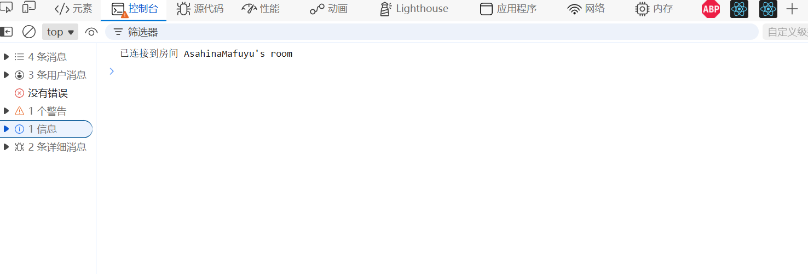
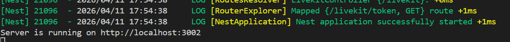
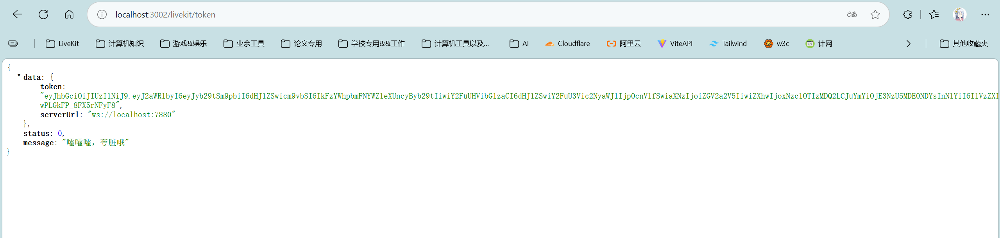

## IndexDB概念

IndexDB本质上就是一个数据库当，你有下面这些需求时，它仍然很合适：

- 离线可读写的业务数据，比如草稿、表单、消息、本地队列、笔记
- 需要比 localStorage 更大的容量和更好的查询能力
- 需要事务、索引、对象存储，而不是单纯字符串键值对。

典型场景包括：

- 离线优先应用
- 本地草稿箱
- 断网提交后重试同步
- 前端缓存部分业务实体，而不是只缓存页面资源。

## 前置内容

### MediaDevices

**`MediaDevices.getUserMedia()`** 会提示用户给予使用媒体输入的许可，媒体输入会产生一个[`MediaStream`](https://developer.mozilla.org/zh-CN/docs/Web/API/MediaStream)，里面包含了请求的媒体类型的轨道。此流可以包含一个视频轨道（来自硬件或者虚拟视频源，比如相机、视频采集设备和屏幕共享服务等等）、一个音频轨道（同样来自硬件或虚拟音频源，比如麦克风、A/D 转换器等等），也可能是其他轨道类型。

它返回一个 [`Promise`](https://developer.mozilla.org/zh-CN/docs/Web/JavaScript/Reference/Global_Objects/Promise) 对象，成功后会`resolve`回调一个 [`MediaStream`](https://developer.mozilla.org/zh-CN/docs/Web/API/MediaStream) 对象。若用户拒绝了使用权限，或者需要的媒体源不可用，`promise`会`reject`回调一个 `PermissionDeniedError` 或者 `NotFoundError` 。

#### 用法

```ts
navigator.mediaDevices
  .getUserMedia(constraints)
  .then(function (stream) {
    /* 使用这个 stream stream */
  })
  .catch(function (err) {
    /* 处理 error */
  });
```

#### 参数说明

`constrains`就是一个object，通常有以下参数：
```json
{
  audio: true,
  video: {
    width: { min: 1024, ideal: 1280, max: 1920 },
    height: { min: 776, ideal: 720, max: 1080 }
  }
};
```

如果是移动设备的话，若要开启前置摄像头，则：

```json
{ 
	audio: true, 
	video: { 
		facingMode: "user" 
	} 
}
```

强制使用后置摄像头，请用：

```json
{ 
	audio: true, 
	video: { 
		facingMode: { 
			exact: "environment" 
		} 
	} 
}
```

> 有关媒体流的相关信息，详见：[媒体流 (MediaStream) - Web API | MDN](https://developer.mozilla.org/zh-CN/docs/Web/API/MediaStream)

## IndexDB使用

```js
// 打开我们的数据库
const request = window.indexedDB.open("MyTestDatabase", 3);
```

open 方法的二个参数是数据库的版本号。数据库的版本决定了数据库模式（schema），即数据库的对象存储（object store）以及存储结构。如果数据库不存在，`open` 操作会创建该数据库，然后触发 `onupgradeneeded` 事件，你需要在该事件的处理器中创建数据库模式。如果数据库已经存在，但你指定了一个更高的数据库版本，会直接触发 `onupgradeneeded` 事件，允许你在处理器中更新数据库模式。
### 处理响应

由于这些请求都是异步的，因此还需要监听对应的事件：

```js
request.onerror = (event) => {
  // 使用 request.errorCode 来做点什么！
};
request.onsuccess = (event) => {
  // 使用 request.result 来做点什么！
};
```

> 此外，浏览器的隐私模式下，IndexedDB 存储仅在内存中存在至隐私会话结束。

#### 成功响应

这里的请求（request）是通过调用 `indexedDB.open()` 产生的，所以 `request.result` 是一个 `IDBDatabase` 的实例

```js
let db;
const request = indexedDB.open("MyTestDatabase");
request.onsuccess = (event) => {
	db = event.target.result; 
};
```

当创建更新的数据库或者使用更高的版本号的话，就会触发onupgradeneeded事件，[IDBVersionChangeEvent](https://developer.mozilla.org/en-US/docs/Web/API/IDBVersionChangeEvent) 对象会作为参数传递给绑定在 `request.result`（例如示例中的 `db`）上的 `onversionchange` 事件处理器。

```js
// 该事件仅在最新的浏览器中实现
request.onupgradeneeded = (event) => {
  // 保存 IDBDatabase 接口
  const db = event.target.result;

  // 为数据库创建对象存储（objectStore）
  const objectStore = db.createObjectStore("name", { keyPath: "myKey" });
};
```

## 构建数据库

下面的表格显示了几种不同的提供键的方法。

| 键路径（`keyPath`） | 键生成器（`autoIncrement`） | 描述                                                                                                 |
| -------------- | --------------------- | -------------------------------------------------------------------------------------------------- |
| 禁用             | 禁用                    | 这种对象存储可以保存任意类型的值，甚至是像数字和字符串这种原始值。每当我们想要增加一个新值的时候，必须提供一个单独的键参数。                                     |
| 启用             | 禁用                    | 这种对象存储只能保存 JavaScript 对象。这些对象必须具有一个和键路径同名的属性。                                                      |
| 禁用             | 启用                    | 这种对象存储可以保存任意类型的值。键会为我们自动生成，或者如果你想要使用一个特定键的话你可以提供一个单独的键参数。                                          |
| 启用             | 启用                    | 这种对象存储只能保存 JavaScript 对象。通常一个键被生成的同时，生成的键的值会被存储在对象中的一个和键路径同名的属性中。然而，如果已存在该属性，该属性的值将被用作键而不会生成一个新的键。 |

原生IndexDB相当繁琐，因此可以使用[Hello World | Dexie.js Documentation - Offline-First Database | Dexie.js - Offline-First Database for JavaScript](https://dexie.org/)

Dexie用来封装IndexDB的一个第三方的库，非常方便，可以试用一下：

```html
<!DOCTYPE html>
<html>
<head>
  <script src="https://unpkg.com/dexie/dist/dexie.js"></script>
  <script>

    var db = new Dexie("FriendDatabase");

    // DB with single table "friends" with primary key "id" and
    // indexes on properties "name" and "age"
    db.version(1).stores({
      friends: `
        id,
        name,
        age`,
    });

    // Now add some values.
    db.friends.bulkPut([
      { id: 1, name: "Josephine", age: 21 },
      { id: 2, name: "Per", age: 75 },
      { id: 3, name: "Simon", age: 5 },
      { id: 4, name: "Sara", age: 50, notIndexedProperty: 'foo' }
    ]).then(() => {

      return db.friends.where("age").between(0, 25).toArray();

    }).then(friends => {

      alert("Found young friends: " +
        friends.map(friend => friend.name));

      return db.friends
        .orderBy("age")
        .reverse()
        .toArray();

    }).then(friends => {

      alert("Friends in reverse age order: " +
        friends.map(friend => `${friend.name} ${friend.age}`));

      return db.friends.where('name').startsWith("S").keys();

    }).then(friendNames => {

      alert("Friends on 'S': " + friendNames);

    }).catch(err => {

      alert("Ouch... " + err);

    });

  </script>
</head>
</html>

```

> 不过这是一个AI时代，API如果还在死记硬背的话，我觉得完全没有必要了，这个可以扔给ai处理

## LiveKit

### 前言

推荐LiveKit是因为它是一个将WebRTC进行一定程度上封装的一个库，用WebRTC的话会考虑非常非常多的底层，而用LiveKit的话则直接开箱食用
首先一定要区分三者：

- `livekit-client`：前端 SDK
- `livekit-server-sdk`：给你自己的后端用来签发 token、调管理接口
- `livekit-server`：真正要跑起来的服务端程序

对于livekit-server服务，如果想要在本地运行，则可以安装：[发布版本 v1.10.1 ·Livekit/Livekit --- Release v1.10.1 · livekit/livekit](https://github.com/livekit/livekit/releases/tag/v1.10.1)

安装好以后启动livekit:

```bash
livekit-server --dev
```

> 开发环境下：
> API key: devkey
> API secret: secret

生产环境的话，详见：[Running LiveKit locally | LiveKit Documentation](https://docs.livekit.io/transport/self-hosting/deployment/)

## LiveKit前端

### 安装

```bash
npm install livekit-client --save
```

> 该模块将在全球命名空间中导出为 `LivekitClient`。访问类中的符号时，你需要用 `LivekitClient` 作为前缀。例如，`Room` 变成 `LivekitClient.Room`

### 用法

#### 连接房间

首先创建livekit.ts文件，然后导入相关库：

```ts
import {
  LocalParticipant,
  LocalTrackPublication,
  Participant,
  RemoteParticipant,
  RemoteTrack,
  RemoteTrackPublication,
  Room,
  RoomEvent,
  Track,
  VideoPresets,
} from 'livekit-client';
```

创建一个房间：

```ts
// 创建新房间
const room = new Room({
    // 自动管理视频质量以适应网络状况
    adaptiveStream: true,
    
    // 优化发布轨道的带宽和CPU使用
    dynacast: true,
    
    // 默认视频捕获设置
    videoCaptureDefaults: {
    
        // 使用720p分辨率进行视频捕获
        resolution: VideoPresets.h720.resolution,
    },
});
```

这里需要跟后端进行连桥：

```ts
// 得到你的url从livekit的仪表盘，或者指向一个自托管的livekit部署
const url = "ws://localhost:7800";

// 生成一个token通过使用livekit服务器sdk或者使用预构建的TokenSource（下面有文档）请求一个端点
const token = "...";
```

相关回答可参考：[chatGPT-LiveKit](https://chatgpt.com/s/t_69da05cf646c81918835f9b4723cbdf6)

token可以参考下面的NestJs中进行配置

然后就是预热连接：

```ts
// 预热连接（可以在页面刚加载时就调用，提前建立连接环境）
room.prepareConnection(url, token);
```

然后就可以对DOM注册事件监听了：

```ts
// 注册事件监听器
room

  // 当订阅到远程音视频轨道时触发
  .on(RoomEvent.TrackSubscribed, handleTrackSubscribed)

  // 当取消订阅远程轨道时触发
  .on(RoomEvent.TrackUnsubscribed, handleTrackUnsubscribed)

  // 当前活跃发言人发生变化时触发（谁在说话）
  .on(RoomEvent.ActiveSpeakersChanged, handleActiveSpeakerChange)

  // 房间断开连接时触发
  .on(RoomEvent.Disconnected, handleDisconnect)

  // 本地轨道取消发布时触发（比如关闭摄像头/麦克风）
  .on(RoomEvent.LocalTrackUnpublished, handleLocalTrackUnpublished);
```

对于上述的一系列书简处理函数，可参考以下定义：

```ts
// 当远程轨道被取消订阅时
function handleTrackUnsubscribed(
  track: RemoteTrack,
  publication: RemoteTrackPublication,
  participant: RemoteParticipant,
) {

  // 从所有绑定的 DOM 元素中移除该轨道
  track.detach();
}

  
  

// 当本地轨道被取消发布时（比如关闭摄像头/麦克风）
function handleLocalTrackUnpublished(
  publication: LocalTrackPublication,
  participant: LocalParticipant,

) {
  // 将本地轨道从页面中移除（停止渲染）
  publication.track.detach();
}

  
  

// 当前发言人变化时（比如谁在说话）
function handleActiveSpeakerChange(speakers: Participant[]) {
  // 可以在 UI 上显示“谁正在说话”的标识（比如高亮头像）
}

  
  

// 房间断开连接时
function handleDisconnect() {
  console.log('已断开房间连接');
}
```

注册完一系列事件以后，就可以连接到房间了：

```ts
// 连接到房间
await room.connect(url, token);
console.log('已连接到房间', room.name);

// 发布本地摄像头和麦克风轨道（开启音视频）
await room.localParticipant.enableCameraAndMicrophone();
```



## LiveKit后端

> 官方文档请参考：[LiveKit JS Server SDK - v2.15.1](https://docs.livekit.io/reference/server-sdk-js/)

### 安装

```bash
npm install livekit-server-sdk --save
```

### 用法

#### 环境变量

你可以把凭据存储在环境变量里。如果在创建 `RoomServiceClient` 或 `AccessToken` 时未传递 api-key 或 api-secret，则将使用以下 env var 中的值：

- `LIVEKIT_API_KEY`
- `LIVEKIT_API_SECRET`

> 关于创建环境变量：
> 在项目的 `.env` 文件里写：
> ```
> LIVEKIT_API_KEY=abc123  
> LIVEKIT_API_SECRET=xyz456
> ```
> 然后 Node.js 里通过 `dotenv` 之类加载。

#### NestJs中进行配置

由于我是在NestJs当中配置的，因此介绍一下如何在NestJs中使用：

```bash
npm install @nestjs/config livekit-server-sdk
```

配置.env:

```env
LIVEKIT_URL=ws://localhost:7880
LIVEKIT_API_KEY=your_api_key
LIVEKIT_API_SECRET=your_api_secret
```

在AppModule里加载配置：

```ts
// app.module.ts
import { Module } from '@nestjs/common';
import { ConfigModule } from '@nestjs/config';
import { LivekitModule } from './livekit/livekit.module';

@Module({
  imports: [
    ConfigModule.forRoot({
      isGlobal: true,
    }),
    LivekitModule,
  ],
})
export class AppModule {}
```

建一个LiveKit模块：

- `livekit.controller.ts`：对外暴露接口
- `livekit.service.ts`：生成 token
- `livekit.module.ts`：注册依赖

Service中存放token：

```ts
// livekit/livekit.service.ts
import { Injectable } from '@nestjs/common';
import { ConfigService } from '@nestjs/config';
import { AccessToken } from 'livekit-server-sdk';

@Injectable()
export class LivekitService {
  constructor(private readonly configService: ConfigService) {}

  async createToken(roomName: string, identity: string) {
    const apiKey = this.configService.get<string>('LIVEKIT_API_KEY');
    const apiSecret = this.configService.get<string>('LIVEKIT_API_SECRET');
    const serverUrl = this.configService.get<string>('LIVEKIT_URL');

    const at = new AccessToken(apiKey, apiSecret, { identity });

    at.addGrant({
      roomJoin: true,
      room: roomName,
      canPublish: true,
      canSubscribe: true,
    });

    const token = await at.toJwt();

    return {
      serverUrl,
      token,
    };
  }
}
```

然后在controller层中对接口进行暴露：

```ts
// livekit/livekit.controller.ts
import { Controller, Get, Query } from '@nestjs/common';
import { LivekitService } from './livekit.service';

@Controller('livekit')
export class LivekitController {
  constructor(private readonly livekitService: LivekitService) {}

  @Get('token')
  async getToken(
    @Query('roomName') roomName = 'test-room',
    @Query('identity') identity = `user-${Date.now()}`,
  ) {
    return this.livekitService.createToken(roomName, identity);
  }
}
```



由于我的NestJs设置的端口是3002，因此访问[localhost:3002/livekit/token](http://localhost:3002/livekit)即可返回token：



> 配置后端端口号也很简单：
> 在main.ts中进行配置即可：

```ts
import { NestFactory } from '@nestjs/core';
import { AppModule } from './app.module';
import {
  FastifyAdapter,
  NestFastifyApplication,
} from '@nestjs/platform-fastify';

  

async function bootstrap() {
  const app = await NestFactory.create<NestFastifyApplication>(
    AppModule,
    new FastifyAdapter(),
  );
  
  // 启动服务器
  await app.listen(process.env.PORT ?? 3002, () => {
    console.log(`Server is running on http://localhost:${process.env.PORT ?? 3002}`);
  });
}
bootstrap();
```

这样我们就得到了服务器地址和对应的token，前端得到它即可

#### 房间管理

> **房间不需要提前创建**，因为第一个参与者加入时，房间会自动创建；`createRoom()` 主要用于自定义房间配置，比如 `emptyTimeout`、`maxParticipants` 等。

相关代码如下：

```ts
import { Injectable } from '@nestjs/common';
import { ConfigService } from '@nestjs/config';
import { AccessToken, RoomServiceClient, Room } from 'livekit-server-sdk';

@Injectable()
export class LivekitService {
    private readonly roomServiceClient: RoomServiceClient;
    private readonly apiKey: string;
    private readonly apiSecret: string;
    private readonly serverUrl: string;
    
    constructor(private configService: ConfigService) {
        const apiKey = this.configService.get<string>('LIVEKIT_API_KEY');
        const apiSecret = this.configService.get<string>('LIVEKIT_API_SECRET');
        const serverUrl = this.configService.get<string>('LIVEKIT_URL');
        if (!serverUrl || !apiKey || !apiSecret) {
            throw new Error('LiveKit environment variables are missing');
        }
        this.apiKey = apiKey;
        this.apiSecret = apiSecret;
        this.serverUrl = serverUrl;
        this.roomServiceClient = new RoomServiceClient(
            this.serverUrl,
            this.apiKey,
            this.apiSecret,
        );
    }

    /**
     *
     * @param roomName 房间名称
     * @param identity 用户名称
     */
    async createToken(roomName: string, identity: string) {
        const at = new AccessToken(this.apiKey, this.apiSecret, {
            identity: identity,
            ttl: 3600 * 6, // token 有效期，单位为秒, 默认6小时
        });

        at.addGrant({
            roomJoin: true, // 允许加入房间
            room: roomName, // 指定房间名称
            canPublish: true, // 允许发布音视频流
            canSubscribe: true, // 允许订阅音视频流
        });

        // 生成令牌
        const token = await at.toJwt();
        
        // 返回令牌
        return {
            token,
            serverUrl: this.serverUrl, // livekit服务器地址
        }
    }

    // 创建房间
    async createRoom(roomName: string) {
        return this.roomServiceClient.createRoom({
            name: roomName,
            emptyTimeout: 10 * 60, // 房间空闲多久后自动销毁，单位为秒，这里设置为10分钟
            maxParticipants: 10, // 房间最大参与者数量
        });
    }

    /**
    * 获取房间列表
    */
    async listRooms(): Promise<Room[]> {
        return this.roomServiceClient.listRooms();
    }

    /**
    * 删除房间
    */
    async deleteRoom(roomName: string): Promise<void> {
        return this.roomServiceClient.deleteRoom(roomName);
    }
}
```

#### Webhook

**LiveKit 主动通知你“房间/用户/轨道发生变化”**

比如：

- 用户加入房间
- 用户离开房间
- 房间结束
- 轨道发布
- 录制完成

可以用它做：

- 房间状态同步（写数据库）
- 在线人数统计
- 触发业务逻辑（比如结束会议）
- 记录日志


