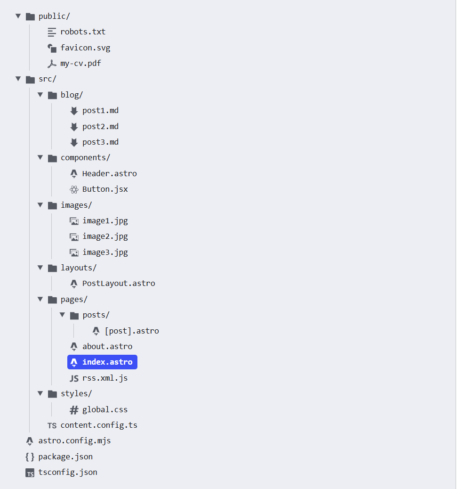
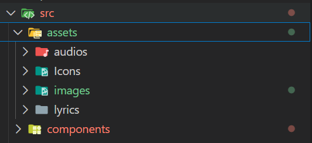

## 前言

这一章主要讲的就是工程规范，从零开始创建一个工程规范化的`astro`工程目录

## 创建工程

1. 创建目录
	```bash
	mkdir your-project-name
	cd your-project-name
	```
2. 初始化`npm`
	```bash
	npm init -y
	```
3. 安装`astro`
	```bash
	npm install astro
	```
	并且配置`package.json`
	```json
	{
	  "scripts": {
	    "dev": "astro dev",
	    "build": "astro build",
	    "preview": "astro preview"
	  },
	}
	```
4. 创建`astro.config.mjs`(用来配置astro项目的文件)
	```mjs astro.config.mjs
	import { defineConfig } from "astro/config";
	// https://astro.js.cn/config
	export default defineConfig({});
	```
5. 添加`tsconfig.json`
	```json
	{
	  "extends": "astro/tsconfigs/strict",
	  "include": [
	    ".astro/types.d.ts",
	    "**/*"
	  ],
	  "exclude": [
	    "dist"
	  ],
	  "compilerOptions": {
	    "jsx": "preserve",
	    "jsxImportSource": "preact",
	    "baseUrl": ".",
	    "paths": {
	      "@/*": [
	        "src/*"
	      ]
	    }
	  }
	}
	```

至此，一切流程就绪，你也得到了最小**骨架**（对于工程中的资源目录分配还没有）

## 目录结构

`astro`官方是这样配置的：



不过有些部分我觉得应该修改一下配置：
1. blog目录下的md我觉得直接挪动到`src/pages/posts`目录下更合理（因为astro构建后的访问路径通常是pages代表根路径，pages下的index.html就是访问url下的首页，而访问`posts/[markdownname]`就可以直接访问markdown）
2. src目录下新建一个assets目录，存放静态资源：
	
	*(我的工程目录就是用assets存放对应的静态资源)*
	 > 对于网页的ico，建议是存放到`public`下，这样的话站点机器人在抓取页面的`meta`数据的时候，它通常直接访问的就是静态资源文件夹
3. components和views随个人喜好存放
4. `sitemap`会自动生成，因此不需要存放，详见我的另一篇博客[astro中的sitemap](/posts/AstroSitemap)

然后对于图片链接这一块儿，有存放到`public`下的，但是链接路径一定要用绝对路径；也有存放到`src`下的，但是链接路径一定要用相对路径，有兴趣可以看往期博客
~~(我忘了，tmd我那一期博客在commit的时候不小心merge丢失了，不会玩git导致的)~~
