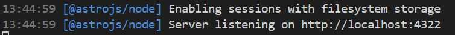
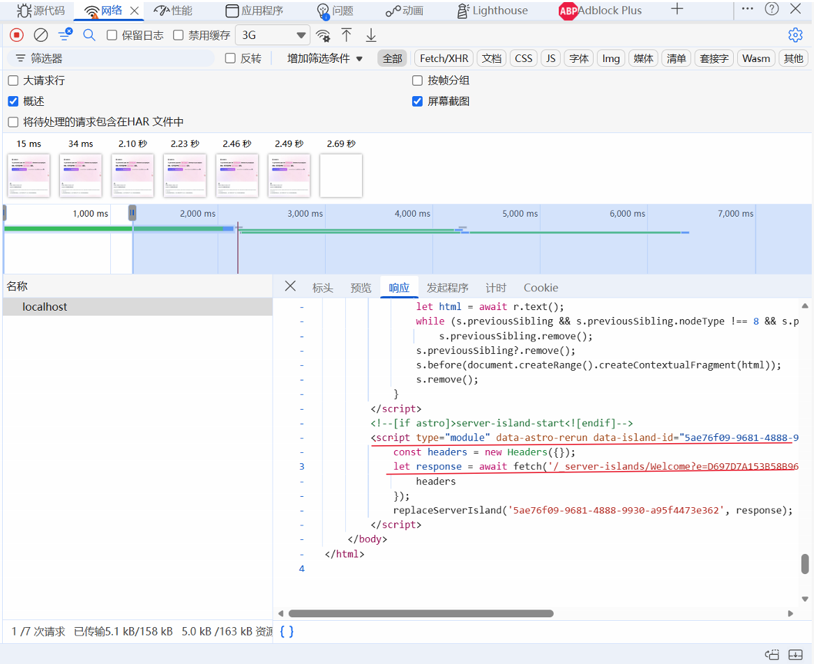

## 前言 

首先我们需要了解MPA和SPA的工作方式：

### MPA 

MPA是将整个DOM树全部都销毁，重新构建页面，加载并解析HTML文件
因此的话变量，脚本，事件以及等等都会被销毁：
- 浏览器发起 **新的 document 导航**（新的 HTML 文档请求）
- 旧页面的：
    - `window` / `document`
    - JS 引擎上下文（全局变量、模块单例、闭包）
    - DOM / CSSOM
    - 定时器（`setInterval`/`setTimeout`）、RAF
    - 事件监听器
    - WebSocket / SSE / Fetch 中的连接（一般会被中止）都变成“旧页面的一部分”，随后整体被释放（浏览器会进行清理 + 回收）

## SPA

SPA却不一样，SPA的话是在当前页面进行重写，SPA的实现原理主要是跟`<a>`标签有关：
当我们点击跳转路由`<a href="/posts/1">`时，浏览器会产生`click`事件，SPA监听到了这个事件，然后通过`preventDefault()`来阻止浏览器的默认`整页跳转`，由路由器来接管这次应当切换到哪个视图上去。

> 可以测试一下：通过`click`链接跳转和通过输入`url`进行跳转会发现：确实SPA的技术就是通过`document`对`<a>`事件的监听和拦截默认事件的触发，不然的话直接输入`url`进行跳转的话，仍然是MPA的表现手段

那问题来了：既然SPA不会跳转页面，那么它又是怎么记住历史路由的？
很简单：`history.pushState(state, "", "/posts/1")`或 `replaceState(...)`
这样的话路由器通过动态添加历史记录，做到地址栏进行历史记录的更改

当点击浏览器前进后退的时候触发`popstate`事件，然后路由器根据当前所要跳转的`url`重新渲染对应的视图

### astro中的SPA

## 群岛组件

> **岛屿的概念就是静态页面上可交互的组件,且这些组通常只会影响自身（通常只更新自己那块 DOM）**

群岛组件就是将一个html页面拆分静态内容以及**多个岛屿**，每个**岛屿**都是单独的一个组件（**每个组件都可以用不同的UI框架，例如react，vue，svelte）

### 客户端群岛（针对UI组件，例如react, Vue, svelte组件）

可以在页面中import其他架构的组件
那么首先我们了解一下如何在`astro`中引入其他框架

#### 在astro中引入vue

一行代码解决：

```bash
npx astro add vue
```

安装完毕以后（**记得重新启动astro服务**），写一个简单的`demo`测试一下：

```vue /src/test.astro
<<template>
    <div>
        hello sekai
        <button @click="testFn">点我弹窗</button>
    </div>
</template>

<script setup>
function testFn () {
    alert('111111111111111')
}
</script>

<style lang="scss" scoped>
.div {
    width: 100px;
    height: 100px;
    background-color: pink;
}
</style>
``` 

```astro /pages/testVue.astro
---
import TestVue from "../components/Vue/test.vue";
import BaseLayout from "@/layouts/BaseLayout.astro";
---
<BaseLayout>
    <TestVue slot="mainContent"/>
</BaseLayout>
```

打开路由和网站测试一下：


#### 岛屿思想的展现

astro官方就指明了：

> 默认情况下，Astro 会自动将每个 UI 组件渲染成仅包含 HTML 和 CSS 的形式，**并自动剥离掉所有客户端 JavaScript。**

因此上述我们点击弹窗是没有意义的，只需要加上`client:load`就行了

```astro /src/testVue.astro
---
import TestVue from "../components/Vue/test.vue";
import BaseLayout from "@/layouts/BaseLayout.astro";
---
<BaseLayout>
    <!-- 现在这个组件就是交互的了 -->
    <TestVue slot="mainContent" client:load/>
</BaseLayout>
```

在使用群岛时，客户端的 JavaScript 只会加载你所使用 `client:*` 指令明确标记的交互组件。

> 注：对于常规的`.astro`组件而言，js脚本仍然正常加载，也就是说**岛屿通常只是针对第三方UI框架开发的js脚本剥离**

所以思路也非常明朗：静态内容由`astro`来进行构造，而动态内容则使用第三方UI框架（例如react, vue等来开发才是对的）


可以发现内容确实已经插入到页面当中去了，证明我们的Vue引入完成

> *这里拓展一下client的几种加载模式*：
> （注：**水合**的意思就是**服务器先把组件渲染成静态 HTML 给浏览器显示；等页面到客户端后，再加载该框架的 JS，把这些已有的 HTML“接管起来”，绑定事件、恢复状态，让它变成可交互的组件。**）
> 1. client:load（最高优先级）
> 	- **何时水合**：页面加载时立刻执行并激活组件 JS
> 	- **适用**：首屏立即可见、需要马上交互的组件
> 2. client:idle（中优先级）
> 	- **何时水合**：初始加载完成后，浏览器空闲时（`requestIdleCallback`）；不支持则用 `load` 事件
> 	- **适用**：不急着交互、可延后加载的组件
> 	- **`timeout`（astro@4.15.0+）**：`client:idle={{ timeout: ms }}`
> 		- **作用**：即使还没空闲，也保证在 ms 内会水合（避免无限拖延）
> 3. `client:visible`（低优先级）
> 	- **何时水合**：组件进入视口才水合（IntersectionObserver）
> 	- **适用**：页面下方/重资源组件，用户不看到就不加载
> 	- **`rootMargin`（astro@4.1.0+）**：`client:visible={{ rootMargin: "200px" }}`
> 		- **作用**：提前“快进入视口”就开始水合，减少 CLS、提升体验
> 4. `client:media`（低优先级）
> 	- **何时水合**：满足某个媒体查询条件才水合
> 	- **适用**：只在特定屏幕尺寸才会出现/需要的组件
> 	- **注意**：如果只是“CSS 隐藏 + 进入视口才显示”，通常用 `client:visible` 就够了
> 5. `client:only="框架名"`
> 	- **作用**：**跳过 SSR**，只在客户端渲染（行为类似 `client:load`，加载时立刻渲染/水合）
> 	- **必须指定框架**：如 `"vue" / "react" / "svelte" ...`
> 	- **可加 fallback**：子元素 `slot="fallback"` 用作加载中占位

### 服务端群岛

服务端群岛就是对于页面而言，高昂贵的组件加载内容（比如图片，js脚本等等），可以使用`server:defer`来延迟加载，通常就是使用懒加载的方式，先用示例样式来代替这些组件显示，然后等页面渲染完毕之后（首次页面展示）,就去拿到这些资源，然后替换掉占位组件，思路其实和懒加载挺类似的，这样做的好处就是**能够让首屏页面加载速度非常快，用户可以第一时间得到相关页面**。

客户端群岛负责`js`脚本的加载，而服务端群岛负责**SSR加载的时候组件是否为script**

但是此时的话必须要有服务端进行托管，如果不托管就会报错：

```powershell
13:28:09 [ERROR] [vite] ✗ Build failed in 890ms
[NoAdapterInstalledServerIslands] [astro:server-islands] Cannot use server islands without an adapter. Please install and configure the appropriate server adapter for your final deployment.
file: D:/web_project/TestBlog/src/pages/index.astro
  Hint:
    See https://docs.astro.build/en/guides/on-demand-rendering/ for more information.
  Error reference:
    https://docs.astro.build/en/reference/errors/no-adapter-installed-server-islands/
  Stack trace:
    at Object.transform (file:///D:/web_project/TestBlog/node_modules/astro/dist/core/server-islands/vite-plugin-server-islands.js:36:19)
    at file:///D:/web_project/TestBlog/node_modules/rollup/dist/es/shared/node-entry.js:22571:40
```

为什么会报错：必须要 adapter？
因为 `server:*`（server islands）意味着：**部署端必须能执行服务器代码**。
- `output: "static"`：只产出静态文件，部署端不会运行你的服务器逻辑
- `server:defer`：需要一个能运行 SSR 的环境来渲染那块 island
所以 Astro 才会报：

> *Cannot use server islands without an adapter*

**这其实是 Server Islands 的第一课：**

> 你一旦用到 `server:*`，就必须从“纯静态托管”走向“有服务端运行时”的部署模式。

简单做一个小部署（本地Node环境）：
- 安装`npm i @astrojs/node`
- 配置`astro.config.mjs`：

```ts
import { defineConfig } from "astro/config";
import node from "@astrojs/node";
export default defineConfig({
	output: "server",
	adapter: node({ mode: "standalone" }),
});
```

然后就可以使用了：

```bash
npm run build
npm run preview
```

#### 代码演示讲解

这么讲可能非常抽象，来做一个小的`deomo`吧

1. 首先我们创建一个`astro`的项目（具体项目创建查看官网）
2. 打开`index.html`,修改`Welcome`组件的代码：
	```astro
	---
	import Welcome from '../components/Welcome.astro';
	import Layout from '../layouts/Layout.astro';
	// Welcome to Astro! Wondering what to do next? Check out the Astro 
	documentation at https://docs.astro.build

	// Don't want to use any of this? Delete everything in this file, the `assets`, 
	`components`, and `layouts` directories, and start fresh.
	---
	<Layout>
	    <Welcome server:defer/>
    </Layout>
    ```
  3. 构建打包，然后预览：
  ```bash
	npm run build
	npm run preview
  ```



点开预览网页，可以看到如下代码：




发现DOMContentLoaded是2.18s，前2.18s只有localhost这个请求，也就是根本没有去请求这个SSR渲染的这一部分的组件

完整`<body>`代码如下：

```html
 <body data-astro-cid-sckkx6r4>
        <script>
            async function replaceServerIsland(id, r) {
                let s = document.querySelector(`script[data-island-id="${id}"]`);
                if (!s || r.status !== 200 || r.headers.get('content-type')?.split(';')[0].trim() !== 'text/html')
                    return;
                let html = await r.text();
                while (s.previousSibling && s.previousSibling.nodeType !== 8 && s.previousSibling.data !== '[if astro]>server-island-start<![endif]')
                    s.previousSibling.remove();
                s.previousSibling?.remove();
                s.before(document.createRange().createContextualFragment(html));
                s.remove();
            }
        </script>
        <!--[if astro]>server-island-start<![endif]-->
        <script type="module" data-astro-rerun data-island-id="5ae76f09-9681-4888-9930-a95f4473e362">
            const headers = new Headers({});
            let response = await fetch('/_server-islands/Welcome?e=D697D7A153B58B96ED3D9C62xynfH9M14fN3q3PAsjpfeEJepWRdWj0%3D&p=&s=', {
                headers
            });
            replaceServerIsland('5ae76f09-9681-4888-9930-a95f4473e362', response);
        </script>
    </body>
```

此时看到的 body 里只有：

- 一个 `replaceServerIsland()` 辅助函数
- 一段条件注释包起来的“server-island-start”标记
- 一个 `<script type="module" data-island-id="...">`：它会去 `fetch('/_server-islands/Welcome?...')`

也就是说：**首个 HTML 响应只返回了“占位 + 拉取 island 的机制”，而不是 island 的最终 HTML。**

这就是 `server:defer` 的核心：**不要让 island 阻塞整页首个 HTML**。

