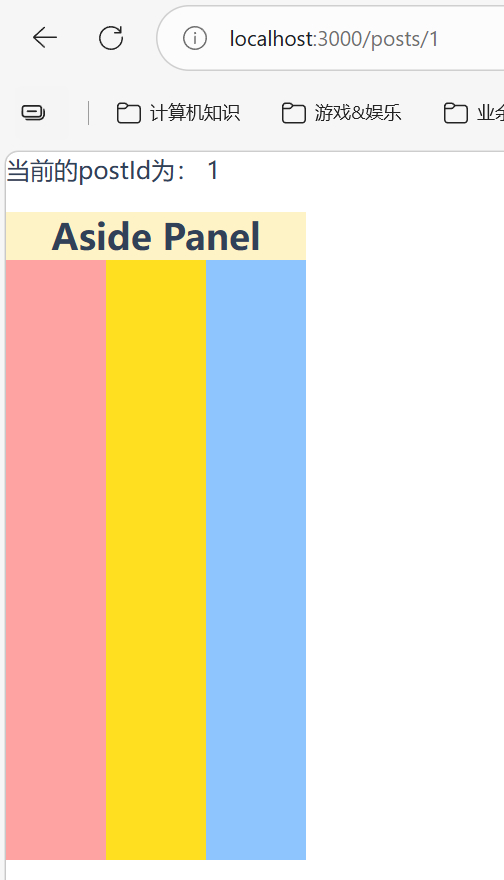
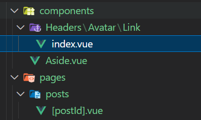
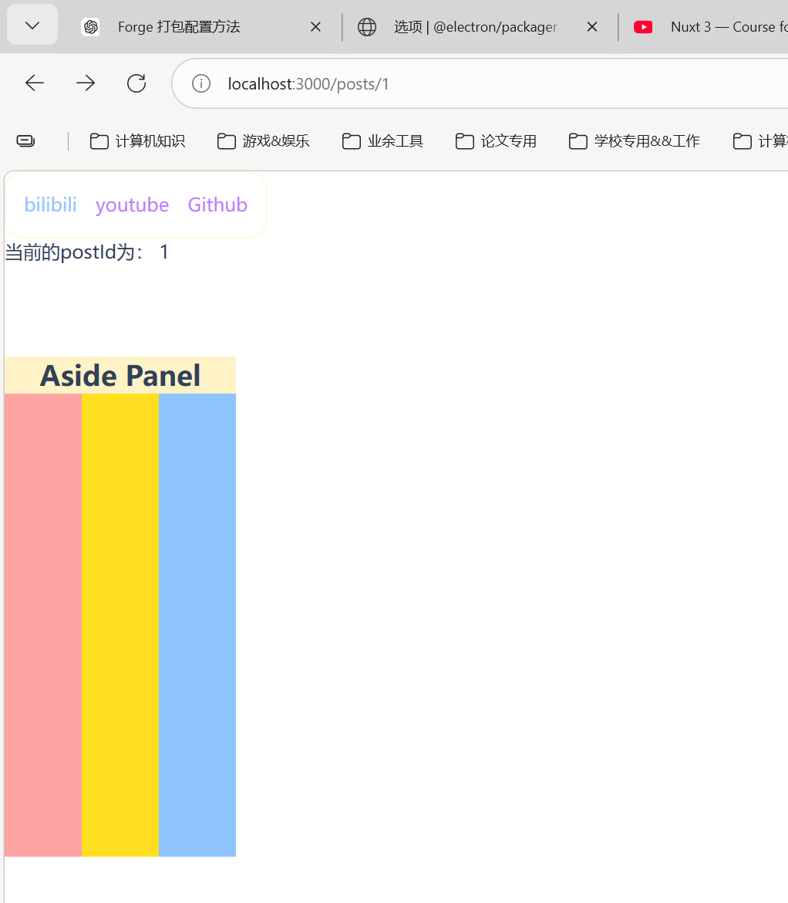
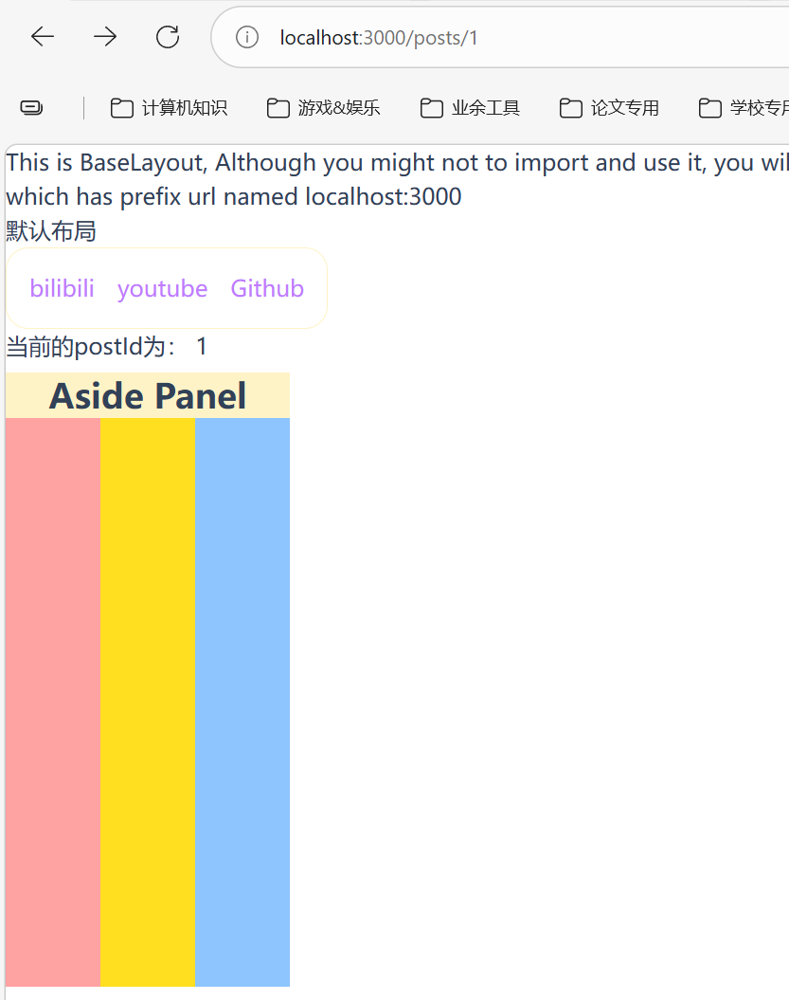
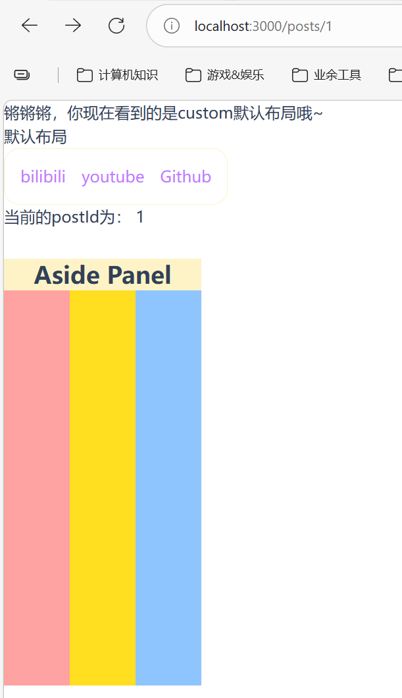
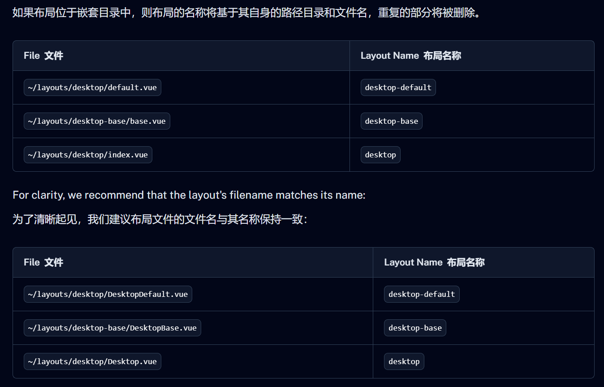

## 组件的便捷性

在Nuxt中，可以在`app/components`目录下创建组件，用的话完全不需要`import`它们，直接调用即可。
例如在`app/components`中创建一个Aside组件：

```vue app/components/Aside.vue
<template>
    <div class="w-50 h-100 fixed top-10 left-0 z-1">
        <header class="bg-amber-100 text-shadow-sky-300 font-bold text-2xl text-center">Aside Panel</header>
        <div class="w-full h-full flex">
            <div class="flex-1 bg-red-300"></div>
            <div class="flex-1 bg-yellow-300"></div>
            <div class="flex-1 bg-blue-300"></div>
        </div>
    </div>
</template>

<script setup>

</script>

<style lang="scss" scoped>
</style>
```

然后在`/app/pages/posts/[postId].vue`中使用它:

```vue /app/pages/posts/[postId].vue
<template>
    <Aside></Aside> // 这里我们并没有显式导入，但是仍然会被读取到
    <div>
        当前的postId为： {{ $route.params.postId }}
    </div>
</template>
```

可以看到：



即使没有显式导入，只要存放到`app/components`目录下的.vue文件都会被当成组件默认导入

> 总不可能所有的组件都丢到`app/components`这个根目录下吧?这样多混乱啊？

是的，同样的，NuxtJs的components也支持目录级别索引，例如我创建了这样一个目录级别：



这层目录为：`app/components/Headers/Avatar/Link/index.vue`，那么我只需要使用`HeadersAvatarLink`这个组件即可(还是`app/pages/posts/[postId].vue`这个页面下)：

```vue app/pages/posts/[postId].vue
<template>
    <Aside></Aside>
    <HeadersAvatarLink />
    <div>
        当前的postId为： {{ $route.params.postId }}
    </div>
</template>
```

在`app/components/Headers/Avatar/Link/index.vue`写入以下代码：

```vue app/components/Headers/Avatar/Link/index.vue
<template>
    <div class="w-fit p-4 flex gap-4 border border-amber-100 rounded-2xl ">
        <a class="text-purple-400 hover:text-blue-300 transition-colors ease-in-out duration-500"
            href="https://www.bilibili.com"
            target="_blank">bilibili</a>
        <a class="text-purple-400 hover:text-blue-300 transition-colors ease-in-out duration-500"
            href="https://www.youtube.com"
            target="_blank">youtube</a>
        <a class="text-purple-400 hover:text-blue-300 transition-colors ease-in-out duration-500"
            href="https://github.com/"
            target="_blank">Github</a>
    </div>
</template>

<script setup>
</script>

<style lang="scss" scoped></style>
```

然后就可以看见组件成功被导入：



> 总结：components组件目录下也支持目录级别索引，并且index.vue也默认代表默认组件，所以非常建议用首字母大写，且一个文件目录一个word是最好的

## Layout

一样的，在`app/layouts`目录下，创建`default.vue`就是默认布局

```vue default.vue
<template>
    <div>
        <p>This is BaseLayout, Although you might not to import and use it, you will see this text in all pages which
            has prefix url named localhost:3000</p>
        <slot></slot>
    </div>
</template>

<script setup>

</script>

<style lang="scss" scoped></style>
```

然后只要在`app/app.vue`中开启 `<NuxtLayout></NuxtLayout>`:

```vue app/app.vue
<template>
    <div>
        <NuxtLayout>
            默认布局
        </NuxtLayout>
        <NuxtPage />
    </div>
</template>
```

就可以看到：无论什么页面都会有这个默认布局：



既然有默认布局，那肯定有自定义，官方是这么解释的：
`definePageMeta` 是一个编译器宏，可用于设置位于 [`app/pages/`](https://nuxt.com/docs/4.x/directory-structure/app/pages) 目录下的**页面**组件的元数据（除非[另有设置](https://nuxt.com/docs/4.x/api/nuxt-config#pages) ）。这样，您可以为 Nuxt 应用程序的每个静态或动态路由设置自定义元数据。

现在定义一个`custom.vue`布局（放在app/layouts下面）：

```vue app/layouts/custom.vue
<template>
    <div>
        <p>锵锵锵，你现在看到的是custom默认布局哦~</p>
        <slot></slot>
    </div>
</template>

<script setup>
</script>

<style lang="scss" scoped></style>
```

还是使用`app/pages/posts/[postId].vue`

```vue app/pages/posts/[postId].vue
<template>
    <Aside></Aside>
    <HeadersAvatarLink />
    <div>
        当前的postId为： {{ $route.params.postId }}
    </div>
</template>

<script setup>
// 这里使用的definePageMeta来配置layout
definePageMeta({
    layout: 'custom'
})
</script>

<style scoped>
</style>
```

再次访问[localhost:3000/posts/1](http://localhost:3000/posts/1)，可以得到:



也可以在`app/app.vue`中使用 [`<NuxtLayout>`](https://nuxt.com/docs/4.x/api/components/nuxt-layout) 的 `name` 属性直接覆盖所有页面的默认布局：

```vue app/app.vue
<script setup lang="ts">
// You might choose this based on an API call or logged-in status
const layout = 'custom'
</script>

<template>
  <NuxtLayout :name="layout">
    <NuxtPage />
  </NuxtLayout>
</template>
```

*这样的话所有的页面默认配置就是custom布局了（锵锵锵）*
官方也对布局的嵌套路由进行了说明：



## Assets

Nuxt和astro一样，提供了两种存放静态资源的路径：
- [`public/`](https://nuxt.com/docs/4.x/directory-structure/public) 目录的内容将按原样在服务器根目录提供。
-  [`app/assets/`](https://nuxt.com/docs/4.x/directory-structure/app/assets) 目录包含您希望构建工具（Vite 或 webpack）处理的所有资源。

其实这一部分没什么好说的，参考astro对应的词条描述就可以了

> 额外的，推荐一个比较好的图标网站：[图标 --- Icônes](https://icones.js.org/)


