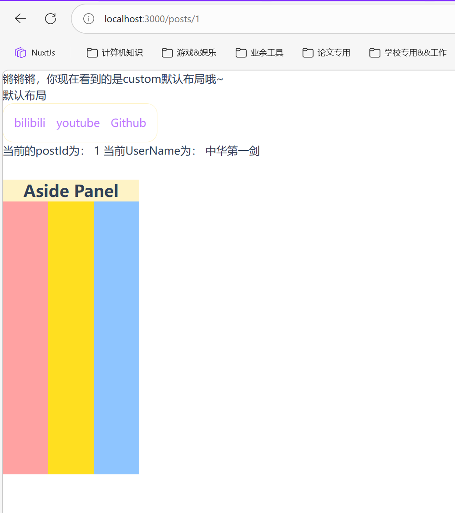

## composables

在Nuxt项目中，app文件夹下创建`composables`文件夹，可以让该文件夹内的所有`js`或者`ts`文件都会当成函数所注册，例如创建一个`app/composables/useUserStores.ts`文件：

```ts app/composables/useUserStores.ts
// composables/useUserStores.ts  
export const useUserStores = () => {  
const userId = useState<number>('userId', () => 1)  
const token = useState<string | null>('token', () => null)  
const username = useState<string | null>('username', () => '中华第一剑')  
  
const modifyUsername = (data: string | null = null) => { username.value = data }  
const modifyToken = (data: string | null = null) => { token.value = data }  
const modifyUserId = (data: number = 1) => { userId.value = data }  
  
return { userId, token, username, modifyUsername, modifyToken, modifyUserId }  
}
```

对于导出方式，命名导出和默认导出皆可：
1. 命名导出:
	
	```ts
	export const useUserStores = () => {  
		...
		return { ... }  
	}
	```
2. 默认导出：
	```ts	
	export default function () {
		...
		return {...}
	}
	```

>Nuxt 的 `useState(key, init)` 是为 **“跨组件共享 + SSR 安全”** 设计的全局响应式状态：
>- **响应式**：返回的是 `Ref`，改了会驱动 UI 更新。
>- **按请求隔离（SSR-safe）**：在服务器端渲染时，Nuxt 会为每个请求创建隔离的 state 容器，你不会把用户 A 的状态泄漏给用户 B。
>- **可在多个组件/页面共享**：只要 key 相同，就拿到同一份 state（同一次请求/同一个客户端会话内）。


该文件扫描的时候会默认导出这个`useUserStores`函数，因此可以直接调用它：

```vue app\pages\posts\[postId].vue
<template>
    <Aside></Aside>
    <HeadersAvatarLink />
    <div>
        当前的postId为： {{ $route.params.postId }}
        当前UserName为： {{ username }}
    </div>
</template>

<script setup>
definePageMeta({
    layout: 'custom'
})
const { userId, username, token } = useUserStores()
</script>

<style scoped>
</style>
```



如果希望框架禁止导入的话，直接设置`nuxt.config.ts`即可：

```ts nuxt.config.ts
export default defineNuxtConfig({
  imports: {
    scan: false,
  },
})
```

VueUse 本质上就是：**把一堆常用能力（浏览器 API、状态、事件、网络、动画、工具函数等）封装成“Vue Composition API 友好的 composables”**，让你在 Vue / Nuxt 项目里用 `ref / computed / watch` 的方式，**更省代码、更一致、更容易复用**。官方定位就是 “Collection of essential Vue Composition Utilities”，并且是 **Vue 3** 体系、TypeScript 友好、可 tree-shaking（按需打包）。

(更多内容详见官方文档：[Nuxt API Reference v4](https://nuxt.com/docs/4.x/directory-structure/app/composables))

## Plugins

同样的，在app目录下创建`plugins`文件夹，它会自动扫描：

```Directory structure
-| plugins/
---| foo.ts      // scanned
---| bar/
-----| baz.ts    // not scanned
-----| foz.vue   // not scanned
-----| index.ts  // currently scanned but deprecated
```

> 只有目录顶层的文件（或任何子目录中的索引文件）才会自动注册为插件，因此上图中只会注册 `foo.ts` 和 `bar/index.ts` 。

要在子目录中添加插件，可以使用 `nuxt.config.ts` 中的 [`app/plugins`](https://nuxt.com/docs/4.x/api/nuxt-config#plugins-1) 选项：

```ts nuxt.config.ts
export default defineNuxtConfig({
  plugins: [
    '~/plugins/bar/baz',
    '~/plugins/bar/foz',
  ],
})
```

如果想要创建插件，则需要传递给插件的唯一参数（nuxtApp）

```ts 
export default defineNuxtPlugin((nuxtApp) => {
  // Doing something with nuxtApp
})
```

nuxtApp相关api如下：
[useNuxtApp · Nuxt Composables v4 --- useNuxtApp · Nuxt Composables v4](https://nuxt.com/docs/4.x/api/composables/use-nuxt-app)

如果一个插件需要等待另一个插件才能运行，你可以将该插件的名称添加到 `dependsOn` 数组中。

```ts
export default defineNuxtPlugin({
  name: 'depends-on-my-plugin',
  dependsOn: ['my-plugin'],
  async setup (nuxtApp) {
    // this plugin will wait for the end of `my-plugin`'s execution before it runs
  },
})
```

如果只是定义全局辅助函数的话：

```ts plugins/example.ts
export default defineNuxtPlugin(() => {
  return {
    provide: {
      hello: (msg: string) => `Hello ${msg}!`,
    },
  }
})
```

然后你就可以在组件中使用该辅助函数了

```vue app/components/Hello.vue
<script setup lang="ts">
// alternatively, you can also use it here
const { $hello } = useNuxtApp()
</script>

<template>
  <div>
    {{ $hello('world') }}
  </div>
</template>
```

