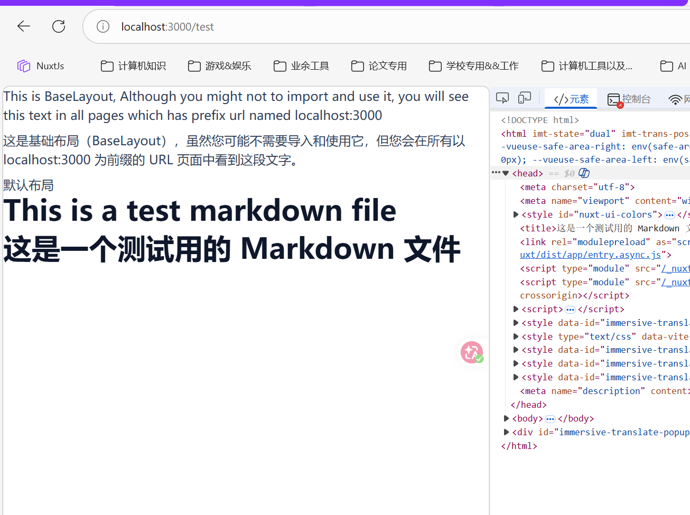

## MiddleWare

在`app`的目录下创建`middleware`文件夹，则可以使用中间件，中间件有三种种：

1. 命名路由中间件，放置在 `app/middleware/` 下，当在页面上使用时，通过异步导入自动加载。
2. 全局路由中间件，放置在 `app/middleware/` 目录下，带有 `.global` 后缀，并在每次路由更改时运行
3. 内联级别（也就是直接在.vue文件当中自定义func）

例如我想要放置一个全局页面路由：

```ts my-middleware.global.ts
export default defineNuxtRouteMiddleware((to, from) => {
    if (to.path === '/login') {
        // 什么都不做，直接放行
    } else {
        // 其他页面需要登录，检查 token 是否存在
        const { token } = useUserStores()
        if (!token.value) {
            return navigateTo('/login')
        }
        // token 存在，继续导航
    }
})
```

Nuxt 提供了两个全局可用的辅助函数，可以直接从中间件返回。

1. [`navigateTo`](https://nuxt.com/docs/4.x/api/utils/navigate-to) - 重定向到指定路由
2. [`abortNavigation`](https://nuxt.com/docs/4.x/api/utils/abort-navigation) - 中止导航，并可选择显示错误消息。

可能的返回值有：

- 什么都不做（简单的 `return` 或完全不返回）——不会阻塞导航，而是会跳转到下一个中​​间件函数（如果有），或者完成路由导航。
- `return navigateTo('/')` - 重定向到指定路径，如果重定向发生在服务器端，则重定向代码设置为 [`302` Found。](https://developer.mozilla.org/en-US/docs/Web/HTTP/Reference/Status/302)
- `return navigateTo('/', { redirectCode: 301 })` - 重定向到指定路径，如果重定向发生在服务器端，则重定向代码设置为 [`301` Moved Permanently。](https://developer.mozilla.org/en-US/docs/Web/HTTP/Reference/Status/301)
- `return abortNavigation()` - 停止当前导航
- `return abortNavigation(error)` - 拒绝当前导航并返回错误。

### 中间件执行顺序

假设中间件目录如下：

```
-| middleware/
---| analytics.global.ts
---| setup.global.ts
---| auth.ts
```

对于某一个`index.vue`中的文件如下：

```vue index.vue
<script setup lang="ts">
definePageMeta({
  middleware: [
    function (to, from) {
      // 自定义内联中间件
    },
    'auth',
  ],
})
</script>
```

中间件预计将按以下顺序运行：

1. `analytics.global.ts`
2. `setup.global.ts`
3. 自定义内联中间件
3. `auth.ts`

也就是说：全局中间件 优先级最高，然后在.vue文件中自定义中间件的顺序，而默认情况下，全局中间件会按照文件名字母顺序执行。

## content

这次不是在app目录下了，这次是在工程的根目录下，创建content的文件夹，[Nuxt Content](https://content.nuxt.com/) 读取项目中的 `content/` 目录，并解析 `.md` 、 `.yml` 、 `.csv` 和 `.json` 文件，为您的应用程序创建一个基于文件的 CMS。

- 使用内置组件渲染您的内容。
- 使用类似 MongoDB 的 API 查询您的内容。
- 使用 MDC 语法在 Markdown 文件中使用 Vue 组件。
- 自动生成导航路线。

首先需要安装依赖：

```bash
npx nuxt module add content
```

创建`content.config.ts`

```ts content.config.ts
import { defineContentConfig, defineCollection } from '@nuxt/content'

export default defineContentConfig({
  collections: {
    content: defineCollection({
      type: 'page',
      source: '**/*.md'
    })
  }
})
```

此配置会创建一个默认 `content` 集合，用于处理项目 `content` 文件夹中的所有 Markdown 文件。您可以根据需要自定义集合设置。

然后我们创建一个`content/test.md`

```md
# This is a test markdown file
```

然后在`app/pages`下创建[postname].vue文件：

```vue app/pages/[postname].vue
<script setup lang="ts">
const route = useRoute()

// 动态获取路由参数
const postName = route.params.postname

// 对应的查询content中的markdown，然后渲染出来
const { data: home } = await useAsyncData(() => queryCollection('content').path(`/${postName}`).first())

useSeoMeta({
  title: home.value?.title,
  description: home.value?.description
})
</script>

<template>
  <ContentRenderer v-if="home" :value="home" />
  <div v-else>Home not found</div>
</template>
```



当然，这个主要是用来支持markdown的module，更多NuxtJs的相关module请参考：[Nuxt 模块 --- Nuxt Modules](https://nuxt.com/modules)

