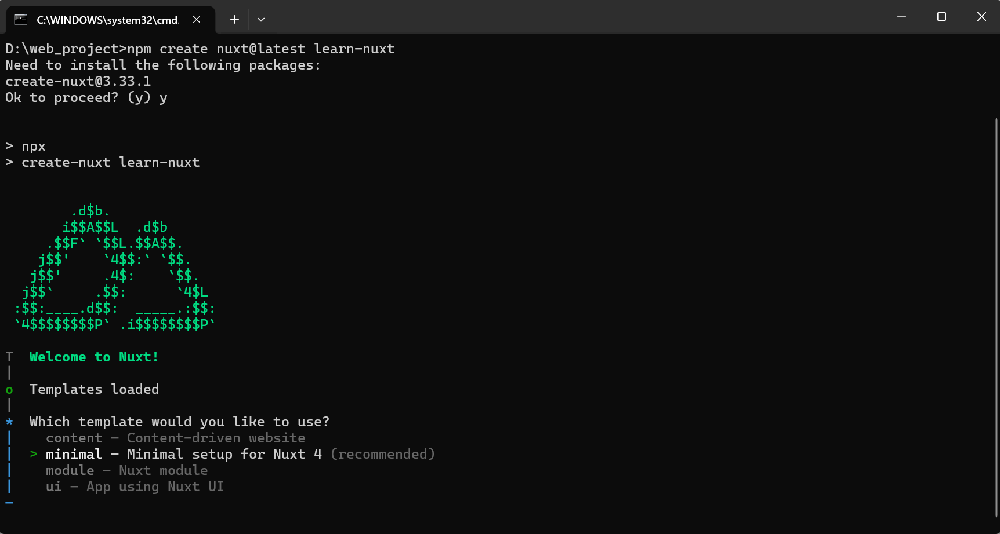
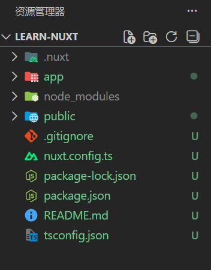
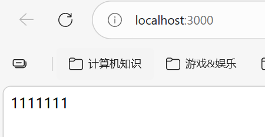
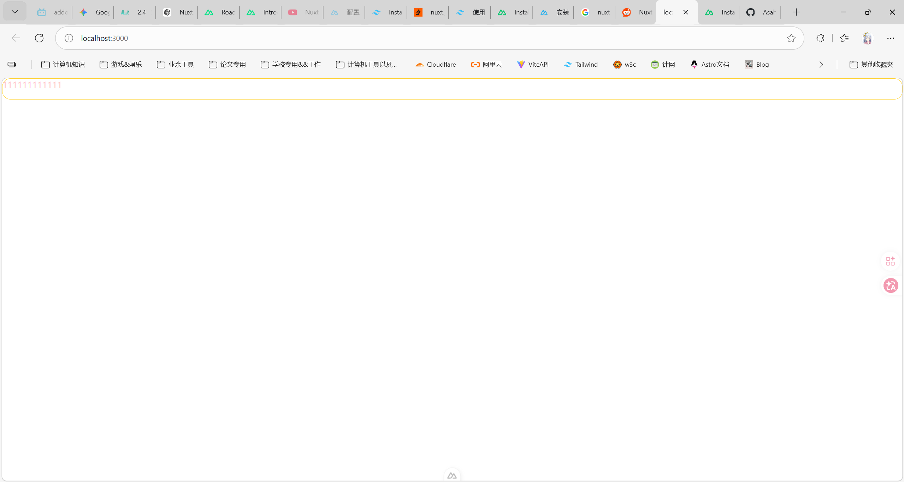
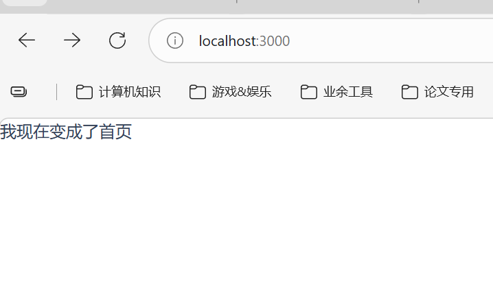
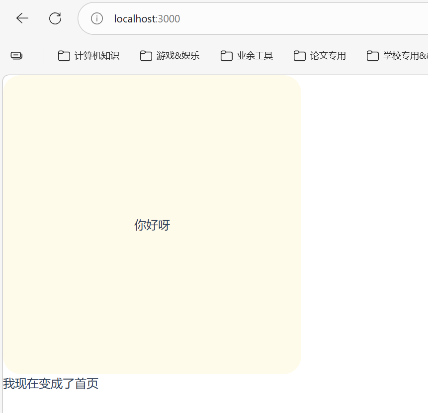
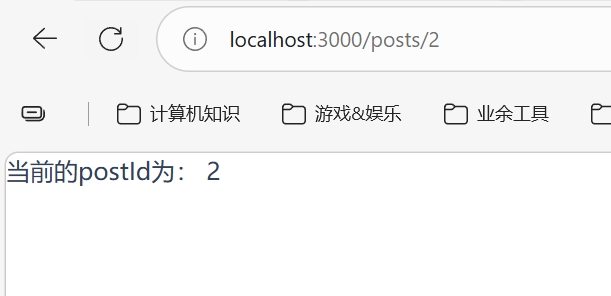

## 概念

### 安装

```bash
npm create nuxt@latest <project-name>
```

这时候会遇到一些选项：



这4个选项的意思是：
1. **minimal – Minimal setup for Nuxt 4 (recommended)**：正常的web应用，特点如下：
	- 最干净的 Nuxt 4 项目
    - 不带多余模块
    - 适合做：
	    - 普通网站
        - 后台系统
        - SaaS
        - SSR / SSG 项目
        - 全栈项目
2. **content – Content-driven website**：适合做博客 / 文档站，它会自动帮你集成：
	- `@nuxt/content`
	- Markdown 内容管理
	- 类似文档系统的结构
	一般来说适合做技术类文档和静态博客
	> 不过我觉得静态博客还是用astro就够用了，astro简直不要太棒~
3. module – Nuxt module：这是给“开发 Nuxt 插件/模块”的人用的~~（普通项目还是算了吧）~~
4. ui – App using Nuxt UI：带官方 UI 组件库（Nuxt UI），主要是它**自带UI插件，用来提升开发速度**，但是不利于我们学习底层

因此我们选择**minimal – Minimal setup for Nuxt 4 (recommended)**即可

其他的随意，因此我们创建好了一个工程，（会自动init并且install），打开工程，初始文件目录如下：



可以发现：相比于原生vue，去除掉了src文件夹，改成用app来代替

修改app.vue，即可修改主页：

```vue app.vue
<template>
  <div>
    <!-- <NuxtRouteAnnouncer />
    <NuxtWelcome /> -->
    1111111
  </div>

</template>
```

启动仍然是`npm run dev`(具体可以去package.json中查看`scripts`)



具体文件结构说明可以参考官网[Introduction · Get Started with Nuxt v4](https://nuxt.com/docs/4.x/directory-structure)

## NuxtJs中使用tailwind
### 在项目中安装Tailwind css（NuxtV4.3.1版本不可用，请移步至下面方案）

1. 下载
```bash
npm install tailwindcss @tailwindcss/vite
```
2.  在nuxt.config.ts中配置
```ts nuxt.config.ts
import tailwindcss from "@tailwindcss/vite";
export default defineNuxtConfig({
	vite: { 
		plugins: [ 
			tailwindcss(), 
		], 
	},
});
```
3. 导入tailwind css：创建一个名为`./app/assets/css/main.css` 文件，并添加一个 `@import` 来导入 Tailwind CSS。
```css main.css
@import "tailwindcss";
```
4. 全局添加 CSS 文件：将新创建的 `./app/assets/css/main.css` 添加到 `nuxt.config.ts` 文件中的 `css` 数组中。
```ts nuxt.config.ts
import tailwindcss from "@tailwindcss/vite";

export default defineNuxtConfig({
  css: ['./app/assets/css/main.css'],
});
```

此时就可以得到一个tailwind的相关工程了。

### 2026.3.1在项目中安装Tailwind css

使用NuxtUi直接安装：

```bash
npm install @nuxt/ui tailwindcss
```

然后直接在nuxt.config.ts中配置module，nuxt/ui即可：

```ts nuxt.config.ts
export default defineNuxtConfig({
  modules: ['@nuxt/ui']
})

```

最后在css中导入tailwindcss和nuxtUI即可：

```css assets/css/main.css
@import "tailwindcss";
@import "@nuxt/ui";
```

配置中添加：

```ts nuxt.config.ts
export default defineNuxtConfig({
	css: ['~/assets/css/main.css']
})
```

> 注：这一步非常重要，在nuxtV4.3.1版本中默认没有重定向，需要在`nuxt.config.ts`中配置重定向路由：
> 
> ```ts nuxt.config.ts
> import path from 'node:path'
> export default defineNuxtConfig({
> alias: {
> 	'~': path.resolve(__dirname), // 一定要配置这个重定向，不然的话nuxt工程无法识别
> },
> ```

配置好了以后就可以看到tailwindcss配置成功了，这里我简单写两句：

```css assets/css/main.css
@import 'tailwindcss';
@import "@nuxt/ui";

@utility text-test-red {
    @apply text-red-200 h-10 rounded-2xl border border-amber-300;
};
```

然后在app.vue中直接使用：

```vue App/app.vue
<template>
  <div class="text-test-red">
    111111111111
  </div>
</template>
```

可以看到：


证明tailwind配置成功~~（不得不吐槽是甜美的为什么tailwindcss V4官方那里为什么还没有修改方案？这配置起来头疼且麻烦的要死，我真的是要吐了）~~

> *addition*: 由于引入了`nuxt/ui`，这样的话会自动抓取各种ui组件，会大幅度降低运行速率，因此需要禁用它们：

```ts nuxt.config.ts
 export default defineNuxtConfig({
	ui: {
		fonts: false, 		
		colorMode: false,		
		theme: {
			transitions: false
		}
	}
})
```

### 在NuxtJs中配置tailwind css

nuxt是直接在`nuxt.config.ts`中直接配置tailwind的`options`：

```ts nuxt.config.ts
export default defineNuxtConfig({
  modules: ['@nuxtjs/tailwindcss'],
  // Defaults options
  tailwindcss: {
    cssPath: [`${assetsDir}/css/tailwind.css`, { injectPosition: "first" }],
    config: {},
    viewer: true,
    exposeConfig: false,
  }
})
```

相关配置可以查询手册[模块选项 - Nuxt 的 Tailwind CSS 模块](https://tailwindcss.nuxtjs.org/getting-started/module-options)

当然，也可以像其他的框架需要维护一份`tailwind.config.ts`文件（创建好以后放置在根目录下，具体的就需要参考tailwind的官方手册）：

```ts tailwind.config.ts
import type { Config } from 'tailwindcss'
import colors from 'tailwindcss/colors'

export default <Partial<Config>>{
    theme: {
    extend: {
      colors: {
        primary: colors.green
      }
    }
  }
}
```

## 文件路由

和astro一样，在根目录下创建`pages`文件夹，里面的.vue文件都会被当作独立的路由进行处理

> 注：我们仍然保留app目录下的app.vue，将其改成NuxtPage，这样的话才能够开启我们的page路由模式

```vue app.vue
<template>
    <div>
        <NuxtPage />
    </div>
</template>
```

然后我们就可以访问`pages`目录下的文件路径了（注：默认打开index.vue，其实这和astro一样的）

```vue pages/index.vue
<template>
    <div>我现在变成了首页</div>
</template>
```



同样的，可以在app.vue中实现页面的基础布局，比如加一个header：

```vue app/app.vue
<template>
    <div>
        <header class="w-100 h-100 text-center leading-100 bg-amber-50 rounded-3xl">
            你好呀
        </header>
        <NuxtPage />
    </div>
</template>
```

再次访问[localhost:3000/](http://localhost:3000/)，可以发现有导航栏了：



这样的话可以使用基本布局来实现app.vue统一框架
### 动态路由

其实动态路由和astro是一样的，astro中动态路由用[param].astro，接收参数由`const { param } = Astro.params;`来接收，Nuxt也是一样的，使用`$route.params.param`来接收即可

例如在`pages/posts/[postId].vue`中写下如下代码：

```vue pages/posts/[postId].vue

```

访问[localhost:3000/posts/2](http://localhost:3000/posts/2)，可以得到2




> 注：页面**必须只有一个根元素** ，才能实现页面间的[路由跳转](https://nuxt.com/docs/4.x/getting-started/transitions) 。HTML 注释也被视为元素。

比如下面3个页面，只有第一个页面是正确的：

```vue pages/page1.vue
<template>
  <div>
    <!-- This page correctly has only one single root element -->
    Page content
  </div>
</template>
```

```vue pages/page2.vue
<template>
  <!-- 由于这条注释也算作html元素，因此该页面不会出现跳转 -->
  <div>Page content</div>
</template>

```

```vue pages/page1.vue
<template>
  <div>This page</div>
  <div>Has more than one root element</div>
  <div>And will not render when route changes during client side navigation</div>
</template>
```

### 导航

NuxtJs中使用导航的话就可以实现SPA效果（他会渲染一个a标签，然后href设置为页面级路由，然后阻止a标签默认行为并且更新url，然后还在history中push上一个url），写法和vue中的router-link一样的：

```vue
 <nav>
      <ul>
        <li><NuxtLink to="/about">About</NuxtLink></li>
        <li><NuxtLink to="/posts/1">Post 1</NuxtLink></li>
        <li><NuxtLink to="/posts/2">Post 2</NuxtLink></li>
      </ul>
    </nav>
```


