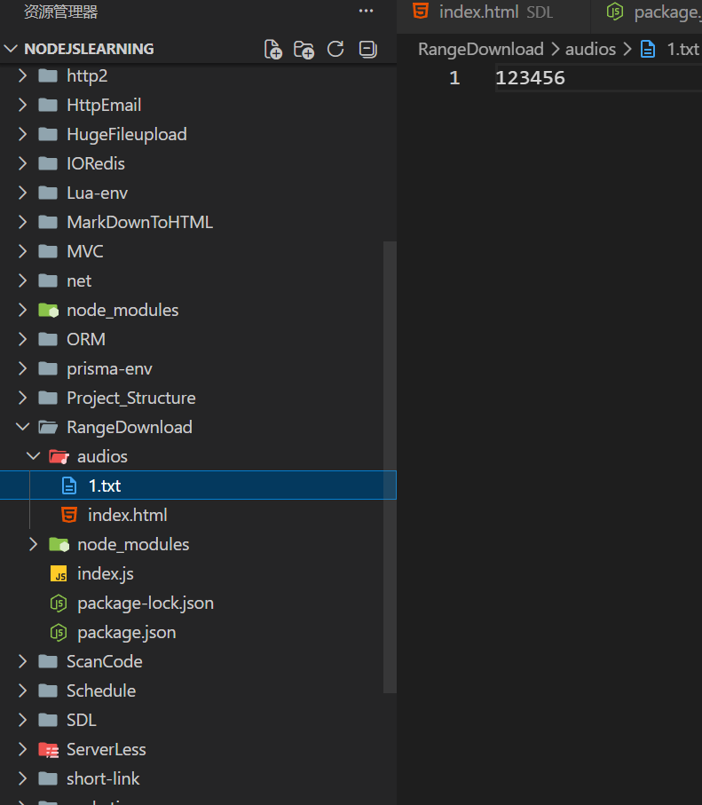
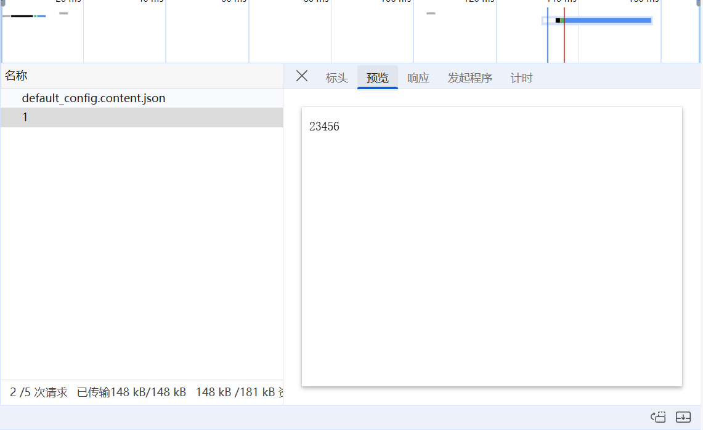
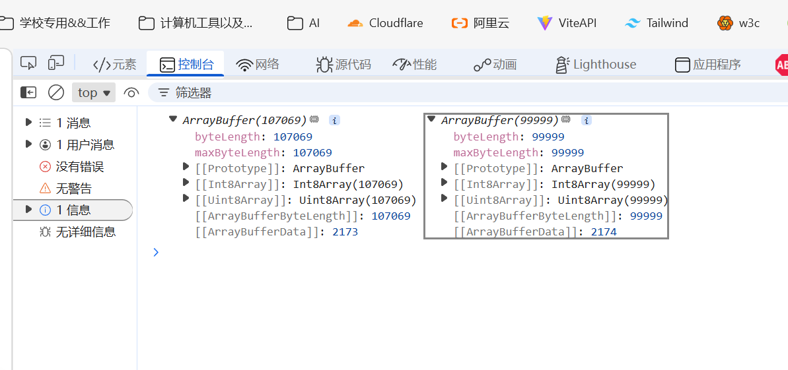
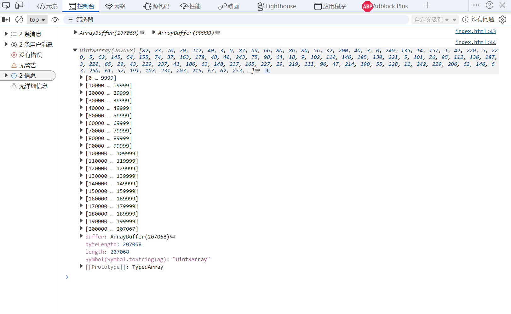
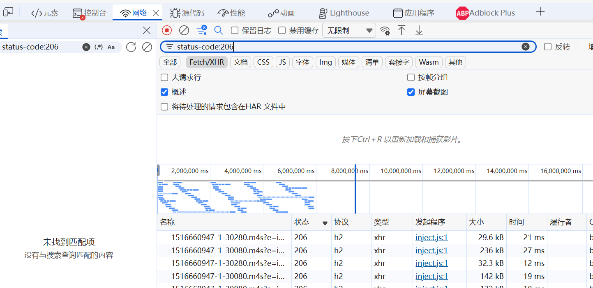

## Range标头

rage作为headers的标头，代表从源文件中截取某一段内容返回，这对于多媒体播放器来说是一个非常好用的功能（后续考虑在音频播放器中加入mv）
使用方法如下：

```http
Range: bytes=200-1000
```

就是下载 200-1000 字节的内容（两边都是闭区间），服务端返回 206 的状态码，并带上这部分内容。

可以省略右边部分，代表一直到结束：

```http
Range: bytes=200-
```

也可以省略左边部分，代表从头开始：

```http
Range: bytes=-1000
```
 `

而且可以请求多段 range，服务端会返回多段内容：

```http
Range: bytes=200-1000, 2000-6576, 19000-
```

此时起一个后端服务(暂时用文本来代替，例如1.txt，后面可以替换成audios)：

```js index.js
import express from 'express'
import cors from 'cors'
import fs from 'node:fs'
import process from 'node:process'
import path from 'node:path'

const app = express()
app.use(cors())

const audioDir = path.join(process.cwd(), 'audios')
const fileLastPrefix = '.txt'

// 得到路径，然后返回部分内容
app.get('/audios/:audioName', async (req, res) => {
    const filename = req.params.audioName
    const filePath = path.join(audioDir, filename + fileLastPrefix)

    // 计算文件总大小
    let total = fs.statSync(filePath).size

    // 如果未指定范围，则直接返回200
    const range = req.headers.range
    if (!range) {
        res.status(200).set({
            'Content-Length': total,
            'Content-Type': 'text/plain',
            'Accept-Ranges': 'bytes',
        })
        fs.createReadStream(filePath).pipe(res)
        return;
    }

    // 计算起始和终止
    let [start, end] = range.split('=')[1].split('-')
    if (!start) {
        start = 0
    } else {
        start = Number(start)
    }
    if (!end) {
        end = total - 1
    } else {
        end = Number(end)
        // 修改end
        end = end >= total ? total - 1 : end
    }

    if (end < start || start > total) {
        res.status(500)
        res.send({
            code: 1,
            message: '请求范围有误！',
            data: null
        })
    }

    // 计算总长度
    const chunkSize = end - start + 1
  
    // 读取数据流
    const readStream = fs.createReadStream(filePath, { start, end })

    res.status(206).set({
        'Content-Range': `bytes ${start}-${end}/${total}`,
        'Accept-Ranges': 'bytes',
        'Content-Length': chunkSize,
        'Content-Type': 'text/plain',
    })

    // 进行传输
    readStream.pipe(res)
})

app.listen(3000, () => {
    console.log("http://localhost:3000")
})
```

>用stream.pipe而不是res.send或者res.download的原因就是对于这种数据媒体流，就应当用stream.pipe更合适

前端随便起一个服务即可：

```html index.html
<!DOCTYPE html>
<html lang="en">
<head>
    <script src="https://www.unpkg.com/axios@1.3.5/dist/axios.min.js"></script>
</head>

<body>
    <script>
        axios.get('http://localhost:3000/audios/1', {
            headers: {
                 Range: 'bytes=1-8',
            }
        }).then((res) => {
            console.log(res.data);
        }).catch((err) => {
            console.log(err);
        })
    </script>
</body>
</html>
```

打开前端，应该访问的是`1.txt`这里面的第2个字节到第9个字节内容，而我们的1.txt只有6个字节：



因此应该返回2~6:



可以测试超出或者没有end的部分

增加获取图片的接口（写成动态推导）
可以根据**文件扩展名**或者直接根据**文件路径**去推断 MIME 类型。Node/Express 里最常见的是用 `mime-types` 这个包。

```bash
npm i mime-types
```

然后后端直接写：

```js index.js
const contentType = mime.lookup(filepath) || 'application/octet-stream'
res.status(200).set({
	'Content-Type': contentType,
})
```

这样的话就可以将我们的服务器端代码进行改造了：

```js index.js
// 得到路径，然后返回部分内容
app.get('/:mediaType/:fileName', async (req, res) => {
    // 得到的是文件名，包括后缀
    const filename = req.params.fileName
    const mediaType = req.params.mediaType

    let filePath
    if (mediaType === 'audios') {
        filePath = path.join(process.cwd(), 'audios', filename)
    } else if (mediaType === 'images') {
        filePath = path.join(process.cwd(), 'images', filename)
    } else {
        res.status(404).send('No such fileType, Please check whether you find picture or audio')
        return;
    }

    // 这里的话可以加一个判断，看看这个文件是否存在，如果不存在的话就直接返回404
    if (!fs.existsSync(filePath)) {
        res.status(404).send('File not found')
        return;
    }

    // 计算文件总大小
    let stats = fs.statSync(filePath)
    let total = stats.size

    // 根据文件后缀得到mime类型
    let contentType = mime.lookup(filePath) || 'application/octet-stream'

    // 如果未指定范围，则直接返回200
    const range = req.headers.range
    if (!range) {
        res.status(200).set({
            'Content-Length': total,
            'Content-Type': contentType,
            'Accept-Ranges': 'bytes',
        })
        fs.createReadStream(filePath).pipe(res)
        return;
    }

    // 计算起始和终止
    let [start, end] = range.split('=')[1].split('-')
    if (!start) {
        start = 0
    } else {
        start = Number(start)
    }
    if (!end) {
        end = total - 1
    } else {
        end = Number(end)

        // 修改end
        end = end >= total ? total - 1 : end
    }

    if (end < start || start > total) {
        res.status(500)
        res.send({
            code: 1,
            message: '请求范围有误！',
            data: null
        })
    }

    // 计算总长度
    const chunkSize = end - start + 1

    // 读取数据流
    const readStream = fs.createReadStream(filePath, { start, end })

    res.status(206).set({
        'Content-Range': `bytes ${start}-${end}/${total}`,
        'Accept-Ranges': 'bytes',
        'Content-Length': chunkSize,
        'Content-Type': contentType,
    })

    // 进行传输
    readStream.pipe(res)
})
```

## Array Buffer

### 介绍
由于我们的readStream.pipe传输的是字节基础单位，这里建议使用Array Buffer(这样的话更像是一块裸数据来进行操作，而不是用Blob)
具体相关API可参考MDN：[ArrayBuffer - JavaScript | MDN](https://developer.mozilla.org/zh-CN/docs/Web/JavaScript/Reference/Global_Objects/ArrayBuffer)

在前端中可以用axios中的`responseType`来定义接收到的数据类型，这里定义为`arraybuffer`，
具体代码如下：

```html index.html
<script>
	const p1 = axios.get('http://localhost:3000/images/AiPai.webp', {
		headers: {
			Range: 'bytes=0-107068'
		},
		responseType: 'arraybuffer'
	}).then(res => res.data)

	const p2 = axios.get('http://localhost:3000/images/AiPai.webp', {
		headers: {
			Range: 'bytes=107069-207068'
		},
		responseType: 'arraybuffer'
	}).then(res => res.data)
	
	Promise.all([p1, p2]).then(res => {
		const [buffer1, buffer2] = res
		console.log(buffer1, buffer2)
	})
</script>
```

打开页面：



得到了arraybuffer之后，ArrayBuffer 本身只是存储二进制数据的，要操作二进制数据要使用具体的 DataView 的子类。
比如我们想以字节的方式操作，那就是 Uint8Array 的方式（Uint 是 unsigned integer，无符号整数）：
### 相关API

Uint8Array常用构造方法：

```js 
new Uint8Array() 
new Uint8Array(length)
new Uint8Array(buffer)
new Uint8Array(buffer, byteOffset) 
new Uint8Array(buffer, byteOffset, length)
```

Uint8Array的拼接方法通常不能像普通数组那样直接concat（）
而是：

- 先算总长度
    
- 创建一个新的 `Uint8Array`
    
- 用 `set()` 把各段拷进去

示例如下：

```js
const a = new Uint8Array([1, 2, 3])
const b = new Uint8Array([4, 5, 6])

const result = new Uint8Array(a.length + b.length)
result.set(a, 0)
result.set(b, a.length)

console.log(result) // Uint8Array(6) [1, 2, 3, 4, 5, 6]
```

前端可以这么写：

```html index.html
<script>
        const p1 = axios.get('http://localhost:3000/images/AiPai.webp', {
            headers: {
                Range: 'bytes=0-107068'
            },
            responseType: 'arraybuffer'
        }).then(res => res.data)
        const p2 = axios.get('http://localhost:3000/images/AiPai.webp', {
            headers: {
                Range: 'bytes=107069-207068'
            },
            responseType: 'arraybuffer'
        }).then(res => res.data)

        Promise.all([p1, p2]).then(res => {
            const [buffer1, buffer2] = res
            // 将buffer转换成Uint8
            const UA1 = new Uint8Array(buffer1)
            const UA2 = new Uint8Array(buffer2)
            const UA = new Uint8Array(buffer1.byteLength + buffer2.byteLength)
            UA.set(UA1, 0)
            UA.set(UA2, buffer1.byteLength)

            console.log(buffer1, buffer2)
            console.log(UA)
        })
    </script>
```



> addition: 我们可以在开发者工具进行筛选过滤：
> 
> **这样的话就能够只看status为206的请求了**
> 一些常见的过滤如下：
> - has-response-header：过滤响应包含某个 header 的请求
> - method：根据 GET、POST 等请求方式过滤请求
> - domain: 根据域名过滤
> - status-code：过滤响应码是 xxx 的请求，比如 404、500 等
> - larger-than：过滤大小超过多少的请求，比如 100k，1M
> - mime-type：过滤某种 mime 类型的请求，比如 png、mp4、json、html 等
> - resource-type：根据请求分类来过滤，比如 document 文档请求，stylesheet 样式请求、fetch 请求，xhr 请求，preflight 预检请求
> - cookie-name：过滤带有某个名字的 cookie 的请求