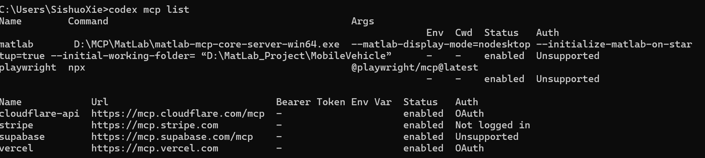
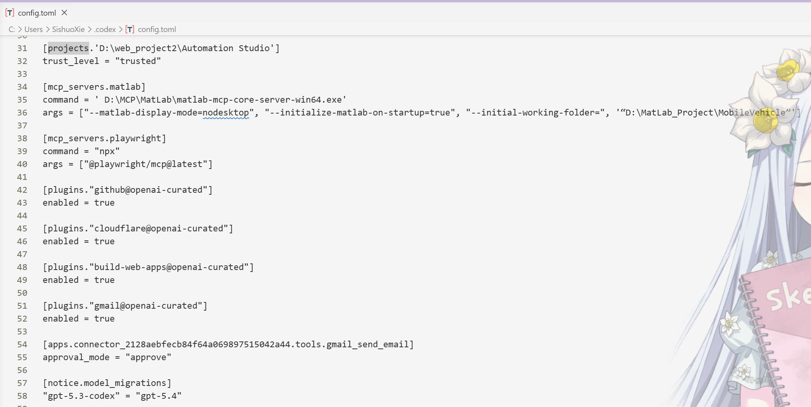

## 基础命令

首先需要知道：每个框架的查看指令不同，这里以codex举例：

查看mcp列表命令如下：

```shell
codex mcp list
```



当然，也可以直接去文件当中查看(Windows用户通常就是C:/Users/<你的用户名>/.codex/config.toml)：



## MCPSuggestions

### Playwright MCP

一台模型上下文协议（MCP）服务器，利用 [Playwright](https://playwright.dev/) 提供浏览器自动化功能。该服务器使 LLM 能够通过结构化的无障碍快照与网页交互，绕过截图或可视化模型的需求。


#### Requirements 

- Node.js 18 及以上

#### Install

标准配置如下：

```toml
{
  "mcpServers": {
    "playwright": {
      "command": "npx",
      "args": [
        "@playwright/mcp@latest"
      ]
    }
  }
}
```

codex:

```shell
codex mcp add playwright npx "@playwright/mcp@latest"
```

claude code的话直接将上面命令中的codex改成claude

###


