## 准备工作 

安装依赖：

```bash
npm install ali-oss --save 
```

然后需要配置项（配置项建议放入alioss_properties.js这个文档中）:

```js alioss_properties.js
const aliOssConfig = {
    region: 'oss-cn-hangzhou',
    accessKeyId: '<access-key-id>',
    accessKeySecret: '<access-key-secret>',
    bucket: '<bucket-name>',
};

export default aliOssConfig
```

这个配置要点开存储桶，然后概览：

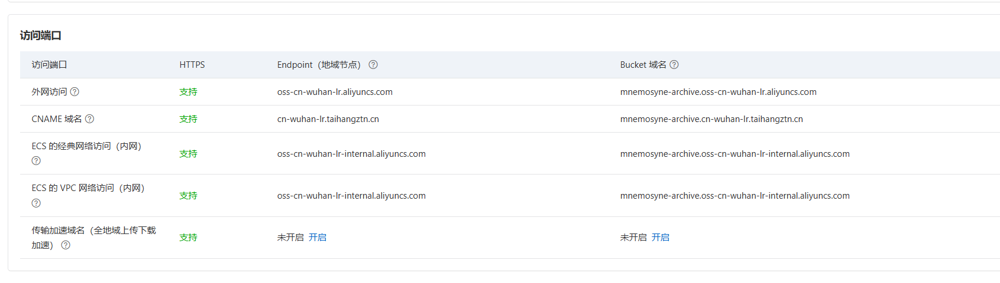

然后accessKey去这里：

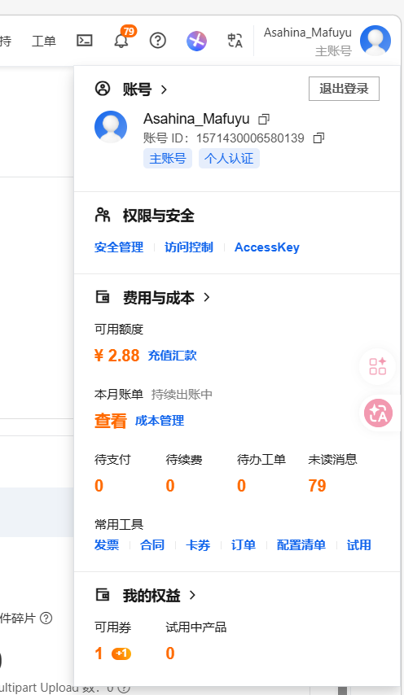


然后忽略，点击继续使用云账号accessKey，然后创建，得到如下结果：

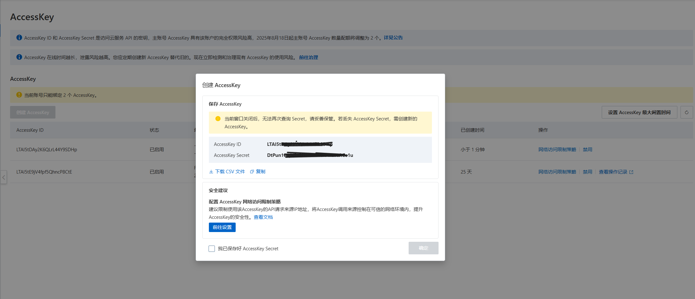

粘贴进去即可

bucketname就填对应桶的名称即可：

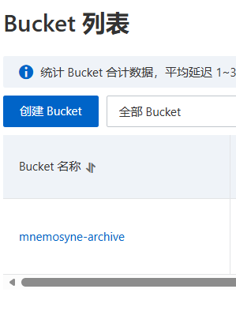

创建我们的主后端服务aliyunoss.js
相关api文档请参考[OSS Node.js SDK-对象存储-阿里云](https://help.aliyun.com/zh/oss/developer-reference/nodejs-sdk/?spm=a2c4g.11186623.help-menu-31815.d_1_1_10.14221e4eaccyk9&scm=20140722.H_32067._.OR_help-T_cn~zh-V_1)

```js aliyunoss.js
import OSS from "ali-oss";
import aliOssConfig from './alioss_properties.js'
import path from "node:path"

const client = new OSS(aliOssConfig)

// 使用put上传文件
const key = 'nodejs-upload-images/KamisatoAyaka.jpg' // 存放在oss当中的完整路径
const localFilePath = path.join(process.cwd(), 'images', 'KamisatoAyaka.jpg') // 本地文件的完整路径

client.put(key, localFilePath) // 可以配置配置项，详见https://help.aliyun.com/zh/oss/developer-reference/nodejs-sdk/?spm=a2c4g.11186623.help-menu-31815.d_1_1_10.14221e4eaccyk9&scm=20140722.H_32067._.OR_help-T_cn~zh-V_1#2ba0518da0g6p
.then(res => {
    console.log(res)
})
```

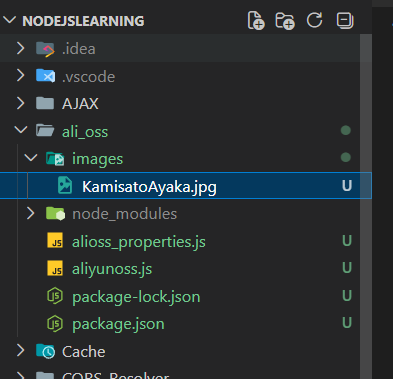

执行，可以看到确实有结果：

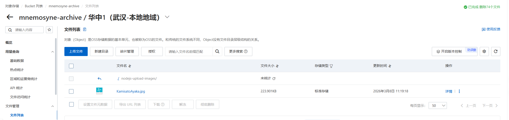

下载也是一样的

```js
// 下载
const storagePath = path.join(process.cwd(), 'images', 'newKamisatoAyaka.jpg')
client.get(key, storagePath).then(res => {
    console.log(res)
})
```

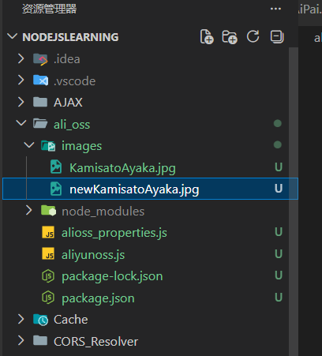

删除最简单：

```js
client.delete(key).then(res => {
    console.log(res)
})
```

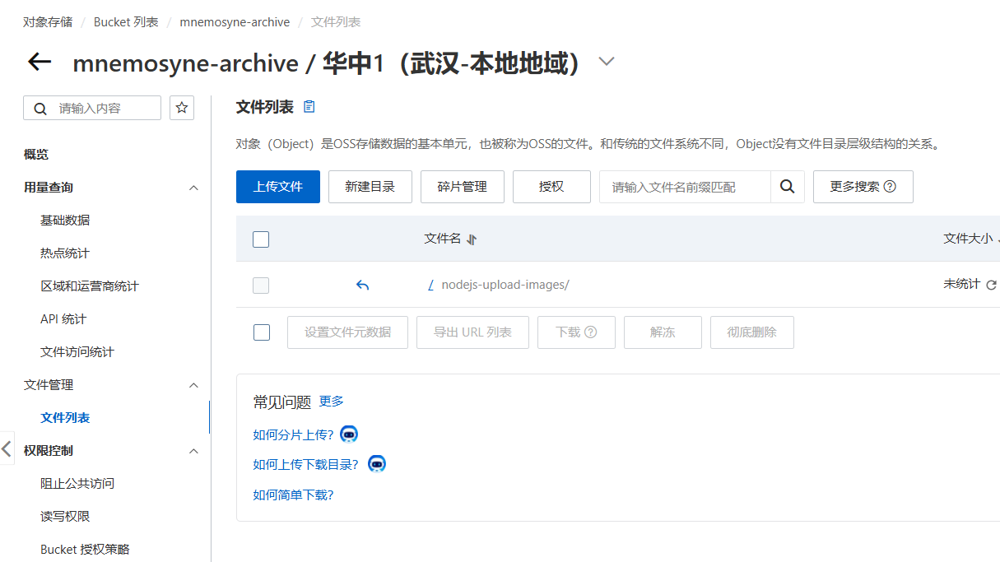

## OSS第三方签名

### 准备工作

首先需要安装依赖

```bash
npm i express cors
```

然后需要在OSS中设置跨域设置：

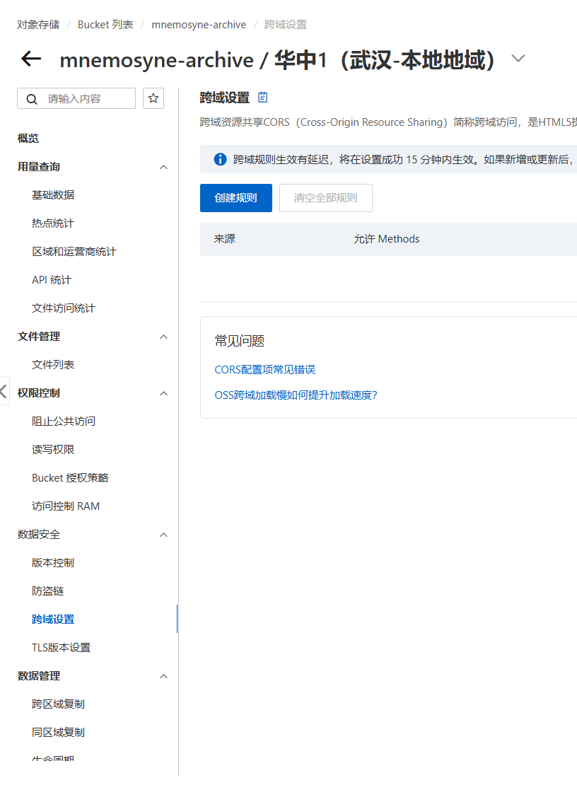

创建规则，可以根据业务自行设置，这里做演示，所以简单设置一下：

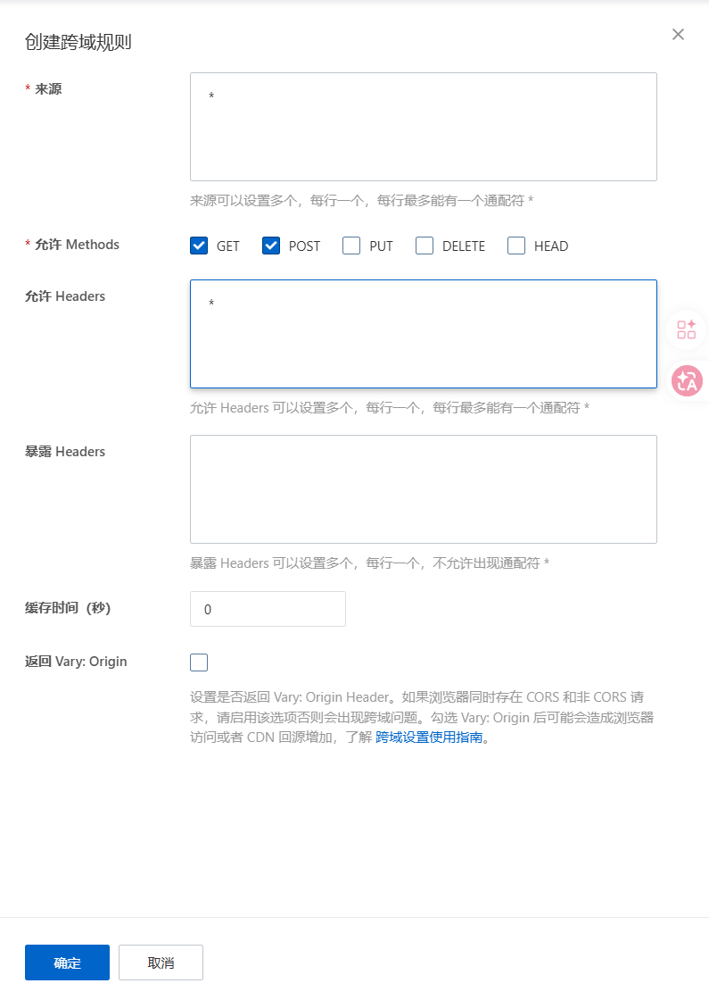


官方文档关于签名：[使用服务端签名实现带上传回调的Web端直传-对象存储-阿里云](https://help.aliyun.com/zh/oss/user-guide/python-1?spm=a2c4g.11186623.0.0.15db5d03oLk0cl)
后端的话就可以给前端返回一个证书，前端可以直接通过这个签名来对存储桶进行对象操作
```js
// 简单提供一个接口，用来给前端获取签名，前端可以使用这个签名直接上传文件到OSS
app.get('/', (req, res) => {
    // 返回签名 密钥 政策等等
    const date = new Date();
    date.setDate(date.getDate() + 1);
    const policy = {
        expiration: date.toISOString(),//设置签名日期
        conditions: [
            ['content-length-range', 0, 1048576000], //设置文件大小限制
        ]
    }
    const formData = client.calculatePostSignature(policy)

    // 请求的地址
    const host = `http://${aliOssConfig.bucket}.${aliOssConfig.region}.aliyuncs.com`

    // 返回给前端
    res.json({
        host, // 返回请求地址
        policy: formData.policy, // 返回签名的policy
        OSSAccessKeyId: formData.OSSAccessKeyId, // 返回accessKeyId
        signature: formData.Signature // 返回签名
    })
})
```

前端代码如下：

```html index.html
<!DOCTYPE html>
<html lang="en">
	<head>
	    <meta charset="UTF-8">
	    <meta name="viewport" content="width=device-width, initial-scale=1.0">
	    <title>Document</title>
	</head>
	
	<body>
	    <input id="upload" type="file">
	    <script>
	        const uploadFile = document.getElementById('upload')
	        let params;
	        
	        // 读取密钥
	        fetch('http://localhost:3000/').then(res => res.json()).then(data => {
	            params = data
	        })
	
	        // 一旦有文件上传，那么就可以向云端发起服务了
	        uploadFile.addEventListener('change', (e) => {
	            const file = e.target.files[0]
	
	            // 创建一个formData,并且添加密钥啥的
	            let formData = new FormData();
	            formData.append('key', `front-end-images/${file.name}`) // 文件名称当成存储路径
	            formData.append('policy', params.policy)
	            formData.append('OSSAccessKeyId', params.OSSAccessKeyId)
	            formData.append('success_action_status', 200)
	            formData.append('signature', params.signature)
	            formData.append('file', file)
	
	            // 对params.host发起请求
	            fetch(params.host, {
	                method: 'POST',
	                body: formData
	            })
	        })
	    </script>
	</body>
</html>
```

完整后端代码如下：

```js 
import OSS from "ali-oss";
import aliOssConfig from './alioss_properties.js'
import path from "node:path"
import express from 'express'
import cors from 'cors'

const client = new OSS(aliOssConfig)
const app = express()

app.use(cors())

// 简单提供一个接口，用来给前端获取签名，前端可以使用这个签名直接上传文件到OSS
app.get('/', (req, res) => {
    // 返回签名 密钥 政策等等
    const date = new Date();
    date.setDate(date.getDate() + 1);
    const policy = {
        expiration: date.toISOString(),//设置签名日期
        conditions: [
            ['content-length-range', 0, 1048576000], //设置文件大小限制
        ]
    }
    const formData = client.calculatePostSignature(policy)

    // 请求的地址
    const host = `http://${aliOssConfig.bucket}.${aliOssConfig.region}.aliyuncs.com`

    // 返回给前端
    res.json({
        host, // 返回请求地址
        policy: formData.policy, // 返回签名的policy
        OSSAccessKeyId: formData.OSSAccessKeyId, // 返回accessKeyId
        signature: formData.Signature // 返回签名
    })
})

app.listen(3000, () => {
    console.log("http://localhost:3000")
})

// // 使用put上传文件
// const key = 'nodejs-upload-images/KamisatoAyaka.jpg' // 存放在oss当中的完整路径
// const localFilePath = path.join(process.cwd(), 'images', 'KamisatoAyaka.jpg') // 本地文件的完整路径

// client.put(key, localFilePath) // 可以配置配置项，详见https://help.aliyun.com/zh/oss/developer-reference/nodejs-sdk/?spm=a2c4g.11186623.help-menu-31815.d_1_1_10.14221e4eaccyk9&scm=20140722.H_32067._.OR_help-T_cn~zh-V_1#2ba0518da0g6p
// .then(res => {
//     console.log(res)
// })

// // 下载
// const storagePath = path.join(process.cwd(), 'images', 'newKamisatoAyaka.jpg')
// client.get(key, storagePath).then(res => {
//     console.log(res)
// })

// // 删除
// client.delete(key).then(res => {
//     console.log(res)
// })
```


此时打开前端上传图片：

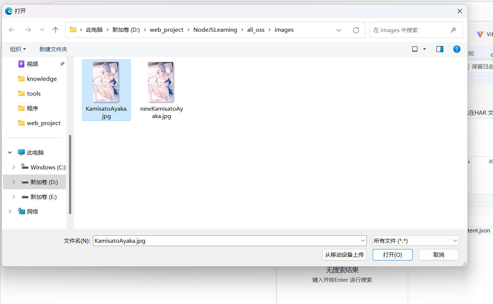

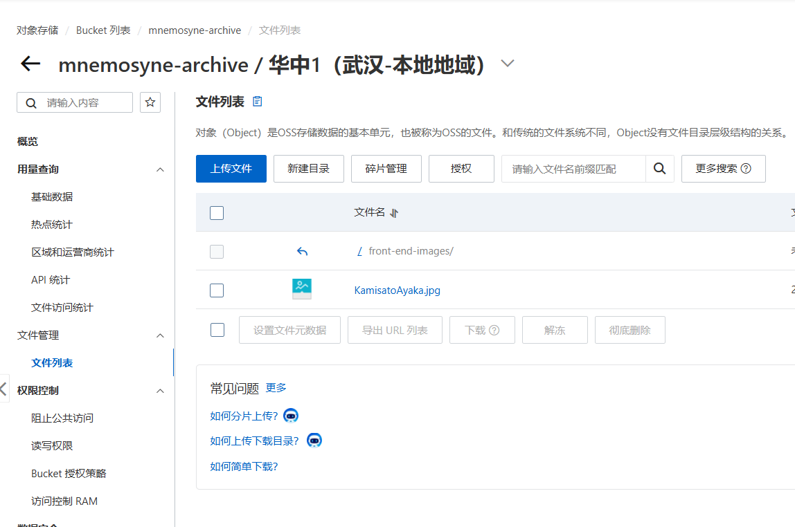

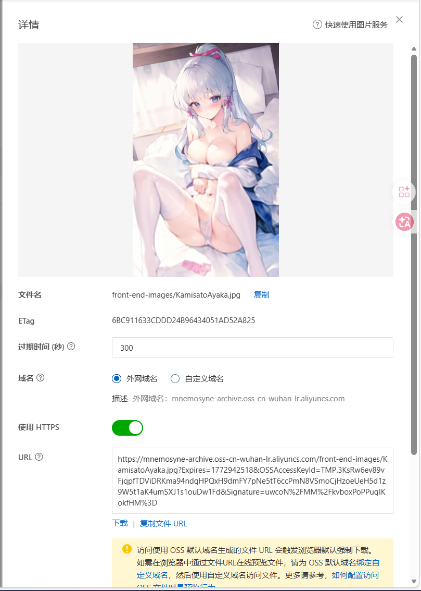

并且可以发现：只有最初请求签名部署的时候请求了后端，后面每一次upload的时候都没有向后端请求：

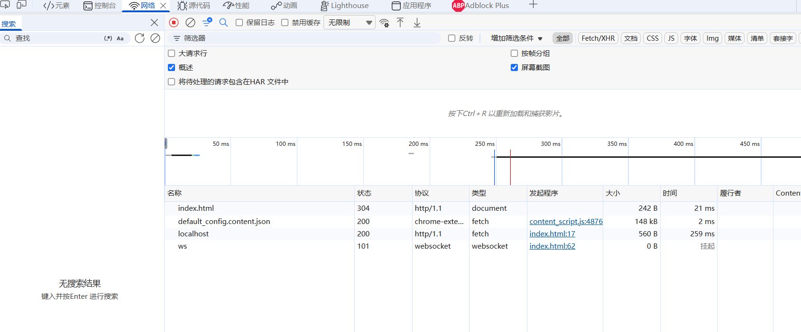

> 所以这种前端上传，后端颁布签名的好处也挺多的，比如后面上传图片完全不需要经过后端处理，直接用签名证书即可

*原图在这里：  
https://mnemosyne-archive.oss-cn-wuhan-lr.aliyuncs.com/front-end-images/KamisatoAyaka.jpg?Expires=1772942855&OSSAccessKeyId=TMP.3KsRw6ev89vFjqpfTDViDRKma94ndqHPQxH9dmFY7pNe5tT6ccPmN8VSmoCjHzoeUeH5d1z9W5t1aK4umSXJ1s1ouDw1Fd&Signature=4SLdMowc13XQUahq8C0oGBR8TjA%3D*


