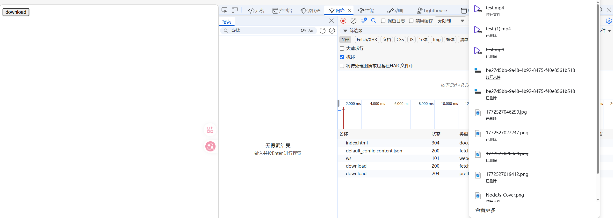
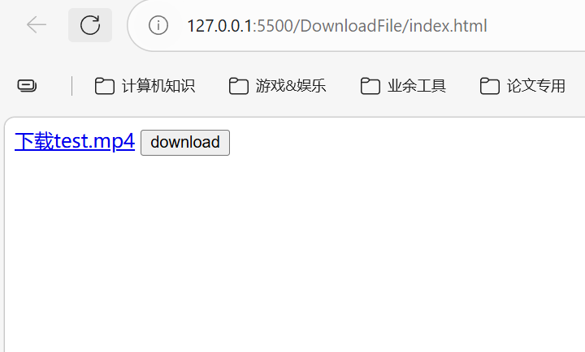
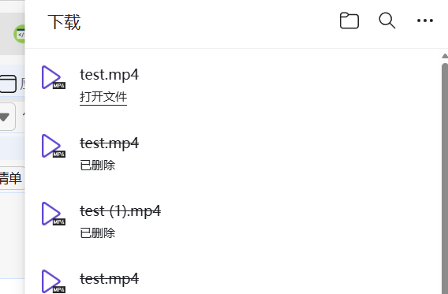

## 前言

首先安装依赖：

```bash
npm i express cors
```

### HTTP响应头解析

**`Content-Disposition`** 响应标头指示回复的内容该以何种形式展示，是以_内联_的形式（即网页或者页面的一部分），还是以_附件_的形式下载并保存到本地。

#### 作为消息主体的标头

在 HTTP 场景中，第一个参数或者是 `inline`（默认值，表示回复中的消息体会以页面的一部分或者整个页面的形式展示），或者是 `attachment`（意味着消息体应该被下载到本地；大多数浏览器会呈现一个“保存为”的对话框，将 `filename` 的值预填为下载后的文件名，假如它存在的话）。

```http
Content-Disposition: inline
Content-Disposition: attachment
Content-Disposition: attachment; filename="filename.jpg"
```

#### 作为多部分主体的标头

当使用 `multipart/form-data` 格式提交表单数据时，每个子部分（例如每个表单字段和任何与字段数据相关的文件）都需要提供一个 `Content-Disposition` 标头，以提供相关信息。标头的第一个指令始终为 `form-data`，并且还_必须_包含一个 `name` 参数来标识相关字段。额外的指令不区分大小写，并使用带引号的字符串语法在 `=` 号后面指定参数。多个参数之间使用分号（`;`）分隔。

```http
Content-Disposition: form-data; name="fieldName"
Content-Disposition: form-data; name="fieldName"; filename="filename.jpg"
```

> 拓展：前端实现下载某一个文件：
>```js
 function downloadUrl(url, filename) {
	 const a = document.createElement('a')
	  a.href = url
	  a.download = filename || ''
	  a.rel = 'noopener'
	  document.body.appendChild(a)
	  a.click()
	  a.remove()
}
// 用法
downloadUrl('/files/report.pdf', 'report.pdf')
> ```

## 实例

前端代码如下：

```html
<!DOCTYPE html>

<html lang="en">
<head>
    <meta charset="UTF-8">
    <meta name="viewport" content="width=device-width, initial-scale=1.0">
    <title>Document</title>
</head>
<body>
    <button id="btn">download</button>
    <script>
        const btn = document.getElementById('btn')
        btn.addEventListener('click', () => {
            fetch('http://localhost:3000/download', {
                method: 'POST',
                body: JSON.stringify({
                    fileName: 'test.mp4'
                }),
                headers: {
                    'Content-Type': 'application/json'
                }
            }).then(res => {
                return res.arrayBuffer()
            }).then(res => {
                // 1. 转成blob
                const blob = new Blob([res], {type: 'video/mp4'})
                // 2. 转成url
                const url = URL.createObjectURL(blob)
                // 创建a标签挂载Url 模拟点击
                const a = document.createElement('a')
                a.href = url
                a.download = 'test.mp4'
                a.click()
            })
        })
    </script>
</body>
</html>
```

后端服务器代码如下：

```js
import express from 'express'
import cors from 'cors'
import fs from 'node:fs'
import path from 'node:path'

const app = express()
app.use(cors())
app.use(express.json())

app.post('/download', (req, res) => {
    const fileName = req.body.fileName
    const filePath = path.join(process.cwd(), 'static', fileName) // 拼接路径
    const content = fs.readFileSync(filePath)
    // 两个响应头：Content-Type 和 Content-Disposition
    res.setHeader('Content-Type', 'application/octet-stream') // octet-stream表示二进制流的意思
    res.setHeader('Content-Disposition', `attachment;filename=${fileName}`) // attachment会将文件作为一个附件去进行下载
    res.send(content)
})

app.listen(3000, () => {
    console.log("http://localhost:3000")
})
```

前端测试，没问题：




## 纯粹使用attach进行实现

如果只用后端返回来的attach进行文件下载的话，前端的话就直接用href请求（**可以是按钮内部点击创造a标签，也可以是纯粹的a标签，取决于是想动态生成还是静态**），这里我们就用a标签来演示，前端代码如下：

```html 
<!DOCTYPE html>
<html lang="en">
	<head>
	    <meta charset="UTF-8">
	    <meta name="viewport" content="width=device-width, initial-scale=1.0">
	    <title>Document</title>
	</head>
	<body>
	    <a href="http://localhost:3000/download?filename=test.mp4" target="_blank">下载test.mp4</a>
    </body>
</html>
```

非常简单的GET请求链接，然后后端直接返回文件流即可（由于绑定了文件名，因此的话前端下载了也会有默认解析格式）：

```js
app.get('/download', (req, res) => {
    const { filename } = req.query
    
    // 下面的和之前一样
    const filePath = path.join(process.cwd(), 'static', filename) // 拼接路径
    const content = fs.readFileSync(filePath)

    // 两个响应头：Content-Type 和 Content-Disposition
    res.setHeader('Content-Type', 'application/octet-stream') // octet-stream表示二进制流的意思
    res.setHeader('Content-Disposition', `attachment;filename=${filename}`) // attachment会将文件作为一个附件去进行下载
    res.send(content)
})
```

后端服务一启动，然后测试：





这样做是最推荐的，省去了又转换一遍的功夫