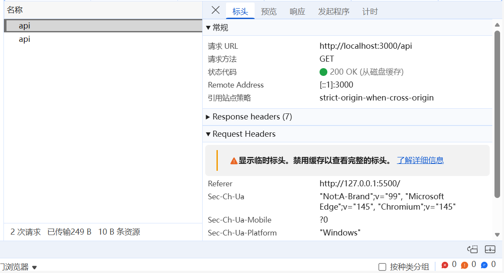
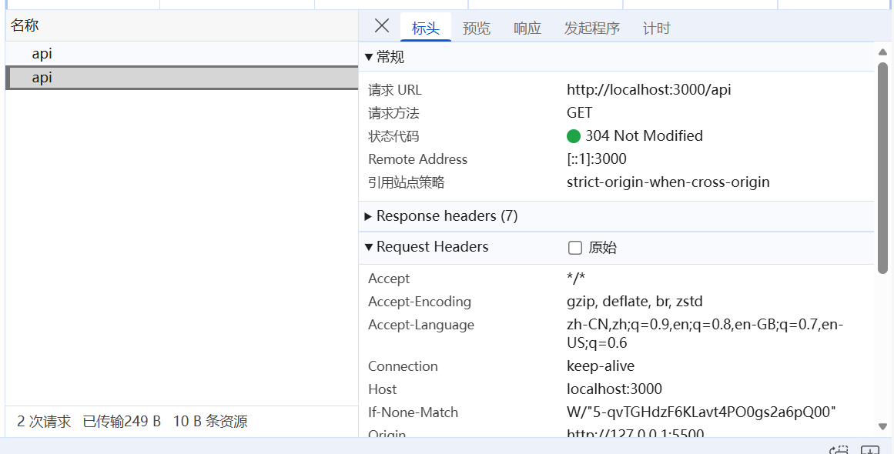
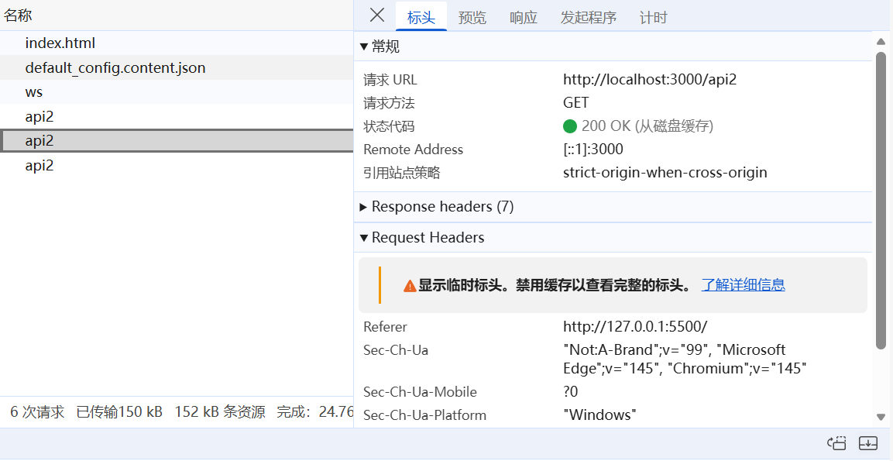
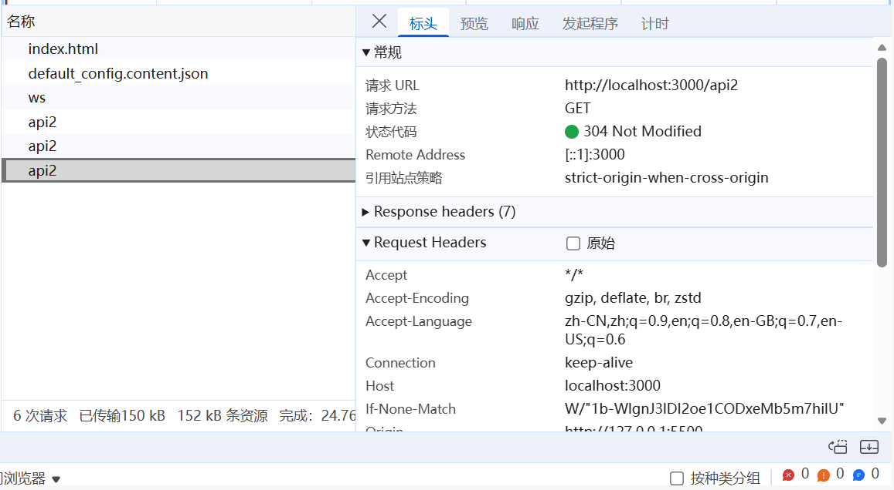

## http缓存

HTTP 缓存主要分为两大类：`强缓存和协商缓存`。这两种缓存都通过 HTTP 响应头来控制，目的是提高网站性能。

## 强缓存

强缓存之后则不需要向服务器发送请求，而是从浏览器缓存读取分为（`内存缓存`）| （`硬盘缓存`）

1. memory cache(内存缓存) 内存缓存存储在浏览器内存当中，一般刷新网页的时候会发现很多内存缓存
    
2. disk cache(硬盘缓存) 硬盘缓存是存储在计算机硬盘中，空间大，但是读取效率比内存缓存慢

### Expires 强缓存

Expires: 该字段指定响应的到期时间，即资源不再被视为有效的日期和时间。它是一个 HTTP 1.0 的头部字段，但仍然被一些客户端和服务器使用。

Expires 的判断机制是：当客户端请求资源时，会获取本地时间戳，然后`拿本地时间戳与 Expires 设置的时间做对比`，如果对比成功，走强缓存，对比失败，则对服务器发起请求。

安装依赖：

```bash
npm i express cors
```

后端代码：

```js index.js
import express from 'express'
import cors from 'cors'
import fs from 'node:fs'
import crypto from 'node:crypto'

const app = express()
app.use(cors())
// 处理静态资源
// 常年不变的
app.use(express.static('./static', {
    maxAge: 1000 * 60 * 5,
    lastModified: true
}))

// 动态资源缓存
// Expires 强缓存
app.get('/api', (req, res) => {
    res.setHeader('Expires', new Date('2026-3-3 18:03:30').toUTCString()) // 设置过期的时间戳
    res.send('hello')
})

app.listen(3000, () => {
    console.log("http://localhost:3000")
})
```

前端代码：

```html index.html
<!DOCTYPE html>
<html lang="en">
<head>
    <meta charset="UTF-8">
    <meta name="viewport" content="width=device-width, initial-scale=1.0">
    <title>Document</title>
</head>
<body>
    <button id="btn">send</button>
    <script>
        const btn = document.getElementById('btn')
        btn.addEventListener('click', () => {
            fetch("http://localhost:3000/api")
        })
    </script>
</body>
</html>
```

调用了一次后就是强缓存：



稍等片刻，点击send以后，就没有缓存了：



### Cache-Control 强缓存

Cache-Control 的值如下：

- `max-age`：浏览器资源缓存的时长(秒)。
- `no-cache`：不走强缓存，**走协商缓存**。
- `no-store`：禁止任何缓存策略。
- `public`：资源即可以被浏览器缓存也可以被代理服务器缓存(CDN)。
- `private`：资源只能被客户端缓存。

```js
// Cache-Control 强缓存
app.get('/api2', (req, res) => {
    res.setHeader('Cache-Control', 'public, max-age=10') // 缓存10s
    res.send('你好伙计，我想是的')
})
```

可以看到：






> *304其实就是协商缓存*，且如果同时设置了Expires和Cache-Control，优先级max-age高

## 协商缓存

详见[Nodejs 第六十章（http缓存） 掘金](https://juejin.cn/post/7352079402055909388#heading-4)
