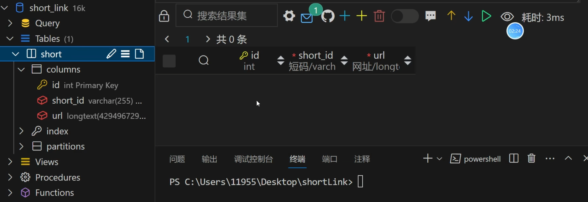
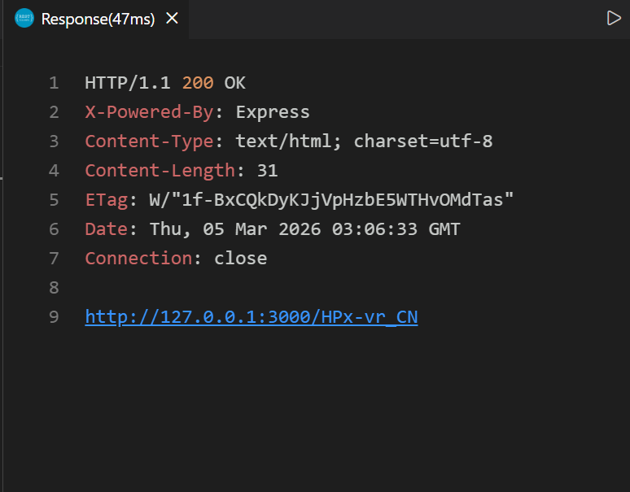
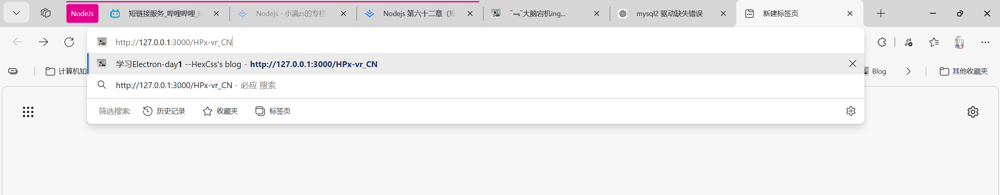
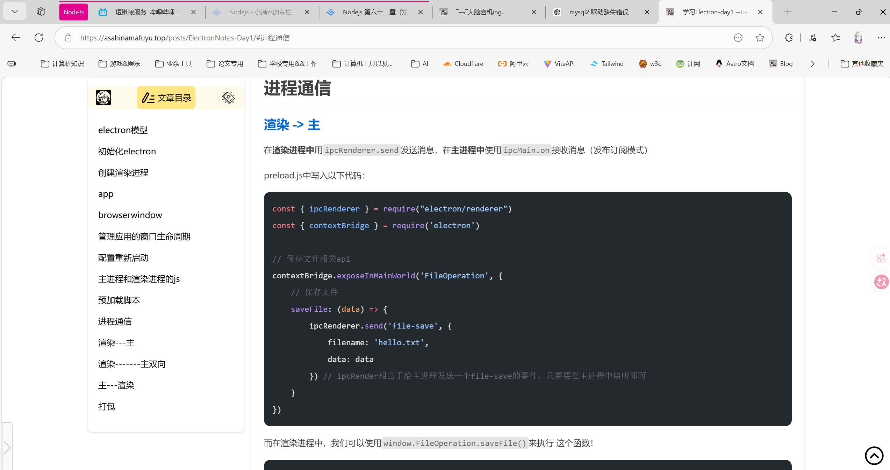

## 安装依赖

```bash
npm i express knex shortid mysql2
```

创建数据库，并且建一张表`short`



```sql
CREATE TABLE short(  
    id int NOT NULL PRIMARY KEY AUTO_INCREMENT COMMENT 'Primary Key',
    short_id VARCHAR(100) COMMENT '短码',
    url VARCHAR(255) COMMENT '网址'
) COMMENT '短链查询表';
```

连接数据库，后端服务可以这么写：

```js index.js
import express from 'express'
import knex from 'knex'
import shortid from 'shortid'

const db = knex({
    client: 'mysql2',
    connection: {
        host: '127.0.0.1',
        user: 'root', // 填你数据库的user
        password: 'HexCssBlog, // 填你自己的密码
        database: 'shortLink'
    }
})

const app = express()

app.use(express.json()) // 启动json，否则的话无法正确的读取body中的json数据

// 1. 接口创建短链
app.post('/create_url', async (req, res) => {
    const short_id = shortid.generate()
    const url = req.body.url
    await db('short').insert({
        short_id, url
    })
    res.send(`http://127.0.0.1:3000/${short_id}`)
})

// 2. get请求获取到短码然后重定向到目标地址
app.get('/:short_id', async (req, res) => {
    const short_id = req.params.short_id
    // 通过short_id去数据库查询
    const result = await db('short').select('url').where({short_id})
    if(result && result[0]){
        res.redirect(result[0].url)
    }else {
        res.send('短链有问题')
    }
})

app.listen(3000, () => {
    console.log("http://localhost:3000")
})
```

创建一个`index.http`的请求文件，内容如下：

```http index.http
POST http://localhost:3000/create_url HTTP/1.1
Content-Type: application.json

{
    "url": "https://asahinamafuyu.top/posts/ElectronNotes-Day1/#%E8%BF%9B%E7%A8%8B%E9%80%9A%E4%BF%A1" 
}
```

先把后端服务启动

```bash
nodemon index.js
```

发送请求，可以得到：



点开这个链接，就重定向到相关的页面当中去了：






 


