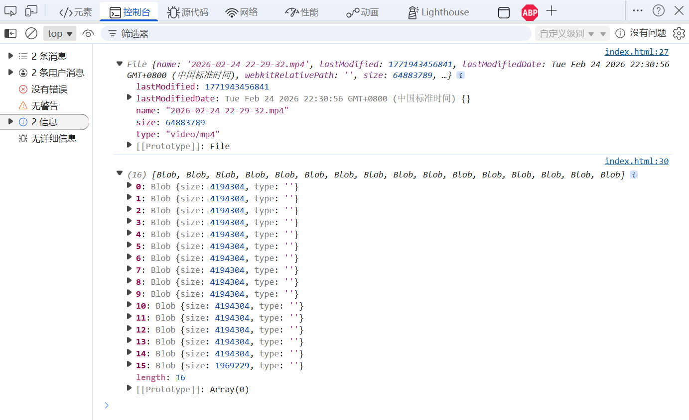
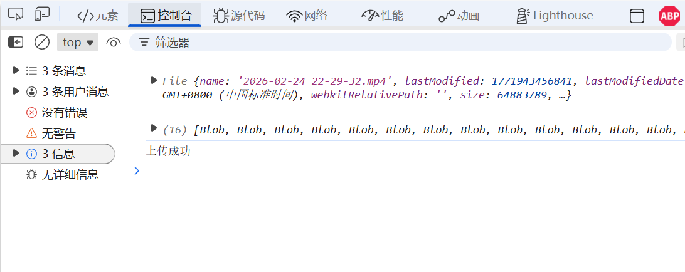
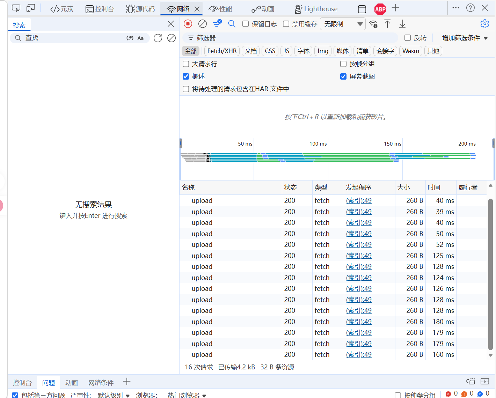
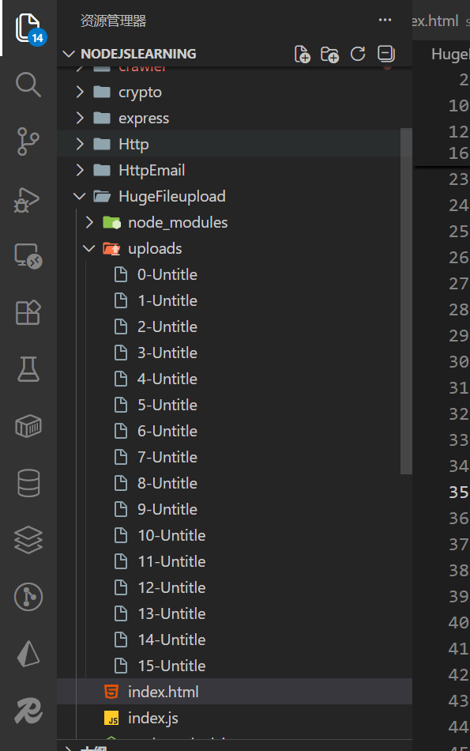
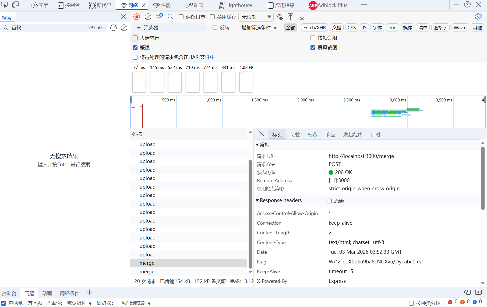
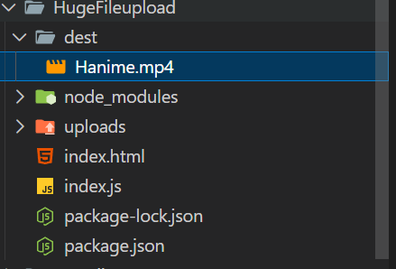

## 前言

大文件上传的话，如果不设置断点续传或者切分成小的传输片段的话，一旦文件中途暂停或者上传失败，那么很容易造成整个文件重新上传的这种情况，这也是我们不希望看到的，因此就有了这篇文章。

## NodeJs实现

安装依赖如下：

1. express 帮我们启动服务，并且提供接口
2. multer 读取文件，存储
3. cors 解决跨域

```bash
npm i express multer cors
```

先构建前端：

```html index.html
<!DOCTYPE html>
<html lang="en">
<head>
    <meta charset="UTF-8">
    <meta name="viewport" content="width=device-width, initial-scale=1.0">
    <title>Document</title>
</head>

<body>
    <input id="file" type="file">
    <script>
        const inputFile = document.getElementById('file')
        // 对数组进行拆分
        const chunkFn = (file, size = 1024 * 1024 * 4) => {
            // 默认切割大小为4MB
            const chunks = []
            for (let i = 0; i < file.size; i += size) {
                chunks.push(file.slice(i, i + size))
            }
            return chunks
        }
        // 通过change事件来拿到这个文件
        inputFile.addEventListener('change', (e) => {
            const file = e.target.files[0] // file上传对象
            console.log(file)  
            // file 对象底层是继承于blob对象的，需要slice方法进行切割
            const chunks = chunkFn(file)
            console.log(chunks)
        })
    </script>
</body>
</html>
```

然后放入一个61MB的文件测试一下：



这样的话可以添加批量上传函数（写完以后直接在`inputFile.addEventListener`的回调函数末尾调用`uploadFiles(chunks)`即可）

```js
// 批量上传
const uploadFiles = (chunks) => {
	// 1.批量上传 Promise.all[请求，请求，... , 请求]
	// 2. 请求需要用formData的方式进行上传
	const list = []
	for (let i = 0; i < chunks.length; i++) {
		const formData = new FormData()
		// 创建一个标识
		formData.append('index', i)
		formData.append('filename', 'Untitle')
		formData.append('file', chunks[i]) // 一定要写在最后面
		
		// 存入到list当中
		list.push(fetch('http://localhost:3000/upload', {
			method: 'POST',
			body: formData
		}))
	}

	// 通过Promise.all
	Promise.all(list).then(res => {
		console.log('上传成功')
	})
}
```

> 如果`formData.append('file', chunks[i])`写在前面的话，那么当multer读取到file的时候，就不会再继续读取后面的数据了，因此`formData.append('file', chunks[i])`一定要写在最后面

再来编写服务端

```ts index.ts
import express from 'express'; // 提供服务
import multer from 'multer' // 上传文件处理
import cors from 'cors' // 解决跨域
import fs from 'node:fs' // 文件操作
import path from 'node:path' // 文件路径操作

// 1. 初始化upload
// 首先编写storage的相关配置信息
const storage = multer.diskStorage({
    destination: function (req, res, cb) {
        cb(null, './uploads/') // 每个切片存储到uploads目录下面
    },
    filename(req, file, cb) {
        cb(null, `${req.body.index}-${req.body.filename}`) // 我们传过来的req.body也就是单个切片的数据，里面有index，有filename，有file
    }
})

const upload = multer({ storage })

const app = express()

// 支持跨域
app.use(cors())
app.use(express.json())

app.post('/upload', upload.single('file'), (req, res) => {
    // 注：upload.single('file')中的'file'要和前端中的 formData.append('file', chunks[i])中的'file'名称一定要对的上
    res.send('ok')
})

app.listen(3000, () => {
    console.log('http://localhost:3000')
})
```

使用nodemon启动服务：

```bash
nodemon index.js
```

上传文件后可以发现上传以后会刷新，则需要用http-server启动前端服务：

```bash
npm install http-server -g
```

然后在项目的根目录下打开cmd，启动：

```bash
http-server
```

它会给出url，点击访问即可，然后再来测试：





查看后端：



可以发现：文件成功上传到后端，也是没问题的

### 合并文件

等文件上传成功以后，需要前端通知后端：文件上传完毕，可以进行合并文件操作了

```js
// 合并文件
// 注意：前端需要传递POST请求，并且body中有fileName这个属性
app.post('/merge', (req, res) => {
    const uploadDir = path.join(process.cwd(), 'uploads')
    const dirs = fs.readdirSync(uploadDir) // 注意：此时读取的文件是乱序的，需要进行排序,dirs也就是一个数组，里面存放的是uploads目录下的文件名
    dirs.sort((a, b) => a.split('-')[0]-b.split('-')[0]) // 通过序号排
    // 排好了以后分别读取即可
    // 使用目标路径
    const dest = path.join(process.cwd(), 'dest' , `${req.body.fileName}.mp4`)
    let buffer = ''
    dirs.forEach(file => {
        fs.appendFileSync(dest, fs.readFileSync(path.join(uploadDir, file))) // appendFileSync也就是往dest文件里追加
        // 而readFileSync则读取每一个片段的数据
        fs.unlinkSync(path.join(uploadDir, file)) // 当合完以后该文件没有用了，可以直接删掉了
    })
    res.send('ok')
})
```

前端通知的话就发起一个fetch请求即可：

```js
// 通过Promise.all
Promise.all(list).then(res => {
	// 通知后端合并文件
	fetch('http://localhost:3000/merge', {
		method: 'POST',
		headers: {
			'Content-Type': 'application/json'
		},
		body: JSON.stringify({
			fileName: 'Hanime'
		})
	})
})
```

测试一下：





> 对于多用户的话，那肯定要存储不同的用户的id作为目录，并且还有时间戳，这样的话就可以做到分区

> 拓展：断点续传又该怎么写呢？