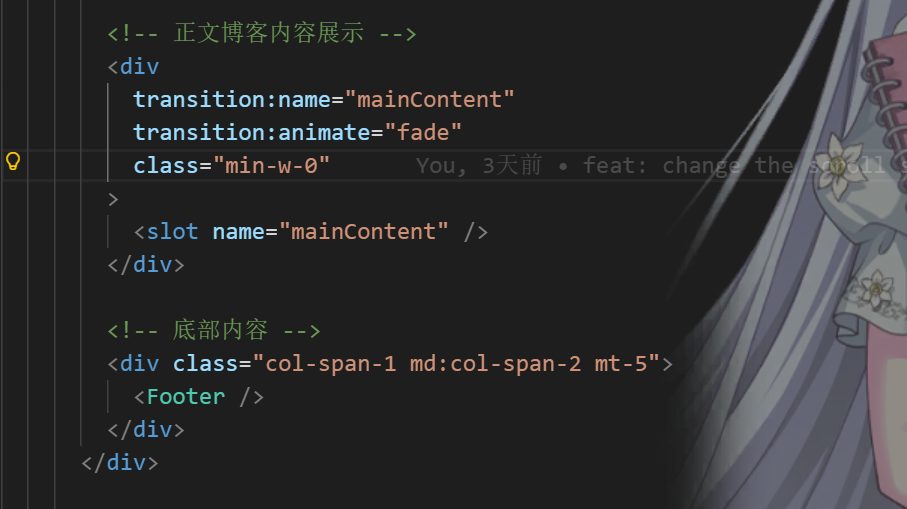

首先关于Astro中路由变化中，如果给body做了transition，那么这个过渡动画还会遮挡其他persist组件（该动画优先级不清楚，反正特别高）,例如我在博客内容中添加过渡：




可以看到这个过渡会有很明显的遮挡，去掉这两行代码（也就是关掉过渡）：

```html
         <div
          class="min-w-0"
        >
```

## 播放器设计逻辑

