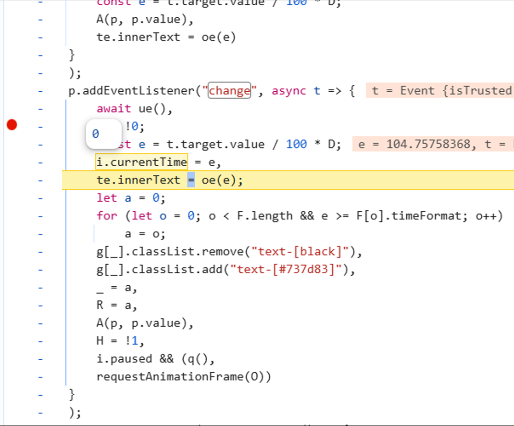
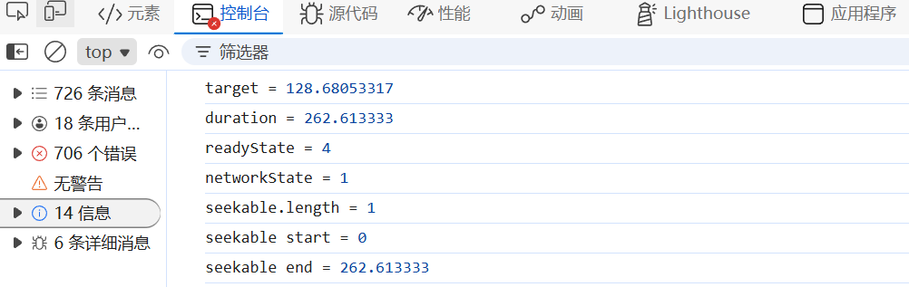
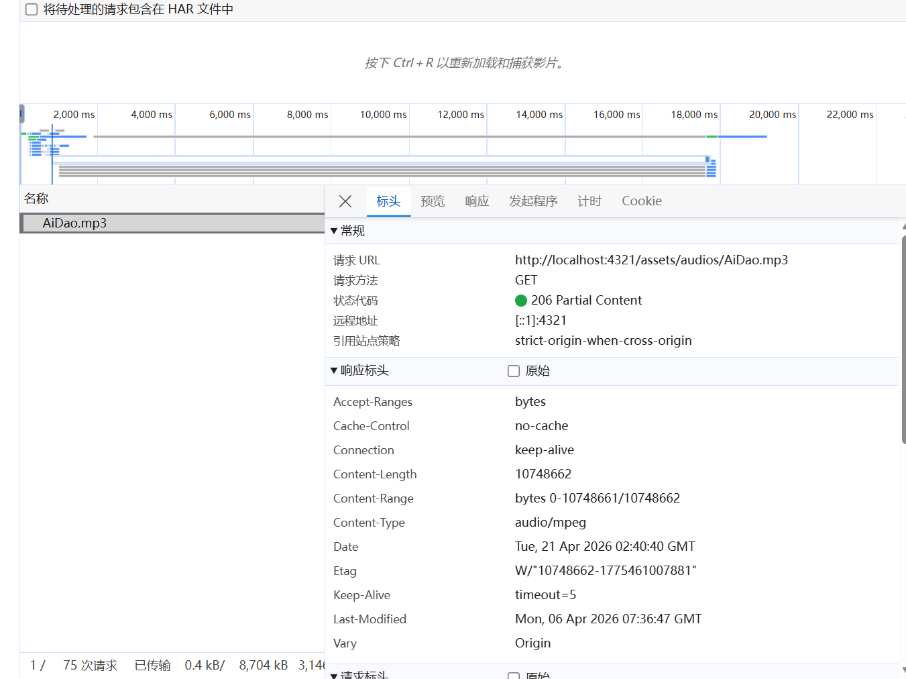
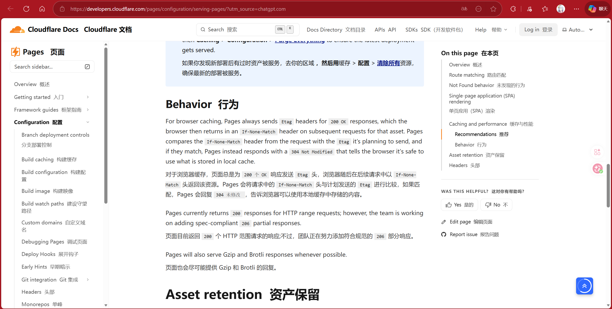
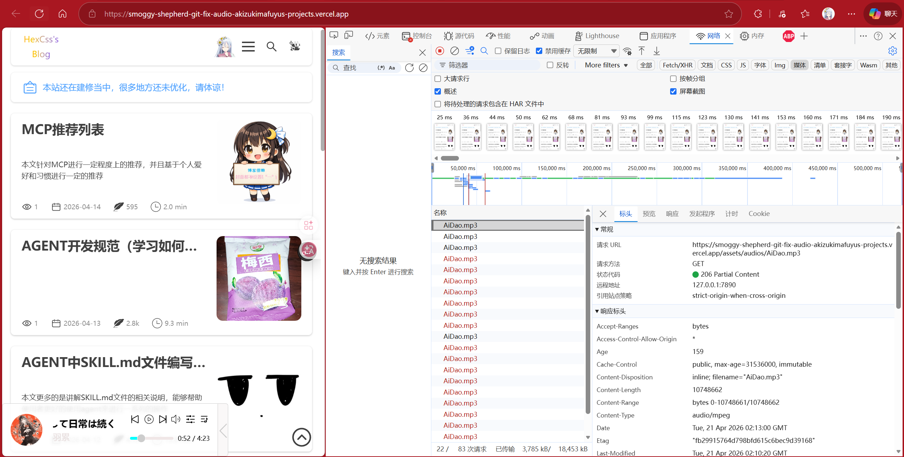
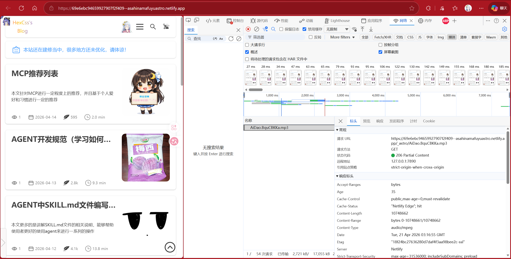

## 前言

这个问题最早需要追朔到2月份的时候，那会儿开发完音频播放器就一直有这个问题：**为什么我的音乐播放器在本地开发环境的时候可以拖动进度条，而在生产环境（也就是部署到cloudflare的时候），每次拖动进度条都会直接重置音频播放进度**，这个问题一直困扰到我现在，我当时也只是认为要么是js绑定变量的问题，要么就是异步冲突等等，于是一直搁浅，直到有了今天的这篇文章

## 病灶

### 如何发现病灶

没办法，前端人员不可能不学习调试工具，于是在学习了devTool调试js以后，我发现了一个很严重的问题：当我本地想要对音频的currentTime进行赋值的时候，是完全可行的，而在CF部署上却始终不行：




很显然，这个赋值是有问题的，那么为什么赋值赋不上去呢？此时我开始寻找线索，一开始以为是小数精准度或者数据类型的问题，但是也不对，后面AI才告诉我：有没有可能是无法seek的原因？

### Seek

于是我添加了相关调试代码：

```js
 console.log('target =', current_time);
	console.log('duration =', audio_entity.duration);
	console.log('readyState =', audio_entity.readyState);
	console.log('networkState =', audio_entity.networkState);
	console.log('seekable.length =', audio_entity.seekable.length);
	if (audio_entity.seekable.length > 0) {
		console.log('seekable start =', audio_entity.seekable.start(0));
		console.log('seekable end =', audio_entity.seekable.end(0));
}
```

打印台结果如下：

```js
target = 110.3
duration = 262.613333 
readyState = 4 
networkState = 1 
seekable.length = 1 
seekable start = 0 
seekable end = 0
```

可以看到确实是seekable start和end都为0

而开发环境的，确实是没问题：



也就是说：**生产环境的无法seek**

为什么无法seek呢？此时我再去检查一下network层面：


在cf中，读取音频返回的是状态码200，而在本地中返回的却是206：



关于206部分可以查看我之前写的博客: [PartialRes](/posts/LearnPartialContentInAudio)

那为什么200状态码就不会有seek，而206状态码能够有seek呢？这里就要说到seek的一个机制：

当加载媒体资源供 [`<audio>`](https://developer.mozilla.org/en-US/docs/Web/HTML/Reference/Elements/audio) 或 [`<video>`](https://developer.mozilla.org/en-US/docs/Web/HTML/Reference/Elements/video) 元素使用时，**`TimeRanges`** 接口用于表示已缓冲的媒体资源时间范围、已播放的时间范围以及可寻求的时间范围。而很多浏览器/播放器在处理 `<audio>` / `<video>` 拖动时，**会优先依赖 `Content-Range` 来确认当前响应对应的字节区间**。

- **206 Partial Content** 响应里通常有  
    `Content-Range: bytes start-end/total`
- **200 OK** 响应里通常**没有** `Content-Range`

比如206响应：

```http
HTTP/1.1 206 Partial Content
Content-Range: bytes 0-1023/9115072
Content-Length: 1024
Accept-Ranges: bytes
```

也就是说：解析206响应中的total才能够赋值给seek
## CF响应机制

既然知道了原因是因为响应状态码是200而不是206，因此无法获取到相对应的seek信息，那么为什么会造成这种情况的呢？

原因是cf的响应机制，cf官方文档就曾说过：**对于浏览器缓存，页面总是为 `200 个 OK` 响应发送 `Etag` 头，浏览器随后在后续请求中以 `If-None-Match` 头返回该资源。Pages 会将请求中的 `If-None-Match` 头与计划发送的 `Etag` 进行比较，如果匹配，Pages 会回复 `304 未修改` ，告诉浏览器可以使用本地缓存中存储的内容。**



因此**如果是对于媒体资源，不建议将静态资源中的媒体资源托管到cf上（如果要使用206状态码的话）**，那么其他部署可以吗？（vercel或者netlify）

首先vercel是可以的：



返回的确确实实是206，且进度条也确实可以seek



上图中是Netlify所部署的结果，因此可以发现：大部分都可以支持，除了CF不支持

## 解决方法

解决方法也有，上面的话就是直接将源文件部署到Netlify或者Vercel当中去，不过如果硬是要使用CF的话，也不是不行：

第一次获取到结果的时候，可以直接将结果保存为本地资源路径：

```js
async function loadAudio() {
	// 直接fetch得了
	const audioUrl = await fetch(AudioList[getPlayAudioFileName()])
	.then(res => res.blob())
	.then(data => {
		const objUrl = URL.createObjectURL(data);
		return objUrl;
	});

	// 首先需要清理一下之前的url对象
	if (PlayingAudioUrl) {
		URL.revokeObjectURL(PlayingAudioUrl);
	}
	PlayingAudioUrl = audioUrl;
    }
```

