## 概述

### 关于vite

vite构建工具的入口文件时index.html：


而webpack是main.ts

### src

src下的main.tsx:

```tsx main.tsx
import { StrictMode } from 'react'
import { createRoot } from 'react-dom/client'
import './index.css'
import App from './App.tsx'

createRoot(document.getElementById('root')!).render(
  <StrictMode>
    <App />
  </StrictMode>,
)
```

> `document.getElementById('root')!`后的!是非空断言，证明一定能够读到

将App组件挂载到root下，而root就是Index.html中的：

```html index.html
<!doctype html>
<html lang="en">
  <head>
    <meta charset="UTF-8" />
    <link rel="icon" type="image/svg+xml" href="/vite.svg" />
    <meta name="viewport" content="width=device-width, initial-scale=1.0" />
    <title>demo1</title>
  </head>

  <body>
    <div id="root"></div>
    <script type="module" src="/src/main.tsx"></script>
  </body>
</html>
```

public目录下的东西打完包以后是直接存放到根目录下的：比如public/vite.svg，是可以直接通过[localhost:5173/vite.svg](http://localhost:5173/vite.svg)访问的：


打包完以后：


可以看到确实在根目录下

而assets中的资源文件会进行预处理

### JSX和TSX

jsx是js的语法扩展，允许在js中编写html代码。

例如：`const fn = () => <div>小满是谁？没听说过</div>`

vue中使用双括号，react中使用{ }：

```tsx 
function App() { 
	const num: number = 333 
	const fn = () => 'test' 
	return (
		 <> 
			 {'11' /** 字符串用法 */} 
			 {num /** 变量用法 */} 
			 {fn() /** 函数用法 */} 
			 {new Date().getTime() /** 日期用法 */} 
		 </> 
	 ) 
 }
```

如果是对象，一定要做序列化才行：

```tsx
function App() {
  const obj = {
    name: '中华第一剑'
  }
  return (
    <>
      <div>{ JSON.stringify(obj) }</div>
    </>
  )
}
```


#### 事件添加

使用onClick进行事件的绑定添加:

```tsx
function App() {
  const fn = () => {
    console.log('hello sekai')
  }

  return (
    <>
      <div onClick={fn}>点击我打印hello sekai</div>
    </>
  )
}
```


如果是需要进行传参，则使用高阶函数：

```tsx
function App() {
  const fn = (params:string) => {
    console.log(params)
  }

  return (
    <>
      <div onClick={() => fn('hello sekai')}>点击我打印hello sekai</div>
    </>
  )
}
```


关于泛型冲突，由于泛型是\<T\>, 这在tsx语法中很容易理解成html中的标签，因此正常写泛型语法会跟tsx语法冲突，他会把泛型理解成是一个元素，解决方案后面加一个,即：

```tsx
function App() {
  const value: string = '中华第一剑'
  const fn = <T,>(params:T) => {
    console.log(params)
  }

  return (
    <>
      <div onClick={() => fn(value)}>{value}</div>
    </>
  )
}
```


但是绑定style或者属性可以用对象绑定：

```tsx
//绑定样式style 
function App() { 
	const styles = { 
		color: 'red' 
	}
	return ( 
	<> 
		<div style={styles}>test</div> 
	</> 
	) 
}
```

#### v-html类似写法以及遍历dom元素

tsx渲染html代码片段用到dangerouslySetInnerHTML：

```tsx
function App() {
  const innerHtml: string = '<div>渲染出来的中华第一剑</div>'
  return (
    <>
      <div dangerouslySetInnerHTML={{ __html: innerHtml }}>
        {/* 注意：中间不能有内容，不然不会进行渲染 */}
      </div>
    </>
  )
}
```


遍历使用map：

```tsx
function App() {
  const arr = [1, 2 ,3,4,5]
  return (
    <>
      <div>
        {arr.map((item) => (
          <h1 key={item}>{item}</h1>
        ))}
      </div>
    </>
  )
}
```


## 工具

### babel

详细可见[Babel | react docs](https://message163.github.io/react-docs/react/tools/babel.html)

### swc

SWC 既可用于编译，也可用于打包。对于编译，它使用现代 JavaScript 功能获取 JavaScript / TypeScript 文件并输出所有主流浏览器支持的有效代码。
**`SWC在单线程上比 Babel 快 20 倍，在四核上快 70 倍。`**

## 虚拟DOM

### fiber

为了解决React15在大组件更新时产生的卡顿现象，React团队提出了 Fiber 架构，并在 React16 发布，将 同步递归无法中断的更新 重构为 异步的可中断更新

它实现了4个具体目标

1. 可中断的渲染：Fiber 允许将大的渲染任务拆分成多个小的工作单元（Unit of Work），使得 React 可以在空闲时间执行这些小任务。当浏览器需要处理更高优先级的任务时（如用户输入、动画），可以暂停渲染，先处理这些任务，然后再恢复未完成的渲染工作。
    
2. 优先级调度：在 Fiber 架构下，React 可以根据不同任务的优先级决定何时更新哪些部分。React 会优先更新用户可感知的部分（如动画、用户输入），而低优先级的任务（如数据加载后的界面更新）可以延后执行。
    
3. 双缓存树（Fiber Tree）：Fiber 架构中有两棵 Fiber 树——current fiber tree（当前正在渲染的 Fiber 树）和 work in progress fiber tree（正在处理的 Fiber 树）。React 使用这两棵树来保存更新前后的状态，从而更高效地进行比较和更新。
    
4. 任务切片：在浏览器的空闲时间内（利用 requestIdleCallback思想），React 可以将渲染任务拆分成多个小片段，逐步完成 Fiber 树的构建，避免一次性完成所有渲染任务导致的阻塞。

首先理解浏览器每一帧要做什么：


> 👉 任务切片的目的不是减少帧数，而是：让每一帧都不超过 16ms
> 从而：
> ✔ 保持 60fps  
> ✔ 避免卡顿  
> ✔ 提升交互流畅度

而且任务是分三次执行，但是渲染也渲染了三次，也就是动画也是60帧，不存在3帧才渲染一次

fiber Tree

fiber tree是长成这样的：


具体点就是：


手绘一下逻辑关系就是：


> 这个过程也是一个深度优先的算法

`oldFiber` 的本质可以先一句话理解成：

**“旧 fiber 树里，当前这个父节点的某一个旧子节点”**。  

let oldFiber = fiber.alternate && fiber.alternate.child;

意思是：

- `fiber`：当前正在构建的新 fiber 节点
- `fiber.alternate`：它对应的“上一轮渲染时的旧 fiber 节点”
- `fiber.alternate.child`：这个旧 fiber 节点的第一个旧子节点

所以 `oldFiber` 一开始拿到的是：

**旧树中，与当前父 fiber 对应的那一串旧 children 的起点。**

细节代码如下：

```js
// jsx通过babel或者swc转换成js代码，最终会调用React.createElement方法创建虚拟DOM对象
const React = {
    createElement(type, props, ...children) {
        return {
            type,
            props: {
                ...props,
                children: children.map(child => {
                    if (typeof child === 'object') {
                        return child;
                    } else {
                        return React.createTextElement(child);
                    }
                }

                )
            },
        };
    },

    createTextElement(text) {
        return {
            type: 'TEXT_ELEMENT',

            props: {

                nodeValue: text,

                children: [],

            },

  

        }

    }

}

  

// const text = document.createTextNode('');

// text.nodeValue = '思考认知'

  
  

const vdom = React.createElement('div', { id: 'container' }, React.createElement('h1', null, '小谢'));

  

// 完成虚拟DOM转fiber树的过程

  

let nextUnitOfWork = null; //下一个工作单元

let wipRoot = null; // 当前正在工作的fiber树的根节点

let currentRoot = null; //旧的fiber树的根节点

let deletions = null; //需要删除的fiber节点

  

// render函数接收虚拟DOM对象和容器节点，创建一个新的fiber树，并将新的fiber树的根节点赋值给wipRoot变量

function render(element, container) {

    // 初始化fiber树

    wipRoot = {

        dom: container, //容器节点

        props: {

            children: [element], //将虚拟DOM对象作为子节点

        },

        alternate: currentRoot, //旧的fiber树的根节点

    }

  

    deletions = []

  

    //将新的fiber树的根节点赋值给nextUnitOfWork变量，开始工作

    nextUnitOfWork = wipRoot;

}

  

// fiber树的结构

function workloop(deadline) {

    let shouldYield = false; //是否需要暂停工作

    // 如果有下一个工作单元，并且不需要暂停工作，就继续工作

    while (nextUnitOfWork && !shouldYield) {

        // 执行工作单元,返回下一个工作单元

        nextUnitOfWork = performUnitOfWork(nextUnitOfWork);

  

        // 获取当前帧剩余的时间，如果剩余时间小于1ms，就需要暂停工作，等待下一帧再继续工作

        shouldYield = deadline.timeRemaining() < 1; // timeRemaining方法返回当前帧剩余的时间，单位是毫秒，如果返回值小于1，说明当前帧已经没有剩余时间了，需要暂停工作，等待下一帧再继续工作

    }

  

    // 如果没有下一个工作单元并且还有待提交的工作根，就提交工作

    if (!nextUnitOfWork && wipRoot) {

        commitRoot();

    }

  

    // requestIdleCallback会在浏览器空闲时执行回调函数，回调函数会接收一个deadline对象，

    // deadline对象有一个timeRemaining方法，可以获取当前帧剩余的时间，如果timeRemaining方法返回0，

    // 说明当前帧已经没有剩余时间了，需要暂停工作，等待下一帧再继续工作

    requestIdleCallback(workloop)

}

  

// 创建DOM节点

function createDom(fiber) {

    // 每一个fiber都有type和props属性

    // 如果当前的type是'TEXT_ELEMENT'，那么就创建一个文本节点

    const dom = fiber.type === 'TEXT_ELEMENT' ? document.createTextNode('') : document.createElement(fiber.type);

  

    // 将props中的属性赋值给dom节点

    updateDom(dom, {}, fiber.props); // 挂载新属性

  

    return dom;

}

  

// 更新DOM节点的属性

// 封装成函数是因为后面需要用到diff算法来比较新旧虚拟DOM树的差异

function updateDom(dom, prevProps, nextProps) {

    // 删除旧的属性

    Object.keys(prevProps).forEach(key => {

        if (key === 'children') {

            return;

        } else {

            dom[key] = ''; // 删除属性

        }

    })

  

    // 添加新的属性

    Object.keys(nextProps).forEach(key => {

        if (key === 'children') {

            return;

        } else {

            dom[key] = nextProps[key];

        }

    })

}

  

// requestIdleCallback会在浏览器空闲时执行回调函数，

// 回调函数会接收一个deadline对象，deadline对象有一个timeRemaining方法，可以获取当前帧剩余的时间，

// 如果timeRemaining方法返回0，说明当前帧已经没有剩余时间了，需要暂停工作，等待下一帧再继续工作

requestIdleCallback(workloop)

  

// 执行工作单元，返回下一个工作单元

function performUnitOfWork(fiber) {

    // 如果当前fiber没有dom节点，就创建一个dom节点

    if (!fiber.dom) {

        fiber.dom = createDom(fiber);

    }

  
  

    // 读取子节点

    const elements = fiber.props.children;

  

    // 遍历子节点，创建子fiber

    reconcileChildren(fiber, elements);

  

    // 如果是父fiber有子fiber，就返回第一个子fiber作为下一个工作单元

    if (fiber.child) {

        return fiber.child;

    }

    // 如果没有子fiber，就返回兄弟fiber作为下一个工作单元

    let nextFiber = fiber;

    while (nextFiber) {

  

        if (nextFiber.sibling) {

            return nextFiber.sibling;

        }

        // 如果没有兄弟fiber，就返回父fiber的兄弟fiber作为下一个工作单元

        nextFiber = nextFiber.parent;

    }

  

    // 遍历完成，没有下一个工作单元了，返回null

    return null;

}

  

function createFiber(element, parent) {

    return {

        type: element.type, //节点类型

        props: element.props, //节点属性

        parent: parent, //父fiber

        dom: null, //dom节点

        child: null, //子fiber

        sibling: null, //兄弟fiber

        alternate: null, //旧的fiber节点

        effectTag: null, //副作用标签，标记需要新增的节点

    }

}

  

// 协调子节点，创建子fiber

// elements就是当前fiber的子节点，也就是虚拟DOM对象的children属性

function reconcileChildren(fiber, elements) {

    // diff算法的核心就是比较新旧虚拟DOM树的差异，找出需要更新的部分，然后只更新这些部分，而不是重新渲染整个页面、

    // 1. 形成fiber树

    // 2. 比较新旧fiber树的差异，找出需要更新的部分

    // 3. 只更新需要更新的部分，而不是重新渲染整个页面

  

    let index = 0; //当前子节点的索引

    let prevSibling = null; //上一个兄弟fiber

  

    /*

    `oldFiber` 的本质可以先一句话理解成：

    “旧 fiber 树里，当前这个父节点的某一个旧子节点”。  

    let oldFiber = fiber.alternate && fiber.alternate.child;

  

    意思是：

    - `fiber`：当前正在构建的新 fiber 节点

    - `fiber.alternate`：它对应的“上一轮渲染时的旧 fiber 节点”

    - `fiber.alternate.child`：这个旧 fiber 节点的第一个旧子节点

  

    所以 `oldFiber` 一开始拿到的是：

    旧树中，与当前父 fiber 对应的那一串旧 children 的起点。

    */

  

    let oldFiber = fiber.alternate && fiber.alternate.child; //旧的fiber树的第一个子fiber

  

    // 遍历子节点，创建子fiber

    while (index < elements.length || oldFiber != null) {

        const element = elements[index]; //当前子节点

        // 1. 复用

        let newFiber = null; //新的fiber节点

        const sameType = oldFiber && element && element.type === oldFiber.type; //判断新旧虚拟DOM节点的类型是否相同

        if (sameType) {

            console.log('复用节点', element.type);

            newFiber = {

                type: element.type, //节点类型

                props: element.props, //节点属性

                parent: fiber, //父fiber

                dom: oldFiber.dom, //dom节点,复用旧的dom节点

                alternate: oldFiber, //旧的fiber节点

                effectTag: 'UPDATE', //副作用标签，标记需要更新的节点

            }

        }

        // 2. 新增

        if (element && !sameType) {

            console.log('新增节点', element.type);

            newFiber = createFiber(element, fiber); //创建新的fiber节点，标记需要新增的节点

            newFiber.effectTag = 'PLACEMENT'; // 代表新增

        }

        // 3. 删除

        // 如果在旧的fiber树中有这个子节点，但是在新的fiber树中没有这个子节点，就标记需要删除的节点

        if (oldFiber && !sameType) {

            console.log('删除节点', oldFiber.type);

            oldFiber.effectTag = 'DELETION'; //标记需要删除的节点

            deletions.push(oldFiber); //将需要删除的节点添加到deletions数组中，后面会统一删除这些节点

        }

  

        if (oldFiber) {

            oldFiber = oldFiber.sibling; //更新旧的fiber节点，指向下一个兄弟fiber

        }

        // 创建子fiber

  
  

        if (index === 0) {

            // 如果是第一个子节点，就将它作为父fiber的child属性

            fiber.child = newFiber;

        } else if (element) {

            // 如果不是第一个子节点，就将它作为上一个兄弟fiber的sibling属性

            prevSibling.sibling = newFiber;

        }

  

        prevSibling = newFiber; //更新上一个兄弟fiber

        index++; //更新索引

    }

  

}

  

// 提交工作，执行副作用

function commitRoot() {

    deletions.forEach(commitWork); //删除需要删除的节点

    commitWork(wipRoot.child); //提交工作，从根节点开始提交

    currentRoot = wipRoot; //将当前正在工作的fiber树的根节点赋值给currentRoot变量，作为下一轮渲染时的旧fiber树

    wipRoot = null; //重置wipRoot变量

}

  

// commitWork函数接收一个fiber节点，根据fiber节点的effectTag属性，执行相应的操作

function commitWork(fiber) {

    if (!fiber) {

        return;

    }

    // 获取父节点

    const domParent = fiber.parent.dom; //父节点的dom节点  

    if (fiber.effectTag === 'PLACEMENT' && fiber.dom != null) {

        domParent.appendChild(fiber.dom); //如果是新增节点，就将它添加到父节点中

    } else if (fiber.effectTag === 'UPDATE' && fiber.dom != null) {

        updateDom(fiber.dom, fiber.alternate.props, fiber.props); //如果是更新节点，就更新它的属性

    } else if (fiber.effectTag === 'DELETION') {

        domParent.removeChild(fiber.dom); //如果是删除节点，就将它从父节点中删除

    }

  

    commitWork(fiber.child); //递归提交子节点
    commitWork(fiber.sibling); //递归提交兄弟节点

}

// 将fiber树渲染到页面上
// render(vdom, document.getElementById('root'))

// 测试用例diff
render(React.createElement('div', { id: 1 }, React.createElement('span', null, 'hello 11')), document.getElementById('root'));

setTimeout(() => {

    render(React.createElement('div', { id: 1 }, React.createElement('p', null, 'hello 22')), document.getElementById('root'));

}, 3000);
```

### requestIdleCallback

requestidlecallback 执行阶段如下：

1. 处理事件的回调click...事件
2. 处理计时器的回调
3. 开始帧
4. 执行requestAnimationFrame 动画的回调
5. 计算机页面布局计算 合并到主线程
6. 绘制
7. 如果此时还有空闲时间，执行requestIdleCallback

用法：

requestidlecallback 接受一个回调函数 `callback` 并且在回调函数中会注入参数 `deadline`

deadline有两个值:

- `deadline.timeRemaining()` 返回是否还有空闲时间(毫秒)
    
- `deadline.didTimeout` 返回是否因为超时被强制执行(布尔值)
    

options:

- `{ timeout: 1000 }` 指定回调的最大等待时间（以毫秒为单位）。如果在指定的 timeout 时间内没有空闲时间，回调会强制执行，避免任务无限期推迟

具体使用案例如下：

```ts
const total = 50000
        const arr = []
        function generateArr() {
            for (let i = 0; i < total; i++) {
                arr.push(function () {
                    document.body.innerHTML += `<div>${i}</div>`
                })
            }
        }

        generateArr()

        // 直接渲染，非常卡顿
        /*
        for (let i = 0; i < arr.length; i++) {
            arr[i]()
        }
        */


        function workLoop(time) {
            // 如果剩余时间大于1，则可以执行绘制操作
            if (time.timeRemaining() > 1 && arr.length > 0) {
                const fn = arr.shift()
                fn()
            }

            // 进行递归
            requestIdleCallback(workLoop, {timeout: 1000})
        }
        // 使用requestIdleCallback进行优化
        requestIdleCallback(workLoop, {timeout: 1000})
```

由于原生的`requestIdleCallback`会有4ms的延迟时间，并且在很多浏览器上会有明显的差异，因此react使用`MessageChannel`这种替代方案

MessageChanne设计初衷是为了方便 我们在不同的上下文之间进行通讯，例如`web Worker`,`iframe` 它提供了两个端口（port1 和 port2），通过这些端口，消息可以在两个独立的线程之间双向传递，用法如下：

```ts
 // 创建 MessageChannel
const channel = new MessageChannel();
const port1 = channel.port1;
const port2 = channel.port2;

// 设置 port1 的消息处理函数
port1.onmessage = (event) => {
	console.log('Received by port1:', event.data);
	port1.postMessage('Reply from port1'); // 向 port2 发送回复消息
};

// 设置 port2 的消息处理函数
port2.onmessage = (event) => {
	console.log('Received by port2:', event.data);
};

// 通过 port2 发送消息给 port1
port2.postMessage('Message from port2');
```

并且消息处理均是宏任务，且延迟为0ms

### React版简易调度器

React调度器给每一个任务分配了优先级

1. ImmediatePriority : 立即执行的优先级，级别最高
2. UserBlockingPriority : 用户阻塞级别的优先级
3. NormalPriority : 正常的优先级
4. LowPriority : 低优先级
5. IdlePriority : 最低阶的优先级

同时还给每个任务设置了过期时间，过期时间越短，优先级越高

声明taskQueue 为数组，存储每个任务的信息，包括优先级，过期时间，回调函数

声明isPerformingWork 为布尔值，表示当前是否在执行任务

声明port 为MessageChannel，用于发送和接收消息

然后将任务添加到队列里面，并且添加进去的时候还需要根据优先级进行排序，然后调用workLoop 执行任务

```js
const ImmediatePriority = 1; // 立即执行的优先级, 级别最高 [点击事件，输入框，]
const UserBlockingPriority = 2; // 用户阻塞级别的优先级, [滚动，拖拽这些]
const NormalPriority = 3; // 正常的优先级 [redner 列表 动画 网络请求]
const LowPriority = 4; // 低优先级  [分析统计]
const IdlePriority = 5;// 最低阶的优先级, 可以被闲置的那种 [console.log]

function getCurrentTime() {
    return performance.now();
}

class SimpleScheduler {
    constructor() {
        // 任务队列,每个任务都是一个对象，包含优先级和回调函数
        this.taskQueue = [];

        // 是否正在执行任务，防止重复调用requestIdleCallback
        this.isPerformingWork = false;
        const channel = new MessageChannel();
        this.port = channel.port2; // 发送消息的端口

        // 接收消息的端口，绑定performWorkUntilDeadline方法，当接收到消息时就执行这个方法
        channel.port1.onmessage = this.performWorkUntilDeadline.bind(this)
    }

    /**
     *
     * @param {优先级} priority
     * @param {回调函数} callback
     */

    scheduleCallback(priority, callback) {
        const curTime = getCurrentTime();
        let timeout;
        switch (priorityLevel) {
            case ImmediatePriority:
                timeout = -1;
                break;
            case UserBlockingPriority:
                timeout = 250;
                break;
            case NormalPriority:
                timeout = 5000;
                break;
            case LowPriority:
                timeout = 10000;
                break;
            case IdlePriority:
                timeout = 1073741823;
                break;
        }

        const task = {
            callback,
            priority,
            expirationTime: curTime + timeout
        }
        this.push(this.taskQueue, task);
        this.schedulePerformWorkUntilDeadline()
    }

    // 接收消息，执行任务
    performWorkUntilDeadline(deadline) {
        this.isPerformingWork = true; // 标记正在执行任务
        this.workLoop(deadline);
        this.isPerformingWork = false; // 标记任务执行完毕
    }
    
    // 任务循环，执行任务队列中的任务
    workLoop(deadline) {
        // 如果有任务，并且当前帧的剩余时间大于0，就继续执行任务
        let currentTask = this.peek(this.taskQueue);
        while (currentTask) {
            let cb = currentTask.callback;
            cb && cb(); // 执行回调函数
            this.pop(this.taskQueue); // 删除已经执行的任务
            currentTask = this.peek(this.taskQueue); // 获取下一个任务
        }
    }
    
    push(queue, task) {
        queue.push(task);

        // 根据优先级和过期时间排序，优先级高的任务排在前面，如果优先级相同，就根据过期时间排序，过期时间早的排在前面
        queue.sort((a, b) => a.expirationTime - b.expirationTime);
    }

    peek(queue) {
        // 返回队列中的第一个任务，也就是优先级最高的任务
        return queue[0] || null;
    }

    pop(queue) {
        // 删除第一个任务
        return queue.shift();
    }

    // 这个方法会在浏览器空闲时被调用，执行任务队列中的任务，直到没有任务了或者当前帧的剩余时间小于0了，就暂停工作，等待下一帧再继续工作
    schedulePerformWorkUntilDeadline() {
        if (!this.isPerformingWork) {
            // 如果没有正在执行任务，就发送消息，触发performWorkUntilDeadline方法
            this.isPerformingWork = true; // 标记正在执行任务，防止重复调用requestIdleCallback
            this.port.postMessage(null); // 发送消息，触发performWorkUntilDeadline方法
        }
    }
}

const ssr = new SimpleScheduler();

// 这个方法可以调用多次，并且顺序不是代码中的顺序，而是根据优先级来执行的
ssr.scheduleCallback(UserBlockingPriority, () => {
    console.log('用户阻塞级别的任务');
});

ssr.scheduleCallback(ImmediatePriority, () => {
    console.log('立即执行的任务');
});
```

## Hooks

> **所有的hook必须要在组件的最顶层使用

### useState

vue中使用ref变成响应式，而react则使用useState，用法如下：

```tsx
import { useState } from "react";
function App() {
 let [demoCount, setDemoCount] = useState(0);
 
 return (
  <div>
   <h1>Count: {demoCount}</h1>
   <button onClick={() => setDemoCount(demoCount + 1)}>Increment</button>
  </div>
 );
}

export default App
```

#### 数组

复杂类型数据不能够使用原数组中的pop，push等方法，而是使用setArr之类的方法：

```tsx
import { useState } from "react"
function App() {
  let [arr, setArr] = useState([1, 2, 3])
  const heandleClick = () => {
    setArr([...arr,4]) //末尾新增 扩展运算符
    //setArr([0,...arr]) 头部新增 扩展运算符
  }
  return (
    <>
      <button onClick={heandleClick}>更改值</button>
      <div id="aaa">{arr}</div>
    </>
  )
}
export default App
```

也就是说需要在setArr中得到新数组才行，修改原数组没有任何意义

下面是常见数组操作的参考表。当你操作 React state 中的数组时，你需要避免使用左列的方法，而首选右列的方法：

| 避免使用 (会改变原始数组)              | 推荐使用 (会返回一个新数组）          |
| --------------------------- | ------------------------ |
| 添加元素 push，unshift           | concat，[...arr] 展开语法（例子） |
| 删除元素 pop，shift，splice       | filter，slice（例子）         |
| 替换元素 splice，arr[i] = ... 赋值 | map（例子）                  |
| 排序 reverse，sort             | 先将数组复制一份（例子）             |
我第一次学会觉得这样做十分麻烦，其实是有一定道理的：

如果你这样改：

```tsx
arr.push(4)  
setArr(arr)
```

表面上你调用了 `setArr`，但传进去的还是 **同一个引用**。  
React 做状态比较时，会发现“新旧引用一样”，就可能认为状态没变，进而不触发你期望的更新。
所以才要这样：

```tsx
setArr([...arr, 4])
```

这里创建了一个新数组，引用变了，React 才能明确知道：  
**状态确实更新了。**

#### 对象

useState可以接受一个函数，可以在函数里面编写逻辑，初始化值，注意这个只会执行一次，更新的时候就不会执行了。

> 在使用setObject的时候，可以使用Object.assign合并对象 或者 ... 合并对象，不能单独赋值，不然会覆盖原始对象。

```tsx
import { useState } from "react";
function App() {
 let [obj, setObj] = useState(() => {
  const date = new Date().getFullYear() + '-' + (new Date().getMonth() + 1) + '-' + new Date().getDate()
  
  return {
    date: date,
    name: '中华第一剑',
    age: 18,
  }
 });

 return (
  <div>
   <h1>日期: {obj.date}</h1>
   <h1>姓名: {obj.name}</h1>
   <h1>年龄: {obj.age}</h1>
    <button onClick={() => {setObj({
     ...obj,
     name: '中华第二剑',
     age: 28,
    }) }}>修改姓名和年龄</button>
  </div>
 );
}

export default App
```

关于useState的异步更新机制，可以查看：[useState | react docs](https://message163.github.io/react-docs/react/hooks/useState.html#usestate%E6%9B%B4%E6%96%B0%E6%9C%BA%E5%88%B6)

### useReducer

使用方法如下：

```tsx
const [state, dispatch] = useReducer(reducer, initialArg, init?)
```

`useReducer` 首次渲染时，先看有没有 `init`：

- 没有就直接用 `initialArg` 作为初始 state
- 有就执行 `init(initialArg)` 得到初始 state  
    后续再通过 `dispatch(action)` 调用 `reducer(state, action)` 来更新状态。

**reducer这个函数默认是不走的，而是等到dispatch进行触发的时候才会执行**：

> 在StrictMode下，若reducer函数修改了源对象，那么就会执行两次这个函数，因此需要严格职守不能修改源对象这一条板上钉钉的事实

下面是使用例子：

```tsx
import { useState, useReducer } from "react";
import './demo.css';

const initData = [
  { name: '小满(只)', price: 100, count: 1, id: 1, isEdit: false },
  { name: '中满(只)', price: 200, count: 1, id: 2, isEdit: false },
  { name: '大满(只)', price: 300, count: 1, id: 3, isEdit: false }
]

// 这个函数的作用是根据不同的action来更新数据
const reducer = (state: Data, action: { type: 'add' | 'sub' | 'del' | 'edit' | 'changeName' , id: number, newname?: string }): Data => {
  return state.map(item => {
    if (item.id !== action.id) return item;
    switch (action.type) {
      case 'add':
        return { ...item, count: item.count + 1 };
      case 'sub':
        return { ...item, count: item.count - 1 };
      case 'del':
        return null;
      case 'edit':
        return { ...item, isEdit: !item.isEdit };
      case 'changeName':
        return { ...item, name: (action as any).newname };
      default:
        return item;
    }
  }).filter(Boolean) as Data;
}

type Data = typeof initData;
function App() {
  const [data, dispatchData] = useReducer(reducer, initData);
  return (
    <>
      <h1>购物车</h1>
      <table className="demo-table" style={{
        border: '1px solid black', padding: '10px', borderCollapse: 'collapse', backgroundColor: 'lightgray', width: '800px',
      }}>
        <thead>
          <tr>
            <th>商品名称</th>
            <th>单价</th>
            <th>数量</th>
            <th>总价</th>
            <th>操作</th>
          </tr>
        </thead>
        <tbody>
          {data.map((item) => {
            if (!item) return null;
            return <tr key={item.id}>
              <td>
                {item.isEdit?
                <input value={item.name} onChange={(e) => dispatchData({type: 'changeName', id: item.id, newname: e.target.value})} type="text">
                </input> : item.name}</td>
              <td>{item.price}</td>
              <td>
                <button disabled={item.count >= 10} onClick={() => dispatchData({ type: 'add', id: item.id })}>+</button>
                {item.count}
                <button disabled={item.count <= 1} onClick={() => dispatchData({ type: 'sub', id: item.id })}>-</button>
              </td>
              <td>{item.price * item.count}</td>
              <td>
                <button onClick={() => dispatchData({ type: 'edit', id: item.id })}>编辑</button>
                <button onClick={() => dispatchData({ type: 'del', id: item.id })}>删除</button>
              </td>
            </tr>
          })}
        </tbody>
        <tfoot>
          <tr>
            <td colSpan={5} align="right">总价: {data.reduce((pre, item) => {
              if (!item) return pre;
              return pre + item.price * item.count
            }, 0)}</td>
          </tr>
        </tfoot>
      </table>
      <div>
      </div>
    </>
  );
}
export default App
```


### useImmer

`useImmer` 是基于 [immer](https://immerjs.github.io/immer/) 库实现的一个 React Hook，它让你可以像修改可变数据一样来修改不可变数据。immer 是一个不可变的数据结构库，完全符合 React 的不可变性原则。

```bash
npm install immer use-immer
```

比如有一个结构体：

```tsx
interface User {
  name: string
  age: number
  profile: {
    avatar: string
    bio: string
    preferences: {
      theme: 'light' | 'dark'
      notifications: boolean
    }
  }
}
```

如果要修改theme，那么需要：

```tsx
{
  ...user,
  preferences:{
    ...user.profile.preferences,
    theme: 'dark'
  }
}
```

这样就会非常麻烦，但是使用useImmer则非常简单：

```tsx
const [user, setUser] = useImmer<User>({
    name: '中华第一剑',
    age: 20,
    profile: {
      avatar: '/avatar.jpg',
      bio: '前端开发者',
      preferences: {
        theme: 'light',
        notifications: true
      }
    }
  })
  
  setUser(draft => {
      draft.profile.preferences.theme = 'dark'
  })
```

直接修改对应的值就行了，非常简单
数组的话直接push，pop即可

普通的值的话，直接修改即可：

```tsx
const [name, setName] = useImmer<string>('中华第一剑')
setName('中华第一奶')
```

useImmerReducer也是同理，直接在reducer函数中改属性就行了，不需要return一个新的对象，案例如下：

```tsx
import { useImmerReducer } from 'use-immer'

interface State {
  count: number
  history: number[]
  isLoading: boolean
}

type Action = 
  | { type: 'INCREMENT' }
  | { type: 'DECREMENT' }
  | { type: 'RESET' }
  | { type: 'SET_LOADING'; payload: boolean }
  | { type: 'ADD_TO_HISTORY' }

const initialState: State = {
  count: 0,
  history: [],
  isLoading: false
}

function counterReducer(draft: State, action: Action) {
  switch (action.type) {
    case 'INCREMENT':
      draft.count += 1
      break
    case 'DECREMENT':
      draft.count -= 1
      break
    case 'RESET':
      draft.count = 0
      break
    case 'SET_LOADING':
      draft.isLoading = action.payload
      break
    case 'ADD_TO_HISTORY':
      draft.history.push(draft.count)
      break
  }
}

export default function AdvancedCounter() {
  const [state, dispatch] = useImmerReducer(counterReducer, initialState)

  const handleIncrement = () => {
    dispatch({ type: 'SET_LOADING', payload: true })
    
    // 模拟异步操作
    setTimeout(() => {
      dispatch({ type: 'INCREMENT' })
      dispatch({ type: 'ADD_TO_HISTORY' })
      dispatch({ type: 'SET_LOADING', payload: false })
    }, 500)
  }

  return (
    <div className="advanced-counter">
      <h2>高级计数器</h2>
      
      <div className="display">
        <span>当前值: {state.count}</span>
        {state.isLoading && <span className="loading">加载中...</span>}
      </div>

      <div className="controls">
        <button 
          onClick={handleIncrement}
          disabled={state.isLoading}
        >
          增加
        </button>
        <button 
          onClick={() => dispatch({ type: 'DECREMENT' })}
          disabled={state.isLoading}
        >
          减少
        </button>
        <button 
          onClick={() => dispatch({ type: 'RESET' })}
          disabled={state.isLoading}
        >
          重置
        </button>
      </div>

      {state.history.length > 0 && (
        <div className="history">
          <h3>历史记录:</h3>
          <ul>
            {state.history.map((value, index) => (
              <li key={index}>{value}</li>
            ))}
          </ul>
        </div>
      )}
    </div>
  )
}
```

### useSyncExternalStore

useSyncExternalStore 是 React 18 引入的一个 Hook，用于从外部存储（例如状态管理库、浏览器 API 等）获取状态并在组件中同步显示。这对于需要跟踪外部状态的应用非常有用。

> 可以理解为react的pinia等

用法如下：

```tsx
const res = useSyncExternalStore(subscribe, getSnapshot, getServerSnapshot?)
```

- - `subscribe`：一个函数，接收一个单独的 `callback` 参数并把它订阅到 store 上。当 store 发生改变时应该调用提供的 `callback`，这将使 React 重新调用 `getSnapshot` 并在需要的时候重新渲染组件。**`subscribe` 函数会返回清除订阅的函数**。
    
- `getSnapshot`：一个函数，**返回组件需要的 store 中的数据快照**。在 store 不变的情况下，重复调用 `getSnapshot` 必须返回同一个值。**如果 store 改变，并且返回值也不同了（用 [`Object.is`](https://developer.mozilla.org/zh-CN/docs/Web/JavaScript/Reference/Global_Objects/Object/is) 比较），React 就会重新渲染组件**。
    
- **可选** `getServerSnapshot`：一个函数，返回 store 中数据的初始快照。它只会在服务端渲染时，以及在客户端进行服务端渲染内容的激活时被用到。快照在服务端与客户端之间必须相同，它通常是从服务端序列化并传到客户端的。如果你忽略此参数，在服务端渲染这个组件会抛出一个错误。

实现localstorage的完整代码如下：

```tsx
import { useSyncExternalStore } from "react"
export const useStorage = <T>(key: string, initValue: T): [T, (value: T) => void] => {
    // 订阅者函数
    const subscribe = (callback: () => void) => {
        // 订阅浏览器的 storage 事件，当 localStorage 发生变化时触发回调
        window.addEventListener('storage', callback)
        return () => {
            // 返回取消订阅
            window.removeEventListener('storage', callback)
        }
    }

    // 缓存快照
    let lastRaw = localStorage.getItem(key)
    let lastParsed: T =
        lastRaw !== null ? JSON.parse(lastRaw) : initValue
    const getSnapshot = () => {
        const raw = localStorage.getItem(key)

        // 如果字符串没变，直接返回上一次解析结果，保证引用稳定
        if (raw === lastRaw) {
            return lastParsed
        }

        lastRaw = raw
        lastParsed = raw !== null ? JSON.parse(raw) : initValue
        return lastParsed
    }

    const res = useSyncExternalStore(subscribe, getSnapshot)
    const updateStorage = (value: T) => {
        // 更新本地存储
        localStorage.setItem(key, JSON.stringify(value))
        // 手动触发 storage 事件，通知所有订阅者更新
        window.dispatchEvent(new StorageEvent('storage'))
    }
    
    return [res, updateStorage]
}

// 用法：
// const [value, setValue] = useStorage('count', 0)
```

主要看下面这段代码：

```tsx
  // 缓存快照
    let lastRaw = localStorage.getItem(key)
    let lastParsed: T =
        lastRaw !== null ? JSON.parse(lastRaw) : initValue

    const getSnapshot = () => {
        const raw = localStorage.getItem(key)

        // 如果字符串没变，直接返回上一次解析结果，保证引用稳定
        if (raw === lastRaw) {
            return lastParsed
        }

        lastRaw = raw
        lastParsed = raw !== null ? JSON.parse(raw) : initValue
        return lastParsed
    }
```

 `useSyncExternalStore` 有两类时机会调用 `getSnapshot`

 **第一类：渲染时**

React 在组件渲染时，会调用 `getSnapshot()` 读取当前外部状态。


 **第二类：订阅通知后**

当 `subscribe` 监听到外部 store 变了，React 会再调用 `getSnapshot()`，看看值是不是真的变了。例如以下代码：

```tsx
// 订阅者函数
    const subscribe = (callback: () => void) => {
        // 订阅浏览器的 storage 事件，当 localStorage 发生变化时触发回调
        window.addEventListener('storage', callback)
        return () => {
            // 返回取消订阅
            window.removeEventListener('storage', callback)
        }

    }
```

也就是给浏览器添加存储的事件监听，一旦本地存储发生变化就要通知快照进行数据返回，很简单的逻辑，也是一个发布订阅的设计模式

```ts
const res = useSyncExternalStore(subscribe, getSnapshot)
```

这里的 `res`，**本质上就是 `getSnapshot()` 当前返回的那个值**。

### useTransition

`useTransition` 是 React 18 中引入的一个 Hook，**用于管理 UI 中的过渡状态，特别是在处理长时间运行的状态更新时**。它允许你将某些更新标记为“过渡”状态，这样 React 可以优先处理更重要的更新，比如用户输入，同时延迟处理过渡更新。

```ts
const [isPending, startTransition] = useTransition();
```

`useTransition` 返回一个数组,包含两个元素

1. `isPending`(boolean)，告诉你是否存在待处理的 transition。
2. `startTransition`(function) 函数，你可以使用此方法将状态更新标记为 transition。

优先级一般，不是很重要

详见[useTransition | react docs](https://message163.github.io/react-docs/react/hooks/useTransition.html)

### useDeferredValue

useDeferredValue 用于延迟某些状态的更新，直到主渲染任务完成。这对于高频更新的内容（如输入框、滚动等）非常有用，可以让 UI 更加流畅，避免由于频繁更新而导致的性能问题。

关联问题：useTransition 和 useDeferredValue 的区别

`useTransition` 和 `useDeferredValue` 都涉及延迟更新，但它们关注的重点和用途略有不同：

- useTransition主要关注点是`状态的过渡`。它允许开发者控制某个更新的延迟更新，还提供了过渡标识，让开发者能够添加过渡反馈。
- useDeferredValue主要关注点是`单个值`的延迟更新。它允许你把特定状态的更新标记为低优先级。

### useEffect

需要纠正一个观念，纯函数具有以下特征：

1. 输入决定输出：相同的输入永远会得到相同的输出。这意味着函数的行为是可预测的。
2. 无副作用：纯函数`不会修改外部状态`，也不会依赖外部可变状态。因此，纯函数内部的操作不会影响外部的变量、文件、数据库等。

比如ajax请求，**它依赖外部的url，一旦url失效，则行为错误**，返回随机数也是，看似是纯函数，其实**它通常依赖伪随机数生成器内部的种子和当前状态。**

使用方法：

```tsx
useEffect(setup, dependencies?)
```

- setup：Effect处理函数,可以返回一个清理函数。**组件挂载时执行setup,依赖项更新时先执行cleanup再执行setup,组件卸载时执行cleanup**。
    
- dependencies(可选)：setup中使用到的响应式值列表(props、state等)。必须以数组形式编写如[dep1, dep2]。不传则每次重渲染都执行Effect。

> - 依赖项不传就代表每一次视图发生变化的时候都需要执行一次函数。
> - 如果传入空数组的话，则只在页面进行初始化以后执行一次，其他时候均不执行
> - 如果传入的数组里面有value的话， 就会监听value是否发生变化，数组中的任意一个value若发生变化则都会执行一次函数

比如下面例子：

```tsx
useEffect(() => {  
	console.log('render', props.name)  
	return () => {  
		console.log('unmount', props.name)  
	}  
}, [props.name])
```

清理函数，会在 **两种情况** 下执行：
1. 组件真正卸载时
	
	组件从页面上被移除时，会执行最后一次 effect 的清理函数。
	
2. `props.name` 发生变化时
	例如依赖数组写的是：[props.name]
	所以当 `props.name` 变化时，React 会：
	1. 先执行**上一次 effect 的清理函数**
	2. 再执行这一次新的 effect
	也就是：
	cleanup oldName  
	render newName

所以它**不只是卸载时执行**，依赖变化时也会执行。

有什么用？防抖！比如文本框输入，用useEffect来监听输入的变化，**每一次变化的时候都会加载一个定时器的fetch请求，清理函数为卸载掉这个定时器，** 因此连续输入的话就不会有那么多请求了，只有在最后一次输入的时候才会真正发送请求，搜索之类的特好用

### useLayoutEffect

`useLayoutEffect` 是 React 中的一个 Hook，用于在浏览器重新绘制屏幕之前触发。与 useEffect 类似。

```tsx
useLayoutEffect(() => { 
// 副作用代码 
	return () => { 
		// 清理代码 
	} 
}, [dependencies]);
```

区别(useLayoutEffect/useEffect)

|区别|useLayoutEffect|useEffect|
|---|---|---|
|执行时机|浏览器完成布局和绘制`之前`执行副作用|浏览器完成布局和绘制`之后`执行副作用|
|执行方式|同步执行|异步执行|
|DOM渲染|阻塞DOM渲染|不阻塞DOM渲染|
以下例子就是测试异步和同步：

```tsx
import React, { useLayoutEffect, useEffect, useRef } from 'react';

function App() {

   // 使用 useEffect 实现动画效果
   useEffect(() => {
      const app1 = document.getElementById('app1') as HTMLDivElement;
      app1.style.transition = 'opacity 3s';
      app1.style.opacity = '1';
   }, []);
   
   // 使用 useLayoutEffect 实现动画效果
   useLayoutEffect(() => {
      const app2 = document.getElementById('app2') as HTMLDivElement;
      app2.style.transition = 'opacity 3s';
      app2.style.opacity = '1';
   }, []);

   return (
      <div>
         <div id="app1"  style={{ opacity: 0 }}>app1</div>
         <div id="app2"  style={{ opacity: 0 }}>app2</div>
      </div>
   );
}
export default App;
```

顺便添加一点css样式：

```css
#app1 {
    width: 200px;
    height: 200px;
    background: red;
}

#app2 {
    width: 200px;
    height: 200px;
    background: blue;
    margin-top: 20px;
    position: absolute;
    top: 230px;
}
```


可以发现app1是有一个明显的过渡效果的，app1中的dom元素首先完成布局和绘制，此时为`opacity: 0`，然后再添加上过渡的，也就是浏览器已经绘制到屏幕上去了，然后再执行opacity:1的transition的

而app2中的 **`style={{ opacity: 0 }}` 这类属性在 `useLayoutEffect` 执行之前，已经被 React 写到真实 DOM 上了。**  
所以 `useLayoutEffect` 里拿到的 DOM，不是“还没设置初始样式的空白 DOM”，而是**已经完成本次提交(commit)的 DOM**。只是**浏览器还没来得及把它绘制到屏幕上**。

流程如下：

- React render  
    先根据 JSX 生成这次要更新的内容
- React commit  
    把 JSX 对应的属性真正写入 DOM  
    这一步里，`<div style={{ opacity: 0 }}>` 已经变成真实 DOM 的内联样式了
- 执行 `useLayoutEffect`  
    此时 DOM 已经存在，样式也已经挂上去了  
    所以你能读到、改到这个 DOM
- 浏览器布局 / 绘制  
    浏览器根据**修改后的最终结果**去计算布局并绘制

> 解释一下render和commit:
> render实际上就是 **从进入组件函数，到拿到 return 出来的 JSX，这整个过程都属于 render。**

```tsx
function App() {  
const x = 1; // 这属于 render 阶段  
const y = x + 1; // 这也属于 render 阶段  
return <div>{y}</div>; // 这也属于 render 阶段  
}
```

> commit就是将计算出来的元素创建/更新真实的DOM，然后设置属性和style，挂载到Ref（但是还没有绘制到浏览器上）

**何时使用？**

比如需要同步读取元素的大小和位置的时候，这一点在做动画特效的时候非常好用，比如此时我需要调整成translateX（-100px）之类的，而且必须一出来就要修改，那么就得用这个，如果有useEffect的话，就会有一个闪烁的过程（先绘制，再重新布局计算）

主要应用于记录滚动条位置，在返回的时候会将滚动条位置直接翻下来，很好的用户体验，示例代码如下：

```tsx
import React, { useLayoutEffect, useEffect, useRef } from 'react';

function App() {
    // 使用useLayoutEffect来过渡页面的滚动位置
    const scrollHandler = (e:React.UIEvent<HTMLDivElement>) => {
        // 获取滚动位置
        const scrollTop = e.currentTarget.scrollTop;
        // 存储在本地
        localStorage.setItem('itemScrollTop', scrollTop.toString());
    }
    
    // 使用useLayoutEffect
    useLayoutEffect(() => {
        const scrollTop = localStorage.getItem('itemScrollTop') || '0';
        console.log(scrollTop, '---scrollTop')
        console.log('useLayoutEffect activated!')
        // 设置滚动位置
        const scrollContainer = document.getElementById('scroll-container');
        if (scrollContainer) {
            scrollContainer.scrollTop = Number(scrollTop);
        }
    }, [])

    return (
        <div id='scroll-container' onScroll={scrollHandler} style={{height: '500px', overflow: 'auto'}}>
            {
                Array.from({ length: 200 }, (_, i) => (
                    <div key={i}>
                        Item {i + 1}
                    </div>
                ))
            }
        </div>
    )
}
export default App;
```

### useRef

当你在React中需要处理**DOM元素或需要在组件渲染之间保持持久性数据时**，便可以使用useRef。使用如下：

```tsx
import { useRef } from 'react';
const refValue = useRef(initialValue)
refValue.current // 访问ref的值 类似于vue的ref,Vue的ref是.value，其次就是vue的ref是响应式的，而react的ref不是响应式的
```

1. **组件在重新渲染的时候，useRef的值不会被重新初始化**。
    
2. 改变 ref.current 属性时，React 不会重新渲染组件。React 不知道它何时会发生改变，因为 ref 是一个普通的 JavaScript 对象。
    
3. useRef的值不能作为useEffect等其他hooks的依赖项，因为它并不是一个响应式状态。
    
4. useRef不能直接获取子组件的实例，需要使用forwardRef。

他和vue的获取DOM挺类似的，示例代码如下：

```tsx
import React, { useLayoutEffect, useEffect, useRef } from 'react';

function App() {
   const divRef = useRef<HTMLDivElement>(null);
   // null:表示还没有获取到DOM元素
   const handleClick = () => {
    console.log(divRef.current); // 这里就可以获取到DOM元素了
   }
    return (
        <div>
            <h1>永恒轮回傻逼游戏</h1>
            <h1>不如泰拉瑞亚一根</h1>
            <div ref={divRef}>哈基米南北绿豆，阿西卡呀库奶龙</div>
            <button onClick={handleClick}>获取DOM元素</button>
        </div>
    )
}
export default App;
```


还有一点，关于react的工作机理：

```tsx
import React, { useLayoutEffect, useEffect, useRef, useState } from 'react';

function App() {
    console.log('render')
    const [count, setCount] = useState(0)
    const handleClick = () => {
        setCount(count + 1)
    }

    return (
        <div>
            <h1>数据存储</h1>
            <div>{count}</div>
            <button onClick={handleClick}>增加</button>
        </div>
    )
}
export default App;
```

每次状态变化，`App()` 都会再跑一遍，所以你会看到：

```tsx
console.log('render')
```

2. **但 `useState(0)` 里的 `0` 只是“初始值”**  
    这个初始值只在**第一次挂载**时真正用来创建状态。

也就是说，第一次渲染时大概像这样：

```js
count = 0
```

当你点击按钮后：

```js
setCount(count + 1)
```

React 会把新的状态保存起来，比如保存成 `1`。

下一次重新执行 `App()` 时，代码虽然又写到了：

```js
const [count, setCount] = useState(0)
```

但 React 这时不会再用 `0` 初始化，而是会把**上一次保存的状态值**拿出来给你，所以此时得到的是：

```js
count = 1
```

不是重新变回 0。

更准确地说：

- **函数里的普通变量**，每次 render 都会重新创建
- **Hook 状态**，是 React 帮你保存在组件外部的一块状态存储里，下次 render 时再按顺序取回来

但是我们可以使用`useRef`来保存数据：

```tsx
import React, { useLayoutEffect, useEffect, useRef, useState } from 'react';

function App() {
    console.log('render')
    const num = useRef(0)
    const [count, setCount] = useState(0)
    const handleClick = () => {
        setCount(count + 1)
        num.current = count
    }
    
    return (
        <div>
            <h1>数据存储</h1>
            <div>count: {count}</div>
            <div>num: {num.current}</div>
            <button onClick={handleClick}>增加</button>
        </div>
    )
}

export default App;
```

useRef也不会丢失状态

> useRef的修改不会触发React的更新机制，而useState则会触发页面的更新机制，有些数据是ui驱动的，则需要进行ui级别的更新，而有些就是后台计算，**比如存 DOM 节点，存定时器 id，存缓存变量，存上一次的值**，这些不需要触发更新UI的操作

比如这个例子：

```tsx
import React, { useLayoutEffect, useEffect, useRef, useState } from 'react';

function App() {
    // 首先写一个计时器
    let timer: NodeJS.Timeout | null = null

    // 然后定义一个count
    const [count, setCount] = useState(0)

    // 定义一个开始函数，用来启动计时器
    const start = () => {
        timer = setInterval(() => {
            setCount(prev => prev + 1) // 这里的prev是上一次的count值，使用函数式更新可以确保我们拿到最新的count值
        }, 300)
    }

    // 定义一个停止函数，用来清除计时器
    const stop = () => {
        clearInterval(timer)
    }

    return (
        <div>
            <h1>计时器场景</h1>
            <div>count: {count}</div>
            <button onClick={start}>开始</button>
            <button onClick={stop}>停止</button>
        </div>
    )
}

export default App;
```

> 由于点击开始以后会不断地修改count，因此会不断的触发页面的更新机制，因此timer始终为null（在你 点击开始以后，因此点击停止根本停不下来）

只要改成useRef即可：

```tsx
let timer = useRef<NodeJS.Timeout | null>(null)
// ...
timer.current = setInterval(() => {
	setCount(prev => prev + 1) // 这里的prev是上一次的count值，使用函数式更新可以确保我们拿到最新的count值
}, 300)

// ...
const stop = () => {
	if (timer.current) {
		clearInterval(timer.current)
	}
}     
```

### useImperativeHandle

可以在子组件内部暴露给父组件`句柄`，那么说人话就是，**父组件可以调用子组件的方法，或者访问子组件的属性**。 如果你学过Vue，就类似于Vue的`defineExpose`。

用法：

```tsx
useImperativeHandle(ref, ()=>{
    return {
        // 暴露给父组件的方法或属性
    }
}, [deps])
```

- ref: 父组件传递的ref对象
- createHandle: 返回值，返回一个对象，对象的属性就是子组件暴露给父组件的方法或属性
- deps?:[可选] 依赖项，当依赖项发生变化时，会重新调用createHandle函数，类似于`useEffect`的依赖项

示例代码如下：

```tsx
import React, { useLayoutEffect, useEffect, useRef, useState, useImperativeHandle } from 'react';

interface ChildRef {
    name: string
    count: number
    addCount: () => void
    subCount: () => void
}

const Child = ({ ref }: { ref: React.Ref<ChildRef> }) => {
    const [count, setCount] = useState(0);
    // 这里可以暴露一些方法和属性给父组件
    useImperativeHandle(ref, () => {
        return {
            name: 'child',
            count,
            addCount: () => setCount(count + 1),
            subCount: () => setCount(count - 1)
        }
    });
    return <div><h2>Child</h2></div>
}

function App() {
    const childRef = useRef<ChildRef>(null);
    const showRefInfo = () => {
        console.log(childRef.current)
    }
    return (
        <div>
            <h3>APP</h3>
            <button onClick={showRefInfo}>获取子组件信息</button>
            <button onClick={() => childRef.current?.addCount()}>操作子组件+1</button>
            <button onClick={() => childRef.current?.subCount()}>操作子组件-1</button>
            <hr />
            <Child ref={childRef} />
        </div>
    )
}

export default App;
```

> 回到函数本身，依赖项这里如果什么都不传，**那么子组件中的任意一个状态发生变化都会触发`useImperativeHandle`中返回属性的更新**，若传一个空数组，则只会在初始化的时候渲染一次，若传依赖项，则只对依赖元素发生更新的时候触发`useImperativeHandle`中返回属性的更新.

### useContext

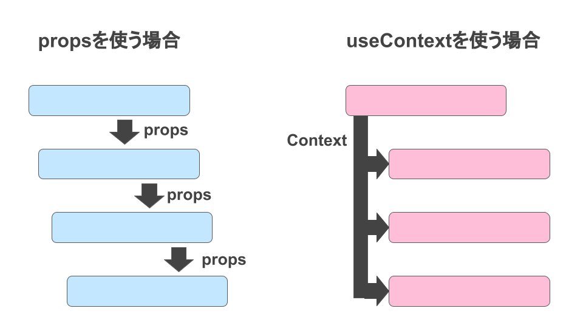
很显然，useContext实现了祖孙级别的通讯

用法：

```tsx
const MyThemeContext = React.createContext({theme: 'light'}); // 创建一个上下文
function App () {
   return (
      <MyThemeContext.Provider value={{theme: 'light'}}>
         <MyComponent />
      </MyThemeContext.Provider>
   )
}
function MyComponent() {
    const themeContext = useContext(MyThemeContext); // 使用上下文
    return (<div>{themeContext.theme}</div>);
}
```

> 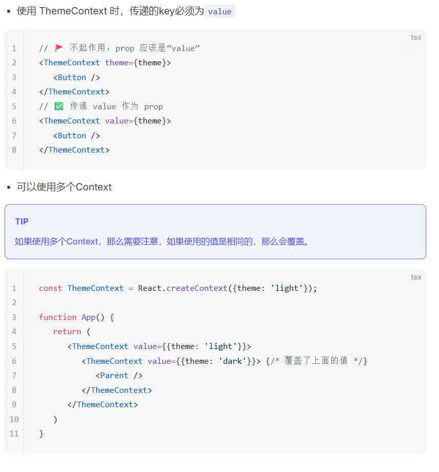


> react18 版本使用的是这种语法：`<ThemeContext.Provider value={{ theme, setTheme }}>`
> react19 版本使用的是这种语法：`<ThemeContext value={{ theme, setTheme }}>`
> 也就是去掉了Provider的包裹

示例代码如下：

```tsx
import React, { useLayoutEffect, useEffect, useRef, useState, useImperativeHandle, useContext, createContext } from 'react';

interface ChildRef {
    name: string
    validate: () => string | true
    reset: () => void
}
interface ThemeType {
    theme: string
}

const ThemeContent = createContext<ThemeType>({} as ThemeType)
const Child = () => {
    const themeCLS = useContext(ThemeContent)
    return (
        <div style={{
            color: themeCLS.theme === "dark" ? "white" : "black",
            backgroundColor: themeCLS.theme === "dark" ? "black" : "white",
            width: '100px',
            height: '100px',
        }}>
            hello, I'm Child
        </div >
   )
}

const Parent = () => {
    const themeCLS = useContext(ThemeContent)
    return (
        <div>
            <div style={{
                color: themeCLS.theme === "dark" ? "white" : "black",
                backgroundColor: themeCLS.theme === "dark" ? "black" : "white",
                width: '100px',
                height: '100px',
            }}>
                hello, I'm Parent
            </div >
            <Child />
        </div>
    )
}

function App() {
    const [theme, setTheme] = useState({theme: 'light'})
    return (
        <>
            <div>
                <ThemeContent value={theme}>
                    <Parent />
                </ThemeContent>
            </div>
            <button onClick={() => setTheme({theme: theme.theme === 'light'? 'dark' : 'light'})}>切换主题</button>
        </>
    )
}
export default App;
```

### useMemo

`useMemo` 是 React 提供的一个性能优化 Hook。它的主要功能是避免在每次渲染时执行复杂的计算和对象重建。通过记忆上一次的计算结果，仅当依赖项变化时才会重新计算，提高了性能，有点类似于Vue的`computed`。

用法：

使用 `React.memo` 包裹组件`[一般用于子组件]`，可以避免组件重新渲染。

```tsx
import React, { memo } from 'react';
const MyComponent = React.memo(({ prop1, prop2 }) => {
  // 组件逻辑
});
const App = () => {
  return <MyComponent prop1="value1" prop2="value2" />;
};
```

比如下面这段代码：

```tsx
import React, { useLayoutEffect, useEffect, useRef, useState, useImperativeHandle, useContext, createContext } from 'react';

interface User {
    name:string;
    age:number;
    phone:string;
}

// 子组件
const UserCard = (props: { user: User }) => {
    console.log('UserCard render');
    const { user } = props;
    return (
        <div>
            <p>{user.name}</p>
            <p>{user.age}</p>
            <p>{user.phone}</p>
        </div>
    )
}

const App = () => {
    const [input, setInput] = useState<string>('');
    const [user, setUser] = useState<User | null>({
	    name: '中华第一剑',
	    age: 18,
	    phone: '1234567890'
  });

  return (
    <div>
        <input type="text" value={input} onChange={(e) => {
            setInput(e.target.value);
        }}/>
        <UserCard user={user!} />
    </div>
  )
}

export default App;
```

此时若改变input，也会触发重新渲染，导致子组件一直重复渲染，这显然是没有必要的，因此需要将子组件用`React.memo`包裹起来：

```tsx
// 子组件
const UserCard = React.memo((props: { user: User }) => {
    console.log('UserCard render');
    const { user } = props;
    return (
        <div>
            <p>{user.name}</p>
            <p>{user.age}</p>
            <p>{user.phone}</p>
        </div>
    )
})
```

也就是说：只有props中的依赖发生改变的时候，才会重新去渲染我们的这个子组件
useMemo实际上就类似于watch，里面的依赖项发生改变的时候才会执行回调函数，否则沿用之前的缓存值

用法如下：

```tsx
import React, { useMemo, useState } from 'react';
const App = () => {
   const [count, setCount] = useState(0);
   const memoizedValue = useMemo(() => count, [count]);
   return <div>{memoizedValue}</div>;
}
```

执行时机：

1. 如果依赖项是个空数组，那么 `useMemo` 的回调函数会执行一次
2. 指定依赖项，当依赖项发生变化时， `useMemo` 的回调函数会执行
3. 不指定依赖项，不推荐这么用，因为每次渲染和更新都会执行

### useCallback

用法如下：

```tsx
import React, { useLayoutEffect, useEffect, useRef, useState, useImperativeHandle, useContext, createContext, useCallback } from 'react';

const App: React.FC = () => {
    console.log('render')
    const [input, setInput] = useState<string>('');
    const changeInput = useCallback((value: string) => {
        setInput(value);
    }, []); // useCallback能够缓存函数，只有当依赖项发生变化时才会重新创建函数，这样可以避免在每次渲染时都创建一个新的函数，从而提高性能。
    return (
        <>
            <input type="text" value={input} onChange={(e) => changeInput(e.target.value)} />
        </>
    )
}

export default App;
```

如果不使用useCallback的话每次更新state都会更新组件，使得函数重新渲染，这样看来是没有必要的

### 父传子

父传子在使用中特别模糊，其实父传子非常简单：

```tsx
function Parent() {
  const [count, setCount] = useState(0);

  return <Child count={count} setCount={setCount} />;
}

function Child(props: { count: number; setCount: React.Dispatch<React.SetStateAction<number>> }) {
  return (
    <button onClick={() => props.setCount(props.count + 1)}>
      {props.count}
    </button>
  );
}
```

直接用props进行接收即可。

然后如果传递的是函数，则需要使用useCallback，如果传递的是变量，则需要用React.memo来监控变量，按需进行重新渲染更新。

### useDebugValue

这一个hook主要给开发人员使用，详见： [useDebugValue | react docs](https://message163.github.io/react-docs/react/hooks/useDebugValue.html)

### useId

```tsx
const id = useId()
// 返回值: :r0: 多次调用值递增
```

主要用于：

- 为组件生成唯一 ID
- 解决 SSR 场景下的 ID 不一致问题
- 无障碍交互唯一ID

```tsx
export const App = () => {
  const id = useId()
  return <>
  <label htmlFor={id}>Name</label>
  <input id={id} type="text" />
  </>
}
```

此时点击label也能够触发input

第二就是SSR场景下的id，在服务端渲染（SSR）场景下，组件会在服务端和客户端分别渲染一次。如果使用随机生成的 ID，可能会导致两端渲染结果不一致，引发 hydration 错误。useId 可以确保生成确定性的 ID。

```tsx
// 一个常见的 SSR 场景：带有工具提示的导航栏组件
const NavItem = ({ text, tooltip }) => {
  // ❌ 错误做法：使用随机值或递增值
  const randomId = `tooltip-${Math.random()}`
  // 在 SSR 时服务端可能生成 tooltip-0.123
  // 在客户端可能生成 tooltip-0.456
  // 导致 hydration 不匹配

  return (
    <li>
      <a 
        aria-describedby={randomId}
        href="#"
      >
        {text}
      </a>
      <div id={randomId} role="tooltip">
        {tooltip}
      </div>
    </li>
  )
}

// ✅ 正确做法：使用 useId
const NavItemWithId = ({ text, tooltip }) => {
  const id = useId()
  const tooltipId = `${id}-tooltip`
  
  return (
    <li>
      <a 
        href="#"
        aria-describedby={tooltipId}
        className="nav-link"
      >
        {text}
      </a>
      <div 
        id={tooltipId}
        role="tooltip"
        className="tooltip"
      >
        {tooltip}
      </div>
    </li>
  )
}

// 使用示例
const Navigation = () => {
  return (
    <nav>
      <ul>
        <NavItemWithId 
          text="首页" 
          tooltip="返回首页"
        />
        <NavItemWithId 
          text="设置" 
          tooltip="系统设置"
        />
        <NavItemWithId 
          text="个人中心" 
          tooltip="查看个人信息"
        />
      </ul>
    </nav>
  )
}
```

## 组件

### 定义

App是一个单体，我们在真正做项目的时候，我们需要把它分解成可管理的，可描述的组件。 React 对于什么是组件和什么不是组件并没有任何硬性规定，这完全取决于你！

react中没有全局和局部组件之类的概念，所有组件均为局部组件，在哪里用，就在哪里引入即可！

关于全局组件，详见：[组件 | react docs](https://message163.github.io/react-docs/react/components/base.html#%E5%85%A8%E5%B1%80%E7%BB%84%E4%BB%B6)

### 组件通信

React 组件使用 `props` 来互相通信。每个父组件都可以提供 props 给它的子组件，从而将一些信息传递给它。Props 可能会让你想起 HTML 属性，但你可以通过它们传递任何 JavaScript 值，包括对象、数组和函数 以及html 元素，这样可以使我们的组件更加灵活。

```tsx
import Card from "./components/Card";
import TestChild from "./components/Information";

function App() {
    return (
        <div>
            <TestChild name="John" age={30} description="A software engineer" />
        </div>
    )
}

export default App
```

```tsx
import React from "react";

interface Props {
    name: string
    age: number
    description: string
}

const TestChild: React.FC<Props> = (props: Props) => {
    return (
        <div>
            <div>name: {props.name}</div>
            <div>age: {props.age}</div>
            <div>description: {props.description}</div>
        </div>
    )
}

export default TestChild
```

默认值的话可以用defaultProps进行解构：

```tsx
interface Props {
    name?: string
    age?: number
    description?: string
}

const defaultProps = {
    name: '中华第一剑',
    age: 20,
    description: '我的剑准备好了'
}

const TestChild: React.FC<Props> = (props) => {
    props = { ...defaultProps, ...props };
    return (
        <div>
            <div>name: {props.name}</div>
            <div>age: {props.age}</div>
            <div>description: {props.description}</div>
        </div>
    )
}
```

如果要给子组件传入slot（类似于vue中插槽的内容的话），就需要用到`props.children`：

父组件：

```tsx
function App() {
    return (
        <div>
            <TestChild>
                <div>这个是传入到插槽中的内容哦</div>
            </TestChild>
        </div>
    )
}
```

子组件：

```tsx
interface Props {
    name?: string
    age?: number
    description?: string
    children?: React.ReactNode // 这里就是用来当作插槽的
}

const TestChild: React.FC<Props> = (props) => {
    props = { ...defaultProps, ...props };
    return (
        <div>
            <div>name: {props.name}</div>
            <div>age: {props.age}</div>
            <div>description: {props.description}</div>
            {props.children} // 装载html，如果是数组一样也能够渲染
        </div>
    )
}
```

> 那vue中的具名插槽该怎么做呢？

直接把 JSX 当成不同 prop 传进去
这是最常见、最像“具名插槽”的做法。

父组件

```tsx
<MyCard
  header={<div>头部</div>}
  footer={<div>底部</div>}
>
  <div>正文</div>
</MyCard>
```

 子组件

```tsx
interface MyCardProps {
  header?: React.ReactNode
  footer?: React.ReactNode
  children?: React.ReactNode
}

function MyCard(props: MyCardProps) {
  return (
    <div className="card">
      <div className="card-header">{props.header}</div>
      <div className="card-body">{props.children}</div>
      <div className="card-footer">{props.footer}</div>
    </div>
  )
}
```

可以把它理解成：

- `children` = 默认插槽
- `header` = 具名插槽 header
- `footer` = 具名插槽 footer

这是 React 里最直接的“具名插槽替代方案”。

**子传父也是类推**

> 记住一点，子传父传函数的话传递的是函数的调用，函数的执行仍然是在父组件中（这个其实就是编程的底层逻辑思维，仔细想想就能想明白了），这样的话我们可以在函数中编写对应的逻辑

父组件：

```tsx
function App() {
    const [storagedContent, setStoragedContent] = useState('')
    const fn = useCallback((param: string) => {
    //  这里的content就是子组件传入的内容
    setStoragedContent(param);
}, []);

    return (
        <div>
            <TestChild fn={fn}>
                <div>这个是传入到插槽中的内容哦</div>
            </TestChild>
            <div>存储在父组件中的内容：{storagedContent}</div>
        </div>
    )
}
```

子组件：

```tsx
const TestChild: React.FC<Props> = (props) => {
    props = { ...defaultProps, ...props };
    return (
        <div>
            <div>name: {props.name}</div>
            <div>age: {props.age}</div>
            <div>description: {props.description}</div>
            {props.children}
            <button onClick={() => props.fn('Hello from child!')}>Click me</button>
        </div>
    )
}
```

### 受控组件

```tsx
function App() {
const [input, setInput] = useState('');

    return (
        <div>
           <input type="text" value={input}  />
        </div>
    )
}
```

由于react当中的useState必须要通过setInput进行修改才能触发重新渲染，否则的话如果不绑定onChange的话，该组件就不知道是否受控

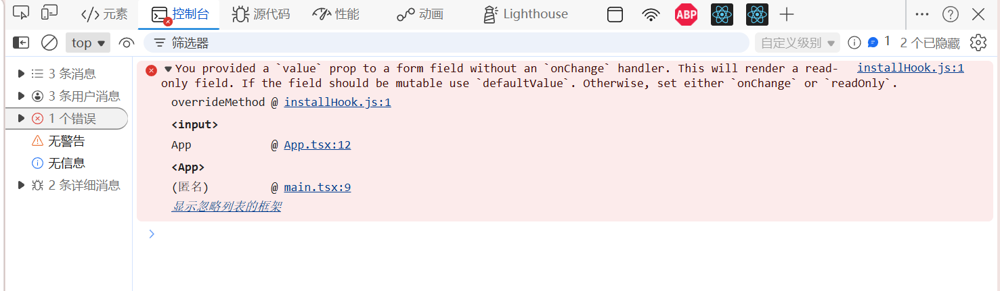

当用户输入内容的时候，value并不会自动更新，这时候就需要我们手动实现一个onChange事件来更新value。

```tsx
function App() {
    const [input, setInput] = useState('');
    const handleChangeInput = (e: React.ChangeEvent<HTMLInputElement>) => {
        setInput(e.target.value);
    }
    return (
        <div>
            <input type="text" value={input} onChange={handleChangeInput} />
        </div>
    )
}
```

其实就是实现了一个类似Vue的v-model的机制，通过onChange事件来更新value，这样就实现了受控组件。

> 受控组件适用于所有表单元素，包括input、textarea、select等。但是除了input type="file" 外，其他表单元素都推荐使用受控组件。

非受控组件的话，就直接操纵原生：

```tsx
function App() {
    let value = ''
    const inputRef = useRef<HTMLInputElement>(null)
    const handleChangeInput = (e: React.ChangeEvent<HTMLInputElement>) => {
        console.log(inputRef.current?.value)
        value = inputRef.current?.value || ''
        console.log("value: ", value)
    }

    return (
        <div>
            <input type="text" ref={inputRef} onChange={ handleChangeInput} />
        </div>
    )
}
```

> 注意：这里为什么不能写成`<input value={value} type="text" ref={inputRef} onChange={ handleChangeInput} />`是因为有一条法则：如果子组件中的属性发生变化，就会重新渲染组件，不过更新机制一直都是有问题，所以建议如果是非受控组件，就绑定Ref进行原生DOM操作即可，而不绑定任何相关的State

### 异步组件

Suspense 是一种异步渲染机制，其核心理念是在组件加载或数据获取过程中，先展示一个占位符（loading state），从而实现更自然流畅的用户界面更新体验。

**应用场景**

- **异步组件加载**：通过代码分包实现组件的按需加载，有效减少首屏加载时的资源体积，提升应用性能。
    
- **异步数据加载**：在数据请求过程中展示优雅的过渡状态（如 loading 动画、骨架屏等），为用户提供更流畅的交互体验。
    
- **异步图片资源加载**：智能管理图片资源的加载状态，在图片完全加载前显示占位内容，确保页面布局稳定，提升用户体验。

这样子：

```tsx
import React, { lazy, Suspense } from 'react'
const AsyncComponent = lazy(() => import('./components/Async'))

const App:React.FC = () => {
    return (
        <div>
            <Suspense fallback={<div>Loading...</div>}>
                <AsyncComponent></AsyncComponent>
            </Suspense>
        </div>
    )
}

export default App
```

就可以让我们能够进行懒加载了

**异步数据加载**

尤其是多媒体平台（例如b站），播放一个视频，视频和用户信息等是分开加载的 

**异步组件**

解决的是：

- 减少首屏包体积
- 按需加载代码
- 路由级拆包
- 某些大组件延迟下载

这是 **代码分割/code splitting** 的问题。

**异步数据** 

解决的是：

- 接口没回来
- 数据依赖还没准备好
- 组件虽然已经有了，但内容还不能渲染

这是 **数据获取/data fetching** 的问题。

**案例如下**

首先在`public`目录下创建一个`data.json`的文件：

```json data.json
{
    "data":{
        "id":1,
        "address":"福州市第十六中学",
        "name":"序号聋",
        "age":26,
        "avatar":"https://api.dicebear.com/7.x/avataaars/svg?seed=小满"
    }
}
```

然后做好骨架屏(在`components`下面创建`Skeleton`文件夹，存放`index.tsx`和`index.css`)：

```css index.css
.skeleton {
    width: 300px;
    height: 150px;
    border: 1px solid #d6d3d3;
    margin: 30px;
    border-radius: 2px;
}

.skeleton-header {
    display: flex;
    justify-content: space-between;
    align-items: center;
    border-bottom: 1px solid #d6d3d3;
    padding: 10px;
}

.skeleton-name {
    width: 100px;
    height: 20px;
    background-color: #d6d3d3;
    animation: skeleton-loading 1.5s ease-in-out infinite;
}

.skeleton-age {
    width: 50px;
    height: 20px;
    background-color: #d6d3d3;
    animation: skeleton-loading 1.5s ease-in-out infinite;
}

.skeleton-content {
    display: flex;
    justify-content: space-between;
    align-items: center;
    padding: 10px;
}

.skeleton-address {
    width: 100px;
    height: 20px;
    background-color: #d6d3d3;
    animation: skeleton-loading 1.5s ease-in-out infinite;
}

.skeleton-avatar {
    width: 50px;
    height: 50px;
    background-color: #d6d3d3;
    animation: skeleton-loading 1.5s ease-in-out infinite;
}

@keyframes skeleton-loading {
    0% {
        opacity: 0.6;
    }
    50% {
        opacity: 1;
    }
    100% {
        opacity: 0.6;
    }
}
```

```tsx index.tsx
import './index.css'
export const Skeleton = () => {
    return <div className="skeleton">
        <header className="skeleton-header">
            <div className="skeleton-name"></div>
            <div className="skeleton-age"></div>
        </header>
        <section className="skeleton-content">
            <div className="skeleton-address"></div>
            <div className="skeleton-avatar"></div>
        </section>
    </div>
}
```

然后Card组件的样式和tsx也写进去(`components/Card/index.tsx`, `components/Card/index.tsx`)：

```tsx index.tsx
import { use } from 'react'
import './index.css'
interface Data {
   name: string
   age: number
   address: string
   avatar: string
}

const getData = async () => {
   await new Promise(resolve => setTimeout(resolve, 2000))
   return await fetch('http://localhost:5173/data.json').then(res => res.json()) as { data: Data }
};

const dataPromise = getData();

const Card: React.FC = () => {
   const { data } = use(dataPromise);
   return <div className="card">
      <header className="card-header">
         <div className="card-name">{data.name}</div>
         <div className="card-age">{data.age}</div>
      </header>
      <section className="card-content">
         <div className="card-address">{data.address}</div>
         <div className="card-avatar">
            
         </div>
      </section>
   </div>;
};

export default Card;
```

> `use` API 用于获取组件内部的Promise,或者Context的内容，该案例使用了use获取Promise返回的数据并且故意延迟2秒返回，模拟网络请求。

`use`

```tsx
const data = use(fetchDataPromise)  
return <div>{data.name}</div>
```

意思也是：

- 我要这里的结果
- 没结果就先别继续正常渲染

所以它有点像 `await`

```css index.css
.card {
    width: 300px;
    height: 150px;
    border: 1px solid #d6d3d3;
    margin: 30px;
    border-radius: 2px;
}

.card-header {
    display: flex;
    justify-content: space-between;
    align-items: center;
    border-bottom: 1px solid #d6d3d3;
    padding: 10px;
}

.card-age {
    font-size: 12px;
    color: #999;
}

.card-content {
    display: flex;
    justify-content: space-between;
    align-items: center;
    padding: 10px;
}
```

App.tsx代码可以这样写：

```tsx App.tsx
import React, { lazy, Suspense } from 'react'
import Card from './components/Card';
import { Skeleton } from './components/Skeleton';

const App:React.FC = () => {
    return (
        <div>
            <Suspense fallback={<Skeleton></Skeleton>}>
                <Card></Card>
            </Suspense>
        </div>
    )
}

export default App
```

### 传送组件

`createPortal`是一个API，不是组件，他的作用是：将一个组件渲染到DOM的任意位置，跟Vue的Teleport组件类似。

用法：

```tsx
import { createPortal } from 'react-dom';

const App = () => {
  return createPortal(<div>小满zs</div>, document.body);
};

export default App;
```

入参

- children：要渲染的组件
- domNode：要渲染到的DOM位置
- key?：可选，用于唯一标识要渲染的组件

返回值

- 返回一个React元素(即jsx)，这个元素可以被React渲染到DOM的任意位置

譬如我们将弹窗挂载到整体页面上去：

```tsx App.tsx
import React, { lazy, Suspense } from 'react';
import { createPortal } from 'react-dom';
import { Modal } from './components/Modal';

const App: React.FC = () => {
    return (
        <div>
            {createPortal(<Modal></Modal>, document.body)}
        </div>
    );
}

export default App
```

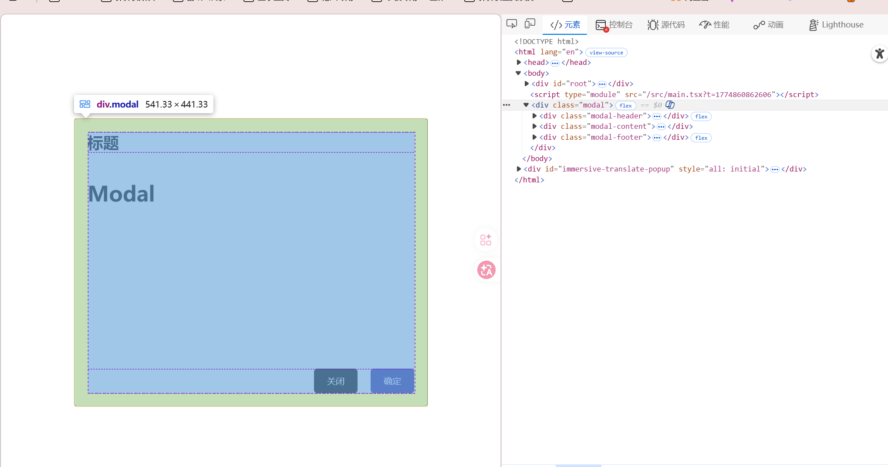

> 来自小满的谏言：
> 我更推荐使用`createPortal`因为他更灵活，可以挂载到任意位置，而`position: fixed`,会有很多问题，在默认的情况下他是根据浏览器视口进行定位的，**但是如果父级设置了`transform、perspective、filter 或 backdrop-filter` 属性非 none 时，他就会相对于父级进行定位**，这样就会导致Modal组件定位不准确`(他不是一定按照浏览器视口进行定位)`，所以不推荐使用。

### 工程化组件

```
project-root/
├─ dist/                      # 打包文件
├─ docs/                      # 文档
├─ packages/                  # 组件目录
│  ├─ Tree/
│  │  ├─ index.ts             # 入口
│  │  ├─ tree.tsx             # 组件
│  │  ├─ styles.css           # 样式
│  │  └─ type.ts              # 类型
│  ├─ Button/
│  │  ├─ index.ts             # 入口
│  │  ├─ button.tsx           # 组件
│  │  ├─ styles.css           # 样式
│  │  └─ type.ts              # 类型
│  └─ index.ts                # 组件汇总
├─ example/
│  ├─ index.html              # 示例
│  ├─ App.tsx                 # 示例
│  └─ main.tsx                # 示例入口
├─ vite.d.ts                  # 类型声明
├─ package.json               # 包管理
├─ vite.config.ts             # vite 配置
├─ tsconfig.json              # ts 配置
└─ README.md                  # README
```

> package.json 可以通过 `npm init -y` 生成
> tsconfig.json 可以通过 `tsc --init` 生成

#### 1. 依赖安装

```bash
npm install vite -D # vite 构建工具
npm install @vitejs/plugin-react-swc -D # 插件编译React
npm install vite-plugin-dts -D #生成d.ts文件 声明文件
npm install react #react依赖
npm install react-dom #react依赖
npm install @types/react -D # 类型
npm install @types/react-dom -D # 类型
npm install @types/node -D # 类型
```

#### 2. 初始化html文件

```html
<!DOCTYPE html>
<html lang="en">
<head>
    <meta charset="UTF-8">
    <meta name="viewport" content="width=device-width, initial-scale=1.0">
    <title>Document</title>
</head>
<body>
    <div id="root"></div>
    <script type="module" src="./main.tsx"></script>
</body>
</html>
```

#### 3. 配置vite.config.ts文件

```ts vite.config.ts
import { defineConfig } from 'vite';
import react from '@vitejs/plugin-react-swc';
import { resolve } from 'path';

// https://vitejs.dev/config/
export default defineConfig({
  plugins: [react()],
  root: resolve(__dirname, 'example'), // 设置项目根目录为 example 文件夹
  server: {
    port: 3000,
    open: true, // 自动打开浏览器
  },
  resolve: {
    alias: {
      '@': resolve(__dirname, 'example'), // 设置 @ 别名指向 example 文件夹
    },
  },
});
```

然后在`package.json`中修改`scripts`为以下属性：

```json package.json
  "scripts": {
    "dev": "vite",
    "build": "vite build"
  },
```

初始化一下`example/App.tsx`:

```tsx example/App.tsx
export default function App() {
  return <div>Hello Sekai</div>
}
```

顺便也得初始化一下`example/main.tsx`:

```tsx example/main.tsx
import React from 'react'
import ReactDOM from 'react-dom/client'
import App from './App'
ReactDOM.createRoot(document.getElementById('root') as HTMLElement).render(
    <App />
)
```

 创建`vite.d.ts`并写入以下代码：

```ts vite.d.ts
/// <reference types="vite/client" />
```

> tsconfig.json中：
> - `target`：**我要把 TS/新语法编译到什么 JS 年代**
> - `module`：**我要用什么模块规范**
> - `moduleResolution`：**导入路径到底按什么规则找文件**
> 其中：
> 如果是前端/Vite项目
> 改成：
> "module": "ESNext",  
> "moduleResolution": "bundler"
> 
> 如果是 Node 项目，不靠 bundler
> 那就别用 `bundler`，改成：
> "module": "NodeNext",  
> "moduleResolution": "NodeNext"
> 或者：
> "module": "Node16", 
> "moduleResolution": "Node16"

至此，初始化工作已准备就绪，剩下的就是编写核心组件代码

代码逻辑部分直接查看：[组件实战 | react docs](https://message163.github.io/react-docs/react/components/practice.html#%E6%A0%B8%E5%BF%83%E9%80%BB%E8%BE%91%E7%BC%96%E5%86%99)

#### 4. 代码打包

配置`vite.config.ts`文件

```ts
import { defineConfig } from 'vite';
import react from '@vitejs/plugin-react-swc';
import { resolve } from 'path';
import dts from 'vite-plugin-dts'; // 生成 .d.ts 文件的插件

// https://vitejs.dev/config/
export default defineConfig({
    plugins: [react(), dts({
        include: ['packages/**/*.ts', 'packages/**/*.tsx'], // 指定需要生成 .d.ts 文件的源文件路径
        entryRoot: resolve(__dirname, 'packages'), // 入口文件所在目录
        insertTypesEntry: true, // 在 package.json 中插入 types 字段，指向生成的 .d.ts 文件
        rollupTypes: true, // 使用 Rollup 来处理类型文件，支持 tree-shaking
        tsconfigPath: resolve(__dirname, 'tsconfig.json'), // 指定 tsconfig.json 的路径
        outDir: resolve(__dirname, 'dist/types'), // 输出 .d.ts 文件的目录
    })],
    root: resolve(__dirname, 'example'), // 设置项目根目录为 example 文件夹
    server: {
        port: 3000,
        open: true, // 自动打开浏览器
    },

    resolve: {
        alias: {
            '@': resolve(__dirname, 'example'), // 设置 @ 别名指向 example 文件夹
        },
    },
    build: {
        outDir: resolve(__dirname, 'dist'), // 设置构建输出目录为 dist 文件夹
        lib: {
            entry: resolve(__dirname, 'packages/index.ts'), // 设置库的入口文件
            name: 'MyComponentLibrary', // 设置库的全局变量名称
            formats: ['es', 'umd', 'cjs', 'iife'], // 设置库的输出格式: es模块、UMD、CommonJS 和 IIFE
            fileName: (format) => `my-component-library.${format}.js`, // 设置输出文件名
        },
        rollupOptions: {
            // 确保外部化处理那些你不想打包进库的依赖
            external: ['react', 'react-dom'],
            output: {
                // 在 UMD 和 IIFE 格式中为这些外部化的依赖提供一个全局变量
                globals: {
                    react: 'React', // 这里的 React 是 React 的全局变量名称，UMD 和 IIFE 格式会使用这个名称来访问外部化的 react 模块
                    'react-dom': 'ReactDOM', // 这里的 ReactDOM 是 ReactDOM 的全局变量名称，UMD 和 IIFE 格式会使用这个名称来访问外部化的 react-dom 模块
                }
            }
        }
    }  
});
```

## CSS

### CSS Module

因为 `React` 没有Vue的Scoped，但是React又是SPA(单页面应用)，所以需要一种方式来解决css的样式冲突问题，也就是把每个组件的样式做成单独的作用域，实现样式隔离，而css modules就是一种解决方案，但是我们需要借助一些工具来实现，比如`webpack`，`postcss`，`css-loader`，`vite`等。

```bash
npm install less -D # 安装less 任选其一
npm install sass -D # 安装sass 任选其一
npm install stylus -D # 安装stylus 任选其一
```

`src/components/Button/index.module.scss` :

```scss
.button {
  color: red;
}
```

`src/components/Button/index.tsx`

```tsx
//使用方法，直接引入即可
import styles from './index.module.scss';

export default function Button() {
  return <button className={styles.button}>按钮</button>;
}
```

编译结果, 可以看到`button`类名被编译成了`button_pmkzx_6`，这就是css modules的实现原理，通过在类名前添加一个唯一的哈希值，来实现样式隔离。


```html
<button class="button_pmkzx_6">按钮</button>
```

修改css modules的具体规则详见：[css modules | react docs](https://message163.github.io/react-docs/react/css/css-modules.html#%E4%BF%AE%E6%94%B9css-modules-%E8%A7%84%E5%88%99)

### css-in-js

优点：

- 可以让 CSS 拥有独立的作用域，阻止 CSS 泄露到组件外部，防止冲突。
- 可以动态的生成 CSS 样式，根据组件的状态来动态的生成 CSS 样式。
- CSS-in-JS 可以方便地实现主题切换功能，只需更改主题变量即可改变整个应用的样式。

缺点：

- css-in-js 是基于运行时，所以会损耗一些性能(电脑性能高可以忽略)
- 调试困难，CSS-in-JS 的样式难以调试，因为它们是动态生成的，而不是在 CSS 文件中定义的。

css-in-js 库有很多，比如 `styled-components`、`emotion`、等等，因为它只是思想，所以很多库都实现了它，但是这些库的实现方式都不一样，所以使用的时候需要根据实际情况选择合适的库，所以 `Antd` 选择了自研。

```bash
npm install styled-components
```

直接在App.tsx里调用：

```tsx
import React from 'react';
import styled from 'styled-components';

const Button = styled.button`
    background-color: #007bff;
    color: white;
    border: 1px solid #ffc107; 
    padding: 10px 20px;
    margin: 20px;
    border-radius: 4px;
    cursor: pointer;
`

const App: React.FC = () => {
    return (
        <div>
           <Button onClick={() => alert('恶作剧的对象，是你哦')}>你好伙计</Button>
        </div>
    );
}

export default App
```

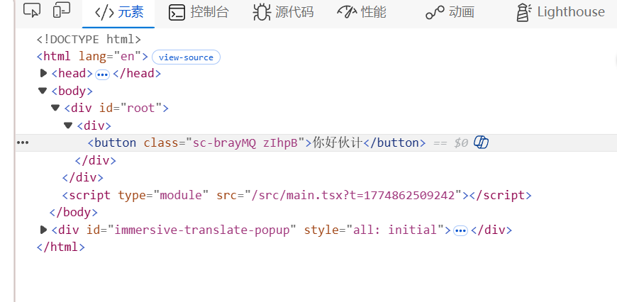

同样的，这个组件支持传参：

```tsx
import React, { lazy, Suspense } from 'react';

import styled from 'styled-components';

  

const Button = styled.button<{primary?: boolean}>`
    ${props => props.primary ? `
        background-color: #007bff;
        color: white;
        border: 1px solid #ffc107;
    ` : `
        background-color: red;
        color: #333;
        border: 1px solid #ffc107;
    `}
    padding: 10px 20px;
    margin: 20px;
    border-radius: 4px;
    cursor: pointer;
`

const App: React.FC = () => {
    return (
        <div>
           <Button primary={false} onClick={() => alert('恶作剧的对象，是你哦')}>你好伙计</Button>
        </div>
    );
}

export default App
```

传入的是false，因此是红色：


如果需要复用的话，直接`styled(Button)`即可，后面同样跟模板字符串，用来覆盖原来的样式：

```tsx
const ErrorButton = styled(Button)`
    background-color: red;
    color: white;  
`
```


**属性**

我们可以通过 `attrs` 来给组件添加属性，比如 `placeholder`，然后通过 `props` 来获取属性值。

```tsx
interface DivComponentProps {
    placeholder: string
}

const InputComponent = styled.input.attrs<DivComponentProps>((props) => ({
    type: 'text',
    placeholder: props.placeholder

}))`
    border:1px solid blue;
    margin:20px;
`
const App: React.FC = () => {
    return (
        <div>
            <Button primary={false} onClick={() => alert('恶作剧的对象，是你哦')}>你好伙计</Button>
            <ErrorButton primary={true} onClick={() => alert('这是一个错误按钮')}>错误按钮</ErrorButton>
            <InputComponent placeholder='请输入内容' />
        </div>
    );
}

export default App
```

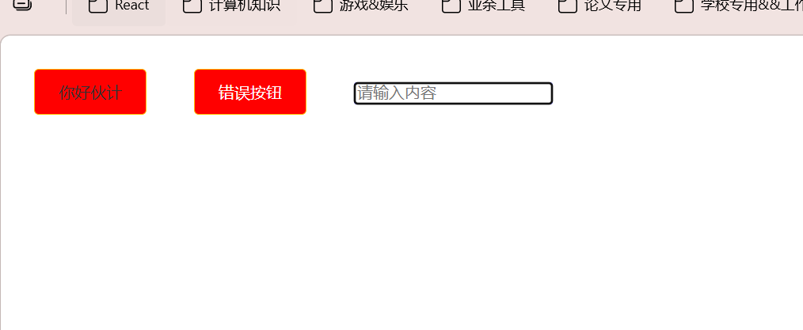

**动画**

```tsx
import styled, { keyframes } from 'styled-components';

// 创建动画
const move = keyframes`
    from {
        transform: translateX(0);
    }
    to {
        transform: translateX(100px);
    }
`

// 直接组件中引用即可
const AnimatedDiv = styled.div`
    width: 100px;  
    height: 100px;
    background-color: green;
    animation: ${move} 2s infinite alternate;
`
```

#### 底层原理

类似于其实就是调用函数：

```tsx
// 1. 第一个参数就是模板字符串数组，第二个参数就是占位符的值：${}
const div = function (strArr:TemplateStringsArray, ...args: any[]) {
    console.log(strArr, args)
}

div`Hello ${'World'}! This is a ${'test'}.`
```

### CSS原子化

原子化 CSS 是一种现代 CSS 开发方法，它将 CSS 样式拆分成最小的、单一功能的类。比如一个类只负责设置颜色，另一个类只负责设置边距。这种方式让样式更容易维护和复用，能提高开发效率，减少代码冗余。通过组合这些小型样式类，我们可以构建出复杂的界面组件。

vite项目

```bash
npm install tailwindcss @tailwindcss/vite
```

具体操作可以查看：[原子化 css | react docs](https://message163.github.io/react-docs/react/css/css-atomic.html#%E5%A6%82%E4%BD%95%E4%BD%BF%E7%94%A8-tailwind-css-4-0-1-%E6%9C%80%E6%96%B0%E7%89%88)

## Router

### 概念

React-router 是 React的路由库，跟Vue的Router很相似。它的作用就是，根据不同的`URL`，匹配不同的组件，然后进行渲染。这样就可以实现在单页面应用中跳转页面。

官方文档:[https://reactrouter.com/home](https://reactrouter.com/home)

安装

1. 数据模式

```bash
npm i react-router #V7不在需要 react-router-dom
```

```ts
export const router = createBrowserRouter([
  {
    path: '/',
    Component: Home,
  },
  {
    path: '/about',
    Component: About,
  },
]);
```

2. 声明模式

```bash
npm i react-router #V7不在需要 react-router-dom
```

```tsx
import React from "react";
import ReactDOM from "react-dom/client";
import { BrowserRouter, Routes, Route } from "react-router";
import App from "./app";
import About from '../about'
const root = document.getElementById("root");

ReactDOM.createRoot(root).render(
  <BrowserRouter>
    <Routes>
      <Route path="/" element={<App />} />
      <Route path="about" element={<About />} />
    </Routes>
  </BrowserRouter>
);
```

**本文主要以数据模式展开**

首先需要创建`src/router/index.ts`来注册对应的路由：

```ts
import { createBrowserRouter } from "react-router";
import Home from "../pages/Home";
import About from "../pages/About";

const router = createBrowserRouter([
    {
        path: "/",
        Component: Home
    },
    {  
        path: "/about",
        Component: About
    }
])

export default router;
```

比如这里注册了两个组件，此时访问路由肯定是无效的，因为还没有将路由规则全局注册，要在App.tsx中进行注册：

```tsx
import React from 'react';
import { RouterProvider } from 'react-router';
import router from './router';

const App: React.FC = () => {
    return (
        <>
            <RouterProvider router={router} />
        </>
    );
}

export default App
```

这样的话进行了一个全局的路由注册

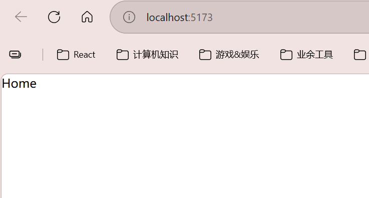

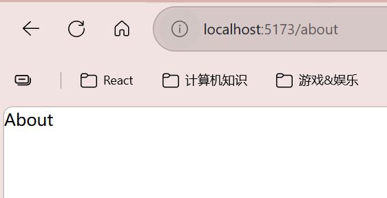

而在vue中则是通过`<router-view></router-view>`来进行的

### 路由模式

在React RouterV7 中，是拥有不同的路由模式，路由模式的选择将直接影响你的整个项目。React Router 提供了四种核心路由创建函数： `createBrowserRouter`、`createHashRouter`、`createMemoryRouter` 和 `createStaticRouter`

#### 1. `createBrowserRouter(推荐)`

核心特点：

- 使用HTML5的history API (pushState, replaceState, popState)
- 浏览器URL比较纯净 (/search, /about, /user/123)
- 需要服务器端支持(nginx, apache,等)否则会刷新404

使用场景：

- 大多数现代浏览器环境
- 需要服务器端支持
- 需要URL美观

> `replaceState`也就是跳转页面且不留下历史记录

#### 2. `createHashRouter`

核心特点：

- 使用URL的hash部分(#/search, #/about, #/user/123)
- 不需要服务器端支持
- 刷新页面不会丢失

使用场景：

- 静态站点托管例如(github pages, netlify, vercel)
- 不需要服务器端支持

#### 3. `createMemoryRouter`

核心特点：

- 使用内存中的路由表
- 刷新页面会丢失状态
- 切换页面路由不显示URL

使用场景：

- 非浏览器环境例如(React Native, Electron)
- 单元测试或者组件测试(Jest, Vitest)

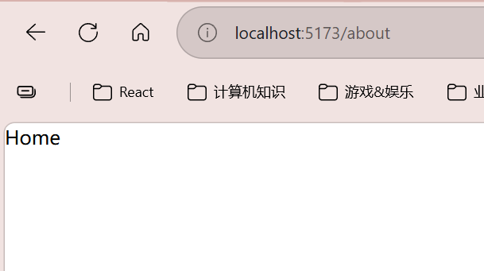

#### 4. `createStaticRouter`

 核心特点：

- 专为服务端渲染（SSR）设计
- 在服务器端匹配请求路径，生成静态 HTML
- 需与客户端路由器（如 createBrowserRouter）配合使用

使用场景：

- 服务端渲染应用（如 Next.js 的兼容方案）
- 需要SEO优化的页面

#### 404问题

 **问题表现**

比如React / Vue Router：

http://localhost:8080/user

- 浏览器直接访问：✅ 正常
- 页面刷新：❌ 404

**原因本质**

SPA 路由是：

 **前端控制路由（浏览器 history API）**

但 nginx 是：

 **服务器按“文件路径”找资源**

所以：

```
/user  → nginx 认为你要找 /user 这个文件  
        → 找不到 → 404
```

**正确解决方案（必须配置）**

```
location / {  
	try_files $uri $uri/ /index.html;  
}
```

如果找不到真实文件 → 返回 index.html → 交给前端路由

### 路由种类

React-Router V7 的路由种类是非常多的，有`嵌套路由` `布局路由` `索引路由` `前缀路由` `动态路由`，大致上是分为这五种的，下面我们一一介绍

> 使用NavLink可以进行类似于a标签的路由跳转，相当于`router-link`

```tsx
import { NavLink } from 'react-router'; 
const Home: React.FC = () => { 
	return ( 
		<div> 
			<NavLink to="/about">About</NavLink> 
		</div> 
	); 
}; 

export default Home;
```

编程式导航useNavigate（类似于vue中的useRouter）进行js的跳转：

vue中的写法：

```ts
import { useRouter } from 'vue-router'  
const router = useRouter()  
router.push('/user')
```

react中的写法：

```tsx
import { Menu as AntdMenu } from 'antd';

import type { MenuProps } from 'antd';

import { AppstoreOutlined } from '@ant-design/icons';
import { useNavigate } from 'react-router';
export default function Menu() {
    const navigate = useNavigate(); // 获取 navigate 函数
    const handleClick: MenuProps['onClick'] = (e: any) => {
        navigate(e.key); // 使用 navigate 函数进行跳转
    }
     const menuItems = [
        {
            key: '/home',
            label: 'Home',
            icon: <AppstoreOutlined />,
        },
        {
            key: '/about',
            label: 'About',
            icon: <AppstoreOutlined />,
        },
    ];
    return (
        <AntdMenu items={menuItems} onClick={handleClick}></AntdMenu>
    )
}
```

#### 嵌套路由

和vue一样，可以在路由中添加children

注意事项：

- 父路由的path 是 `index`开始，所以访问子路由的时候需要加上父路由的path例如 `/index/home` `/index/about`
- **子路由不需要增加`/`了直接写子路由的path即可**
- 子路由默认是不显示的，**需要父路由通过 `Outlet` 组件来显示子路由 outlet 就是类似于Vue的`<router-view>`展示子路由的一个容器**
- 子路由的层级可以无限嵌套，但是要注意的是，一般实际工作中就是2-3层

比如Content组件：

```tsx
import { Outlet } from "react-router"

export default function Content() {
    return (
        <div>
            <Outlet />
        </div>
    )
}
```

我定义一份这个路由：

```ts
import { createBrowserRouter } from "react-router";
import About from "../components/About";
import Layout from "../layout";
import Home from "../components/Home";

const router = createBrowserRouter([
    {
        path: "/",
        Component: Layout,
        children: [
            {
                path: "home",
                Component: Home
            },
            {
                path: "/about",
                Component: About
            }
        ]
    },
])
```

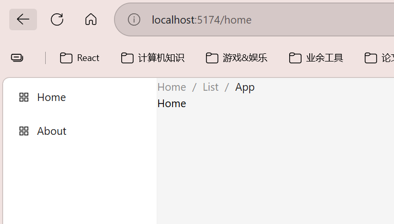

访问/home，将`Home`组件传递给`Content`中的`Outlet`

#### 布局路由

布局路由是一种特殊的嵌套路由，父路由可以省略 `path`，这样不会向 URL 添加额外的路径段：

```tsx
const router = createBrowserRouter([
    {
        // path: "/",
        Component: Layout,
        children: [
            {
                path: "index/home",
                Component: Home
            },
            {
                path: "index/about",
                Component: About
            }
        ]
    },
])
```

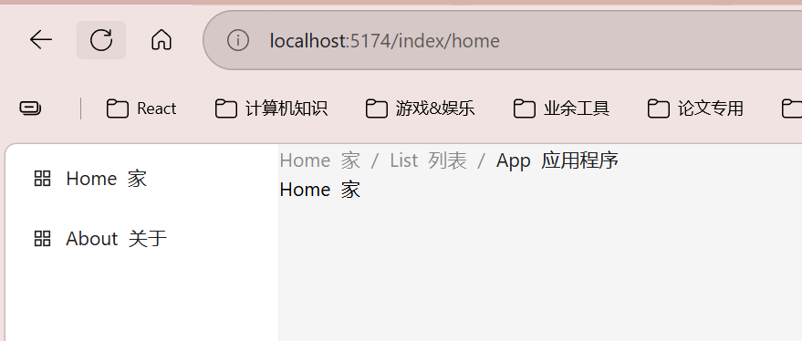

#### 索引路由

索引路由使用 `index: true` 来定义，作为父路由的默认子路由：

```tsx
const router = createBrowserRouter([
    {
        path: "/",
        Component: Layout,
        children: [
            {
                // path: "index/home",
                index: true,
                Component: Home
            },
            {
                path: "about",
                Component: About
            }
        ]
    },
])
```

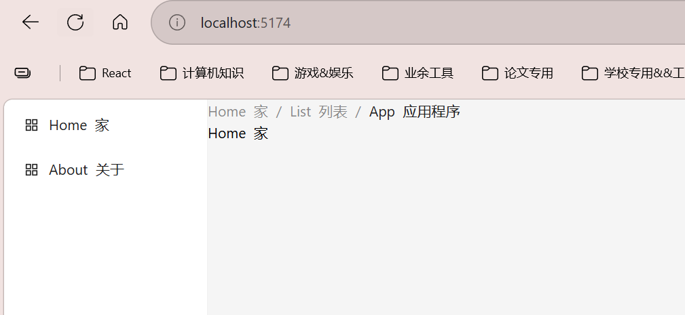

#### 动态路由

动态路由通过 `:参数名` 语法来定义动态段：

访问规则如下 `http://localhost:5174/home/123`:

```tsx
const router = createBrowserRouter([
    {
        path: "/",
        Component: Layout,
        children: [
            {
                path: "home/:id",
                // index: true,
                Component: Home
            },
            {
                path: "about",
                Component: About
            }
        ]
    },
])
```

其实和vue的一样，页面中获取可以使用`useParams`这个函数：

```tsx
import { Outlet } from "react-router"
import { useParams } from "react-router"

export default function Content() {
    const { id } = useParams()
    return (
        <div>
            Content {id}
            <Outlet />
        </div>
    )
}
```

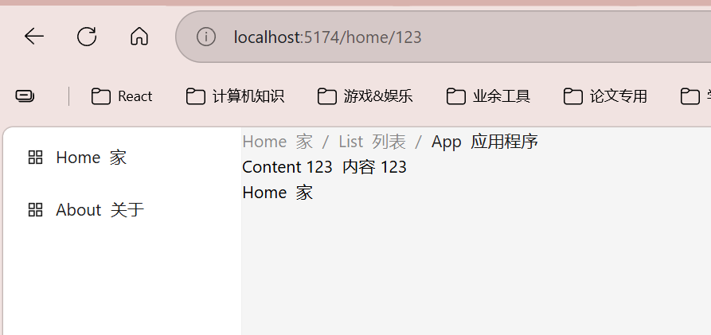

### 传参

```tsx
import { NavLink } from "react-router"

export default function Home() {
    return (
        <div>
            Home
            <NavLink to="about">About</NavLink>
        </div>
    )
}
```

获取参数

```tsx
//1. 获取参数
import { useSearchParams } from 'react-router'
const [searchParams, setSearchParams] = useSearchParams()
console.log(searchParams.get('id')) //获取id参数

//2. 获取参数
import { useLocation } from 'react-router'
const { search } = useLocation()
console.log(search) //获取search参数 ?id=123
```

params方式可以看上面的[动态路由](#动态路由)

**state在URL中不显示，但是可以传递参数，例如**：


```bash
/user
```

跳转方式：

```tsx
<Link to="/user" state={{ name: '小满zs', age: 18 }}>User</Link> //1. Link 跳转
<NavLink to="/user" state={{ name: '小满zs', age: 18 }}>User</NavLink> //2. NavLink 跳转
import { useNavigate } from 'react-router'
const navigate = useNavigate()
navigate('/user', { state: { name: '小满zs', age: 18 } }) //3. useNavigate 跳转
```

获取参数：
useLocation用法查看[useLocation](https://message163.github.io/react-docs/react/router/hooks/useLocation.html)

```tsx
import { useLocation } from 'react-router'
const { state } = useLocation()
console.log(state) //获取state参数
console.log(state.name) //获取name参数
console.log(state.age) //获取age参数
```

> 但是这种传参方式有一个缺点：仅在当前会话生效，如果关闭掉，或者给别人分享该页面都会报错。

#### 总结

React Router 提供了三种参数传递方式，各有特点：

1. Params 方式 (`/user/:id`)

- 适用于：传递必要的路径参数（如ID）
- 特点：符合 RESTful 规范，刷新不丢失
- 限制：只能传字符串，参数显示在URL中

2. Query 方式 (`/user?name=xiaoman`)

- 适用于：传递可选的查询参数
- 特点：灵活多变，支持多参数
- 限制：URL可能较长，参数公开可见

3. State 方式

- 适用于：传递复杂数据结构
- 特点：支持任意类型数据，参数不显示在URL
- 限制：刷新可能丢失，不利于分享

> 选择建议：必要参数用 Params，筛选条件用 Query，临时数据用 State。
> 一般来说：业务参数（比如id等等）通常用Params，而筛选条件（例如分页，日期，年龄这种筛选条件）则用Query

### 懒加载

懒加载是一种优化技术，用于延迟加载组件，直到需要时才加载。这样可以减少初始加载时间，提高页面性能。

#### 懒加载的实现

通过在路由对象中使用 `lazy` 属性来实现懒加载。例如在router.ts中编写

```ts
import { createBrowserRouter } from "react-router";
import Layout from "../layout";
import Home from "../components/Home";

const sleep = (ms: number) => new Promise(resolve => setTimeout(resolve, ms))

const router = createBrowserRouter([
    {
        path: "/",
        Component: Layout,
        children: [
            {
                path: "home",
                Component: Home
            },
            {
                path: "about",
                lazy: async () => {
                    await sleep(2000) // 模拟网络请求的延迟
                    const about = await import('../components/About')
                    return {
                        Component: about.default, // 使用的时候需要加上 default，因为我们是使用 export default 导出的
                    }
                }
            }
        ]
    },
])

export default router;
```

此时跳转到About页面才会重新加载about的相关组件，因此About组件会有延迟，就会出现访问卡顿2秒，这样体验非常不好

#### 使用状态优化`useNavigation`

速查文档[useNavigation](https://message163.github.io/react-docs/react/router/hooks/useNavigation.html)

对我们的Content组件进行编辑：

```tsx
import { Outlet, useNavigation } from "react-router"

export default function Content() {
    const navigation = useNavigation()
    console.log('Content navigation state:', navigation.state);
    return (
        <div>
            <Outlet />
        </div>
    )
}
```

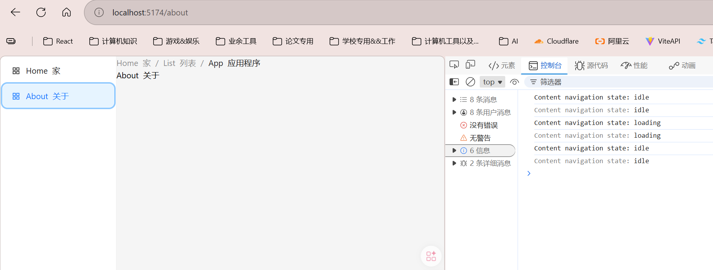

可以看到从/home跳转到/about的时候会出现loading

那么就可以用loading来做一个过渡效果:

```tsx
import { Outlet, useNavigation } from "react-router"
import { Spin, Alert } from "antd";

export default function Content() {
    const navigation = useNavigation()
    const isLoading = navigation.state === 'loading';
    return (
        <div>
            {isLoading ? <Spin>
                <Alert
                    description="正在加载页面，请稍候..."
                    type="info"
                />
            </Spin>
                :
                <Outlet />}
        </div>
    )
}
```

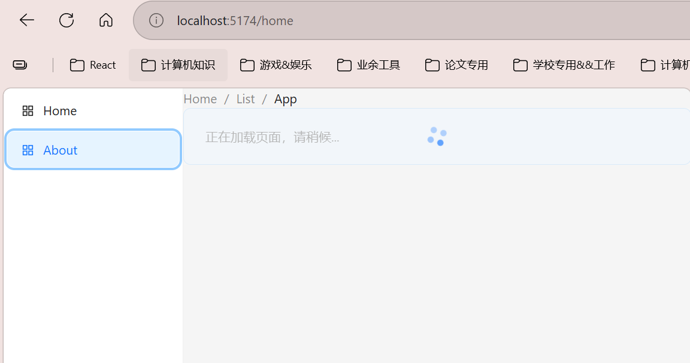

### 路由操作

路由的操作是由两个部分组成的:

- loader
- action

在平时工作中大部分都是在做`增刪查改(CRUD)`的操作，所以一个界面的接口过多之后就会使逻辑臃肿复杂，难以维护，所以需要使用路由的高级操作来优化代码。

#### loader

在之前的话我们是 `RenderComponent(渲染组件)`-> `Fetch(获取数据)`-> `RenderView(渲染视图)`

有了loader之后是 `loader(通过fetch获取数据)` -> `useLoaderData(获取数据)` -> `RenderComponent(渲染组件)`

直接在路由当中配置：

```tsx
import { createBrowserRouter } from "react-router";
import Layout from "../layout";
import Home from "../components/Home";
import About from "../components/About";

const sleep = (ms: number) => new Promise(resolve => setTimeout(resolve, ms))
const data = {
    name: '中华第一剑',
    age: 25,
    description: '我的剑准备好了'
}

const router = createBrowserRouter([
    {
        path: "/",
        Component: Layout,
        children: [
            {
                path: "home",
                Component: Home
            },
            {
                path: "about",
                Component: About,
                loader: async () => {
                    await sleep(2000)
                    return {
	                    data: data,
	                    success: true
                    }
                }
            }
        ]
    },
])

export default router;
```

然后在About组件中进行接收即可(使用useLoaderData)：

```tsx
import { useLoaderData } from "react-router"

export default function About() {
    const { data, success } = useLoaderData();
    console.log(data, success)
    return (
        <div>
            About
        </div>
    )
}
```

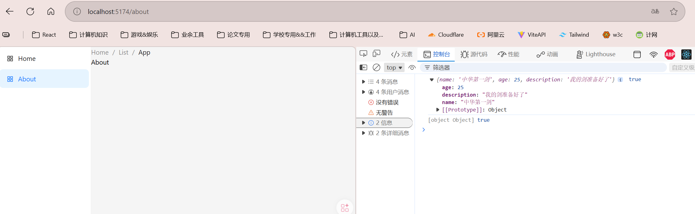

### 导航

这一栏具体可以去看小满zs专栏：[导航 | react docs](https://message163.github.io/react-docs/react/router/nav.html)

### ErrorBoundary

ErrorBoundary是用于捕获路由loader或action的错误，并进行处理

如果loader或action抛出错误，会调用ErrorBoundary组件。
比如在router/index.ts路由配置文件中：

```ts
import { createBrowserRouter } from "react-router";
import Layout from "../layout";
import Home from "../components/Home";
import About from "../components/About";
import Error from '../layout/Error'; // 错误处理组件
import { message } from "antd";
const sleep = (ms: number) => new Promise(resolve => setTimeout(resolve, ms))
const data = {
    name: '中华第一剑',
    age: 25,
    description: '我的剑准备好了'
}

const router = createBrowserRouter([
    {
        path: "/",
        Component: Layout,
        children: [
            {
                path: "home",
                Component: Home
            },
            {
                path: "about",
                Component: About,
                loader: async () => {
                    throw {
                        message: '加载数据失败',
                        status: 500
                    }
                },
                ErrorBoundary: Error, //如果loader或action抛出错误，会调用ErrorBoundary组件
            }
        ]
    },
])

export default router;
```

编写我们的Error组件（layout/Error/index.tsx）:

```tsx
import { useRouteError } from 'react-router'

interface Error {
    message: string;
    status: number;
}

export default function Error() {
    const error = useRouteError() as Error;
    return <div>{error.message}</div>
}
```

## 状态管理

Zustand作为状态管理，有以下优点：

1. `轻量级` Zustand 的体积非常小，只有 1kb 左右。
2. `简单易用` Zustand 不需要像Redux，去通过`Provider`包裹组件，Zustand提供了简洁的API，能够快速上手。
3. `易于集成` Zustand 可以轻松的与React 和 Vue 等框架集成。(Zustand也有Vue版本)
4. `扩拓展性` Zustand 提供了中间件的概念，可以通过插件的方式扩展功能，例如(持久化,异步操作，日志记录)等。
5. `无副作用` Zustand 推荐使用 `immer`库处理不可变性， 避免不必要的副作用。

### 安装

```bash
npm install zustand
```

### 使用

创建一个`store`文件夹在文件下下面创建对应的业务模块比如全局管理`price.ts`

```ts
import { create } from "zustand";

interface PriceState {
    price: number;
    state: number;
    incrementPrice: () => void;  
    decrementPrice: () => void;
    resetPrice: () => void;
    getPrice: () => number;
}

const usePriceStore = create<PriceState>((set, get) => ({
    // state也就是这个对象本身
    // zustand设置属性的时候不会像useState中那样覆盖整个state对象，而是会进行合并
    // 所以我们只需要传入需要更新的属性即可
    price: 0,
    state: 0,
    incrementPrice: () => set((state) => ({ price: state.price + 1 })),
    decrementPrice: () => set((state) => ({ price: state.price - 1 })),
    resetPrice: () => set({ price: 0 }), // 可以直接传入一个对象来更新state，不需要使用函数形式
    getPrice: () => get().price  // 通过get函数获取当前的state对象，然后访问price属性

}))

export default usePriceStore;
```

在App中使用：

```tsx
import React from 'react';
import  usePriceStore  from './stores/price';
import './App.css';

const App: React.FC = () => {
    const { price, incrementPrice, decrementPrice, resetPrice } = usePriceStore();
    return (
        <>
            <button className='app-btn' onClick={incrementPrice}> + </button>
            <p>{price}</p>
            <button className='app-btn' onClick={decrementPrice}> - </button>
            <button className='app-btn' onClick={resetPrice}> Reset </button>
        </>
    );
}

export default App
```

写一个App.css好看一点：

```css
.app-btn {
    padding: 10px 20px;
    background-color: #007bff;
    color: white;
    border: none;
    border-radius: 4px;
    cursor: pointer;
    margin: 5px;
}
```
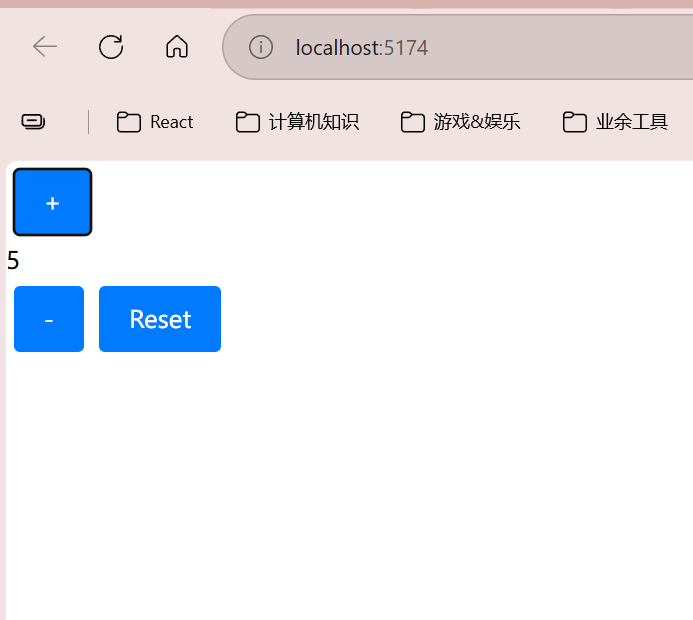

操作什么的，木得问题哦

### 深层次状态

如果上述中`PriceState`中还有对象的话，那么更新的话就不能只更新对象中的属性：

比如这个：

```ts
import { create } from 'zustand'

interface User {
    gourd: {
        oneChild: string,
        twoChild: string,
        threeChild: string,
        fourChild: string,
        fiveChild: string,
        sixChild: string,
        sevenChild: string,
    },
    updateGourd: () => void
}

// 创建 store
const useUserStore = create<User>(((set) => ({
    // 初始化葫芦娃状态
    gourd: {
        oneChild: '大娃',
        twoChild: '二娃',
        threeChild: '三娃',
        fourChild: '四娃',
        fiveChild: '五娃',
        sixChild: '六娃',
        sevenChild: '七娃',
    },
    // 更新方法
    updateGourd: () => set((state) => ({
        gourd: {
            // ...state.gourd,  // 需要手动合并状态
            oneChild: '大娃-超进化',
        }
    }))
})))

export default useUserStore;
```

这里的：

```ts
updateGourd: () => set((state) => ({
        gourd: {
            // ...state.gourd,  // 需要手动合并状态
            oneChild: '大娃-超进化',
        }
    }))
```

不能和上面一样只赋值给oneChild了

#### 解决方案

就用之前的immer中间库就行了

```bash
npm install immer
```

```ts
import { produce } from 'immer'

const data = {
  user: {
    name: '张三',
    age: 18
  }
}

// 使用 produce 创建新状态
const newData = produce(data, draft => {
  draft.user.age = 20  // 直接修改 draft
})

console.log(newData, data) 
// 输出:
// { user: { name: '张三', age: 20 } } 
// { user: { name: '张三', age: 18 } }
```

#### 在Zustand中使用

引入的话就需要：

```ts
import { immer } from "zustand/middleware/immer";
```

修改我们原来的price.ts:

```ts
import { create } from "zustand";
import { immer } from "zustand/middleware/immer";

interface PriceState {
    price: number;
    state: number;
    user: {
        name: string;
        age: number;
        email: string;
    };
    incrementPrice: () => void;
    decrementPrice: () => void;
    resetPrice: () => void;
    getPrice: () => number;
    updateUser: () => void;
}

const usePriceStore = create<PriceState>()(immer((set, get) => ({
    // state也就是这个对象本身
    // zustand设置属性的时候不会像useState中那样覆盖整个state对象，而是会进行合并
    // 所以我们只需要传入需要更新的属性即可
    price: 0,
    state: 0,
    user: {
        name: '中华第一剑',
        age: 25,
        email: 'black survival 2@email.com'
    },
    incrementPrice: () => set((state) => ({ price: state.price + 1 })),
    decrementPrice: () => set((state) => ({ price: state.price - 1 })),
    resetPrice: () => set({ price: 0 }), // 可以直接传入一个对象来更新state，不需要使用函数形式
    getPrice: () => get().price,  // 通过get函数获取当前的state对象，然后访问price属性
    updateUser: () => set((state) => {
        state.user.age = 30;
    })
})))

export default usePriceStore;
```

然后在App.tsx里直接调用即可：

```tsx
import React from 'react';
import  usePriceStore  from './stores/price';
import './App.css';

const App: React.FC = () => {
    const { price, incrementPrice, decrementPrice, resetPrice, user, updateUser } = usePriceStore();
    return (
        <>
            <button className='app-btn' onClick={incrementPrice}> + </button>
            <p>{price}</p>
            <button className='app-btn' onClick={decrementPrice}> - </button>
            <button className='app-btn' onClick={resetPrice}> Reset </button>
            <p>name:{user.name}</p>
            <p>age:{user.age}</p>
            <p>email:{user.email}</p>
            <button className='app-btn' onClick={updateUser}> Update User </button>
        </>
    );
}

export default App
```

#### 原理剖析

immer.js 通过 Proxy 代理对象的所有操作，实现不可变数据的更新。当对数据进行修改时，immer 会创建一个被修改对象的副本，并在副本上进行修改，最后返回修改后的新对象，而原始对象保持不变。这种机制确保了数据的不可变性，同时提供了直观的修改方式。

immer 的核心原理基于以下两个概念：

1. 写时复制 (Copy-on-Write)
    
    - 无修改时：直接返回原对象
    - 有修改时：创建新对象
2. 惰性代理 (Lazy Proxy)
    
    - 按需创建代理
    - 通过 Proxy 拦截操作
    - 延迟代理创建

### 状态简化

这一章详情请看：[状态简化 | react docs](https://message163.github.io/react-docs/react/zustand/simplify.html)

这里如果用解构的话，就会出现性能问题：比如组件B解构出了price，组件A解构但没有用price，一旦price发生变化，组件A也会重新渲染，这样会对性能产生一些影响

所以为了规避这个问题，我们可以使用状态选择器，状态选择器可以让我们只选择我们需要的部分状态，这样就不会引发不必要的重渲染，此时我们需要修改我们的App.tsx:

```tsx
const price = usePriceStore( state => state.price);
const user = usePriceStore(state => state.user);
const incrementPrice = usePriceStore(state => state.incrementPrice);
const decrementPrice = usePriceStore(state => state.decrementPrice);
const resetPrice = usePriceStore(state => state.resetPrice);
const updateUser = usePriceStore(state => state.updateUser);
```

这种解构方式才是正确的，但是属性多了又该怎么办呢？
因此衍生出了`useShallow`:

```tsx
import { useShallow } from 'zustand/react/shallow';
const { price, user, incrementPrice, decrementPrice, resetPrice, updateUser } = usePriceStore(useShallow((state) => ({
	price: state.price,
	user: state.user,
	incrementPrice: state.incrementPrice,
	decrementPrice: state.decrementPrice,
	resetPrice: state.resetPrice,
	updateUser: state.updateUser
})))
```

这样只针对导入的属性来针对性的渲染组件即可

### 中间件

zustand的中间件的用法，其实就是不停的用中间件包裹，比如这种：

```ts
const usePriceStore = create<PriceState>()(
    immer(
        middleware1(
            middleware2(
                (set, get) => ({
                    // state也就是这个对象本身
                    // zustand设置属性的时候不会像useState中那样覆盖整个state对象，而是会进行合并
                    // 所以我们只需要传入需要更新的属性即可
                    price: 0,
                    state: 0,
                    user: {
                        name: '中华第一剑',
                        age: 25,
                        email: 'black survival 2@email.com'
                    },
                    incrementPrice: () => set((state) => ({ price: state.price + 1 })),
                    decrementPrice: () => set((state) => ({ price: state.price - 1 })),
                    resetPrice: () => set({ price: 0 }), // 可以直接传入一个对象来更新state，不需要使用函数形式
                    getPrice: () => get().price,  // 通过get函数获取当前的state对象，然后访问price属性
                    updateUser: () => set((state) => {
                        state.user.age = 30;
                    })
                })
            )
        )
    )
)
```

可以自定义实现一个中间件，比如实现一个简易的日志中间件，了解其中间件的实现原理,：

```tsx
const logger = (config) => (set, get, api) => config((...args) => {
    console.log(api)
    console.log('before', get())
    set(...args)
    console.log('after', get())
}, get, api)
```

参数解释：

1. config (外层函数参数)
    
    - 类型：函数 (set, get, api) => StoreApi
    - 作用：原始创建 store 的配置函数，由用户传入。中间件需要包装这个函数。
2. set (内层函数参数)
    
    - 类型：函数 (partialState) => void
    - 作用：原始的状态更新函数，用于修改 store 的状态。
3. get (内层函数参数)
    
    - 类型：函数 () => State
    - 作用：获取当前 store 的状态值。
4. api (内层函数参数)
    
    - 类型：对象 StoreApi
    - 作用：包含 store 的完整 API（如 setState, getState, subscribe, destroy 等方法）。

一些官方中间件请参考：[中间件 | react docs](https://message163.github.io/react-docs/react/zustand/middleware.html#devtools)


