## 概述

### 关于vite

vite构建工具的入口文件时index.html：

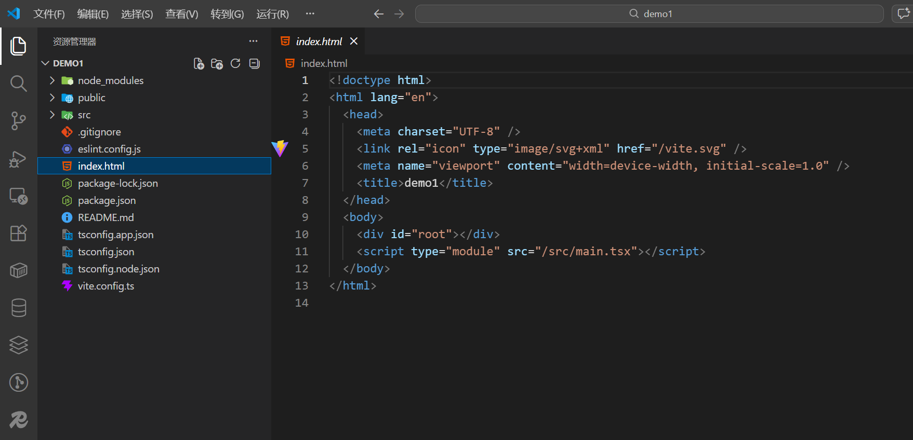

而webpack是main.ts

### src

src下的main.tsx:

```tsx main.tsx
import { StrictMode } from 'react'
import { createRoot } from 'react-dom/client'
import './index.css'
import App from './App.tsx'

createRoot(document.getElementById('root')!).render(
  <StrictMode>
    <App />
  </StrictMode>,
)
```

> `document.getElementById('root')!`后的!是非空断言，证明一定能够读到

将App组件挂载到root下，而root就是Index.html中的：

```html index.html
<!doctype html>
<html lang="en">
  <head>
    <meta charset="UTF-8" />
    <link rel="icon" type="image/svg+xml" href="/vite.svg" />
    <meta name="viewport" content="width=device-width, initial-scale=1.0" />
    <title>demo1</title>
  </head>

  <body>
    <div id="root"></div>
    <script type="module" src="/src/main.tsx"></script>
  </body>
</html>
```

public目录下的东西打完包以后是直接存放到根目录下的：比如public/vite.svg，是可以直接通过[localhost:5173/vite.svg](http://localhost:5173/vite.svg)访问的：

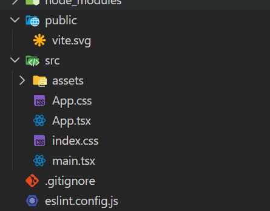

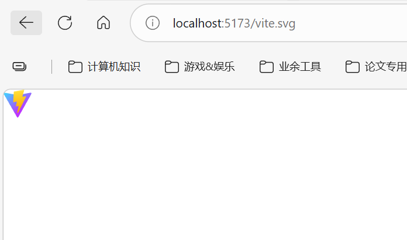

打包完以后：

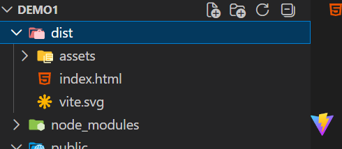

可以看到确实在根目录下

而assets中的资源文件会进行预处理

### JSX和TSX

jsx是js的语法扩展，允许在js中编写html代码。

例如：`const fn = () => <div>小满是谁？没听说过</div>`

vue中使用双括号，react中使用{ }：

```tsx 
function App() { 
	const num: number = 333 
	const fn = () => 'test' 
	return (
		 <> 
			 {'11' /** 字符串用法 */} 
			 {num /** 变量用法 */} 
			 {fn() /** 函数用法 */} 
			 {new Date().getTime() /** 日期用法 */} 
		 </> 
	 ) 
 }
```

如果是对象，一定要做序列化才行：

```tsx
function App() {
  const obj = {
    name: '中华第一剑'
  }
  return (
    <>
      <div>{ JSON.stringify(obj) }</div>
    </>
  )
}
```

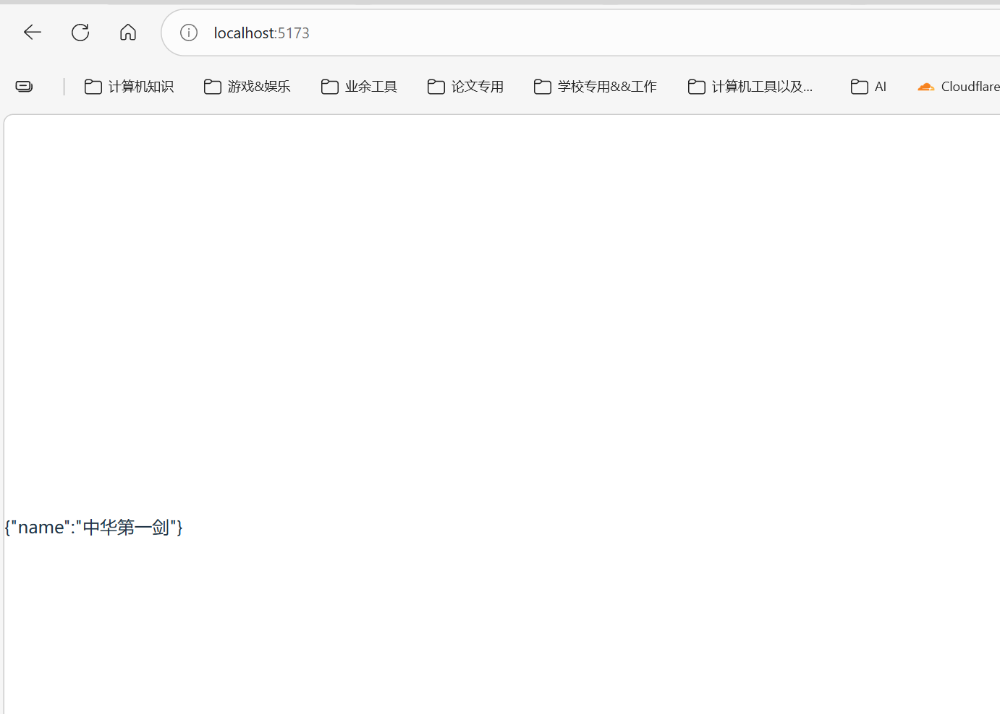

#### 事件添加

使用onClick进行事件的绑定添加:

```tsx
function App() {
  const fn = () => {
    console.log('hello sekai')
  }

  return (
    <>
      <div onClick={fn}>点击我打印hello sekai</div>
    </>
  )
}
```

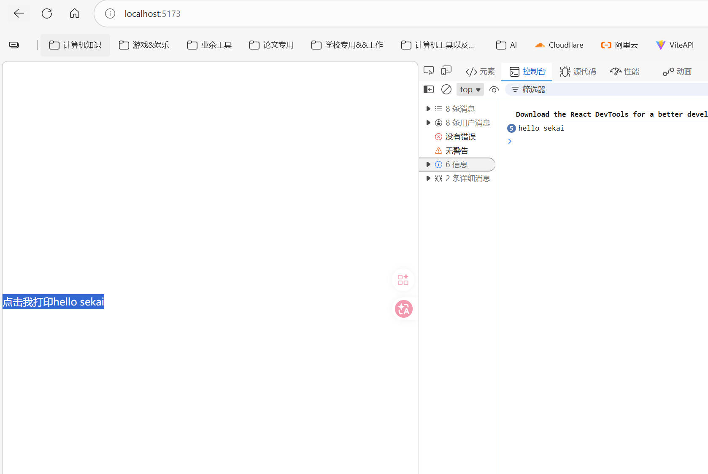

如果是需要进行传参，则使用高阶函数：

```tsx
function App() {
  const fn = (params:string) => {
    console.log(params)
  }

  return (
    <>
      <div onClick={() => fn('hello sekai')}>点击我打印hello sekai</div>
    </>
  )
}
```

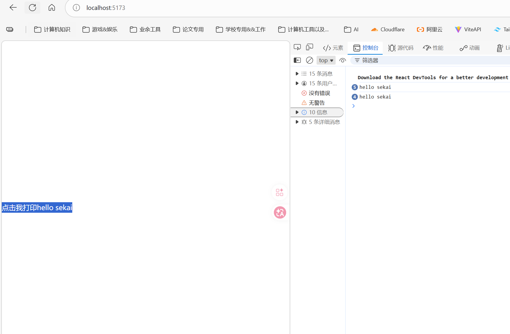

关于泛型冲突，由于泛型是\<T\>, 这在tsx语法中很容易理解成html中的标签，因此正常写泛型语法会跟tsx语法冲突，他会把泛型理解成是一个元素，解决方案后面加一个,即：

```tsx
function App() {
  const value: string = '中华第一剑'
  const fn = <T,>(params:T) => {
    console.log(params)
  }

  return (
    <>
      <div onClick={() => fn(value)}>{value}</div>
    </>
  )
}
```

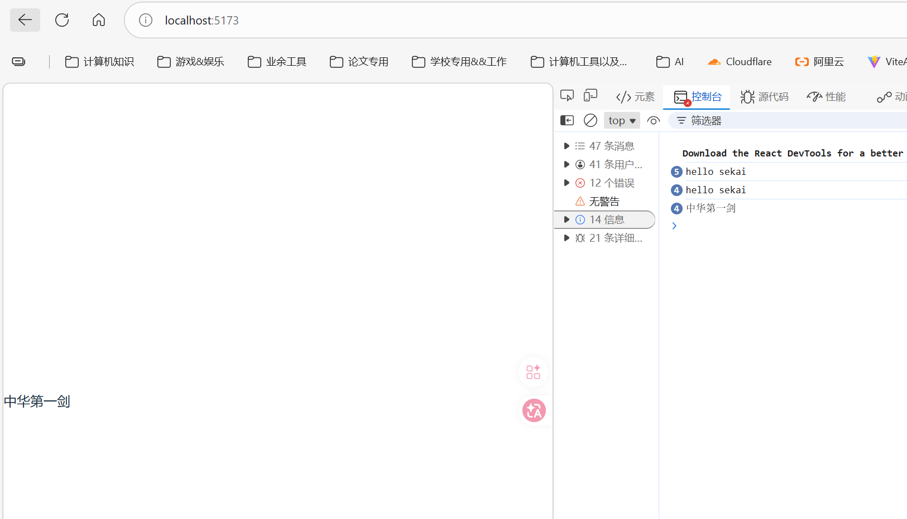

但是绑定style或者属性可以用对象绑定：

```tsx
//绑定样式style 
function App() { 
	const styles = { 
		color: 'red' 
	}
	return ( 
	<> 
		<div style={styles}>test</div> 
	</> 
	) 
}
```

#### v-html类似写法以及遍历dom元素

tsx渲染html代码片段用到dangerouslySetInnerHTML：

```tsx
function App() {
  const innerHtml: string = '<div>渲染出来的中华第一剑</div>'
  return (
    <>
      <div dangerouslySetInnerHTML={{ __html: innerHtml }}>
        {/* 注意：中间不能有内容，不然不会进行渲染 */}
      </div>
    </>
  )
}
```

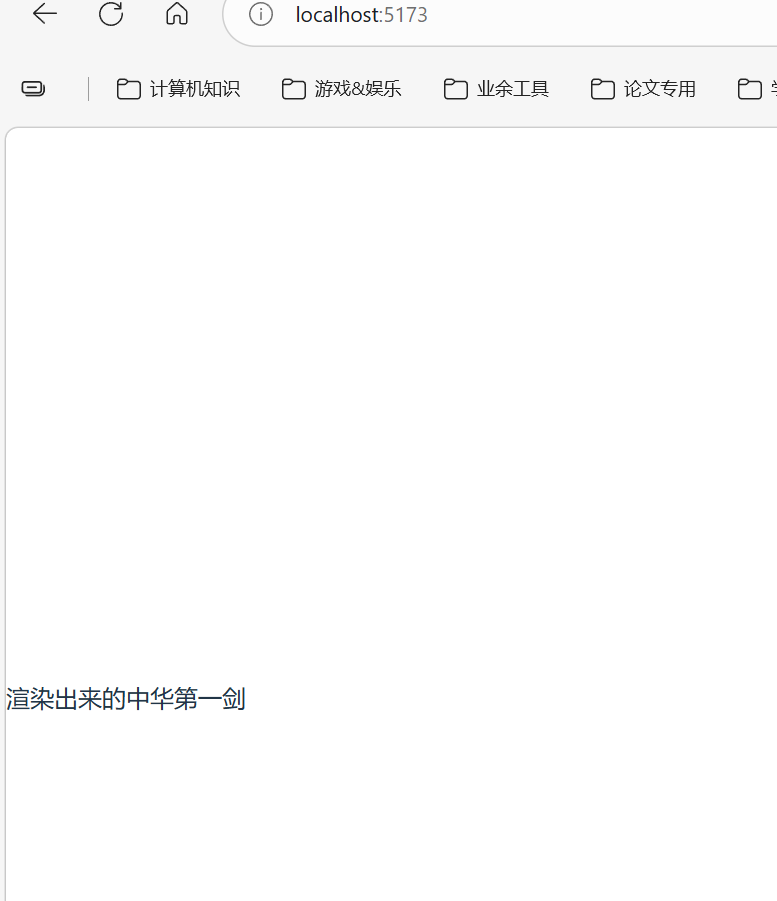

遍历使用map：

```tsx
function App() {
  const arr = [1, 2 ,3,4,5]
  return (
    <>
      <div>
        {arr.map((item) => (
          <h1 key={item}>{item}</h1>
        ))}
      </div>
    </>
  )
}
```

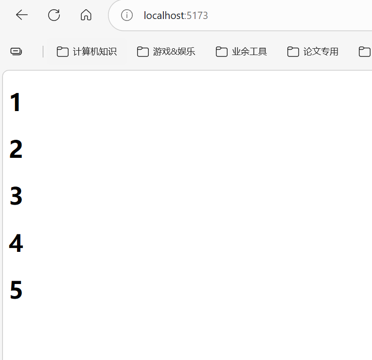

### 工具

#### babel

详细可见[Babel | react docs](https://message163.github.io/react-docs/react/tools/babel.html)

#### swc

SWC 既可用于编译，也可用于打包。对于编译，它使用现代 JavaScript 功能获取 JavaScript / TypeScript 文件并输出所有主流浏览器支持的有效代码。
**`SWC在单线程上比 Babel 快 20 倍，在四核上快 70 倍。`**

### 虚拟DOM

#### fiber

为了解决React15在大组件更新时产生的卡顿现象，React团队提出了 Fiber 架构，并在 React16 发布，将 同步递归无法中断的更新 重构为 异步的可中断更新

它实现了4个具体目标

1. 可中断的渲染：Fiber 允许将大的渲染任务拆分成多个小的工作单元（Unit of Work），使得 React 可以在空闲时间执行这些小任务。当浏览器需要处理更高优先级的任务时（如用户输入、动画），可以暂停渲染，先处理这些任务，然后再恢复未完成的渲染工作。
    
2. 优先级调度：在 Fiber 架构下，React 可以根据不同任务的优先级决定何时更新哪些部分。React 会优先更新用户可感知的部分（如动画、用户输入），而低优先级的任务（如数据加载后的界面更新）可以延后执行。
    
3. 双缓存树（Fiber Tree）：Fiber 架构中有两棵 Fiber 树——current fiber tree（当前正在渲染的 Fiber 树）和 work in progress fiber tree（正在处理的 Fiber 树）。React 使用这两棵树来保存更新前后的状态，从而更高效地进行比较和更新。
    
4. 任务切片：在浏览器的空闲时间内（利用 requestIdleCallback思想），React 可以将渲染任务拆分成多个小片段，逐步完成 Fiber 树的构建，避免一次性完成所有渲染任务导致的阻塞。

首先理解浏览器每一帧要做什么：

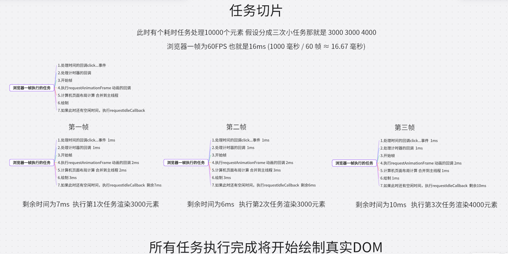

> 👉 任务切片的目的不是减少帧数，而是：让每一帧都不超过 16ms
> 从而：
> ✔ 保持 60fps  
> ✔ 避免卡顿  
> ✔ 提升交互流畅度

而且任务是分三次执行，但是渲染也渲染了三次，也就是动画也是60帧，不存在3帧才渲染一次

fiber Tree

fiber tree是长成这样的：

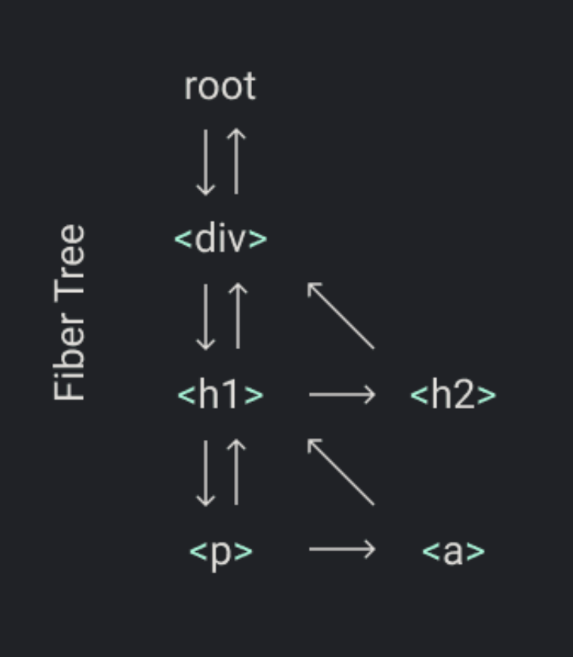


具体点就是：

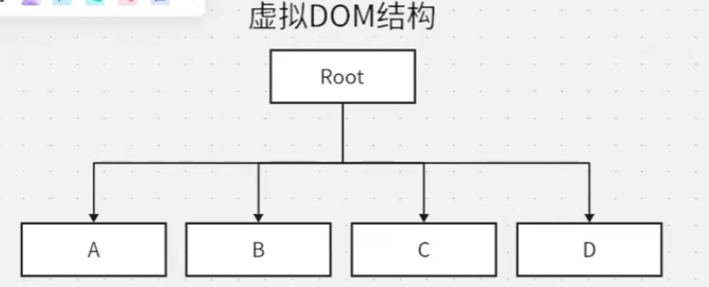

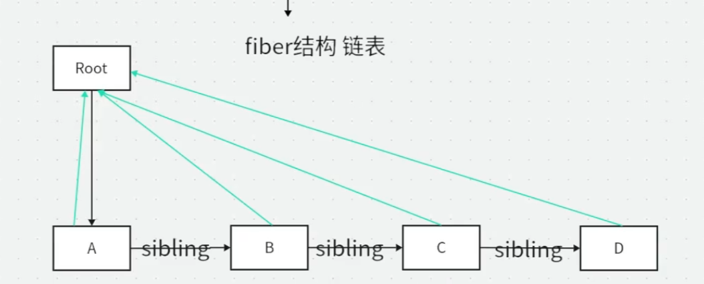

手绘一下逻辑关系就是：

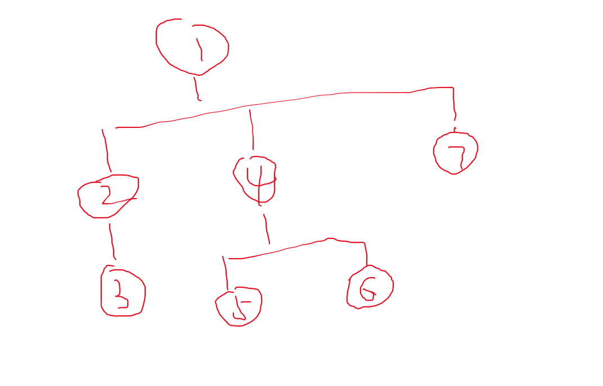

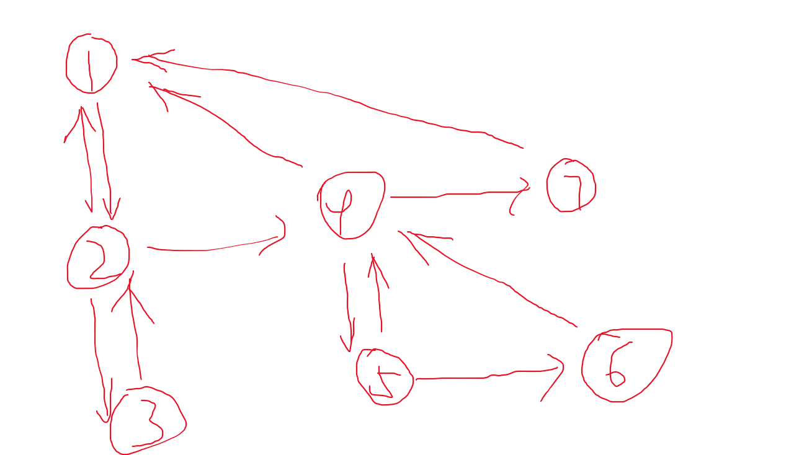


> 这个过程也是一个深度优先的算法

`oldFiber` 的本质可以先一句话理解成：

**“旧 fiber 树里，当前这个父节点的某一个旧子节点”**。  

let oldFiber = fiber.alternate && fiber.alternate.child;

意思是：

- `fiber`：当前正在构建的新 fiber 节点
- `fiber.alternate`：它对应的“上一轮渲染时的旧 fiber 节点”
- `fiber.alternate.child`：这个旧 fiber 节点的第一个旧子节点

所以 `oldFiber` 一开始拿到的是：

**旧树中，与当前父 fiber 对应的那一串旧 children 的起点。**

细节代码如下：

```js
// jsx通过babel或者swc转换成js代码，最终会调用React.createElement方法创建虚拟DOM对象
const React = {
    createElement(type, props, ...children) {
        return {
            type,
            props: {
                ...props,
                children: children.map(child => {

                    if (typeof child === 'object') {

                        return child;

                    } else {

                        return React.createTextElement(child);

                    }

                }

                )

            },

  

        };

    },

    createTextElement(text) {

        return {

            type: 'TEXT_ELEMENT',

            props: {

                nodeValue: text,

                children: [],

            },

  

        }

    }

}

  

// const text = document.createTextNode('');

// text.nodeValue = '思考认知'

  
  

const vdom = React.createElement('div', { id: 'container' }, React.createElement('h1', null, '小谢'));

  

// 完成虚拟DOM转fiber树的过程

  

let nextUnitOfWork = null; //下一个工作单元

let wipRoot = null; // 当前正在工作的fiber树的根节点

let currentRoot = null; //旧的fiber树的根节点

let deletions = null; //需要删除的fiber节点

  

// render函数接收虚拟DOM对象和容器节点，创建一个新的fiber树，并将新的fiber树的根节点赋值给wipRoot变量

function render(element, container) {

    // 初始化fiber树

    wipRoot = {

        dom: container, //容器节点

        props: {

            children: [element], //将虚拟DOM对象作为子节点

        },

        alternate: currentRoot, //旧的fiber树的根节点

    }

  

    deletions = []

  

    //将新的fiber树的根节点赋值给nextUnitOfWork变量，开始工作

    nextUnitOfWork = wipRoot;

}

  

// fiber树的结构

function workloop(deadline) {

    let shouldYield = false; //是否需要暂停工作

    // 如果有下一个工作单元，并且不需要暂停工作，就继续工作

    while (nextUnitOfWork && !shouldYield) {

        // 执行工作单元,返回下一个工作单元

        nextUnitOfWork = performUnitOfWork(nextUnitOfWork);

  

        // 获取当前帧剩余的时间，如果剩余时间小于1ms，就需要暂停工作，等待下一帧再继续工作

        shouldYield = deadline.timeRemaining() < 1; // timeRemaining方法返回当前帧剩余的时间，单位是毫秒，如果返回值小于1，说明当前帧已经没有剩余时间了，需要暂停工作，等待下一帧再继续工作

    }

  

    // 如果没有下一个工作单元并且还有待提交的工作根，就提交工作

    if (!nextUnitOfWork && wipRoot) {

        commitRoot();

    }

  

    // requestIdleCallback会在浏览器空闲时执行回调函数，回调函数会接收一个deadline对象，

    // deadline对象有一个timeRemaining方法，可以获取当前帧剩余的时间，如果timeRemaining方法返回0，

    // 说明当前帧已经没有剩余时间了，需要暂停工作，等待下一帧再继续工作

    requestIdleCallback(workloop)

}

  

// 创建DOM节点

function createDom(fiber) {

    // 每一个fiber都有type和props属性

    // 如果当前的type是'TEXT_ELEMENT'，那么就创建一个文本节点

    const dom = fiber.type === 'TEXT_ELEMENT' ? document.createTextNode('') : document.createElement(fiber.type);

  

    // 将props中的属性赋值给dom节点

    updateDom(dom, {}, fiber.props); // 挂载新属性

  

    return dom;

}

  

// 更新DOM节点的属性

// 封装成函数是因为后面需要用到diff算法来比较新旧虚拟DOM树的差异

function updateDom(dom, prevProps, nextProps) {

    // 删除旧的属性

    Object.keys(prevProps).forEach(key => {

        if (key === 'children') {

            return;

        } else {

            dom[key] = ''; // 删除属性

        }

    })

  

    // 添加新的属性

    Object.keys(nextProps).forEach(key => {

        if (key === 'children') {

            return;

        } else {

            dom[key] = nextProps[key];

        }

    })

}

  

// requestIdleCallback会在浏览器空闲时执行回调函数，

// 回调函数会接收一个deadline对象，deadline对象有一个timeRemaining方法，可以获取当前帧剩余的时间，

// 如果timeRemaining方法返回0，说明当前帧已经没有剩余时间了，需要暂停工作，等待下一帧再继续工作

requestIdleCallback(workloop)

  

// 执行工作单元，返回下一个工作单元

function performUnitOfWork(fiber) {

    // 如果当前fiber没有dom节点，就创建一个dom节点

    if (!fiber.dom) {

        fiber.dom = createDom(fiber);

    }

  
  

    // 读取子节点

    const elements = fiber.props.children;

  

    // 遍历子节点，创建子fiber

    reconcileChildren(fiber, elements);

  

    // 如果是父fiber有子fiber，就返回第一个子fiber作为下一个工作单元

    if (fiber.child) {

        return fiber.child;

    }

    // 如果没有子fiber，就返回兄弟fiber作为下一个工作单元

    let nextFiber = fiber;

    while (nextFiber) {

  

        if (nextFiber.sibling) {

            return nextFiber.sibling;

        }

        // 如果没有兄弟fiber，就返回父fiber的兄弟fiber作为下一个工作单元

        nextFiber = nextFiber.parent;

    }

  

    // 遍历完成，没有下一个工作单元了，返回null

    return null;

}

  

function createFiber(element, parent) {

    return {

        type: element.type, //节点类型

        props: element.props, //节点属性

        parent: parent, //父fiber

        dom: null, //dom节点

        child: null, //子fiber

        sibling: null, //兄弟fiber

        alternate: null, //旧的fiber节点

        effectTag: null, //副作用标签，标记需要新增的节点

    }

}

  

// 协调子节点，创建子fiber

// elements就是当前fiber的子节点，也就是虚拟DOM对象的children属性

function reconcileChildren(fiber, elements) {

    // diff算法的核心就是比较新旧虚拟DOM树的差异，找出需要更新的部分，然后只更新这些部分，而不是重新渲染整个页面、

    // 1. 形成fiber树

    // 2. 比较新旧fiber树的差异，找出需要更新的部分

    // 3. 只更新需要更新的部分，而不是重新渲染整个页面

  

    let index = 0; //当前子节点的索引

    let prevSibling = null; //上一个兄弟fiber

  

    /*

    `oldFiber` 的本质可以先一句话理解成：

    “旧 fiber 树里，当前这个父节点的某一个旧子节点”。  

    let oldFiber = fiber.alternate && fiber.alternate.child;

  

    意思是：

    - `fiber`：当前正在构建的新 fiber 节点

    - `fiber.alternate`：它对应的“上一轮渲染时的旧 fiber 节点”

    - `fiber.alternate.child`：这个旧 fiber 节点的第一个旧子节点

  

    所以 `oldFiber` 一开始拿到的是：

    旧树中，与当前父 fiber 对应的那一串旧 children 的起点。

    */

  

    let oldFiber = fiber.alternate && fiber.alternate.child; //旧的fiber树的第一个子fiber

  

    // 遍历子节点，创建子fiber

    while (index < elements.length || oldFiber != null) {

        const element = elements[index]; //当前子节点

        // 1. 复用

        let newFiber = null; //新的fiber节点

        const sameType = oldFiber && element && element.type === oldFiber.type; //判断新旧虚拟DOM节点的类型是否相同

        if (sameType) {

            console.log('复用节点', element.type);

            newFiber = {

                type: element.type, //节点类型

                props: element.props, //节点属性

                parent: fiber, //父fiber

                dom: oldFiber.dom, //dom节点,复用旧的dom节点

                alternate: oldFiber, //旧的fiber节点

                effectTag: 'UPDATE', //副作用标签，标记需要更新的节点

            }

        }

        // 2. 新增

        if (element && !sameType) {

            console.log('新增节点', element.type);

            newFiber = createFiber(element, fiber); //创建新的fiber节点，标记需要新增的节点

            newFiber.effectTag = 'PLACEMENT'; // 代表新增

        }

        // 3. 删除

        // 如果在旧的fiber树中有这个子节点，但是在新的fiber树中没有这个子节点，就标记需要删除的节点

        if (oldFiber && !sameType) {

            console.log('删除节点', oldFiber.type);

            oldFiber.effectTag = 'DELETION'; //标记需要删除的节点

            deletions.push(oldFiber); //将需要删除的节点添加到deletions数组中，后面会统一删除这些节点

        }

  

        if (oldFiber) {

            oldFiber = oldFiber.sibling; //更新旧的fiber节点，指向下一个兄弟fiber

        }

        // 创建子fiber

  
  

        if (index === 0) {

            // 如果是第一个子节点，就将它作为父fiber的child属性

            fiber.child = newFiber;

        } else if (element) {

            // 如果不是第一个子节点，就将它作为上一个兄弟fiber的sibling属性

            prevSibling.sibling = newFiber;

        }

  

        prevSibling = newFiber; //更新上一个兄弟fiber

        index++; //更新索引

    }

  

}

  

// 提交工作，执行副作用

function commitRoot() {

    deletions.forEach(commitWork); //删除需要删除的节点

    commitWork(wipRoot.child); //提交工作，从根节点开始提交

    currentRoot = wipRoot; //将当前正在工作的fiber树的根节点赋值给currentRoot变量，作为下一轮渲染时的旧fiber树

    wipRoot = null; //重置wipRoot变量

}

  

// commitWork函数接收一个fiber节点，根据fiber节点的effectTag属性，执行相应的操作

function commitWork(fiber) {

    if (!fiber) {

        return;

    }

    // 获取父节点

    const domParent = fiber.parent.dom; //父节点的dom节点  

    if (fiber.effectTag === 'PLACEMENT' && fiber.dom != null) {

        domParent.appendChild(fiber.dom); //如果是新增节点，就将它添加到父节点中

    } else if (fiber.effectTag === 'UPDATE' && fiber.dom != null) {

        updateDom(fiber.dom, fiber.alternate.props, fiber.props); //如果是更新节点，就更新它的属性

    } else if (fiber.effectTag === 'DELETION') {

        domParent.removeChild(fiber.dom); //如果是删除节点，就将它从父节点中删除

    }

  

    commitWork(fiber.child); //递归提交子节点
    commitWork(fiber.sibling); //递归提交兄弟节点

}

// 将fiber树渲染到页面上
// render(vdom, document.getElementById('root'))

// 测试用例diff
render(React.createElement('div', { id: 1 }, React.createElement('span', null, 'hello 11')), document.getElementById('root'));

setTimeout(() => {

    render(React.createElement('div', { id: 1 }, React.createElement('p', null, 'hello 22')), document.getElementById('root'));

}, 3000);
```

#### requestIdleCallback

requestidlecallback 执行阶段如下：

1. 处理事件的回调click...事件
2. 处理计时器的回调
3. 开始帧
4. 执行requestAnimationFrame 动画的回调
5. 计算机页面布局计算 合并到主线程
6. 绘制
7. 如果此时还有空闲时间，执行requestIdleCallback

用法：

requestidlecallback 接受一个回调函数 `callback` 并且在回调函数中会注入参数 `deadline`

deadline有两个值:

- `deadline.timeRemaining()` 返回是否还有空闲时间(毫秒)
    
- `deadline.didTimeout` 返回是否因为超时被强制执行(布尔值)
    

options:

- `{ timeout: 1000 }` 指定回调的最大等待时间（以毫秒为单位）。如果在指定的 timeout 时间内没有空闲时间，回调会强制执行，避免任务无限期推迟

具体使用案例如下：

```ts
const total = 50000
        const arr = []
        function generateArr() {
            for (let i = 0; i < total; i++) {
                arr.push(function () {
                    document.body.innerHTML += `<div>${i}</div>`
                })
            }
        }

        generateArr()

        // 直接渲染，非常卡顿
        /*
        for (let i = 0; i < arr.length; i++) {
            arr[i]()
        }
        */


        function workLoop(time) {
            // 如果剩余时间大于1，则可以执行绘制操作
            if (time.timeRemaining() > 1 && arr.length > 0) {
                const fn = arr.shift()
                fn()
            }

            // 进行递归
            requestIdleCallback(workLoop, {timeout: 1000})
        }
        // 使用requestIdleCallback进行优化
        requestIdleCallback(workLoop, {timeout: 1000})
```

由于原生的`requestIdleCallback`会有4ms的延迟时间，并且在很多浏览器上会有明显的差异，因此react使用`MessageChannel`这种替代方案

MessageChanne设计初衷是为了方便 我们在不同的上下文之间进行通讯，例如`web Worker`,`iframe` 它提供了两个端口（port1 和 port2），通过这些端口，消息可以在两个独立的线程之间双向传递，用法如下：

```ts
 // 创建 MessageChannel
const channel = new MessageChannel();
const port1 = channel.port1;
const port2 = channel.port2;

// 设置 port1 的消息处理函数
port1.onmessage = (event) => {
	console.log('Received by port1:', event.data);
	port1.postMessage('Reply from port1'); // 向 port2 发送回复消息
};

// 设置 port2 的消息处理函数
port2.onmessage = (event) => {
	console.log('Received by port2:', event.data);
};

// 通过 port2 发送消息给 port1
port2.postMessage('Message from port2');
```

并且消息处理均是宏任务，且延迟为0ms

#### React版简易调度器

React调度器给每一个任务分配了优先级

1. ImmediatePriority : 立即执行的优先级，级别最高
2. UserBlockingPriority : 用户阻塞级别的优先级
3. NormalPriority : 正常的优先级
4. LowPriority : 低优先级
5. IdlePriority : 最低阶的优先级

同时还给每个任务设置了过期时间，过期时间越短，优先级越高

声明taskQueue 为数组，存储每个任务的信息，包括优先级，过期时间，回调函数

声明isPerformingWork 为布尔值，表示当前是否在执行任务

声明port 为MessageChannel，用于发送和接收消息

然后将任务添加到队列里面，并且添加进去的时候还需要根据优先级进行排序，然后调用workLoop 执行任务

```js
const ImmediatePriority = 1; // 立即执行的优先级, 级别最高 [点击事件，输入框，]
const UserBlockingPriority = 2; // 用户阻塞级别的优先级, [滚动，拖拽这些]
const NormalPriority = 3; // 正常的优先级 [redner 列表 动画 网络请求]
const LowPriority = 4; // 低优先级  [分析统计]
const IdlePriority = 5;// 最低阶的优先级, 可以被闲置的那种 [console.log]

function getCurrentTime() {
    return performance.now();
}

class SimpleScheduler {
    constructor() {
        // 任务队列,每个任务都是一个对象，包含优先级和回调函数
        this.taskQueue = [];

        // 是否正在执行任务，防止重复调用requestIdleCallback
        this.isPerformingWork = false;
        const channel = new MessageChannel();
        this.port = channel.port2; // 发送消息的端口

        // 接收消息的端口，绑定performWorkUntilDeadline方法，当接收到消息时就执行这个方法
        channel.port1.onmessage = this.performWorkUntilDeadline.bind(this)
    }

    /**
     *
     * @param {优先级} priority
     * @param {回调函数} callback
     */

    scheduleCallback(priority, callback) {
        const curTime = getCurrentTime();
        let timeout;
        switch (priorityLevel) {
            case ImmediatePriority:
                timeout = -1;
                break;
            case UserBlockingPriority:
                timeout = 250;
                break;
            case NormalPriority:
                timeout = 5000;
                break;
            case LowPriority:
                timeout = 10000;
                break;
            case IdlePriority:
                timeout = 1073741823;
                break;
        }

        const task = {
            callback,
            priority,
            expirationTime: curTime + timeout
        }
        this.push(this.taskQueue, task);
        this.schedulePerformWorkUntilDeadline()
    }

    // 接收消息，执行任务
    performWorkUntilDeadline(deadline) {
        this.isPerformingWork = true; // 标记正在执行任务
        this.workLoop(deadline);
        this.isPerformingWork = false; // 标记任务执行完毕
    }
    
    // 任务循环，执行任务队列中的任务
    workLoop(deadline) {
        // 如果有任务，并且当前帧的剩余时间大于0，就继续执行任务
        let currentTask = this.peek(this.taskQueue);
        while (currentTask) {
            let cb = currentTask.callback;
            cb && cb(); // 执行回调函数
            this.pop(this.taskQueue); // 删除已经执行的任务
            currentTask = this.peek(this.taskQueue); // 获取下一个任务
        }
    }
    
    push(queue, task) {
        queue.push(task);

        // 根据优先级和过期时间排序，优先级高的任务排在前面，如果优先级相同，就根据过期时间排序，过期时间早的排在前面
        queue.sort((a, b) => a.expirationTime - b.expirationTime);
    }

    peek(queue) {
        // 返回队列中的第一个任务，也就是优先级最高的任务
        return queue[0] || null;
    }

    pop(queue) {
        // 删除第一个任务
        return queue.shift();
    }

    // 这个方法会在浏览器空闲时被调用，执行任务队列中的任务，直到没有任务了或者当前帧的剩余时间小于0了，就暂停工作，等待下一帧再继续工作
    schedulePerformWorkUntilDeadline() {
        if (!this.isPerformingWork) {
            // 如果没有正在执行任务，就发送消息，触发performWorkUntilDeadline方法
            this.isPerformingWork = true; // 标记正在执行任务，防止重复调用requestIdleCallback
            this.port.postMessage(null); // 发送消息，触发performWorkUntilDeadline方法
        }
    }
}

const ssr = new SimpleScheduler();

// 这个方法可以调用多次，并且顺序不是代码中的顺序，而是根据优先级来执行的
ssr.scheduleCallback(UserBlockingPriority, () => {
    console.log('用户阻塞级别的任务');
});

ssr.scheduleCallback(ImmediatePriority, () => {
    console.log('立即执行的任务');
});
```

### Hooks

> **所有的hook必须要在组件的最顶层使用

#### useState

vue中使用ref变成响应式，而react则使用useState，用法如下：

```tsx
import { useState } from "react";
function App() {
 let [demoCount, setDemoCount] = useState(0);
 
 return (
  <div>
   <h1>Count: {demoCount}</h1>
   <button onClick={() => setDemoCount(demoCount + 1)}>Increment</button>
  </div>
 );
}

export default App
```

#### 数组

复杂类型数据不能够使用原数组中的pop，push等方法，而是使用setArr之类的方法：

```tsx
import { useState } from "react"
function App() {
  let [arr, setArr] = useState([1, 2, 3])
  const heandleClick = () => {
    setArr([...arr,4]) //末尾新增 扩展运算符
    //setArr([0,...arr]) 头部新增 扩展运算符
  }
  return (
    <>
      <button onClick={heandleClick}>更改值</button>
      <div id="aaa">{arr}</div>
    </>
  )
}
export default App
```

也就是说需要在setArr中得到新数组才行，修改原数组没有任何意义

下面是常见数组操作的参考表。当你操作 React state 中的数组时，你需要避免使用左列的方法，而首选右列的方法：

| 避免使用 (会改变原始数组)              | 推荐使用 (会返回一个新数组）          |
| --------------------------- | ------------------------ |
| 添加元素 push，unshift           | concat，[...arr] 展开语法（例子） |
| 删除元素 pop，shift，splice       | filter，slice（例子）         |
| 替换元素 splice，arr[i] = ... 赋值 | map（例子）                  |
| 排序 reverse，sort             | 先将数组复制一份（例子）             |
我第一次学会觉得这样做十分麻烦，其实是有一定道理的：

如果你这样改：

```tsx
arr.push(4)  
setArr(arr)
```

表面上你调用了 `setArr`，但传进去的还是 **同一个引用**。  
React 做状态比较时，会发现“新旧引用一样”，就可能认为状态没变，进而不触发你期望的更新。
所以才要这样：

```tsx
setArr([...arr, 4])
```

这里创建了一个新数组，引用变了，React 才能明确知道：  
**状态确实更新了。**

#### 对象

useState可以接受一个函数，可以在函数里面编写逻辑，初始化值，注意这个只会执行一次，更新的时候就不会执行了。

> 在使用setObject的时候，可以使用Object.assign合并对象 或者 ... 合并对象，不能单独赋值，不然会覆盖原始对象。

```tsx
import { useState } from "react";
function App() {
 let [obj, setObj] = useState(() => {
  const date = new Date().getFullYear() + '-' + (new Date().getMonth() + 1) + '-' + new Date().getDate()
  
  return {
    date: date,
    name: '中华第一剑',
    age: 18,
  }
 });

 return (
  <div>
   <h1>日期: {obj.date}</h1>
   <h1>姓名: {obj.name}</h1>
   <h1>年龄: {obj.age}</h1>
    <button onClick={() => {setObj({
     ...obj,
     name: '中华第二剑',
     age: 28,
    }) }}>修改姓名和年龄</button>
  </div>
 );
}

export default App
```

关于useState的异步更新机制，可以查看：[useState | react docs](https://message163.github.io/react-docs/react/hooks/useState.html#usestate%E6%9B%B4%E6%96%B0%E6%9C%BA%E5%88%B6)

#### useReducer

使用方法如下：

```tsx
const [state, dispatch] = useReducer(reducer, initialArg, init?)
```

`useReducer` 首次渲染时，先看有没有 `init`：

- 没有就直接用 `initialArg` 作为初始 state
- 有就执行 `init(initialArg)` 得到初始 state  
    后续再通过 `dispatch(action)` 调用 `reducer(state, action)` 来更新状态。

**reducer这个函数默认是不走的，而是等到dispatch进行触发的时候才会执行**：

> 在StrictMode下，若reducer函数修改了源对象，那么就会执行两次这个函数，因此需要严格职守不能修改源对象这一条板上钉钉的事实

下面是使用例子：

```tsx
import { useState, useReducer } from "react";
import './demo.css';

const initData = [
  { name: '小满(只)', price: 100, count: 1, id: 1, isEdit: false },
  { name: '中满(只)', price: 200, count: 1, id: 2, isEdit: false },
  { name: '大满(只)', price: 300, count: 1, id: 3, isEdit: false }
]

// 这个函数的作用是根据不同的action来更新数据
const reducer = (state: Data, action: { type: 'add' | 'sub' | 'del' | 'edit' | 'changeName' , id: number, newname?: string }): Data => {
  return state.map(item => {
    if (item.id !== action.id) return item;
    switch (action.type) {
      case 'add':
        return { ...item, count: item.count + 1 };
      case 'sub':
        return { ...item, count: item.count - 1 };
      case 'del':
        return null;
      case 'edit':
        return { ...item, isEdit: !item.isEdit };
      case 'changeName':
        return { ...item, name: (action as any).newname };
      default:
        return item;
    }
  }).filter(Boolean) as Data;
}

type Data = typeof initData;
function App() {
  const [data, dispatchData] = useReducer(reducer, initData);
  return (
    <>
      <h1>购物车</h1>
      <table className="demo-table" style={{
        border: '1px solid black', padding: '10px', borderCollapse: 'collapse', backgroundColor: 'lightgray', width: '800px',
      }}>
        <thead>
          <tr>
            <th>商品名称</th>
            <th>单价</th>
            <th>数量</th>
            <th>总价</th>
            <th>操作</th>
          </tr>
        </thead>
        <tbody>
          {data.map((item) => {
            if (!item) return null;
            return <tr key={item.id}>
              <td>
                {item.isEdit?
                <input value={item.name} onChange={(e) => dispatchData({type: 'changeName', id: item.id, newname: e.target.value})} type="text">
                </input> : item.name}</td>
              <td>{item.price}</td>
              <td>
                <button disabled={item.count >= 10} onClick={() => dispatchData({ type: 'add', id: item.id })}>+</button>
                {item.count}
                <button disabled={item.count <= 1} onClick={() => dispatchData({ type: 'sub', id: item.id })}>-</button>
              </td>
              <td>{item.price * item.count}</td>
              <td>
                <button onClick={() => dispatchData({ type: 'edit', id: item.id })}>编辑</button>
                <button onClick={() => dispatchData({ type: 'del', id: item.id })}>删除</button>
              </td>
            </tr>
          })}
        </tbody>
        <tfoot>
          <tr>
            <td colSpan={5} align="right">总价: {data.reduce((pre, item) => {
              if (!item) return pre;
              return pre + item.price * item.count
            }, 0)}</td>
          </tr>
        </tfoot>
      </table>
      <div>
      </div>
    </>
  );
}
export default App
```


#### useImmer

`useImmer` 是基于 [immer](https://immerjs.github.io/immer/) 库实现的一个 React Hook，它让你可以像修改可变数据一样来修改不可变数据。immer 是一个不可变的数据结构库，完全符合 React 的不可变性原则。

```bash
npm install immer use-immer
```

比如有一个结构体：

```tsx
interface User {
  name: string
  age: number
  profile: {
    avatar: string
    bio: string
    preferences: {
      theme: 'light' | 'dark'
      notifications: boolean
    }
  }
}
```

如果要修改theme，那么需要：

```tsx
{
  ...user,
  preferences:{
    ...user.profile.preferences,
    theme: 'dark'
  }
}
```

这样就会非常麻烦，但是使用useImmer则非常简单：

```tsx
const [user, setUser] = useImmer<User>({
    name: '中华第一剑',
    age: 20,
    profile: {
      avatar: '/avatar.jpg',
      bio: '前端开发者',
      preferences: {
        theme: 'light',
        notifications: true
      }
    }
  })
  
  setUser(draft => {
      draft.profile.preferences.theme = 'dark'
  })
```

直接修改对应的值就行了，非常简单
数组的话直接push，pop即可

普通的值的话，直接修改即可：

```tsx
const [name, setName] = useImmer<string>('中华第一剑')
setName('中华第一奶')
```

useImmerReducer也是同理，直接在reducer函数中改属性就行了，不需要return一个新的对象，案例如下：

```tsx
import { useImmerReducer } from 'use-immer'

interface State {
  count: number
  history: number[]
  isLoading: boolean
}

type Action = 
  | { type: 'INCREMENT' }
  | { type: 'DECREMENT' }
  | { type: 'RESET' }
  | { type: 'SET_LOADING'; payload: boolean }
  | { type: 'ADD_TO_HISTORY' }

const initialState: State = {
  count: 0,
  history: [],
  isLoading: false
}

function counterReducer(draft: State, action: Action) {
  switch (action.type) {
    case 'INCREMENT':
      draft.count += 1
      break
    case 'DECREMENT':
      draft.count -= 1
      break
    case 'RESET':
      draft.count = 0
      break
    case 'SET_LOADING':
      draft.isLoading = action.payload
      break
    case 'ADD_TO_HISTORY':
      draft.history.push(draft.count)
      break
  }
}

export default function AdvancedCounter() {
  const [state, dispatch] = useImmerReducer(counterReducer, initialState)

  const handleIncrement = () => {
    dispatch({ type: 'SET_LOADING', payload: true })
    
    // 模拟异步操作
    setTimeout(() => {
      dispatch({ type: 'INCREMENT' })
      dispatch({ type: 'ADD_TO_HISTORY' })
      dispatch({ type: 'SET_LOADING', payload: false })
    }, 500)
  }

  return (
    <div className="advanced-counter">
      <h2>高级计数器</h2>
      
      <div className="display">
        <span>当前值: {state.count}</span>
        {state.isLoading && <span className="loading">加载中...</span>}
      </div>

      <div className="controls">
        <button 
          onClick={handleIncrement}
          disabled={state.isLoading}
        >
          增加
        </button>
        <button 
          onClick={() => dispatch({ type: 'DECREMENT' })}
          disabled={state.isLoading}
        >
          减少
        </button>
        <button 
          onClick={() => dispatch({ type: 'RESET' })}
          disabled={state.isLoading}
        >
          重置
        </button>
      </div>

      {state.history.length > 0 && (
        <div className="history">
          <h3>历史记录:</h3>
          <ul>
            {state.history.map((value, index) => (
              <li key={index}>{value}</li>
            ))}
          </ul>
        </div>
      )}
    </div>
  )
}
```

#### useSyncExternalStore

useSyncExternalStore 是 React 18 引入的一个 Hook，用于从外部存储（例如状态管理库、浏览器 API 等）获取状态并在组件中同步显示。这对于需要跟踪外部状态的应用非常有用。

> 可以理解为react的pinia等

用法如下：

```tsx
const res = useSyncExternalStore(subscribe, getSnapshot, getServerSnapshot?)
```

- - `subscribe`：一个函数，接收一个单独的 `callback` 参数并把它订阅到 store 上。当 store 发生改变时应该调用提供的 `callback`，这将使 React 重新调用 `getSnapshot` 并在需要的时候重新渲染组件。**`subscribe` 函数会返回清除订阅的函数**。
    
- `getSnapshot`：一个函数，**返回组件需要的 store 中的数据快照**。在 store 不变的情况下，重复调用 `getSnapshot` 必须返回同一个值。**如果 store 改变，并且返回值也不同了（用 [`Object.is`](https://developer.mozilla.org/zh-CN/docs/Web/JavaScript/Reference/Global_Objects/Object/is) 比较），React 就会重新渲染组件**。
    
- **可选** `getServerSnapshot`：一个函数，返回 store 中数据的初始快照。它只会在服务端渲染时，以及在客户端进行服务端渲染内容的激活时被用到。快照在服务端与客户端之间必须相同，它通常是从服务端序列化并传到客户端的。如果你忽略此参数，在服务端渲染这个组件会抛出一个错误。

实现localstorage的完整代码如下：

```tsx
import { useSyncExternalStore } from "react"
export const useStorage = <T>(key: string, initValue: T): [T, (value: T) => void] => {
    // 订阅者函数
    const subscribe = (callback: () => void) => {
        // 订阅浏览器的 storage 事件，当 localStorage 发生变化时触发回调
        window.addEventListener('storage', callback)
        return () => {
            // 返回取消订阅
            window.removeEventListener('storage', callback)
        }
    }

    // 缓存快照
    let lastRaw = localStorage.getItem(key)
    let lastParsed: T =
        lastRaw !== null ? JSON.parse(lastRaw) : initValue
    const getSnapshot = () => {
        const raw = localStorage.getItem(key)

        // 如果字符串没变，直接返回上一次解析结果，保证引用稳定
        if (raw === lastRaw) {
            return lastParsed
        }

        lastRaw = raw
        lastParsed = raw !== null ? JSON.parse(raw) : initValue
        return lastParsed
    }

    const res = useSyncExternalStore(subscribe, getSnapshot)
    const updateStorage = (value: T) => {
        // 更新本地存储
        localStorage.setItem(key, JSON.stringify(value))
        // 手动触发 storage 事件，通知所有订阅者更新
        window.dispatchEvent(new StorageEvent('storage'))
    }
    
    return [res, updateStorage]
}

// 用法：
// const [value, setValue] = useStorage('count', 0)
```

主要看下面这段代码：

```tsx
  // 缓存快照
    let lastRaw = localStorage.getItem(key)
    let lastParsed: T =
        lastRaw !== null ? JSON.parse(lastRaw) : initValue

    const getSnapshot = () => {
        const raw = localStorage.getItem(key)

        // 如果字符串没变，直接返回上一次解析结果，保证引用稳定
        if (raw === lastRaw) {
            return lastParsed
        }

        lastRaw = raw
        lastParsed = raw !== null ? JSON.parse(raw) : initValue
        return lastParsed
    }
```

 `useSyncExternalStore` 有两类时机会调用 `getSnapshot`

 **第一类：渲染时**

React 在组件渲染时，会调用 `getSnapshot()` 读取当前外部状态。


 **第二类：订阅通知后**

当 `subscribe` 监听到外部 store 变了，React 会再调用 `getSnapshot()`，看看值是不是真的变了。例如以下代码：

```tsx
// 订阅者函数
    const subscribe = (callback: () => void) => {
        // 订阅浏览器的 storage 事件，当 localStorage 发生变化时触发回调
        window.addEventListener('storage', callback)
        return () => {
            // 返回取消订阅
            window.removeEventListener('storage', callback)
        }

    }
```

也就是给浏览器添加存储的事件监听，一旦本地存储发生变化就要通知快照进行数据返回，很简单的逻辑，也是一个发布订阅的设计模式

```ts
const res = useSyncExternalStore(subscribe, getSnapshot)
```

这里的 `res`，**本质上就是 `getSnapshot()` 当前返回的那个值**。

#### useTransition

`useTransition` 是 React 18 中引入的一个 Hook，**用于管理 UI 中的过渡状态，特别是在处理长时间运行的状态更新时**。它允许你将某些更新标记为“过渡”状态，这样 React 可以优先处理更重要的更新，比如用户输入，同时延迟处理过渡更新。

```ts
const [isPending, startTransition] = useTransition();
```

`useTransition` 返回一个数组,包含两个元素

1. `isPending`(boolean)，告诉你是否存在待处理的 transition。
2. `startTransition`(function) 函数，你可以使用此方法将状态更新标记为 transition。

优先级一般，不是很重要

详见[useTransition | react docs](https://message163.github.io/react-docs/react/hooks/useTransition.html)

#### useDeferredValue

useDeferredValue 用于延迟某些状态的更新，直到主渲染任务完成。这对于高频更新的内容（如输入框、滚动等）非常有用，可以让 UI 更加流畅，避免由于频繁更新而导致的性能问题。

关联问题：useTransition 和 useDeferredValue 的区别

`useTransition` 和 `useDeferredValue` 都涉及延迟更新，但它们关注的重点和用途略有不同：

- useTransition主要关注点是`状态的过渡`。它允许开发者控制某个更新的延迟更新，还提供了过渡标识，让开发者能够添加过渡反馈。
- useDeferredValue主要关注点是`单个值`的延迟更新。它允许你把特定状态的更新标记为低优先级。

#### useEffect

需要纠正一个观念，纯函数具有以下特征：

1. 输入决定输出：相同的输入永远会得到相同的输出。这意味着函数的行为是可预测的。
2. 无副作用：纯函数`不会修改外部状态`，也不会依赖外部可变状态。因此，纯函数内部的操作不会影响外部的变量、文件、数据库等。

比如ajax请求，**它依赖外部的url，一旦url失效，则行为错误**，返回随机数也是，看似是纯函数，其实**它通常依赖伪随机数生成器内部的种子和当前状态。**

使用方法：

```tsx
useEffect(setup, dependencies?)
```

- setup：Effect处理函数,可以返回一个清理函数。**组件挂载时执行setup,依赖项更新时先执行cleanup再执行setup,组件卸载时执行cleanup**。
    
- dependencies(可选)：setup中使用到的响应式值列表(props、state等)。必须以数组形式编写如[dep1, dep2]。不传则每次重渲染都执行Effect。

> - 依赖项不传就代表每一次视图发生变化的时候都需要执行一次函数。
> - 如果传入空数组的话，则只在页面进行初始化以后执行一次，其他时候均不执行
> - 如果传入的数组里面有value的话， 就会监听value是否发生变化，数组中的任意一个value若发生变化则都会执行一次函数

比如下面例子：

```tsx
useEffect(() => {  
	console.log('render', props.name)  
	return () => {  
		console.log('unmount', props.name)  
	}  
}, [props.name])
```

清理函数，会在 **两种情况** 下执行：
1. 组件真正卸载时
	
	组件从页面上被移除时，会执行最后一次 effect 的清理函数。
	
2. `props.name` 发生变化时
	例如依赖数组写的是：[props.name]
	所以当 `props.name` 变化时，React 会：
	1. 先执行**上一次 effect 的清理函数**
	2. 再执行这一次新的 effect
	也就是：
	cleanup oldName  
	render newName

所以它**不只是卸载时执行**，依赖变化时也会执行。

有什么用？防抖！比如文本框输入，用useEffect来监听输入的变化，**每一次变化的时候都会加载一个定时器的fetch请求，清理函数为卸载掉这个定时器，** 因此连续输入的话就不会有那么多请求了，只有在最后一次输入的时候才会真正发送请求，搜索之类的特好用

#### useLayoutEffect

`useLayoutEffect` 是 React 中的一个 Hook，用于在浏览器重新绘制屏幕之前触发。与 useEffect 类似。

```tsx
useLayoutEffect(() => { 
// 副作用代码 
	return () => { 
		// 清理代码 
	} 
}, [dependencies]);
```

区别(useLayoutEffect/useEffect)

|区别|useLayoutEffect|useEffect|
|---|---|---|
|执行时机|浏览器完成布局和绘制`之前`执行副作用|浏览器完成布局和绘制`之后`执行副作用|
|执行方式|同步执行|异步执行|
|DOM渲染|阻塞DOM渲染|不阻塞DOM渲染|
以下例子就是测试异步和同步：

```tsx
import React, { useLayoutEffect, useEffect, useRef } from 'react';

function App() {

   // 使用 useEffect 实现动画效果
   useEffect(() => {
      const app1 = document.getElementById('app1') as HTMLDivElement;
      app1.style.transition = 'opacity 3s';
      app1.style.opacity = '1';
   }, []);
   
   // 使用 useLayoutEffect 实现动画效果
   useLayoutEffect(() => {
      const app2 = document.getElementById('app2') as HTMLDivElement;
      app2.style.transition = 'opacity 3s';
      app2.style.opacity = '1';
   }, []);

   return (
      <div>
         <div id="app1"  style={{ opacity: 0 }}>app1</div>
         <div id="app2"  style={{ opacity: 0 }}>app2</div>
      </div>
   );
}
export default App;
```

顺便添加一点css样式：

```css
#app1 {
    width: 200px;
    height: 200px;
    background: red;
}

#app2 {
    width: 200px;
    height: 200px;
    background: blue;
    margin-top: 20px;
    position: absolute;
    top: 230px;
}
```

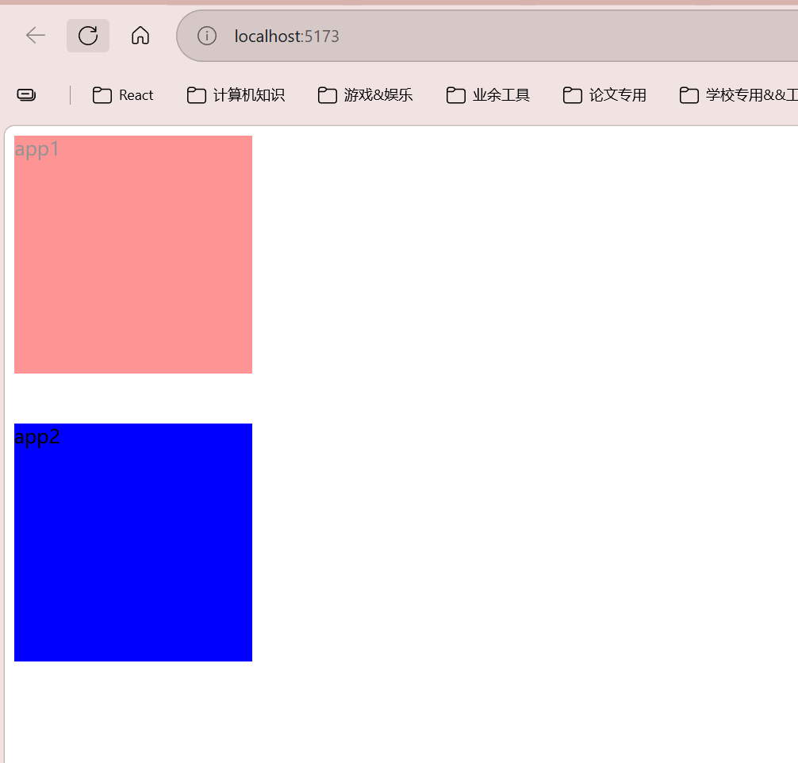

可以发现app1是有一个明显的过渡效果的，app1中的dom元素首先完成布局和绘制，此时为`opacity: 0`，然后再添加上过渡的，也就是浏览器已经绘制到屏幕上去了，然后再执行opacity:1的transition的

而app2中的 **`style={{ opacity: 0 }}` 这类属性在 `useLayoutEffect` 执行之前，已经被 React 写到真实 DOM 上了。**  
所以 `useLayoutEffect` 里拿到的 DOM，不是“还没设置初始样式的空白 DOM”，而是**已经完成本次提交(commit)的 DOM**。只是**浏览器还没来得及把它绘制到屏幕上**。

流程如下：

- React render  
    先根据 JSX 生成这次要更新的内容
- React commit  
    把 JSX 对应的属性真正写入 DOM  
    这一步里，`<div style={{ opacity: 0 }}>` 已经变成真实 DOM 的内联样式了
- 执行 `useLayoutEffect`  
    此时 DOM 已经存在，样式也已经挂上去了  
    所以你能读到、改到这个 DOM
- 浏览器布局 / 绘制  
    浏览器根据**修改后的最终结果**去计算布局并绘制

> 解释一下render和commit:
> render实际上就是 **从进入组件函数，到拿到 return 出来的 JSX，这整个过程都属于 render。**

```tsx
function App() {  
const x = 1; // 这属于 render 阶段  
const y = x + 1; // 这也属于 render 阶段  
return <div>{y}</div>; // 这也属于 render 阶段  
}
```

> commit就是将计算出来的元素创建/更新真实的DOM，然后设置属性和style，挂载到Ref（但是还没有绘制到浏览器上）

**何时使用？**

比如需要同步读取元素的大小和位置的时候，这一点在做动画特效的时候非常好用，比如此时我需要调整成translateX（-100px）之类的，而且必须一出来就要修改，那么就得用这个，如果有useEffect的话，就会有一个闪烁的过程（先绘制，再重新布局计算）

主要应用于记录滚动条位置，在返回的时候会将滚动条位置直接翻下来，很好的用户体验，示例代码如下：

```tsx
import React, { useLayoutEffect, useEffect, useRef } from 'react';

function App() {
    // 使用useLayoutEffect来过渡页面的滚动位置
    const scrollHandler = (e:React.UIEvent<HTMLDivElement>) => {
        // 获取滚动位置
        const scrollTop = e.currentTarget.scrollTop;
        // 存储在本地
        localStorage.setItem('itemScrollTop', scrollTop.toString());
    }
    
    // 使用useLayoutEffect
    useLayoutEffect(() => {
        const scrollTop = localStorage.getItem('itemScrollTop') || '0';
        console.log(scrollTop, '---scrollTop')
        console.log('useLayoutEffect activated!')
        // 设置滚动位置
        const scrollContainer = document.getElementById('scroll-container');
        if (scrollContainer) {
            scrollContainer.scrollTop = Number(scrollTop);
        }
    }, [])

    return (
        <div id='scroll-container' onScroll={scrollHandler} style={{height: '500px', overflow: 'auto'}}>
            {
                Array.from({ length: 200 }, (_, i) => (
                    <div key={i}>
                        Item {i + 1}
                    </div>
                ))
            }
        </div>
    )
}
export default App;
```

#### useRef

当你在React中需要处理**DOM元素或需要在组件渲染之间保持持久性数据时**，便可以使用useRef。使用如下：

```tsx
import { useRef } from 'react';
const refValue = useRef(initialValue)
refValue.current // 访问ref的值 类似于vue的ref,Vue的ref是.value，其次就是vue的ref是响应式的，而react的ref不是响应式的
```

1. **组件在重新渲染的时候，useRef的值不会被重新初始化**。
    
2. 改变 ref.current 属性时，React 不会重新渲染组件。React 不知道它何时会发生改变，因为 ref 是一个普通的 JavaScript 对象。
    
3. useRef的值不能作为useEffect等其他hooks的依赖项，因为它并不是一个响应式状态。
    
4. useRef不能直接获取子组件的实例，需要使用forwardRef。

他和vue的获取DOM挺类似的，示例代码如下：

```tsx
import React, { useLayoutEffect, useEffect, useRef } from 'react';

function App() {
   const divRef = useRef<HTMLDivElement>(null);
   // null:表示还没有获取到DOM元素
   const handleClick = () => {
    console.log(divRef.current); // 这里就可以获取到DOM元素了
   }
    return (
        <div>
            <h1>永恒轮回傻逼游戏</h1>
            <h1>不如泰拉瑞亚一根</h1>
            <div ref={divRef}>哈基米南北绿豆，阿西卡呀库奶龙</div>
            <button onClick={handleClick}>获取DOM元素</button>
        </div>
    )
}
export default App;
```

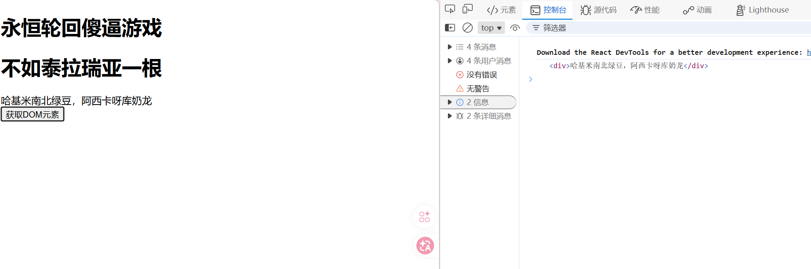

还有一点，关于react的工作机理：

```tsx
import React, { useLayoutEffect, useEffect, useRef, useState } from 'react';

function App() {
    console.log('render')
    const [count, setCount] = useState(0)
    const handleClick = () => {
        setCount(count + 1)
    }

    return (
        <div>
            <h1>数据存储</h1>
            <div>{count}</div>
            <button onClick={handleClick}>增加</button>
        </div>
    )
}
export default App;
```

每次状态变化，`App()` 都会再跑一遍，所以你会看到：

```tsx
console.log('render')
```

2. **但 `useState(0)` 里的 `0` 只是“初始值”**  
    这个初始值只在**第一次挂载**时真正用来创建状态。

也就是说，第一次渲染时大概像这样：

```js
count = 0
```

当你点击按钮后：

```js
setCount(count + 1)
```

React 会把新的状态保存起来，比如保存成 `1`。

下一次重新执行 `App()` 时，代码虽然又写到了：

```js
const [count, setCount] = useState(0)
```

但 React 这时不会再用 `0` 初始化，而是会把**上一次保存的状态值**拿出来给你，所以此时得到的是：

```js
count = 1
```

不是重新变回 0。

更准确地说：

- **函数里的普通变量**，每次 render 都会重新创建
- **Hook 状态**，是 React 帮你保存在组件外部的一块状态存储里，下次 render 时再按顺序取回来

但是我们可以使用`useRef`来保存数据：

```tsx
import React, { useLayoutEffect, useEffect, useRef, useState } from 'react';

function App() {
    console.log('render')
    const num = useRef(0)
    const [count, setCount] = useState(0)
    const handleClick = () => {
        setCount(count + 1)
        num.current = count
    }
    
    return (
        <div>
            <h1>数据存储</h1>
            <div>count: {count}</div>
            <div>num: {num.current}</div>
            <button onClick={handleClick}>增加</button>
        </div>
    )
}

export default App;
```

useRef也不会丢失状态

> useRef的修改不会触发React的更新机制，而useState则会触发页面的更新机制，有些数据是ui驱动的，则需要进行ui级别的更新，而有些就是后台计算，**比如存 DOM 节点，存定时器 id，存缓存变量，存上一次的值**，这些不需要触发更新UI的操作

比如这个例子：

```tsx
import React, { useLayoutEffect, useEffect, useRef, useState } from 'react';

function App() {
    // 首先写一个计时器
    let timer: NodeJS.Timeout | null = null

    // 然后定义一个count
    const [count, setCount] = useState(0)

    // 定义一个开始函数，用来启动计时器
    const start = () => {
        timer = setInterval(() => {
            setCount(prev => prev + 1) // 这里的prev是上一次的count值，使用函数式更新可以确保我们拿到最新的count值
        }, 300)
    }

    // 定义一个停止函数，用来清除计时器
    const stop = () => {
        clearInterval(timer)
    }

    return (
        <div>
            <h1>计时器场景</h1>
            <div>count: {count}</div>
            <button onClick={start}>开始</button>
            <button onClick={stop}>停止</button>
        </div>
    )
}

export default App;
```

> 由于点击开始以后会不断地修改count，因此会不断的触发页面的更新机制，因此timer始终为null（在你 点击开始以后，因此点击停止根本停不下来）

只要改成useRef即可：

```tsx
let timer = useRef<NodeJS.Timeout | null>(null)
// ...
timer.current = setInterval(() => {
	setCount(prev => prev + 1) // 这里的prev是上一次的count值，使用函数式更新可以确保我们拿到最新的count值
}, 300)

// ...
const stop = () => {
	if (timer.current) {
		clearInterval(timer.current)
	}
}     
```

