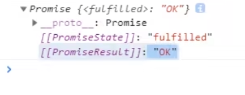
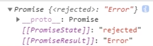
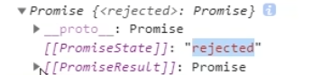
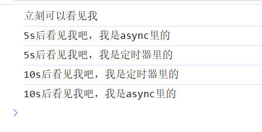

## Promise对象

首先，`new Promise`不会导致异步，异步的核心是在`new Promise`的这个对象的**回调函数被放入微队列中而不影响主线程的执行**才叫做异步

> 也就是说，Promise对象本身是**同步**的，真正异步主要是**回调函数被安排在微任务队列当中**

例如：
```js
new Promise((resolve) => {  
	console.log('A'); // 立刻打印  
	resolve();  
	console.log('B'); // 立刻打印  
});  
console.log('C'); // 打印结果均为同步执行
```

Promise 的状态只在 `resolve/reject` 被调用时改变；一旦改变，就把 then/catch/finally 对应的回调排进微任务队列；微任务仍由同一个 JS 主线程在每个宏任务结束后执行。

### resolve和reject

`resolve`和`reject`都会将Promise对象的状态设置为noPending，且在resolve和reject函数中可以添加value:

```js
const a = new Promise ((resolve) => {
	resolve('111')
})
a.then((value) => {
	console.log(value) // 此处的value就是'111'
})
```

reject也是同理

### then方法

then方法返回的一定也是一个`Promise`对象，可以这么理解：当你为某个Promise实例使用.then方法的话，那么就会创建一个Promise对象，**并且这个Promise对象是新对象，接收两个回调函数（`then(onFulfilled, onRejected)`），通过回调函数来对这个Promise对象编写resolve和reject所对应的函数执行体**，

then方法定义是同步的，上述例子中:

```ts
a.then((value) => {
	console.log(value) // 此处的value就是'111'
})

```

这个then方法是同步执行（和Promise一样，内部的方法是同步执行的），**但是then中的onFulfilled和onRejected是异步执行（当原Promise对象不是pending状态的时候才会触发）**

#### then中传递Promise对象

> 注：如果Promise对象的resolve方法**传入的参数是Promise对象，那么外层的Promise对象继承resolve方法中Promise对象的resolve方法的值，reject也是如此**

这么讲可能十分抽象，用一个例子就好了：

```ts
let p2 = Promise.resolve(new Promise((resolve, reject) => {
	resolve('ok');
})) 
console.log(p2)// p2就是一个Promise对象，并且fulfilled，并且PromiseResult为'ok'而不是一个Promise对象
```


这也说明了Promise即使是链式，结果也是传递性质

> 记住一点：父级Promise.resolve属性永远继承子级的Promise属性，即使子级是rejected，那么父级也会变成rejected

比如这个例子：

```ts
let p2 = Promise.resolve(new Promise((resolve, reject) => {
	reject('Error');
})) 
console.log(p2)// p2就是一个Promise对象，并且rejected，并且PromiseResult为'Error'而不是一个Promise对象
```



> **对于Promise.reject，传入什么对象，那么PromiseResult就是什么**

例如：

```ts
let p2 = Promise.reject(new Promise((resolve, reject) => {
	resolve('ok');
})) 
console.log(p2)// p2就是一个Promise对象，并且rejected，并且PromiseResult为Promise对象而不是'ok'
```



### Promise.all

静态方法，**接收一个Promise可迭代对象作为输入**，规则如下：

- 如果某一项是 **普通值** → 立刻当成 fulfilled 的结果
    
- 如果某一项是 **Promise** → 等它 settle
    
- 如果某一项是 **thenable（有 then 方法的对象）** → 会“吸收/跟随”它的 then 行为（像 Promise 一样处理）
	
- 任意一项 **reject** → `Promise.all` 立刻 reject

> 但 `Promise.all` 的输入项 **不要求**都是 Promise，它会自动帮你“Promise 化”。

例如：

```ts
const promise1 = Promise.resolve(3);
const promise2 = 42;
const promise3 = new Promise((resolve, reject) => {
  setTimeout(resolve, 100, "foo");
});

Promise.all([promise1, promise2, promise3]).then((values) => {
  console.log(values);
});
// Expected output: Array [3, 42, "foo"]
```

如果其中有一个rejected，那么整个都会rejected，并且PromiseResult就是触发reject的那个Promise的PromiseResult，例如：

```ts
// 所有的值都不是 Promise，因此返回的 Promise 将被兑现
const p = Promise.all([1, 2, 3]);
// 输入中唯一的 Promise 已经被兑现，因此返回的 Promise 将被兑现
const p2 = Promise.all([1, 2, 3, Promise.resolve(444)]);
// 一个（也是唯一的一个）输入 Promise 被拒绝，因此返回的 Promise 将被拒绝
const p3 = Promise.all([1, 2, 3, Promise.reject(555)]);

// 使用 setTimeout，我们可以在队列为空后执行代码
setTimeout(() => {
  console.log(p);
  console.log(p2);
  console.log(p3);
});

// 打印：
// Promise { <state>: "fulfilled", <value>: Array[3] }
// Promise { <state>: "fulfilled", <value>: Array[4] }
// Promise { <state>: "rejected", <reason>: 555 }
```

### 多个then方法绑定

then方法类似于发布订阅模式，只要你对某个Promise绑定了某个then方法以后，当它fulfilled则会执行then方法中注册的所有回调函数，执行顺序按照注册顺序一一执行

```ts
const p2 = new Promise(resolve => resolve('aaaaaaaa'));

console.log("猜猜谁会先触发");

p2.then(() => console.log("先添加的先触发"));
p2.then(() => console.log("后添加的后触发"));

setTimeout(() => {
  p2.then(() => console.log("延时的也会触发"));
}, 1000);
```

也就是说：

> - 只要 `p2` 已经是 **fulfilled/rejected（settled）**，以后再给它加 `.then(...)` / `.catch(...)`，**都会触发**。
> - 但**不是“立刻同步触发”**，而是**“尽快异步触发”**：回调会被排进 **微任务队列（microtask queue）**，等当前这段同步脚本执行完（当前 call stack 清空）就执行。

### then链中error传递性

对于then长链，只要链中其中某一个回调方法reject（throw一个error），那么这个长链的结果返回就是error，并且后面的.then方法都不会执行：

```ts
    const p2 = new Promise((resolve, reject) => {
            resolve('1')
        })
        p2.then(() => {
            console.log("p2成功执行")
            throw 'rejected' // 从这里开始，后面的.then方法都不用看，直接跳转到catch
        }).then(() => {
            console.log("你看不到这一行代码")
            throw 'this reject is hidden, because this .then is skipped'
        }).then(() => {
            console.log("由于上面的执行失败，你也不会看到这一行输出")
        }).catch(() => {
            console.log("按理来说你只会看到'p2成功执行'")
        })
```

## async函数

async函数返回一个Promise对象，示例代码如下：

```ts
async function asyncFn () {
            return '111'
        }
        const res = asyncFn()
        console.log(typeof res) // Promise
        console.log(res) // Promise [PromiseStatus: fulfilled, PromiseResult: '111']
```

说白了，async其实就是返回一个Promise对象的Function

- `return x` ⇒ 等价于 `return Promise.resolve(x)`
    
- `throw e` ⇒ 等价于 `return Promise.reject(e)`

可以看个例子：

```ts
  function returnPromise5S () {
           return new Promise((resolve, reject) => {
                setTimeout(() => {
                    resolve(1000)
                }, 5000)
            })
        }
        async function asyncFn () {
            let timer = await returnPromise5S()
            console.log("5s后看见我吧，我是async里的")
            timer = await returnPromise5S()
            console.log("10s后看见我吧，我是async里的")
        }
        asyncFn()
        console.log("立刻可以看见我")
        setTimeout(()=> {
        console.log("5s后看见我吧，我是定时器里的")
        }, 5000)
         setTimeout(()=> {
        console.log("10s后看见我吧，我是定时器里的")
        }, 10000)
```

想一下这个例子应该会打印什么



想一下为什么会这么打印

## await表达式

await表达式右侧为Promise对象，也可以是其他值，如果为Promise对象，一般需要等到Promise成功或者reject以后，才会输出（不然的话就会一直等待右侧的Promise对象，这个等待是放到微任务当中去的）

> await表达式返回的就是右侧Promise对象当中的值

```ts
 async function testFn () {
            let res = await new Promise((resolve, reject) => {
                resolve('ok')
            })
            console.log(res) // 控制台打印ok
        }
        testFn()
```

> 注意：async给予了await恢复和暂停的能力，如果async中不用await的话，那么就像执行同步代码一样执行