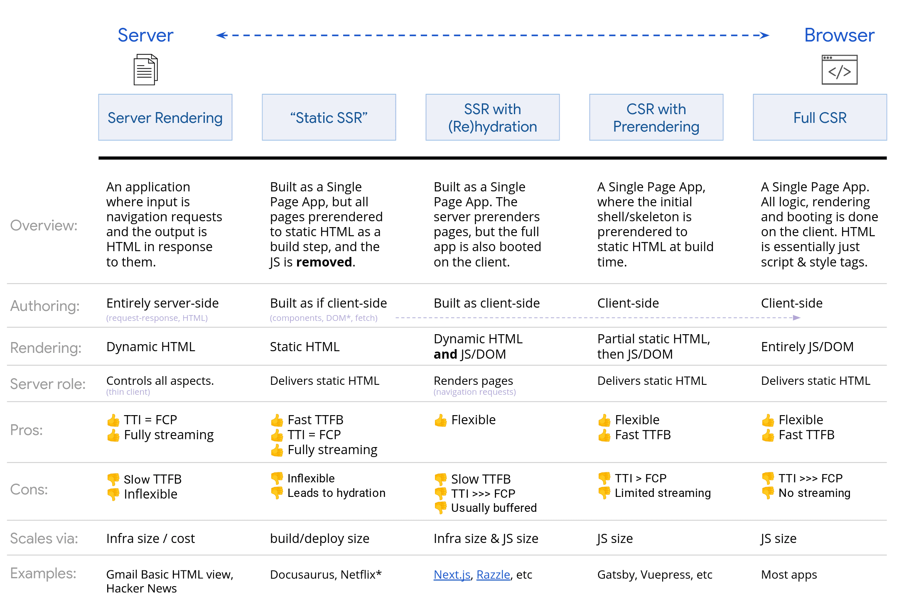

## 前言

web开发者应当做出的决策中，比较重要的就是：**组件在web页面当中渲染的位置和实现逻辑**

> 经验人士常言之：SSR或静态渲染是比较可靠的手段，而不是完全重新渲染。

服务端渲染：在服务器上渲染应用以向客户发送html而不是JavaScripts
客户端渲：在浏览器中渲染应用，使用 JavaScript 修改 DOM。

（这里推荐一个写的非常好的博客：[在网页上呈现  |  Articles  |  web.dev](https://web.dev/articles/rendering-on-the-web?utm_source=chatgpt.com&hl=zh-cn#terminology)）

## 性能

[第一字节时间 (TTFB)](https://web.dev/articles/ttfb?hl=zh-cn)

点击链接与 新网页上加载的第一个内容字节之间的时间。

[First Contentful Paint (FCP)](https://web.dev/articles/fcp?hl=zh-cn)

请求的内容（文章正文等）变为可见的时间。

[Interaction to Next Paint (INP)](https://web.dev/articles/inp?hl=zh-cn)

一个代表性指标，用于评估网页是否始终能快速响应用户输入。

[Total Blocking Time (TBT)](https://web.dev/articles/tbt?hl=zh-cn)

INP 的[代理指标](https://almanac.httparchive.org/en/2022/performance#inp-and-tbt) ，用于计算网页加载期间主线程被阻塞的时间。

## 为什么要使用服务端渲染

1. 服务端渲染的话，服务器返回给用户的就只是HTML文件，可以避免在客户端上进行额外的数据提取和 模板处理往返，因为渲染器会在浏览器收到响应之前处理这些操作。同时服务器的**FCP**会变得很低（因为请求的内容此时没有其他的script，浏览器进行HTML解析会变得十分顺利）
2. 额外的，**INP**也会降低（因为在网页加载期间，**主线程不会经常被阻塞**。当主线程被阻塞的频率较低时，用户互动就有更多机会更快运行。）
3. 同时需要考虑用户的CPU限制，可能有些用户的CPU 非常慢，但是如果是SSR渲染的话，可以降低用户因为CPU限制而导致的网页卡顿或者变慢，但是，**这也会增加网页的TTFB**。

## 静态渲染（SSG）

也就是我们的静态博客惯用手段：在构建期发生，与服务端渲染不同，它可以实现非常快速的TTFB。 一般来说，静态渲染意味着提前为每个网址生成单独的 HTML 文件 。由于HTML响应是预先生成的，因此您可以将静态渲染部署到多个 CDN，以利用边缘缓存。

为什么需要用到SSR渲染呢？因为很多时候需要用到动态数据（比如登录态、个性化、实时数据这些）

用Astro中的话来说就是：
Astro 里常见三种：

- `output: "static"`：纯 SSG（构建产出 HTML 文件）
    
- `output: "server"`：纯 SSR（请求时渲染，需要 adapter）
    
- `output: "hybrid"`：一部分静态，一部分 SSR（也需要 adapter）

我们之前遇到的 `server:defer`（Server Islands）属于 **需要服务端运行时** 的能力，所以纯 `static` 不行。

> 将SSR和SSG混合构建才是当前页面的构建惯用手段

## 客户端渲染（CSR）

客户端渲染最大的难点首当其冲就是**移动端渲染**
使用客户端渲染并依赖大型 JavaScript 软件包的体验 应考虑[积极的代码拆分](https://web.dev/articles/reduce-javascript-payloads-with-code-splitting?hl=zh-cn) ，以降低网页加载期间的 TBT 和 INP，以及延迟加载 JavaScript，以便 仅在需要时提供用户所需的内容。对于互动性较少或 没有互动性的体验，服务器端渲染可以更好地解决这些问题 。

## 总结
