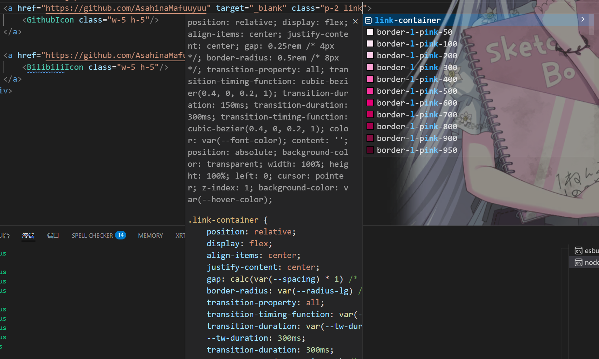
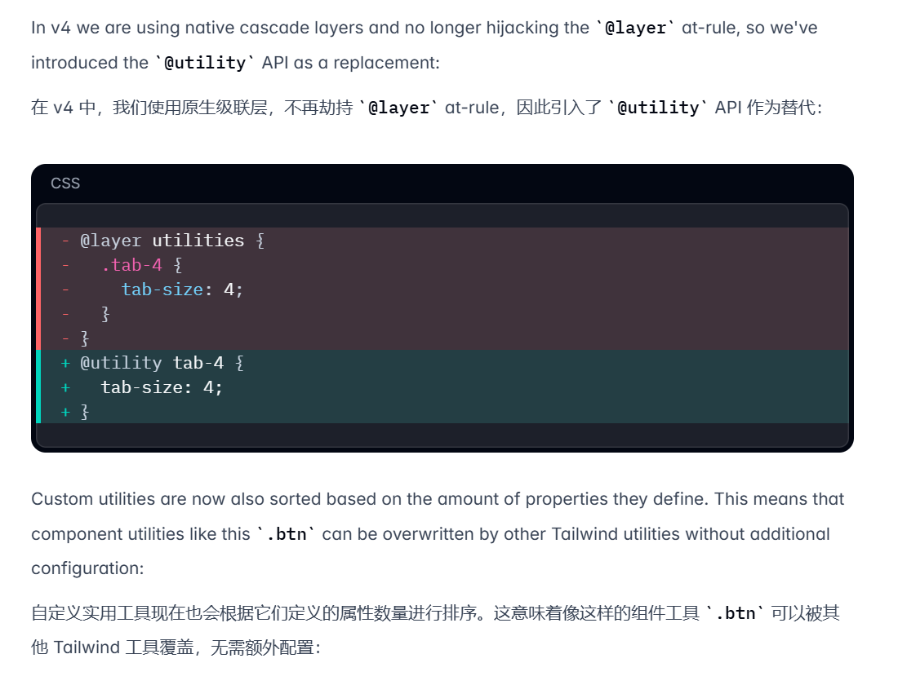
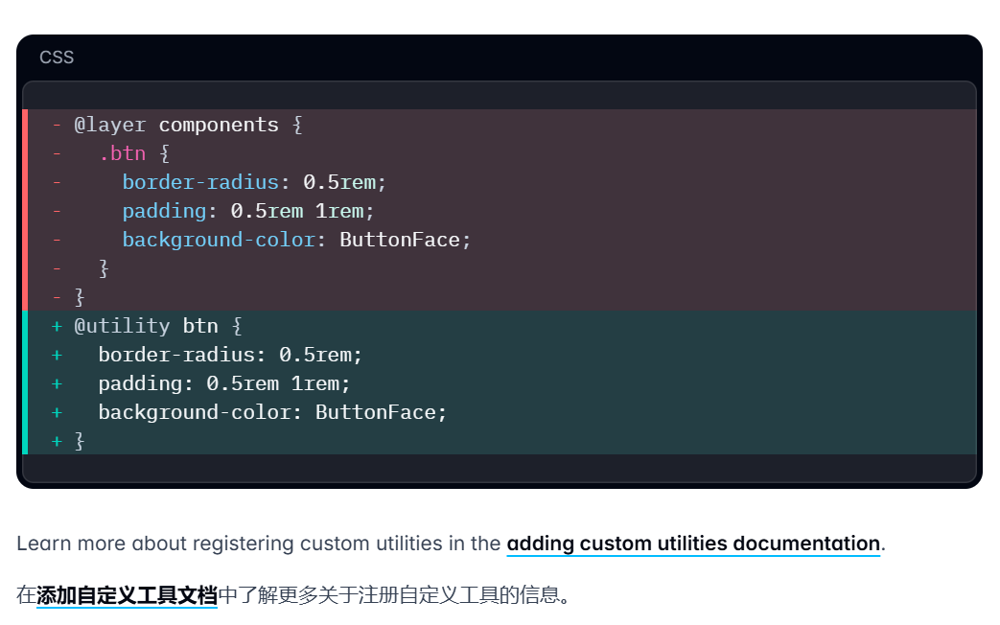

在V4以前，我们通常使用`@layer <base/utilities/components>`这种操作来注入自定义类别，这种方式的最大问题就是：它是根据类别注入样式，但是在V4中我们可以自定义样式类别，例如下面这段代码：
```css
@utility link-container {
    @apply relative rounded-lg flex justify-center items-center gap-1 transition-all ease-in-out duration-300 hover:text-body;
}
```
这段代码定义了一个自定义的类别，link-container，通过这个类别的话，我们在vscode编辑器中也能够有相对应的提示：

**这就说明了当我们在用@utilities定义的时候就已经在底层注入了这个类**，同时也支持嵌套css：
```css
@utility link-container {
    @apply relative rounded-lg flex justify-center items-center gap-1 transition-all ease-in-out duration-300 hover:text-body;
    &::before {
        ...;
    }
    &:hover {
        ...;
    }
    div {
        ...;
        another-class {
            ...;
        }
    }
}
```
下面也是官方的相关说明：
> 
> 
>
以及通常自定义的theme：
```css
@theme {
/* caption注释 / footnote */
    --text-caption: calc(0.75*var(--font-size));
/* 定义颜色 */
  --color-caption: rgb(163, 163, 163);
}
```
这样定义是非常不规范的，--text就是定义文本大小规范等，--color就是定义颜色色号等，要这么定义规范的话，我建议还是用@utilities来定义规范：
```css
/* 定义字幕专用主题类 */
@utility text-caption {
    font-size: calc(0.75*var(--font-size));
    font-weight: 300;
    color: rgb(163, 163, 163);
}
```
只需要在组件中这样写即可：
```html
<caption class="text-caption">
  示例caption
</caption>
```