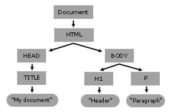
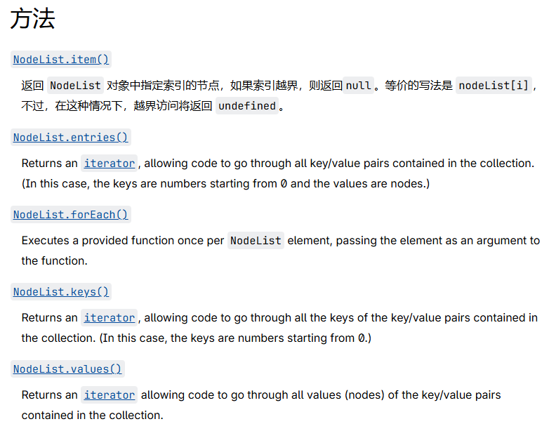
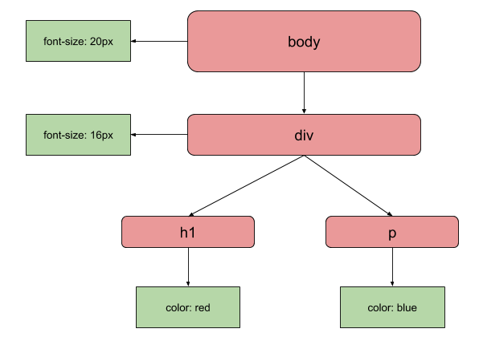
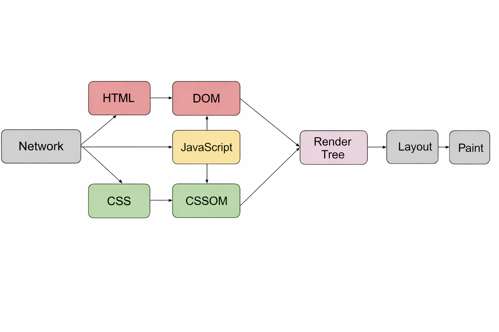
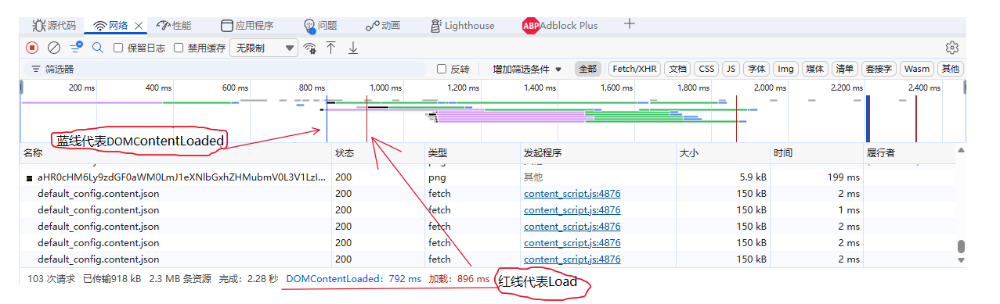
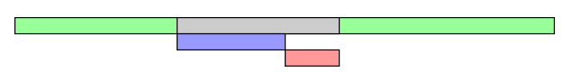
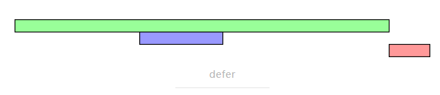
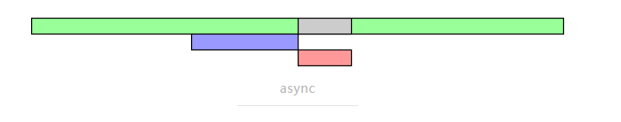
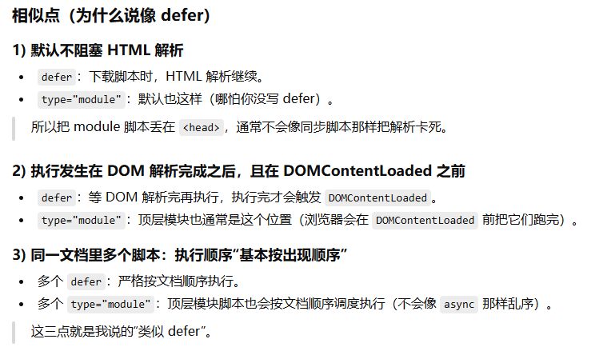
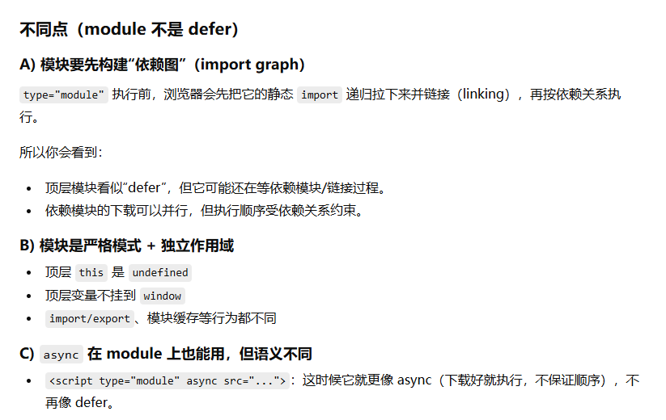

## 从零开始的DOM和BOM之旅

### 何为DOM

DOM（Document Object Model）的基础概念想必应该都学过，那么再来重新学一下：

```html
<html lang="en"> 
	<head> 
		<title>My Document</title>
	 </head> 
	 <body> 
		 <h1>Header</h1> 
		 <p>Paragraph</p> 
	 </body> 
 </html>
```



上图是一颗DOM树，用于模拟页面内容的结构
js实际上没有任何DOM树的概念，只是因为在浏览器的`rumtime`的时候，js可以通过`document`和`window`这个API来获取到各种信息和方法

对于DOM，具有以下数据类型：
1. [`Document`](https://developer.mozilla.org/zh-CN/docs/Web/API/Document)：通常也就是根元素`document`,其中`document.documentElement`也就是`<html>`
2. [`Node`](https://developer.mozilla.org/zh-CN/docs/Web/API/Node)：也是最最最基本的元素，可以用下面的关系来理解：
	- **Node**：DOM 里最通用的“节点”基类
		- **Document**（`document`）
		- **Element**（元素节点：`<div>`, `<p>`, `<html>`…）
			- **HTMLElement**（HTML 元素的那一支：`<div>`, `<body>`, `<html>`…）
	        - **SVGElement**（`<svg>` 等）
		- **Text**（文本节点：元素里的文字）
		- **Comment**（注释节点：`<!-- -->`）
3. [`Element`](https://developer.mozilla.org/zh-CN/docs/Web/API/Element): 它指的是一个元素或一个由 DOM API 的成员返回的 `element` 类型的节点
4. [`NodeList`](https://developer.mozilla.org/zh-CN/docs/Web/API/NodeList): 通常是由[`Node.childNodes`](https://developer.mozilla.org/zh-CN/docs/Web/API/Node/childNodes)或者[`document.querySelectorAll`](https://developer.mozilla.org/zh-CN/docs/Web/API/Document/querySelectorAll)返回的，记住以下特征：
	- ✅ **可以用下标取**：`list[0]`
	- ✅ **有 `.length`**
	- ✅ **通常可用 `.forEach`**（现代浏览器）
    - ❌ **没有数组方法**：`map / filter / reduce / push / pop` 等都没有
    - 

其他的没必要再来记忆

### 何为BOM

BOM（Browser Object Model）其实非常好理解，BOM就是整个浏览器的行为，它包含`document`：

```js
window.document === document // true
```

更直观一点就是：`window`提供BOM的入口和DOM

### CSSOM？

CSSOM很像DOM，但针对的是CSS而不是HTML：



## 相关的生命周期

### JavaScript在DOM中解析

`javascript`的解析会影响DOM解析：

```html
<body>  
 <script type="text/javascript">  
 console.log(document.getElementById('ele')); // null  
 </script>  
  
 <div id="ele"></div>  
  
 <script type="text/javascript">  
 console.log(document.getElementById('ele')); // <div id="ele"></div>  
 </script>  
</body>
```

同样的，由于`JavaScript`可以查询到任意对象的样式，因此：**Css解析一定要发生在Javascript前**。

当页面加载时，浏览器会依次进行以下几个步骤：

1. 解析 HTML 文件：浏览器将 HTML 文档解析为 DOM 树。
2. 解析 CSS 文件：浏览器将 CSS 文件解析为 CSSOM 树。
3. 构建渲染树：浏览器将 DOM 树和 CSSOM 树结合，生成渲染树。渲染树包含了每个可见元素的样式信息。
4. 布局：浏览器根据渲染树进行布局计算，确定每个元素的位置和大小。
5. 绘制：浏览器将元素渲染到屏幕上。





首先定义颜色条（示例颜色条，和调试工具中的并不一一对应）


解析`script`分为同步脚本和异步脚本：

#### 同步脚本

同步脚本（标签中不含 async 或 defer）： `<script src="***.js" charset="utf-8"></script>`

当 HTML 文档被解析时如果遇见（同步）脚本，则停止解析，先去加载脚本，然后执行，执行结束后继续解析 HTML 文档。过程如下图:



#### 异步脚本

异步脚本又分为`defer`和`async`
##### defer 脚本

`<script src="***.js" charset="utf-8" defer></script>`

`defer`脚本的解析通常在结束HTML解析之后再进行异步执行，但是`defer`脚本的下载是**边解析边进行下载**，而且`defer`的解析顺序和`defer`脚本在文档中的顺序（说白了，由于是异步的，放入到微任务的顺序也不一样），过程如下图;



##### async 脚本

`<script src="***.js" charset="utf-8" async></script>`

对于`async`脚本而言，HTML会在后台进行下载，一旦下载好就会**同步执行**，也就是停下HTML的解析，转而去执行`async`脚本。过程如下图：


并且要注意两点：
- `DOMContentLoaded` 触发条件（简化但抓核心）：**HTML 解析完成 + 所有 `defer`（以及通常的 `type="module"`）都已执行完**
    
- **`async` 不在这个等待集合里**：它不保证顺序，也不保证在 DCL 之前执行完，所以 **DCL 不会等它**
> 因此`DOMContentLoaded`完全有可能在 **`async`** 之前执行！！！

*补充一个type=module的script*：对于该脚本而言（GPT给出了答复）：





> 总结：若不加`async`，其表现和defer差不多，若加了`async`，那么就和`async`表现类似
### DOMContentLoaded

> 当一个`HTML`文档被加载和解析完成后，`DOMContentLoaded`事件便会被触发。

触发条件（核心）：

- **HTML 已解析完**，DOM 树已经建好（你能可靠地 `querySelector` 到元素）
    
- **同步脚本（blocking script）都执行完**（包括普通 `<script>` 和内联脚本，以及会阻塞解析的脚本）
    
- **defer 脚本执行完**（`defer` 的脚本会在解析完后、DOMContentLoaded 之前按顺序执行）

不保证：

- 图片、视频、音频、字体、一些 CSS 背景图等**都下载完**
	
- 页面里所有资源都 “load 完”

> 简单记：`DOMContentLoaded` = “结构（DOM）好了”，`load` = “资源都好了”。

