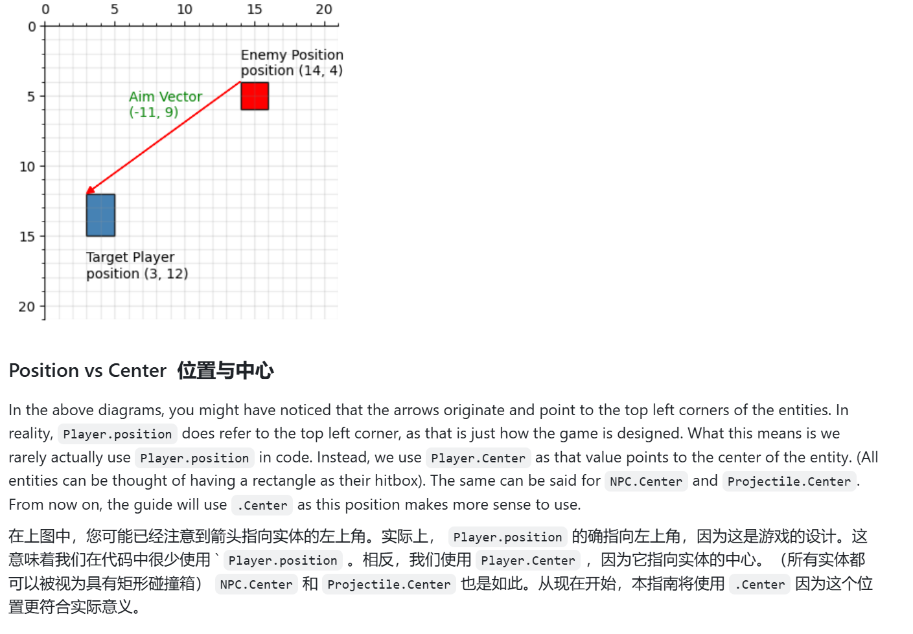
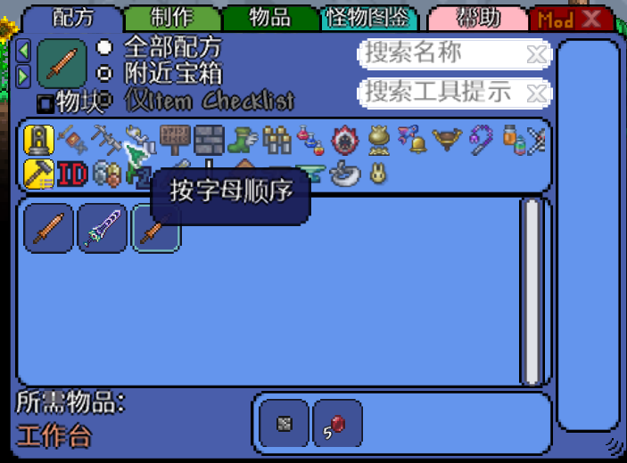
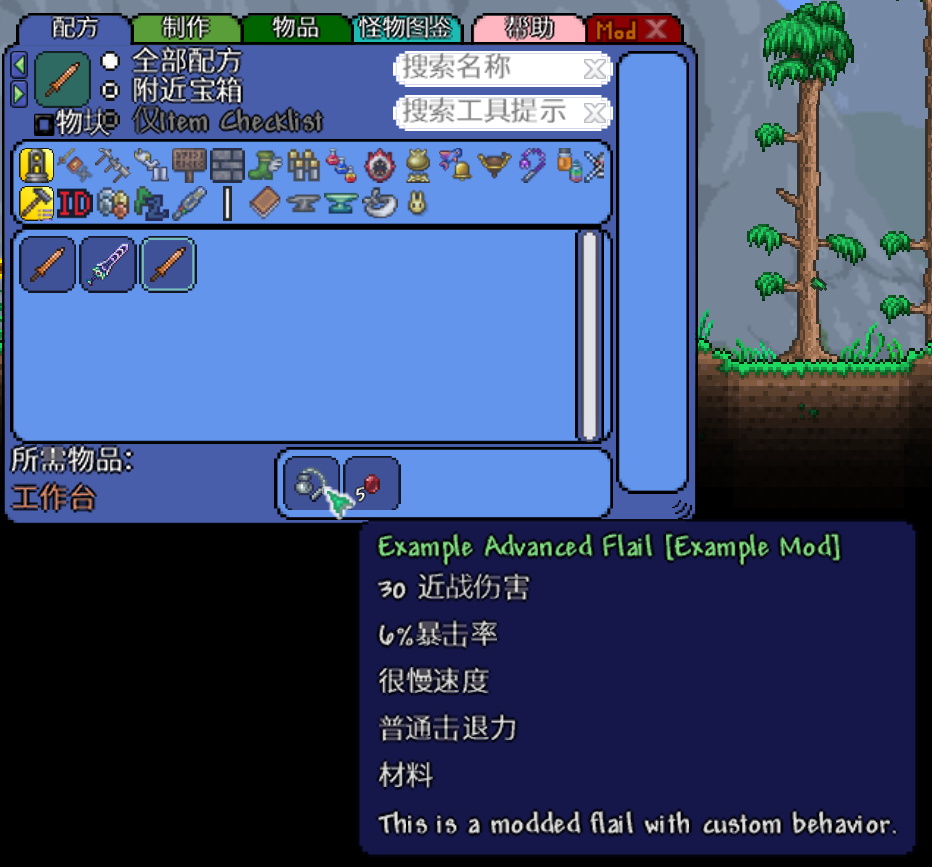
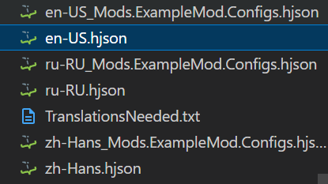
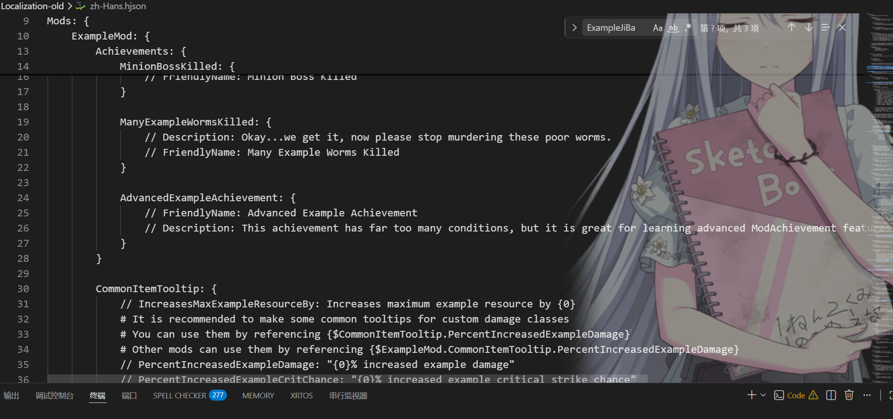
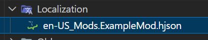
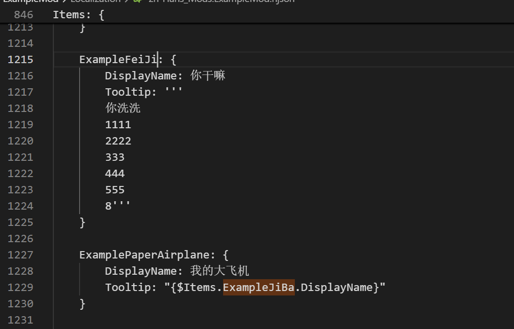
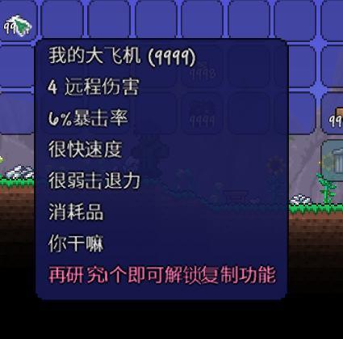
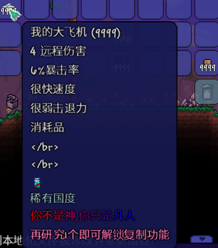

## 坐标

### 世界坐标

> **世界坐标**指的就是**整个游戏地图里的全局坐标**。


玩家、NPC、投射物和尘埃都存在于世界坐标系中。世界坐标通常表示为 `Vector2` ，这意味着世界坐标的 `X` 和 `Y` 分量是浮点数，也就是说像 3943.23 和 2334.213 这样的非整数值也是有效值。如果使用 100% 屏幕缩放，则显示器上的每个像素都等于世界空间的 1 个单位。世界坐标 (0, 0) 位于世界的最左上角。

### 图块坐标

图块采用图块坐标。图块坐标仅用于与图块相关的方法和 `Main.tile` 数组。图块坐标通常表示为 `Point` 或 `Point16` 类型，这意味着图块坐标的 `X` 和 `Y` 分量必须是整数。

> 也就是说npc和玩家还有其他的都可以占据部分方块，而土块必须要用整数个方块

### 屏幕坐标

屏幕坐标（实际上是窗口坐标）用于像屏幕绘制和用户界面元素这样的操作。一个常见的错误是在手动绘制实体时，直接使用实体本身的位置来绘制。但这是行不通的，因为绘制代码只接受**屏幕空间坐标**，而不是**世界空间坐标**。

为了正确绘制，你需要从你要绘制的位置中减去 `Main.screenPosition`。

### 图块坐标 < --- > 世界坐标

每个图块占据 16x16 的世界坐标空间。将图块坐标乘以 16，即可得到指向该图块左上角的世界坐标。您可以使用 `Point.ToWorldCoordinates` `Vector2.ToWorldCoordinates` 来简化代码。`Point.ToWorldCoordinates` 会自动将 X 和 Y 坐标都加上 8，返回图块中心的世界坐标。

可以这样理解：

```
左上角 ---------------- 右上角  
   |                      |  
   |        中心          |  
   |      (+8, +8)        |  
左下角 ---------------- 右下角
```
一个 tile:  

比如 tile 坐标是 `(10, 20)`：

- 左上角世界坐标：`(160, 320)`
- 中心世界坐标：`(168, 328)`

示例代码如下：

```c#
// 找到玩家正后方对应的图块（tile）
Point tileLocation = Main.LocalPlayer.Center.ToTileCoordinates();
Tile tile = Main.tile[tileLocation.X, tileLocation.Y];
Tile theSameTile = Main.tile[tileLocation]; // Point 和 Point16 都可以直接用来索引 Main.tile

// 从图块坐标（Tile 坐标）转换为世界坐标（World 坐标）来生成粒子（Dust）
Point16 position = new Point16(i, j);
Dust.NewDustDirect(position.ToWorldCoordinates(), 4, 4, dustChoice, 0f, 0f, 100, default, 1f);
```

### 关于Vector2

`Vector2` 是一个结构体，用来表示几何学中的**二维向量**。一个 `Vector2` 包含两个字段：`X` 和 `Y`，分别表示这个二维向量在 X 方向和 Y 方向上的分量大小。

在 tModLoader 中，`Vector2` 主要有两个用途：

1. **表示位置（Position）**  
    `Vector2` 用来表示游戏中很多元素的位置，比如玩家（Player）、弹幕（Projectile）、粒子（Dust）、NPC 等。
2. **表示速度（Velocity）**  
    `Vector2` 也用来表示速度，也就是一个物体在 X 和 Y 两个方向上的移动速度。

例如：

- 如果玩家当前位置是 `(3, 7)`
- 玩家速度是 `(4, 8)`

那么每次游戏更新位置时，玩家的位置都会加上速度：

- 更新一次后位置变为 `(7, 15)`  
    因为：
    - `3 + 4 = 7`
    - `7 + 8 = 15`

可以看到，**向量相加就是分别对每个分量相加**。

更一般地说：

- 如果向量 A 表示位置
- 向量 B 表示速度
- 经过时间 X（单位：更新次数）

那么新位置就是：

A + X * B

在 Terraria 的坐标系统中也是这样工作的。每一帧（tick），物体的位置都会根据它的速度发生改变。

需要特别注意：

- 游戏是以 **每秒 60 次更新（60 FPS）** 运行的
- 所以这里的速度单位是：
    - **每次更新移动多少世界坐标单位（world units per update）**
    - 而不是每秒移动多少（不是 per second）



### 配方合成

#### 1. 原版配方合成

在泰拉瑞亚中，可以直接继承`GlobalItem`这个类对原版物品进行修改：

```c#
using Microsoft.Xna.Framework;
using Terraria;
using Terraria.DataStructures;
using Terraria.ID;
using Terraria.ModLoader;

namespace ExampleMod.Common.GlobalItems
{
    // This file shows a very simple example of a GlobalItem class. GlobalItem hooks are called on all items in the game and are suitable for sweeping changes like
    // adding additional data to all items in the game. Here we simply adjust the damage of the Copper Shortsword item, as it is simple to understand.
    // See other GlobalItem classes in ExampleMod to see other ways that GlobalItem can be used.
    public class ShortswordGlobalItem : GlobalItem
    {
        // Here we make sure to only instance this GlobalItem for the Copper Shortsword, by checking item.type
        public override bool AppliesToEntity(Item item, bool lateInstantiation)
        {
            return item.type == ItemID.CopperShortsword;
        }
        
        // 这里可以对物品的属性进行修改
        public override void SetDefaults(Item item)
        {
            // 翻译一下：通知游戏我们对这个物品进行了功能性的修改。
            item.StatsModifiedBy.Add(Mod); // Notify the game that we've made a functional change to this item.
            item.damage = 50; // Change damage to 50!
            item.useTime = 10; // Change use time to 10!
            item.useAnimation = 10; // Change use animation to 10!
                                    // 做成一个非常快的短剑！
                                    // item.useStyle = ItemUseStyleID.Stabbing; // Make it a shortsword!
        }

        // 添加合成方法
        public override void AddRecipes()
        {
            Recipe recipe = Recipe.Create(ItemID.CopperShortsword, 1); // 合成结果：1个铜短剑
            recipe.AddIngredient(ItemID.StoneBlock, 1);    // 材料：1个石块
            recipe.AddIngredient(ItemID.Ruby, 5); // 需要5个红玉
            recipe.AddTile(TileID.WorkBenches); // 需要工作台
            recipe.Register();
        }
    }
}
```

主要看`AddRecipes`这个重写方法，对于原版物品，也就是继承了`GlobalItem`这个类而言的话，就要实现`AddRecipes`这个方法

`Recipe.Create`接收两个参数，一个是你要合成的物品id，另一个就是数量（比如合成结果是1个，对于武器而言，通常是1个最好），返回一个`Recipe`的实例

在实例中使用`AddIngredient`就可以注册配料表，最后使用`Register`进行登记即可

> 链式句法也是没有问题的

```c#
Recipe.Create(ItemID.CopperShortsword, 1)
	.AddIngredient(ItemID.StoneBlock, 1)
	.AddIngredient(ItemID.Ruby, 5)
	.AddTile(TileID.WorkBenches)
	.Register()
```

水、蜂蜜、熔岩和闪光严格来说并不是方块，因此，如果要制作需要站在这些方块旁边的配方，请使用以下物品之一：

```cs
recipe.AddCondition(Condition.NearWater);
recipe.AddCondition(Condition.NearLava);
recipe.AddCondition(Condition.NearHoney);
recipe.AddCondition(Condition.NearShimmer);
```



#### 2. Mod版本配方合成

如果改成mod中的配方表，则：

```c#
public override void AddRecipes()
        {
            Recipe recipe = Recipe.Create(ItemID.CopperShortsword, 1); // 合成结果：1个铜短剑
  recipe.AddIngredient(ModContent.ItemType<Content.Items.Weapons.ExampleAdvancedFlail>(), 1);    // 材料：1个Mod内的ExampleAdvancedFlail
            recipe.AddIngredient(ItemID.Ruby, 5); // 需要5个红玉
            recipe.AddTile(TileID.WorkBenches); // 需要工作台
            recipe.Register();
        }
```



如果要在

```c#
using ExampleMod.Content.Projectiles;
using Terraria;
using Terraria.ID;
using Terraria.ModLoader;

namespace ExampleMod.Content.Items.Weapons

{
    // Example Advanced Flail is a complete adaption of Ball O' Hurt. The Projectile has the complete code needed to customize all aspects of the flail. See ExampleFlail for a simpler example that is less customizable.
    public class ExampleAdvancedFlail : ModItem
    {
        public override void SetStaticDefaults() {
            // This line will make the damage shown in the tooltip twice the actual Item.damage. This multiplier is used to adjust for the dynamic damage capabilities of the projectile.
            // When thrown directly at enemies, the flail projectile will deal double Item.damage, matching the tooltip, but deals normal damage in other modes.
            ItemID.Sets.ToolTipDamageMultiplier[Type] = 2f;

        }
        
        public override void SetDefaults() {
            Item.useStyle = ItemUseStyleID.Shoot; // How you use the item (swinging, holding out, etc.)
            Item.useAnimation = 45; // The item's use time in ticks (60 ticks == 1 second.)
            Item.useTime = 45; // The item's use time in ticks (60 ticks == 1 second.)
            Item.knockBack = 5.5f; // The knockback of your flail, this is dynamically adjusted in the projectile code.
            Item.width = 32; // Hitbox width of the item.
            Item.height = 32; // Hitbox height of the item.
            Item.damage = 15; // The damage of your flail, this is dynamically adjusted in the projectile code.
            Item.noUseGraphic = true; // This makes sure the item does not get shown when the player swings his hand
            Item.shoot = ModContent.ProjectileType<ExampleAdvancedFlailProjectile>(); // The flail projectile
            Item.shootSpeed = 12f; // The speed of the projectile measured in pixels per frame.
            Item.UseSound = SoundID.Item1; // The sound that this item makes when used
            Item.rare = ItemRarityID.Green; // The color of the name of your item
            Item.value = Item.sellPrice(gold: 1, silver: 50); // Sells for 1 gold 50 silver
            Item.DamageType = DamageClass.MeleeNoSpeed; // Deals melee damage
            Item.channel = true;
            Item.noMelee = true; // This makes sure the item does not deal damage from the swinging animation
        }

        // Please see Content/ExampleRecipes.cs for a detailed explanation of recipe creation.
        public override void AddRecipes() {
            CreateRecipe()
                .AddIngredient<ExampleItem>()
                .AddTile<Tiles.Furniture.ExampleWorkbench>()
                .Register();
        }
    }
}
```

直接在`ModItem`类中调用静态方法`CreateRecipe`，它接收一个参数，也就是数量，默认是合成本物品，添加配方和那些一模一样就行了。

### 本地化

首先要明确：en-Us.hjson是模板，当每次重构的时候，en-Us.hjson都会将模板替换到各个其他的语言文件当中去



比如zh-Hans.hjson:



注释了// 的代表是注释，证明未被翻译，下次构建的时候仍然会替换掉，并且游戏内也不生效

**如果想要创建其他的语种？**

> 直接在Localization目录下添加`zh-Hans.hjson`即可，框架会自动将内容填充至`zh-Hans.hjson`,若没有`en-US.hjson`也是一样的，直接构建，tmodloader会自动创建一个`en-US.hjson`：



直接修改即可：

```hjson
ExampleFeiJi: {
	DisplayName: 你干嘛
	Tooltip: 你洗洗
}
```

动态插入

如果您的本地化文件中存在重复出现的文本，或者您希望在游戏中使用现有文本，可以使用替换功能来保持本地化文件的整洁有序。替换功能在本地化值中以 `{$KeyHere}` 的形式出现。游戏加载时，这些部分将被替换为与提供的键值对应的本地化文本。

例如，游戏中已经将 `Right Click To Open` ”文本的翻译存储在 `CommonItemTooltip.RightClickToOpen` 键中。模组可以通过替换来重用该值。条目 `Tooltip: "{$CommonItemTooltip.RightClickToOpen}"` 最终会显示该物品对应的用户语言的 `Right Click To Open` 文本。其他现有的翻译，例如物品名称和其他常用工具提示，也可供使用。

比如在Items下：



```hjson
ExampleFeiJi: {
	DisplayName: 你干嘛
	Tooltip: '''
	你洗洗
	1111
	2222
	333
	444
	555
	8'''
}

ExamplePaperAirplane: {
	DisplayName: 我的大飞机
	Tooltip: "{$Items.ExampleJiBa.DisplayName}"
}

```



> 这个主要是解决物品绑定时候的问题，比如有一把武器叫星怒，而另一把武器的描述可以写成：这比星怒好用多了，难道不是吗？如果后面星怒改了翻译，此时的话我们只需要改对应名称的翻译就行了，相关联的描述就不用修改了

#### 更改文字颜色

```
	ExamplePaperAirplane: {
		DisplayName: 我的大飞机
		Tooltip: '''
		[c/FF0000:你][c/DF0020:不][c/BF0040:是][c/9F0060:神,][c/800080:你][c/60009F:只][c/4000BF:是][c/2000DF:凡][c/0000FF:人]
		'''
	}
```

标准语法为：\[c/{色号}:{内容}\]



具体内容详见：[聊天 - 官方中文 Terraria Wiki](https://terraria.wiki.gg/zh/wiki/%E8%81%8A%E5%A4%A9)

如果文本需要换行，使用下面的语法。确保缩进一致：

```
SomeKey: 
'''
这条翻译有两行。
这是第二行!
'''
```

你也可以使用 `\n` 作为备选方案，但从可读性考虑，并不推荐使用此方法。使用 `\n` 换行时也需要双引号。tModLoader会在自动更新本地化文件时将这种方案转换为上面那一种。

#### 关于物品属性：

```c#
public class ExampleSword : ModItem
{
    public override void SetStaticDefaults()
    {
        // 旅途模式研究需求配置
        Item.ResearchUnlockCount = 0; // 设为0禁用研究功能
    }
    
    public override void SetDefaults()
    {
        // === 基础战斗属性 ===
        Item.damage = 150;            // 基础伤害值
        Item.DamageType = DamageClass.Melee; // 伤害类型：melee近战
        Item.crit = 35;              // 暴击率加成(%)
        Item.knockBack = 6;          // 击退力度
        
        // === 视觉与尺寸属性 ===
        Item.width = 40;             // 贴图宽度(像素)
        Item.height = 40;            // 贴图高度(像素)
        Item.rare = ItemRarityID.Blue; // 稀有度等级
        Item.value = Item.buyPrice(silver: 1); // 物品价值
        
        // === 使用行为参数 ===
        Item.useTime = 20;           // 使用间隔(帧)
        Item.useAnimation = 20;      // 动画时长(帧)
        Item.useStyle = ItemUseStyleID.Swing; // 使用动作类型
        Item.UseSound = SoundID.Item1; // 使用音效
        Item.autoReuse = true;       // 启用自动重复使用
        Item.useTurn = true;         // 使用时转向鼠标方向
        
        // === 弹药系统 ===
        Item.useAmmo = AmmoID.None;  // 消耗弹药类型
        Item.ammo = AmmoID.None;     // 自身作为弹药时的类型
        
        // === 其他功能参数 ===
        Item.noMelee = false;        // 禁用近战碰撞箱
        Item.noUseGraphic = false;   // 隐藏使用动画
        Item.accessory = false;      // 是否为饰品
        Item.consumable = false;     // 是否为消耗品
        Item.defense = 150;            // 防御力加成
        Item.maxStack = 9999;           // 最大堆叠量
        
        // === 工具属性 ===
        Item.pick = 0;               // 镐力
        Item.axe = 0;                // 斧力
        Item.hammer = 0;             // 锤力
        
        // === 弹幕系统 ===
        Item.shoot = ProjectileID.None; // 发射弹幕ID
        Item.shootSpeed = 10;        // 弹幕初速度
        Item.channel = false;        // 是否为蓄力武器
    }
}
```
