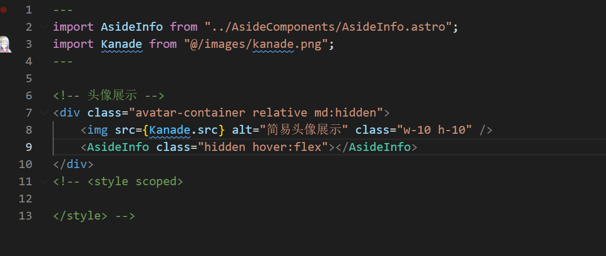
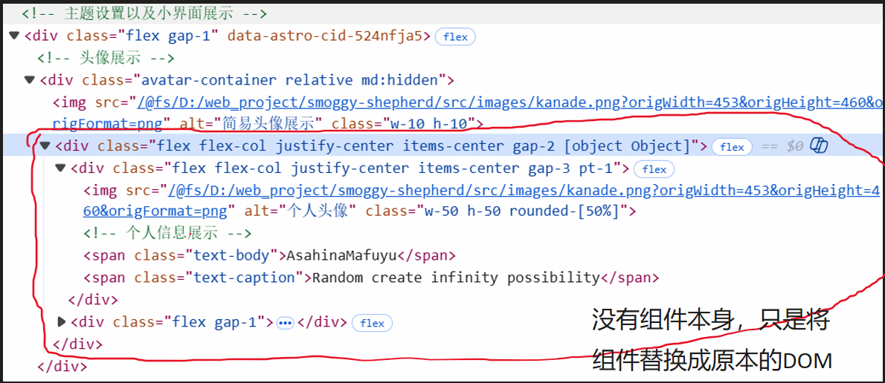

# 1. 组件的本质：
组件本质上就是一个“占位 + 展开（substitution）”的结构单元
组件标签本身 不是 DOM 元素，
它的 class / style 不会天然作用到内部 DOM，
除非框架“刻意帮你做了透传或合并”。
例如我在实际中写的：

但事实上就是：

如果是Astro这种的话，则需要通过props进行传参才行：
```html
---
import Profile from "./Profile.astro";
import LinkNav from "./link-nav.astro";
const {class: className = ""} = Astro.props
---

<div class={`flex flex-col justify-center items-center gap-2 ${className}`}>
    <Profile />
    <LinkNav />
</div>
```